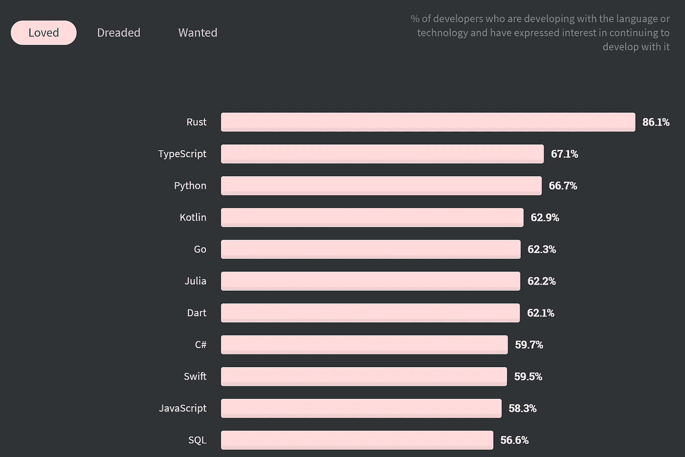

# JavaScript 是一种很棒的语言——如果你使用 TypeScript 的话

> 原文：<https://betterprogramming.pub/its-time-we-admit-the-truth-about-javascript-98d197c0f1ec>

## 是时候我们承认 JavaScript 的真相了


照片由[普里西拉·杜·普里兹](https://unsplash.com/@priscilladupreez?utm_source=medium&utm_medium=referral)在 [Unsplash](https://unsplash.com?utm_source=medium&utm_medium=referral) 上拍摄。

JavaScript 受到很多人的讨厌。汤姆·布拉迪也是。

> "世界上只有两种语言:人们抱怨的语言和没人使用的语言。"——比雅尼·斯特劳斯特鲁普，C++的创造者

如果你不喜欢 JavaScript，可能有三个原因:

*   你没有真正尝试过。毫无疑问，你会听到目空一切的程序员告诉你，JavaScript 之所以不好，是因为`"5"`松散地等于`5`(优秀的 JavaScript 开发人员几乎从不使用松散的等式)，或者是因为与性能相关的原因( [Node.js 只是比 Java](https://benchmarksgame-team.pages.debian.net/benchmarksgame/fastest/javascript.html) 慢一点)。
*   很难写出高质量的代码。也许你已经尝试过了，但是发现它缺乏结构鼓励了糟糕的代码实践。如果这是你的原因，请继续阅读，了解更多关于编写可读和可伸缩的 JavaScript 代码的知识。
*   它没有类型系统。一直读到最后，因为使用 JavaScript 的一个最有说服力的理由是使用 TypeScript。

现在你已经知道了你的立场，这里有三个你应该在下一个项目中使用 Node.js 的理由。

# 1.JavaScript 非常适合函数式编程

谁不爱函数式编程？

JavaScript 令人难以置信的灵活性可不是闹着玩的——你可以只用纯函数编写一个无状态的应用程序。

JavaScript 中函数式编程如此自然的一个原因是函数是一级变量，就像字符串或数字一样。

例如:

```
const addThree = (x) => x + 3;
console.log(addThree(4)); // prints 7
```

我们可以将这个函数传递给`Array.map()`，它将数组的值从函数的输入映射到它的输出:

```
const arr = [3, 4, 5];
const mappedArr = arr.map(addThree);
console.log(mappedArr); // => [6, 7, 8]
```

您也可以编写一个返回另一个函数的函数:

```
const mapByAdding = (x) => (n) => n + x;
```

现在，我们可以通过向每个元素添加任意数字来映射数组:

```
const arr = [3, 4, 5];
const addFourToAll = arr.map(mapByAdding(4));
console.log(addFourToAll); // => [7, 8, 9]
```

返回其他函数的函数，称为*高阶函数*，帮助我们设计健壮的抽象，同时保持函数风格。

JavaScript 数组也有一个`filter`方法，该方法采用谓词函数并返回一个数组，该数组只包含满足谓词的元素:

```
const arr = [3, 4, 5];
const oddNumbers = arr.filter((n) => n % 0 === 1);
console.log(oddNumbers); // => [3, 5]
```

这没什么值得大书特书的。但是看看组合谓词有多容易:

```
const andPredicate = (pred1, pred2) => {
  return (el) => pred1(el) && pred2(el); 
}
```

该函数接受两个谓词，如果元素满足这两个谓词，则返回另一个返回`true`的谓词。

我们还可以根据需要将函数嵌套在其他函数中:

所有这些特性——以及更多特性——使得用漂亮、实用的 JavaScript 代码编写复杂模块变得容易。

# 2.JS 非常适合异步编程

不管是哪种语言，异步编程通常都很困难，但是 JavaScript 的承诺和`async` / `await`方法可能是最直观的。

承诺表示一些涉及其他异步操作的操作。

我们可以使用`await`关键字来等待一个承诺的完成:

```
const response = await someApiCall();
```

我们只能在异步函数中使用`await`，因为等待承诺完成的函数本身必须返回一个承诺。我们用`async`来表示这一点:

```
async function getDataFromApi() {
  const response = await someApiCall();
  return response.data.sort();
}
```

我们也可以使用`Promise`构造函数获得相同的结果，它采用一个执行一些异步操作的函数，然后进行解析或拒绝。如果我们`resolve()`，承诺实现，返回一个可选的结果值，我们可以传递给`resolve`。如果我们`reject()`，指示错误，诺言必须被抓住。

下面是前面使用`Promise`构造函数的代码片段的等效代码:

```
const getDataFromApi = new Promise(async (resolve, reject) => {
  const response = await someApiCall();
  resolve(response.data.sort());
});
```

注意，我们传递给 Promise 的函数是`async`，它允许我们在它的主体内部使用`await`。

如果我们想对一个数组中的所有值执行一些异步任务呢？

假设我们有一个用户数组`ids`,想要从某个服务器获取相应的数据库条目。然而，它的 API 只允许我们一次检索一个用户。

## 糟糕的解决方案

我们可以在`async`函数中使用`for-each`循环:

为什么这样不好？由于`for`循环和`await`是同步的，API 调用将顺序完成，而不是并行完成。这意味着我们的加载时间随着 id 数量的增加而线性增加——这可不好！

## 更好的解决方案

相反，我们应该使用`Promise.all`来并行调用一组承诺，清理我们的代码并大大提高效率。

首先，我们将数组`userIds`映射到将返回相应用户的承诺:

```
const getUserPromises = userIds.map(id => {
  return asyncGetUserById(id); // returns a Promise, NOT the result
});
```

然后，我们简单地将这个数组传递给`Promise.all()`，它并行调用承诺，并按照给定承诺的顺序返回 API 结果的数组:

```
const users = await Promise.all(getUserPromises);
```

Promises 和`async` / `await`极大地简化了 JavaScript 中的异步编程，使之成为调度大量网络请求的应用程序的特别谨慎的选择。

# 然而，JavaScript 有点糟糕

尽管 JavaScript 有优势，但缺乏类型系统让许多潜在用户望而却步——这是有充分理由的。开发一个没有类型的大型应用程序就像用 Vim 编码一样。你只是要求做更多的工作。

谢天谢地，有一个解决方案:TypeScript(也就是过去十年中 web 开发领域发生的最好的事情之一)。

TypeScript 是由 C#背后的许多相同的微软工程师开发的，是一个健壮的、高度灵活的 JavaScript 类型系统。

我们可以很容易地键入变量:

```
const val: string = "5";
```

注意:这是一个虚构的例子。TypeScript 会简单地推断字符串文字的类型。

我们也可以定义像变量这样的类型。下面是一个`Predicate`函数的类型定义:

```
type Predicate = (val: any) => boolean;
```

像许多其他强类型语言一样，TypeScript 支持泛型:

```
type Predicate<T> = (val: T) => boolean;
```

除了熟悉的`enum`构造，TypeScript 还允许我们定义联合类型:

```
type ApiResponseStatus = "ok" | "error";
```

现在，我们已经拥有了为 API 响应定义简单类型所需的一切:

```
type ApiResponse<T> = {
  status: "ok" | "error";
  data: T;
  error: string;
}
```

但是我们可以更进一步。如果 API 响应的状态为`ok`，我们知道它一定有数据，不能有错误。否则，它一定有错误，不能有数据。

我们可以用一个巧妙的联合式来表达这一点:

现在，当我们处理一个`ApiResponse`时，我们的 IDE 将根据`status`准确地知道哪些字段是可用的。

因此，这段代码将编译为:

但这不会:

```
if (apiResponse.status === "error") {
  return apiResponse.data;
}
```

这仅仅触及了赋予 TypeScript 独特能力和多功能性的大量特性的表面。这也不是一项新技术——大多数流行的 npm 包已经支持 TypeScript，越来越多的小型库也在效仿。

因此，毫不奇怪，TypeScript 是堆栈溢出用户第二喜欢的编程语言，仅次于 Rust:



来源:[栈溢出开发者调查](https://insights.stackoverflow.com/survey/2020)

# 一种又爱又恨的语言

C++的创造者比雅尼·斯特劳斯特鲁普曾经说过:“世界上只有两种语言:人们抱怨的语言和没人使用的语言。”

毫无疑问，JavaScript 是世界上使用最多的编程语言——这不仅仅是因为 web 开发人员几乎没有选择。在过去的十年中，JS 在整个堆栈中的使用激增。

尽管普遍对这种语言不屑一顾，但拥有多年 JavaScript 应用程序开发经验的开发人员都知道，它在大多数领域都很出色:它功能多样、灵活，而且使用 Node.js 很快。

随着 TypeScript 的广泛采用，JavaScript 的最后一个最大的缺陷得到了解决，Node.js 成为 2021 年最通用、对开发人员友好的软件开发工具。