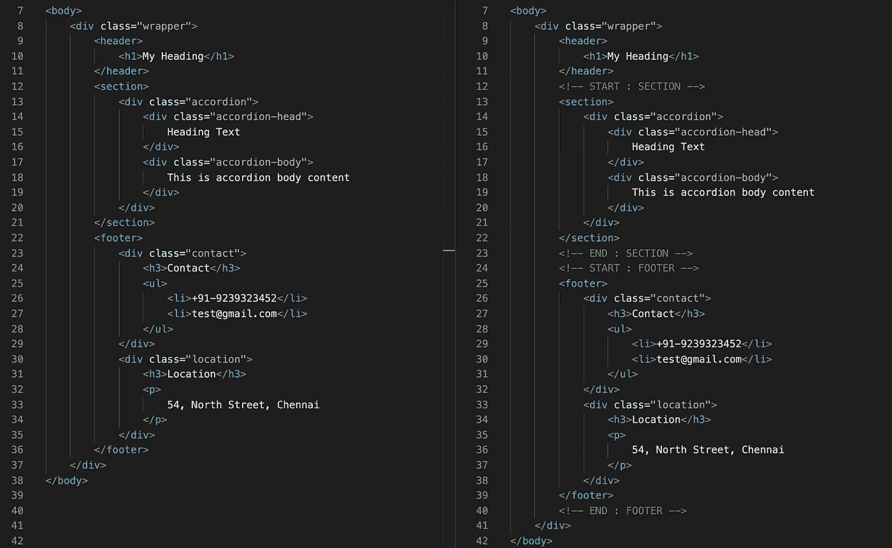
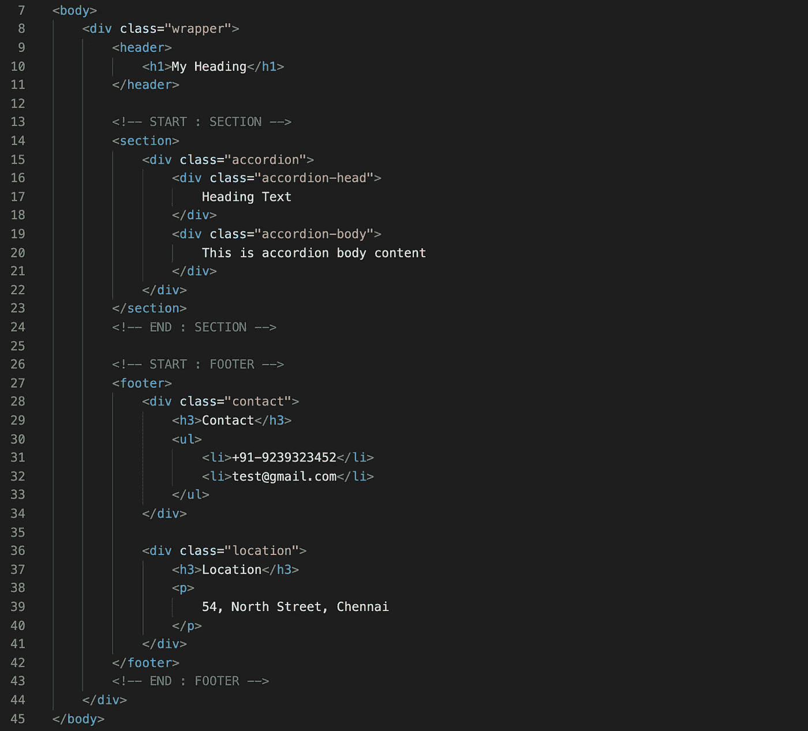
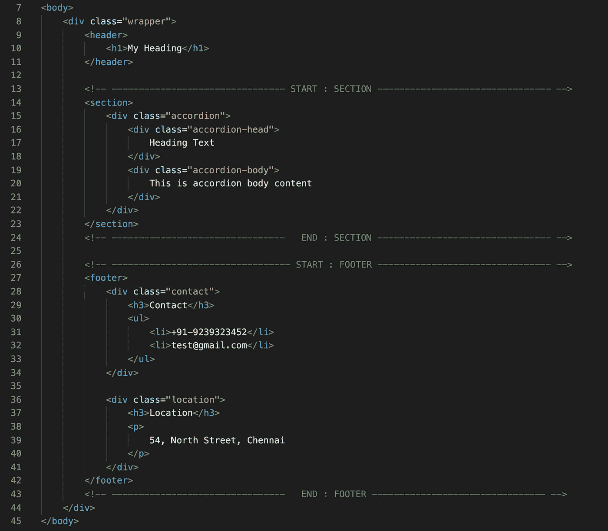

# 这是你的空间——写可读的代码

> 原文：<https://betterprogramming.pub/its-your-space-write-readable-code-efbd159faa19>

## 空白和注释是你的朋友

法比安·格罗斯在 [Unsplash](https://unsplash.com?utm_source=medium&utm_medium=referral) 拍摄的照片

在编写代码时，我们大多数人都遵循编码指南和实践。我们知道变量、函数、类等等。，应该命名。必要时，我们会记录评论，以帮助从事该项目的其他开发人员。

图一。代码比较:左窗格与右窗格

两个窗格有相同的代码，但是右边的窗格有注释。代码中的注释使其他开发人员更容易理解。

但是，对于另一个人来说，在一大块代码中浏览并找到一个特定的部分有多容易呢？这就是*行距*发挥作用的地方。

在图 2 中，注意行号(12，25，35)故意留为空白，以确保在两个不同的组件或部分之间存在逻辑切割。

图二。带行距的代码

你是否发现很难找到一段代码，因为注释看起来和代码一样长？

如果 IDE 没有单独的代码和注释颜色会怎样？

这是我们可以应用长注释的地方，如下所示。在这里，不同代码之间有一个清晰的界限:

图 3:带有行间距和逻辑注释划分的代码

*不用担心这些多余的行和注释会增加文件大小。当代码被转移到产品中时，代码压缩技术将会处理这个问题。*

同样的逻辑也适用于 Javascript 文件。两个函数之间的行距可以提高代码的可读性和整洁性。

这是另一个如何编写 React 本机功能代码组件的例子。

`Checkout **screens/home-screen**`

代码间距的反应本地小吃示例

作为开发人员，这可能是一个额外的小步骤，以确保我们的代码简洁易懂。

> 社交距离是有区别的。