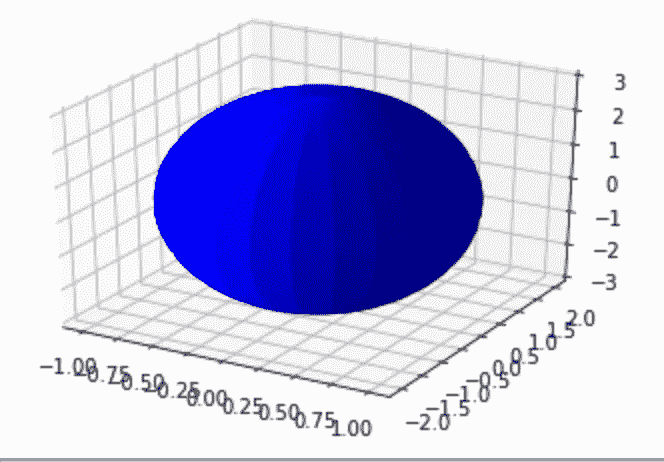
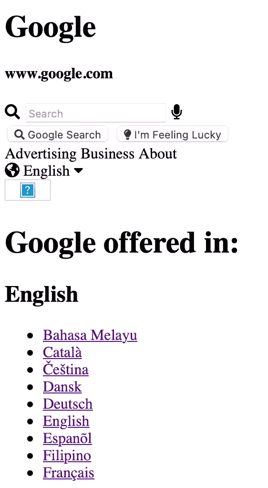

# 开放的法典——我的考验和磨难

> 原文：<https://betterprogramming.pub/ive-been-using-openai-codex-how-far-can-ai-code-go-23833074fd4c>

## 我用五个经典的编码问题测试了 AI 工具


开放法典

去年，OpenAI 宣布了 Codex，这是一种借助人工智能(AI)进行高效编程的模型。上传到 OpenAI YouTube 频道的一个视频展示了一个现场演示，即使亲眼所见也很难相信。

只需几行命令，就可以用 JavaScript 创建一个完整的游戏。

命令的级别看起来有点高，但是使用 Codex，你可以看到它能够立即执行代码并运行游戏。这样，Codex 是一个帮助人们比他们自己更有效地编写代码的模型。

由于人工智能的快速发展，几年前甚至无法想象的事情正在成为现实。幸运的是，我获得了 OpenAI 测试 Codex 的许可。我想知道人工智能能在多大程度上帮助我们编写代码。

# 1.用 Python 3 制作石头剪刀布游戏

首先，正如我在 Codex live 演示中展示的那样，我认为制作一个游戏会很有趣。我认为最好从一个简单的游戏开始，所以我决定做一个你可以用电脑玩石头剪子布的游戏。我很快给了法典以下指示。

```
"""
Rock-scissor-paper game written in python3
"""
```

随即，Codex 显示了下面的 Python 3 代码:

```
import random# Game start
print("Let's play Rock-Scissor-Paper game!")# Variable settings
user_score = 0
computer_score = 0# Game process
while True:
    user_choice = input("Rock, Scissor, Paper? (R/S/P) : ")
    computer_choice = random.choice(["R", "S", "P"])if user_choice == "R":
        if computer_choice == "R":
            print("Computer : Rock")
            print("Draw!")
        elif computer_choice == "S":
            print("Computer : Scissor")
            print("You win!")
            user_score += 1
        elif computer_choice == "P":
            print("Computer : Paper")
            print("You lose!")
            computer_score += 1
    elif user_choice == "S":
        if computer_choice == "R":
            print("Computer : Rock")
            print("You lose!")
            computer_score += 1
        elif computer_choice == "S":
            print("Computer : Scissor")
            print("Draw!")
        elif computer_choice == "P":
            print("Computer : Paper")
            print("You win!")
            user_score += 1
    elif user_choice == "P":
        if computer_choice == "R":
            print("Computer : Rock")
            print("You win!")
            user_score += 1
        elif computer_choice == "S":
            print("Computer : Scissor")
            print("You lose!")
            computer_score += 1
        elif computer_choice == "P":
            print("Computer : Paper")
            print("Draw!")
    else:
        print("Please enter R/S/P.")
        continueprint("Your score : " + str(user_score))
    print("Computer score : " + str(computer_score))if user_score == 3:
        print("You win!")
        break
    elif computer_score == 3:
        print("You lose!")
        break

# Game end
print("Game over!")
```

我复制并粘贴到了[在线 python 编译器](https://www.tutorialspoint.com/execute_python3_online.php)网站。结果如下所示:

```
Let's play Rock-Scissor-Paper game!
Rock, Scissor, Paper? (R/S/P) : S
Computer : Scissor
Draw!
Your score : 0
Computer score : 0
Rock, Scissor, Paper? (R/S/P) : R
Computer : Rock
Draw!
Your score : 0
Computer score : 0
Rock, Scissor, Paper? (R/S/P) : P
Computer : Paper
Draw!
Your score : 0
Computer score : 0
Rock, Scissor, Paper? (R/S/P) : R
Computer : Rock
Draw!
Your score : 0
Computer score : 0
Rock, Scissor, Paper? (R/S/P) : R
Computer : Paper
You lose!
Your score : 0
Computer score : 1
Rock, Scissor, Paper? (R/S/P) : R
Computer : Paper
You lose!
Your score : 0
Computer score : 2
Rock, Scissor, Paper? (R/S/P) : R
Computer : Paper
You lose!
Your score : 0
Computer score : 3
You lose!
**Game over!**
```

正如您在结果窗口中看到的，您可以玩石头剪刀布游戏，第一个获得 3 分的人获胜。电脑先得了 3 分，我输了。游戏自动结束了。

# 2.使用 Python 3 的数学作业

之后，我让 Codex 用 Python 3 编写代码，输出一个二次方程图。

```
“””
Make a code for drawing simple quadratic equation using python3\. 
Note that the code should embrace random quadratic equations from user.
“””
```

Codex 给了我下面的代码:

```
import matplotlib.pyplot as plt
import numpy as np# input a, b, c from user
a = int(input("a = "))
b = int(input("b = "))
c = int(input("c = "))# draw the graph
x = np.linspace(-10, 10, 100)
y = a*x**2 + b*x + c
plt.plot(x, y)
plt.show()
```

我立即执行了 Python 3 解释器。


二次曲线是用法典建议的代码绘制的。

可以看到二次方程被 Codex 建议的代码成功的画出来了。如果我输入系数 a、b 和 c，那么上面的代码会给出图形。

我要求另一个订单，类似于*画一个椭球*！

```
""" 
Write a simple code for drawing simple ellipsoid with python3\. 
"""
```

我认为这对他们来说很容易:

```
"""
Write a simple code for drawing simple ellipsoid with python3.
"""import scipy.special as sps
import numpy as np
from mpl_toolkits.mplot3d import Axes3D
import matplotlib.pyplot as pltfig = plt.figure()
ax = fig.add_subplot(111, projection='3d')a = 1
b = 2
c = 3u = np.linspace(0, 2 * np.pi, 100)
v = np.linspace(0, np.pi, 100)x = a * np.outer(np.cos(u), np.sin(v))
y = b * np.outer(np.sin(u), np.sin(v))
z = c * np.outer(np.ones(np.size(u)), np.cos(v))ax.plot_surface(x, y, z,  rstride=4, cstride=4, color='b')plt.show()
```



三维椭球图像是由 CODEX 建议的代码绘制的。

# 3.制作一个简单的网络爬虫

我曾经怀疑过 Codex 是否真的能做一个网络爬虫。当然，因为爬行代码对于复杂的任务来说变得相当长，所以我让 Codex 做了一个简单的爬行任务(比如只从 Google 新闻网站加载标题，等等。).

```
"""
A simple code for showing brief information from Google News.
"""
```

抄本给我看了这样的东西:

```
import requests
from bs4 import BeautifulSoupurl = "[https://news.google.com/](https://news.google.com/)"response = requests.get(url)
soup = BeautifulSoup(response.text, "html.parser")titles = soup.find_all("h3", class_="ipQwMb ekueJc RD0gLb")for title in titles:
    print(title.text)
```

由于该网址是谷歌新闻的英文版，结果是:

```
Maryland Primary Election Results 2022
Biden holds off — for now — on climate emergency declaration
Sri Lanka: Ranil Wickremesinghe elected president
Uvalde school shooting: What is the employment status of responding officers? We asked each agency
Jan. 6 panel says Secret Service failed to deliver ‘erased’ texts
Vladimir Putin Says Russia Will Honor Gas Commitments, but Warns of New Nord Stream Curbs
```

如果我把链接替换成日本谷歌新闻怎么样？

```
東京都 コロナ 4 人死亡 2 万 401 人感染確認 2 万人超は2 月 5 日以来
世界景気「後退懸念強まる」 IMF 専務理事インタビュー
息子の入試に加点してもらい、東京医大に合格…受託収賄罪の文科省元局長に執行猶予付き判決
中学生に袋かぶせて殴り監禁か NPO 法人理事長・小学校教員を逮捕
【速報】神奈川・黒岩知事「新規感染者 1 万人超の見通し」過去最多に(2022 年 7 月 20 日)
伊藤詩織さん、性被害当時に刑事部長だった中村格警察庁長官に「お話しして欲しい」
```

然后，我们把网址改成韩国谷歌新闻。

```
금속노조, 서울·거제서 총파업 집회…"대우조선 투쟁 승리"
민주당 박홍근 교섭단체 대표 연설 “권력 사유화, 반드시 대가”…탄핵 빗대 윤 대통령 직격
권성동, '대통령실 사적 채용' 논란에 “논란 커진 건 저의 불찰”
이명박 이재용 사면?…`광복절 특사`질문에 말 아낀 尹
노동부장관 또 거제행‥대우조선 협상 타결되나?
수학여행 다녀온 전주 고교 학생·교사 159명 확진
```

看新闻内容的时候，可以看到最新的新闻文章正在被拉上来。

# 4.模仿谷歌主页

可以求一个 Codex 的 HTML 编码吗？我这样问命令:

```
<!-- Mimick google main homepage only with HTML & CSS -->
```

Codex 回复了以下代码:

```
<!-- Mimick google main homepage only with HTML & CSS -->
<!DOCTYPE html>
<html lang="en">
<head>
    <meta charset="UTF-8">
    <meta name="viewport" content="width=device-width, initial-scale=1.0">
    <meta http-equiv="X-UA-Compatible" content="ie=edge">
    <title>Google Homepage</title>
    <link href="[https://fonts.googleapis.com/css?family=Roboto:100,300,400,500,700,900](https://fonts.googleapis.com/css?family=Roboto:100,300,400,500,700,900)" rel="stylesheet">
    <link rel="stylesheet" href="[https://use.fontawesome.com/releases/v5.6.3/css/all.css](https://use.fontawesome.com/releases/v5.6.3/css/all.css)" integrity="sha384-UHRtZLI+pbxtHCWp1t77Bi1L4ZtiqrqD80Kn4Z8NTSRyMA2Fd33n5dQ8lWUE00s/" crossorigin="anonymous">
    <link rel="stylesheet" href="styles.css">
</head>
<body>

    <div class="wrapper">
        <div class="header">
            <div class="header-upper">
                <div class="header-logo">
                    <h1>Google</h1>
                    <h4>[www.google.com](http://www.google.com)</h4>
                </div>
                <div class="search-section">
                    <div class="search-bar">
                        <i class="fas fa-search"></i>
                        <input type="text" placeholder="Search">
                        <i class="fas fa-microphone"></i>
                    </div>
                    <button class="btn-search">
                        <i class="fas fa-search"></i>
                        <span>Google Search</span>
                    </button>
                    <button class="btn-i-am-feeling-lucky">
                        <i class="fas fa-lightbulb"></i>
                        <span>I'm Feeling Lucky</span>
                    </button>
                </div>
            </div>
            <div class="header-lower">
                <div class="header-options">
                    <span>Advertising</span>
                    <span>Business</span>
                    <span>About</span>
                </div>
                <div class="header-language">
                    <i class="fas fa-globe-americas"></i>
                    <span>English</span>
                    <i class="fas fa-caret-down"></i>
                </div>
            </div>
        </div><div class="content">
            <div class="image-section">
                
            </div><div class="image-section-content">
                <h1>Google offered in:</h1>
                <h2>English</h2>
                <ul>
                    <li><a href="">Bahasa Melayu</a></li>
                    <li><a href="">Català</a></li>
                    <li><a href="">Čeština</a></li>
                    <li><a href="">Dansk</a></li>
                    <li><a href="">Deutsch</a></li>
                    <li><a href="">English</a></li>
                    <li><a href="">Espanõl</a></li>
                    <li><a href="">Filipino</a></li>
                    <li><a href="">Français</a></li>
                </ul>
                <ul>
                    <li><a href="">Hrvatski</a></li>
                    <li><a href="">Indonesia</a></li>
                    <li><a href="">Italiano</a></li>
                    <li><a href="">Latviešu</a></li>
                    <li><a href="">Lietuvių</a></li>
                    <li><a href="">Magyar</a></li>
                    <li><a href="">Nederlands</a></li>
                    <li><a href="">Norsk</a></li>
                    <li><a href="">Polski</a></li>
                </ul>
                <ul>
                    <li><a href="">Português</a></li>
                    <li><a href="">Română</a></li>
                    <li><a href="">Slovenčina</a></li>
                    <li><a href="">Suomi</a></li>
                    <li><a href="">Svenska</a></li>
                    <li><a href="">Tiếng Việt</a></li>
                    <li><a href="">Türkçe</a></li>
                    <li><a href="">Български</a></li>
                    <li><a href="">Pусский</a></li>
                </ul>
                <ul>
                    <li><a href="">Српски</a></li>
                    <li><a href="">한국어</a></li>
                    <li><a href="">中文（繁體）</a></li>
                    <li><a href="">中文（简体）</a></li>
                    <li><a href="">日本語</a></li>
                    <li><a href="">हिन्दी</a></li>
                    <li><a href="">ภาษาไทย</a></li>
                </ul>
            </div>
        </div><div class="footer">
            <div class="footer-options">
                <ul>
                    <li><a href="">Advertising</a></li>
                    <li><a href="">Business</a></li>
                    <li><a href="">About</a></li>
                </ul>
            </div>
        </div>
    </div>
</body>
</html>
```

我把它们复制粘贴到[在线 HTML 解释器](https://htmledit.squarefree.com/)中，检查结果。



由 CODEX 配置的模拟谷歌 HTML 窗口

虽然因为 CSS 文件不存在，我们看不到漂亮的外观，但是我们可以看到从页眉到搜索栏到搜索按钮的一切都已经实现了。

我们还可以看到谷歌主页上的签名按钮，“我感觉很幸运。”再多做一点工作，Codex 也有望加快工作速度。

# 5.让我们用抄本做一个井字游戏

如果你正在学习 Python，你可能会遇到井字游戏的问题。

Codex 让您轻松解决:

```
"""
Make a Tic-Tac-Toe game written in python3\. Make sure to write Checkerboard with '|', '-'.
"""
```

我指示 Codex 直接从代码窗口检查棋盘。生成的代码如下:

```
import randomclass TicTacToe(object):
    def __init__(self):
        self.board = [[' ', ' ', ' '], [' ', ' ', ' '], [' ', ' ', ' ']]def print_board(self):
        for i in range(0, 3):
            for j in range(0, 3):
                print('|', end=' ')
                print(self.board[i][j], end=' ')
            print('|\n')
        print('-' * 11)def get_input(self):
        while True:
            try:
                x, y = input('Please enter two integers between 1 and 3, separated by comma: ').split(',')
            except ValueError:
                print('Invalid input, try again')
                continue
            x, y = int(x), int(y)
            if 1 <= x <= 3 and 1 <= y <= 3:
                break
            print('Invalid input, try again')
        return x - 1, y - 1def check(self, x, y, player):
        return self.board[x][y] == ' ' and (x, y) in self.generate_moves(player)def make_move(self, x, y, player):
        self.board[x][y] = 'X' if player == 1 else 'O'def generate_moves(self, player):
        moves = []
        for i in range(0, 3):
            for j in range(0, 3):
                if self.board[i][j] == ' ':
                    moves.append((i, j))
        return movesdef has_winner(self):
        # check rows
        for i in range(0, 3):
            if self.board[i][0] != ' ' and self.board[i][0] == self.board[i][1] and self.board[i][1] == self.board[i][2]:
                return True# check columns
        for i in range(0, 3):
            if self.board[0][i] != ' ' and self.board[0][i] == self.board[1][i] and self.board[1][i] == self.board[2][i]:
                return True# check diagonals
        if self.board[0][0] != ' ' and self.board[0][0] == self.board[1][1] and self.board[1][1] == self.board[2][2]:
            return Trueif self.board[0][2] != ' ' and self.board[0][2] == self.board[1][1] and self.board[1][1] == self.board[2][0]:
            return Truereturn Falsedef is_full(self):
        for i in range(0, 3):
            for j in range(0, 3):
                if self.board[i][j] == ' ':
                    return False
        return Truedef game_over(self):
        return self.has_winner() or self.is_full()def play_human(self, player):
        print('Player {}\'s turn'.format(player))
        x, y = self.get_input()
        while not self.check(x, y, player):
            print('Invalid move')
            x, y = self.get_input()
        self.make_move(x, y, player)def play_computer(self, player):
        moves = self.generate_moves(player)
        move = random.choice(moves)
        x, y = move
        print('Player {} moves to ({}, {})'.format(player, x + 1, y + 1))
        self.make_move(x, y, player)def game_loop(self):
        player = 1while not self.game_over():
            self.print_board()
            if player == 1:
                self.play_human(player)
            else:
                self.play_computer(player)
            player = 2 if player == 1 else 1self.print_board()
        if self.has_winner():
            print('Game over: Player {} wins'.format(player))
        else:
            print('Game over: No winner')if __name__ == '__main__':
    game = TicTacToe()
    game.game_loop()
```

我检查了它们，看它们是否工作正常。

```
|   |   |   ||   |   |   ||   |   |   |-----------
Player 1's turn
Please enter two integers between 1 and 3, separated by comma: 1,1
| X |   |   ||   |   |   ||   |   |   |-----------
Player 2 moves to (1, 2)
| X | O |   ||   |   |   ||   |   |   |
```

如果用户输入一个带逗号的 X 位置(如 1，1)，棋盘会立即放置棋子，计算机也会将其棋子放置在任意位置并输出状态。当连续的三个棋子(X 或 O)以任何对角线、水平或垂直的形式放置时，游戏结束。

```
| X | O | O ||   | X |   ||   |   | X |-----------
Game over: Player 2 wins
```

是的，我赢了。多亏了法典，做井字游戏变得如此简单。

# 结论

在试用 Codex 一段时间后，我能够看到超出我预期的结果。

但是，我仍然认为，仅仅使用人工智能很难写出所有的代码。

在我看来，如果在写代码的骨架或者草稿的时候使用人工智能，会有很大的帮助。从无到有是一个非常艰难的过程。但是，如果一个草图是由人工智能构建，然后由人类塑造，我认为这将使这个过程更快、更有效。

还有，好像支持各种语言。除了 Python 3(我最常用的)，它还提供了其他语言的简单代码，前提是给出了好的说明。

当然，它不能正确地进行太复杂的编码。如果在人们兴趣不足的领域要求过多的细节或编码，Codex 很可能给出错误的答案。

不管怎么说，Codex 是我开始使用计算机以来遇到的最神奇最创新的工具。就像阿拉丁的神灯。一个精灵，当你点它的时候，它会实现你的愿望。

近来人们对计算机工程很感兴趣。自动化和编码可以用于各种环境和领域。我希望法典能加速这一趋势。