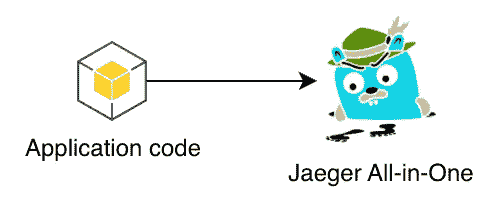
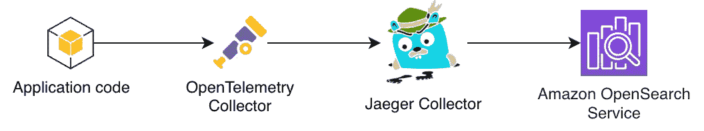
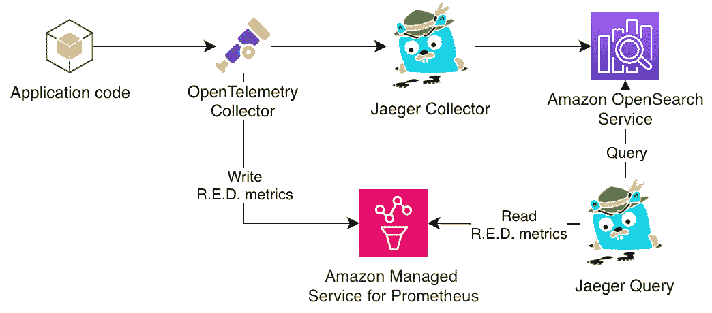
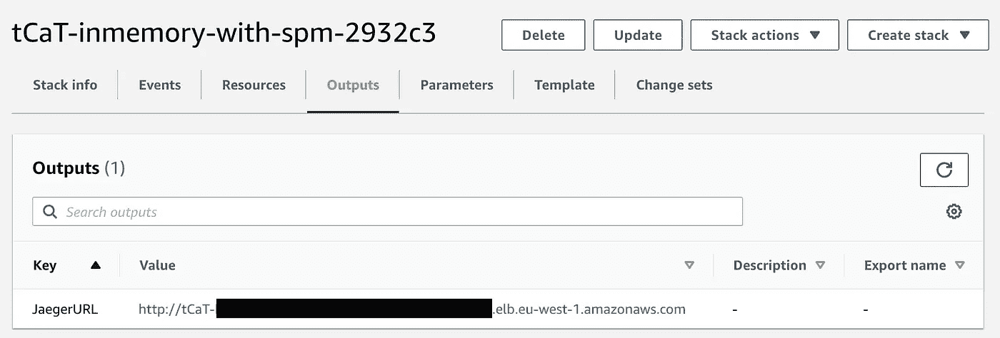
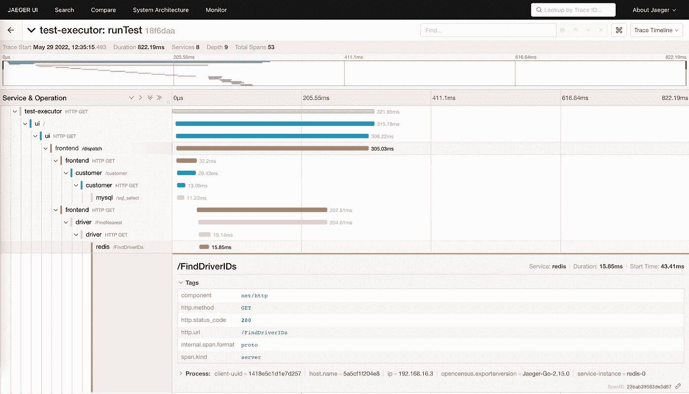
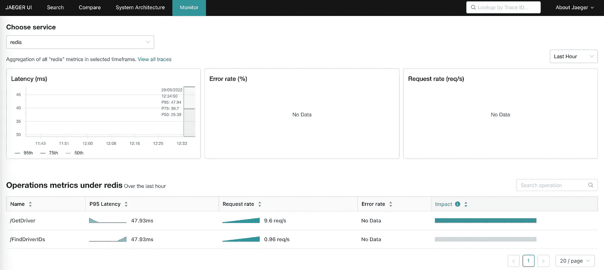
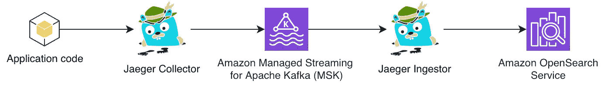

# 耶格快速入门 v0.2

> 原文：<https://betterprogramming.pub/jaeger-quick-start-v0-2-adce4d1bfe64>

## [*寻思*](https://medium.com/@dmitrykolomiets/list/musings-on-tracing-3d7bd0d2093c)

## 服务性能监控支持

照片由 [Ahmad Odeh](https://unsplash.com/@aoddeh?utm_source=unsplash&utm_medium=referral&utm_content=creditCopyText) 在 [Unsplash](https://unsplash.com/?utm_source=unsplash&utm_medium=referral&utm_content=creditCopyText) 上拍摄

# 摘要

我们生活在分布式追踪和开放式遥测社区的激动人心的时代。事情发展很快，可能很难跟上最新的变化。

这是一篇分享 Jaeger Quick Start 最新更新的帖子，并暗示了可能很快会发生的生态系统变化。

快速回顾——Jaeger 快速入门帮助您在 Amazon Web Services (AWS)云上部署高度可用的 Jaeger——开源、端到端分布式跟踪后端。你可以在之前的帖子中找到更多信息:

 [## Jaeger 快速入门介绍——在 AWS 上部署

### 端到端分布式跟踪平台的研究

better 编程. pub](/introducing-jaeger-quick-start-deploying-on-aws-f0ee5d398e8a) 

# 部署架构

## 内存存储后端

有多种方法可以将你的轨迹导出到 Jaeger。最基本的一种是使用 OpenTelemetry SDK 和 Jaeger Exporter(参见语言特定的包，例如 [Java](https://github.com/open-telemetry/opentelemetry-java/tree/main/exporters/jaeger) 、 [Python](https://github.com/open-telemetry/opentelemetry-python/tree/main/exporter/opentelemetry-exporter-jaeger) 、 [JavaScript](https://github.com/open-telemetry/opentelemetry-js/tree/main/packages/opentelemetry-exporter-jaeger) 、[。网](https://github.com/open-telemetry/opentelemetry-dotnet/blob/main/src/OpenTelemetry.Exporter.Jaeger/README.md)等。)直接从应用程序中导出跟踪:

最基本的 Jaeger 部署(内存存储后端)

Jaeger Quick Start 以默认配置部署，创建最简单的 [Jaeger All-In-One](https://www.jaegertracing.io/docs/1.34/deployment/#all-in-one) 实例，将所有痕迹保存在内存中。尽管如此，它仍然是一个功能齐全的 Jaeger 你可以收集踪迹，使用搜索，查看服务之间的依赖关系，等等。

尽管如此，如果 Jaeger 实例死亡或重启，您将丢失所有数据。这种模式非常适合评估、测试环境和概念验证工作。

以下端口用于集成:

*   `14250` (gRPC)
    接受 protobuf 格式的轨迹跨度
*   `14268` (HTTP)
    接受节约格式的跟踪跨度
*   `80 / 443` (HTTP)
    `/api/*`端点和`/`的耶格 UI
*   [可选] `14269` (HTTP)
    管理端口:`/`处的健康检查和`/metrics`处的指标

## 弹性搜索存储后端

您可能希望为您的生产环境建立一个更实际的设置，最好是一个高度可用的架构，将跟踪数据保存在持久存储中，并将 Jaeger 实例分布在多个[可用性区域](https://docs.aws.amazon.com/AWSEC2/latest/UserGuide/using-regions-availability-zones.html#concepts-availability-zones)中以获得弹性。

Jaeger Quick Start 通过在负载平衡器和自动扩展组后面使用多个[收集器](https://www.jaegertracing.io/docs/1.34/deployment/#collector)和[查询服务](https://www.jaegertracing.io/docs/1.34/deployment/#query-service--ui) Fargate 任务来支持这种部署场景。这在跟踪流量峰值的情况下提供了弹性和伸缩性。亚马逊 OpenSearch 服务被用作持久存储——同样，分布在多个可用性区域。

具有弹性搜索存储后端的 Jaeger

以下端口用于集成:

*   `14250` (gRPC)
    接受 protobuf 格式的跟踪跨度
*   `14268` (HTTP)
    接受节约格式的跟踪跨度
*   `80 / 443` (HTTP)
    `/api/*`端点和`/`处的 Jaeger UI
*   [可选] `14269` (HTTP)
    收集器管理端口:`/`处的健康检查和`/metrics`处的度量
*   [可选] `16687` (HTTP)
    查询服务管理端口:`/`的健康检查和`/metrics`的度量

## 在耶格面前打开遥测收集器

你可能已经注意到，前面给出的两个选项并没有公开一个标准的 [OTLP](https://opentelemetry.io/docs/reference/specification/protocol/) 端口——你必须使用 [Jaeger 客户端库](https://www.jaegertracing.io/docs/1.34/architecture/#jaeger-client-libraries)(正在退役中) [Jaeger 代理](https://www.jaegertracing.io/docs/1.34/architecture/#agent)或[Jaeger open telemetry Collector exporter](https://github.com/open-telemetry/opentelemetry-collector-contrib/tree/main/exporter/jaegerexporter)来发送跟踪到 Jaeger。

这在某些情况下可能是不可行的——也许你已经有一个依赖于 OTLP 的大型应用程序，你不能修改或者你不能容易地安装 Jaeger open telemetry Collector exporter，例如，用于 OpenTelemetry (ADOT)的 [AWS 发行版的情况——Jaeger exporter 不包括在](http://AWS Distro for OpenTelemetry) [ADOT 收集器](https://github.com/aws-observability/aws-otel-collector)中。

为了克服这一点，Jaeger Quick Start 提供了一个选项，可以在 Jaeger Collector 前面部署一个高度可用的 OpenTelemetry Collector 预先配置为使用 OTLP 接受跟踪并将它们导出到 Jaeger。收集器实例跨可用性区域分布，并由遵循[高可用性和可伸缩性原则](https://docs.aws.amazon.com/whitepapers/latest/real-time-communication-on-aws/high-availability-and-scalability-on-aws.html)的自动扩展组提供支持。

这是一个交钥匙解决方案，确保您的应用程序可以继续使用 OTLP 将跟踪导出到 Jaeger。正如我们稍后将看到的，这种集成还支持更多有趣的选项。

Jaeger 有一个前开式遥测收集器

> 无论存储配置如何，OpenTelemetry collector 都可以部署在 Jaeger 前面——支持内存和弹性搜索选项。

以下端口用于集成(除了上面我们已经介绍过的 Jaeger 专用端口之外):

*   `4317` (gRPC / HTTP)
    OTLP 接收器
*   [可选]`1777`(HTTP)
    [pprof open 遥测采集器扩展](https://github.com/open-telemetry/opentelemetry-collector-contrib/tree/main/extension/pprofextension)
*   【可选】`55679`(HTTP)
    [open telemetry Collector 的 zPages 扩展](https://github.com/open-telemetry/opentelemetry-collector/tree/main/extension/zpagesextension)

## OpenTelemetry Collector 和 Jaeger 操作指标

Jaeger Collector、Jaeger Query service 和 OpenTelemetry Collector 提供了许多您可能想要收集的操作指标，并将其显示在操作仪表板中以进行监控和警报。

为了简化跨所有实例收集指标的任务，Jaeger Quick Start 提供了一个选项，可以将指标抓取并导出到 Prometheus workspace 的集中式[亚马逊托管服务。您可以请求创建新的工作空间，也可以使用现有的工作空间。](https://aws.amazon.com/prometheus/)

Jaeger 可选择与亚马逊为 Prometheus 提供的托管服务集成

这种设置对于遥测平台的操作方面至关重要的生产质量环境至关重要。

# 服务性能监控(SPM)

## 具有 Jaeger 历史的 SPM

上一节中总结的部署选项在使用 Jaeger 构建分布式跟踪平台时为您提供了很大的灵活性。我还想介绍另一个选项，以激发您的兴趣并展示分布式跟踪的强大功能。

有一个有趣的想法，来自 [logz.io](https://logz.io/) 的人们在 2021 年 4 月提出了[，并宣布它将在 2021 年 12 月可用:](https://github.com/jaegertracing/jaeger/issues/2954)

 [## 从分布式跟踪到 APM:将 OpenTelemetry & Jaeger 提升一个层次

### 更新:作为 v1.29.0 的一部分，Jaeger project 于 2021 年 12 月发布了服务健康指标的“监控”选项卡…

logz.io](https://logz.io/blog/monitoring-microservices-opentelemetry-jaeger/) 

以下是这一特性背后的高层次思考:

*   OpenTelemetry Collector 是来自不同服务的所有跟踪的焦点
*   跟踪包含大量信息，例如错误代码和延迟等
*   如果我们将 OpenTelemetry Collector 配置为使用传入的轨迹，并为每个服务计算 [R.E.D .指标](https://www.weave.works/blog/the-red-method-key-metrics-for-microservices-architecture/)(速率、错误、持续时间)会怎么样？

事实上，这正是 Jaeger 社区通过为 OpenTelemetry Collector 引入[跨度度量处理器](https://github.com/open-telemetry/opentelemetry-collector-contrib/tree/main/processor/spanmetricsprocessor)所做的！通过利用 OpenTelemetry 堆栈，处理器生成的指标可被 Jager UI 用来显示所有服务的 R.E.D .指标。这项功能在 Jaeger 文档中被记录为[服务性能监控](https://www.jaegertracing.io/docs/1.34/spm/)，是 Logz.io 商业产品[的一部分。](https://logz.io/platform/distributed-tracing/#backend)

> 正如 Jaeger 文档中所指出的，服务性能监控仍然是一个实验性的特性。配置的 OpenTelemetry 和 Jaeger 方面可能会有进一步的变化。

## Jaeger 快速入门中的 SPM

正如我们在上一节中所介绍的，Jaeger Quick Start 支持 SPM 的所有必要组件的部署:

*   Jaeger 收集器/查询服务+ UI
*   打开遥测收集器
*   普罗米修斯工作区的亚马逊托管服务

因此，启用 SPM 就是正确配置所有这些组件(配置 Otel Collector 以使用 Span Metrics Processor 并向 Prometheus 公开指标，配置 Jaeger 从 Prometheus 获取指标，等等)。)

Jaeger Quick Start 自动执行这些步骤，并通过简单的开/关配置选项提供 SPM 支持。它支持在您自己的环境中使用来自服务的真实跟踪以一种低摩擦的方式评估 SPM:

支持服务性能监控的 Jaeger

## Jaeger 快速入门中的 SPM 演示

Jaeger Quik Start 附带了一个. taskcat.yml 文件，其中包含许多测试，这些测试是为部署我们在本文中提到的不同 Jaeger 架构而精心设计的。这个文件依赖于 [TaskCat](https://github.com/aws-ia/taskcat) 来自动化我将在下面使用的部署。您也可以参考[手动部署说明](https://github.com/kolomiets/quickstart-jaeger#deployment)来使用 AWS 控制台部署快速入门。

使用以下命令在 AWS 环境中部署 Jaeger Quick Start with SPM:

`taskcat test run -n -t inmemory-with-spm`

一旦部署完毕，你可以从堆栈的输出参数中得到 Jaeger 查询端点:

快速启动云形成堆栈的 JaegerURL 输出参数

Jaeger Quick Start 还提供了一个简单的跨度生成器应用程序，可用于生成样本轨迹并将它们导出到 Jaeger 前面的 OpenTelemetry Collector(记住，捕获 R.E.D .指标的[跨度指标处理器](https://github.com/open-telemetry/opentelemetry-collector-contrib/tree/main/processor/spanmetricsprocessor)是在 OpenTelemetry Collector 的上下文中运行的)。您可以使用下面的命令启动生成器应用程序(用我们上面讨论的堆栈输出参数中的域名替换`{otel-collector-domain}`):

`OTEL_COLLECTOR_HOST={otel-collector-domain} docker-compose up`

如果您现在导航到 Jaeger 查询 URL，您将看到应用程序生成的跟踪:

Jaeger 跟踪细节视图

不过这都是标准的分布式跟踪功能。新增功能是“Monitor”选项卡，它显示所有服务和操作的 SPM 计算指标:

Jaeger SPM 监视器标签

您可以随意使用这个应用程序，并查看所获取的指标。要获得关于该功能的更多详细信息，请参考主题为的官方 [Jaeger 文档。](https://www.jaegertracing.io/docs/1.34/spm/)

# 后续步骤

Jaeger Quick Start v0.2 是一个重要的里程碑，因为它实现了许多常见的部署场景，并展示了 OpenTelemetry 和 Jaeger 社区(SPM)的一个主要实验功能。尽管该项目仍处于起步阶段，但本节将重点介绍接下来明显的步骤。

## Jaeger 中的 OTLP 支持

> **31.05.2022 更新**:[Jaeger 中的 OTLP 支持发布](https://medium.com/jaegertracing/introducing-native-support-for-opentelemetry-in-jaeger-eb661be8183c)

您可能已经注意到 Jaeger 不支持跟踪提交的 OTLP 协议。在某些环境中，这可能是一个限制因素，Jaeger Quick Start 通过在 Jaeger 前面部署 OpenTelemetry 收集器来接受 OTLP 跟踪并提供 SPM 等附加功能来解决这个问题。

Jaeger 团队认识到了这一局限性，并致力于解决这一问题:

 [## 通过 OTLP 问题#3625 jaegertracing/jaeger 接受 OpenTelemetry 跟踪数据

### 这是在 Jaeger v2 讨论中出现的最重要的特性，但它实际上并不需要 v2，可以…

github.com](https://github.com/jaegertracing/jaeger/issues/3625) 

在撰写本文时，OTLP 支持预计在 1.35 Jaeger 版本中推出。一旦该特性可用，我将调整快速入门以利用直接 OTLP 集成。

## Apache Kafka 支持

另一个非常常见的 Jaeger 架构涉及 Jaeger 收集器和长期持久存储(如 Elasticsearch)之间的 Apache Kafka 流。当收集器和存储之间需要中间缓冲时，这通常对高容量摄入很有用。参考 [Jaeger 文档](https://www.jaegertracing.io/docs/1.34/performance-tuning/#consider-using-apache-kafka-as-intermediate-buffer)了解更多关于此模式的细节。

Jaeger 具有 Elasticsearch 存储后端和 Kafka 流

目前，Jaeger Quick Start 不支持 Apache Kafka 流架构。GitHub 上有一个公开的问题来跟踪这项工作。请访问 GitHub 页面查看。

# 结论

请在您的环境中尝试 SPM 这是一个有趣的实验项目，它在分布式跟踪的基础上构建了智能。SPM 展示了用原始跟踪数据构建的工具和过程的潜力——这些工具和过程可以迅速成为分布式跟踪空间中商业产品的重要组成部分，正如 [Logz.io](https://logz.io/) 最近证明的那样。

# 资源

*   [kolomiets/Quick Start-Jaeger](https://github.com/kolomiets/quickstart-jaeger)—Jaeger 快速启动项目
*   [Jager 快速启动部署指南](https://kolomiets.github.io/quickstart-jaeger/)
*   [耶格服务性能监控(SPM)](https://www.jaegertracing.io/docs/1.34/spm/)