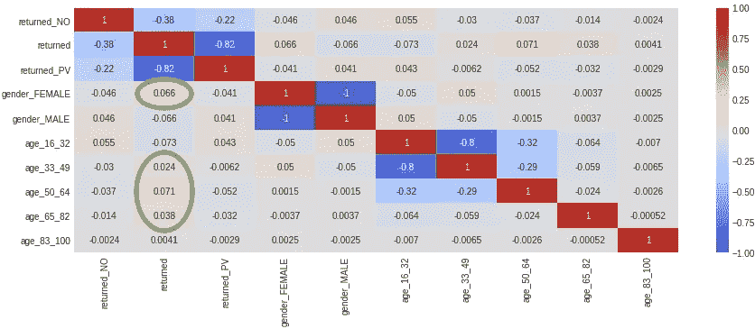
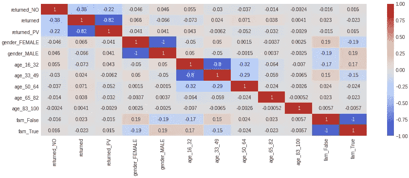

# 了解如何构建自己的半合成机器学习数据集

> 原文：<https://betterprogramming.pub/jailbird-part-1-curiosity-fake-data-657f8f6dd256>

## **为什么**网飞的节目《世界上最严酷的监狱内幕》启发我为数据科学撰写了一份问题陈述


[德蕾斯·库克](https://unsplash.com/@deleece?utm_source=unsplash&utm_medium=referral&utm_content=creditCopyText)在 [Unsplash](https://unsplash.com/s/photos/prison?utm_source=unsplash&utm_medium=referral&utm_content=creditCopyText) 上的照片

我已经看完了网飞世界上最严酷监狱的所有剧集。我喜欢在糟糕的情况下看到好的结果。挪威监狱取得了很大的成绩，但从其他监狱也总能学到至少一点有用的东西。

一个例子是巴西监狱，在那里，一个教授生活技能和工作心态的慈善基金会是矫正治疗的一部分。它通过团队建设活动提供情感康复，如泥浴，囚犯们走出他们的舒适区，互相用泥覆盖。

乌克兰的囚犯在每日歌唱俱乐部获得一些欢笑，所有已婚囚犯都有权每两个月进行为期三天的配偶探视。

在伯利兹，一所监狱开展了一项康复计划，囚犯们在那里学习社会化和愤怒管理。

洪都拉斯监狱的警卫把自己锁在外面，挑选出来的、信任的囚犯被武装起来，并被赋予管理监狱的责任。

第二季和第三季的主持人是英国记者拉斐尔·罗，他因莫须有的罪名被判终身监禁，不得假释。服刑 12 年后，他最终被无罪释放。他的经历和感受不仅为这部剧的结局增色不少，而且最终会和所有站出来展示自己的人一起，让这部剧变得更好。

剧中几乎所有的监狱都极其恐怖。但我相信应该有可能收集所有这些知识，在这里和那里做一点调整，并通过使用知识而不是必要的资金来改善世界各地的监狱福利和制度。

为了让事情变得更好，你需要数据，所以我开始浏览 [Kaggle](https://www.kaggle.com/) 寻找数据集，找到了 [NYS 累犯:始于 2008](https://www.kaggle.com/new-york-state/nys-recidivism-beginning-2008) 。但是和通常的数据集一样，它缺少软因素。我认为有用的数据是这样的数据，它能告诉囚犯们是否得到了足够高质量的社交，他们能阅读什么，他们做什么活动，以及他们是否在任何情况下都感到需要。

如果囚犯在服刑期间能够继续与亲属度过健康的高质量时间，那么他们的关系将会得到维持。一旦他们出狱，一个他们非常想念的健康的社交圈将等待他们重新进入。他们会努力不再打破这个圈子。

我有了用软因子列生成和丰富数据集的想法。但是我从做探索性的数据分析开始。我在相关矩阵的帮助下发现，特别是女性和年龄跨度在 33-82 岁(但特别是 50-64 岁)的囚犯重返监狱的可能性很高。



这就是我如何使用 [Faker](https://pypi.org/project/Faker/) 为数据集生成额外的合成数据:

GitHub gist 的链接:[https://gist . GitHub . com/annaunger/1 ada ab 593 f 0 b 0a 171 c 69 F6 d 638 a 44 a 23](https://gist.github.com/annaunger/1adaab593f0b0a171c69f6d638a44a23)

# 如何一步一步来

我已经用 one-hot 编码对数据集进行了编码，以将其用于机器学习。然后我创建一个空列表，在那里我使用 [Faker](https://faker.readthedocs.io/en/master/providers/faker.providers.misc.html) 生成一个布尔值，这取决于`DataFrame`中的值，使用`[iloc](https://pandas.pydata.org/pandas-docs/stable/reference/api/pandas.DataFrame.iloc.html)`。

```
pip install Fakerfakies = []for i in range(len(new_df)): if (new_df.iloc[i].gender_MALE==1) 
    and (new_df.iloc[i].age_16_32==1):
        fakies.append(fake.boolean(chance_of_getting_true=85)) elif (new_df.iloc[i].gender_MALE==1) 
    and (new_df.iloc[i].age_50_64==1):
        fakies.append(fake.boolean(chance_of_getting_true=75)) elif (new_df.iloc[i].gender_MALE==1) 
    and (new_df.iloc[i].age_33_49==1):
        fakies.append(fake.boolean(chance_of_getting_true=70)) elif (new_df.iloc[i].gender_MALE==1) 
    and (new_df.iloc[i].age_65_82==1):
        fakies.append(fake.boolean(chance_of_getting_true=65)) elif (new_df.iloc[i].gender_FEMALE==1) 
    and (new_df.iloc[i].age_16_32==1):
        fakies.append(fake.boolean(chance_of_getting_true=55)) elif (new_df.iloc[i].gender_FEMALE==1) 
    and (new_df.iloc[i].age_50_64==1):
        fakies.append(fake.boolean(chance_of_getting_true=25)) elif (new_df.iloc[i].gender_FEMALE==1) 
    and (new_df.iloc[i].age_33_49==1):
        fakies.append(fake.boolean(chance_of_getting_true=40)) elif (new_df.iloc[i].gender_FEMALE==1) 
    and (new_df.iloc[i].age_65_82==1):
        fakies.append(fake.boolean(chance_of_getting_true=45))

    else:
        fakies.append(fake.boolean(chance_of_getting_true=30))
```

我将造假者名单添加到`DataFrame`:

```
new_df['visitors_family'] = pd.DataFrame(fakies)
```

然后，我用一键编码对新列进行编码:

```
df_visitors_family_one_hot = pd.get_dummies(new_df['visitors_family'], prefix='fam')
```

我用`DataFrame`连接两个编码的列:

```
new_df_con_enc = pd.concat([new_df, df_visitors_family_one_hot], axis=1)
```

我重命名`DataFrame`并删除添加的 Faker 列表列:

```
final_df = new_df_con_enc.drop(['visitors_family'], axis=1)
```

我用一个相关矩阵来可视化`DataFrame`，看看我的假数据看起来是否正常:

```
plt.figure(figsize=(15,5))
sns.heatmap(final_df.corr(),
        vmin=-1,
        cmap='coolwarm',
        annot=True);
```



看起来不错，但是我需要稍微调整一下`chance_of_getting_true`的值。

很难找到一个与您的需求 100%匹配的数据集，因此，知道如何生成您自己的数据集是很好的，一个不是完全随机的数据集。

感谢阅读！