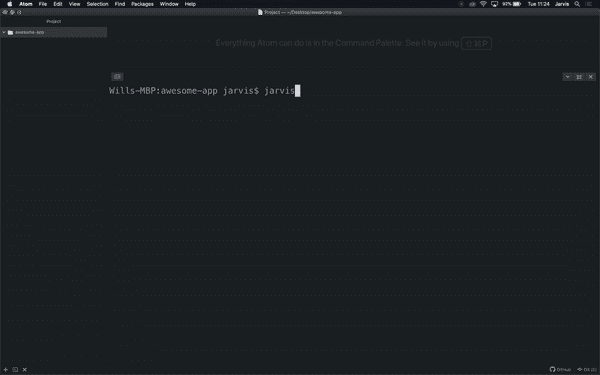
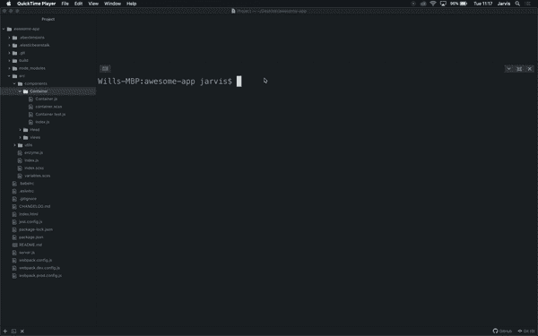
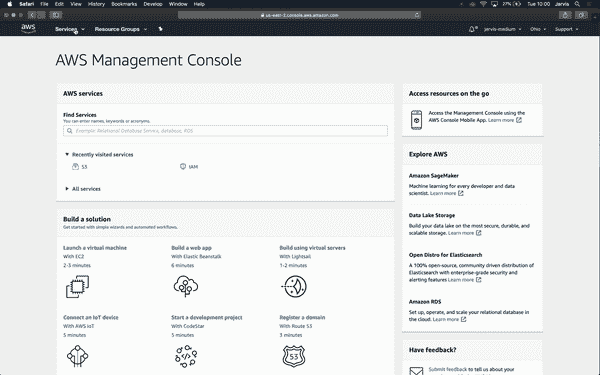
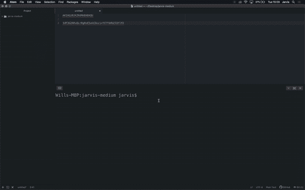
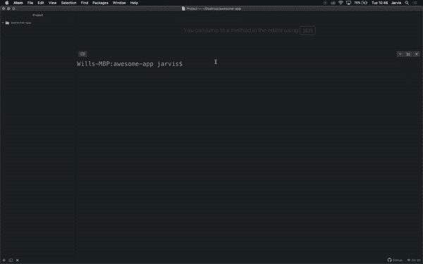
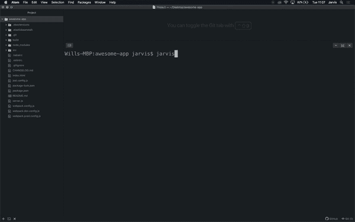

# Jarvis 1.1.0 —新增功能和使用方法

> 原文：<https://betterprogramming.pub/jarvis-1-1-0-whats-new-how-to-use-it-f53a23377f48>

## 浏览最新版本中包含的修复和更新


Jarvis 1.1.0 今天发布了一些很酷的新特性和大量更新。在这篇文章中，我将快速浏览所有的变化，并向您展示如何使用新功能。

如果你还不知道 Jarvis 是什么，那么你就错过了。Jarvis 是一个 CLI，可以帮助完成日常任务，如管理配置、部署应用程序和初始化项目。如果你想了解更多关于贾维斯的事情，以及我为什么建造他，那么你应该阅读[这个故事](https://medium.com/swlh/building-a-cli-to-help-manage-github-accounts-react-projects-and-more-2755259be493)，如果你想知道如何设置和使用他，那么[这个故事](https://medium.com/better-programming/how-to-set-up-use-jarvis-the-cli-that-makes-your-life-easier-54fa6d7e83b)将指导你。

要将 Jarvis 更新到新版本，运行:

```
npm install -g @willptswan/jarvis
```

## 修理

首先，我们来看看已经修复了什么。运行`react-init`和`react-create`时产生的组件测试已经修复。现在，测试会像预期的那样通过和失败，而不是总是通过。同样在`react-init`命令中，`Environment.js`已经更新了社交媒体 URL 的 getters，所以它们现在将返回正确的 URL 而不是`undefined`。最后，在运行`react-init`时，自定义滚动条的样式已经被移除，因为 CSS 没有得到广泛支持。

# 有什么新鲜事吗？

Jarvis 1.10 除了一些新特性之外，还增加了很多新特性。

## 更新

让我们从更新开始，Jarvis 现在将每天自动检查更新。如果有可用的更新，Jarvis 将在命令运行完毕后显示一条消息让您知道。

## SCSS

你不用再少用了，现在`react-init`和`react-create`都支持 SCSS。默认情况下，仍然使用“更少”,但是您可以在设置中对此进行更改。

## 设置

贾维斯现在有了设置。目前，只有三种设置:

*   `checkActiveConfig` —这告诉 Jarvis 您是否希望它在运行命令之前总是检查活动配置。
*   这告诉贾维斯你是否希望使用 SCSS 或者更少。
*   `autoCheckUpdates` —这告诉 Jarvis 您是否希望他自动检查更新。

随着贾维斯的成长，更多的设置将会被添加进来，允许你对他进行更多的定制。

随着设置的引入，Jarvis 有了三个新命令。

*   `settings-update` —这允许您更新设置。
*   `settings-reset` —允许您将所有设置重置为默认值。
*   `settings-view` —允许您查看当前设置。

您不必担心添加新设置时会遗漏它们。每次运行命令时，Jarvis 都会检查新的设置。如果有新的设置，那么他会问你要怎么设置。

## 新网站

在 1.1.0 版中有两个新的站点速记员:

*   `css` — CSS 招数
*   `m` —中等

这两个短手都由`site-open`和`site-search`支撑。

## AWS 区域



AWS 区域

当您添加新的 AWS 配置或更新现有配置时，您将看到所有可用区域的列表。将对您键入的区域进行验证，以确保在运行 AWS 相关命令时不会出现意外行为。

## S3 上传

有了 Jarvis 1.1.0，你现在可以直接从 Jarvis 上传文件和文件夹到 S3。执行此操作的命令语法是:

```
jarvis s3-upload <filePath> -p
```



上传文件和文件夹到 AWS S3

`-p`选项用于在您不想上传文件所在的文件夹时上传多个文件。这样做的原因是，如果你想上传多个文件，那么他们需要在一个文件夹中，但你可能不希望他们所在的文件夹被上传。让我们来看几个例子。假设您有以下文件结构:

```
// File Structure
logo.png
icons/    
     menu.png    
     instagram.png    
     facebook.png    
     twitter.png
```

如果你想上传`logo.png`，那么你可以运行:

```
jarvis s3-upload logo.png// This uploads to
bucket/
    logo.png
```

如果您想要上传所有图标，包括文件夹，那么您应该运行:

```
jarvis s3-upload icons// This uploads to
bucket/
    icons/
        menu.png
        instagram.png
        facebook.png
        twitter.png
```

最后，如果您想上传所有图标而不是文件夹，那么您应该运行:

```
jarvis s3-upload icons -p// This uploads to
bucket/
    menu.png
    instagram.png
    facebook.png
    twitter.png
```

当您运行`s3-upload`命令时，Jarvis 将首先检查当前的 S3 配置是否正确。检查完配置后，Jarvis 将询问您希望上传文件的 S3 存储桶内的路径。他还会询问您希望对文件使用什么 ACL，所有可能的 ACL 都会显示出来供您参考。上传文件&文件夹到 S3 就是这么简单。

## AWS 弹性豆茎

你现在可以初始化弹性 Beanstalk 应用程序，并部署它们，不仅如此，`react-init`和`react-deploy`现在都支持弹性 Beanstalk。



为 Elastic Beanstalk 创建新的 IAM 用户

让我们看看如何使用`react-init`和`react-deploy`来实现这一点。您需要做的第一件事是转到 AWS 控制台，创建一个新的具有以下权限的编程式 IAM 用户:

*   ElasticLoadBalancingFullAccess
*   AWSElasticBeanstalkFullAccess

不要忘记记下访问密钥和秘密访问密钥，因为在下一步中会用到它们。创建用户后，继续使用以下命令创建新的配置:

```
jarvis config-new eb
```



创建新的弹性 Beanstalk 配置

Jarvis 将首先要求您提供一个配置 id，之后他将要求您提供您想要的区域，以及您刚刚创建的键。输入所有信息后，Jarvis 将在用户的根目录下创建一个凭证文件和一个配置文件。这些文件由 Elastic Beanstalk CLI 在运行命令时使用。

现在您已经设置了配置，您可以继续创建一个新项目:

```
mkdir awesome-app
cd awesome-app
jarvis react-init awesome-app
```



为弹性豆茎初始化一个 React 项目

您将在`react-init`中看到的只有一个变化，它现在将询问项目是否将部署在 Elastic Beanstalk 上，回答是。一旦您做出响应，Jarvis 将确保活动配置是正确的。然后，他将开始初始化一个弹性 Beanstalk 应用程序，为应用程序创建一个配置文件，然后创建应用程序环境。这个过程可能需要几分钟，所以如果看起来像是卡住了，也不要担心。一旦 Jarvis 完成了一个弹性 Beanstalk 应用程序的初始化，`react-init`将照常继续。

您的应用程序现在可以部署了，运行以下命令:

```
jarvis react-deploy eb 1.0.0
```



将 React 应用部署到 Elastic Beanstalk

*注意:当您部署应用程序时，您应该只能在 AWS 控制台中看到一个环境。我的控制台显示了多种环境，因为由于 NPM 缓存错误，我不得不重新运行几次* `*react-init*` *。*

与`react-init`类似，这里你不会看到太大的变化。唯一的区别是，不是检查 GCP 配置，而是检查您的 EB 配置，不是部署到 Google App Engine，而是将您的应用部署到 Elastic Beanstalk。

这个命令要注意的主要事情是它现在有了一个平台参数和一个版本。仅使用版本运行命令将不再有效，您现在必须运行以下命令之一:

```
jarvis react-deploy gae <version>
jarvis react-deploy eb <version>
```

至此，您已经创建了一个 React 应用程序，并将其部署到 AWS Elastic Beanstalk。

如果您有一个现有的应用程序，那么您可以使用`eb-init`命令来初始化一个 Elastic Beanstalk 应用程序，并使用`eb-deploy`命令将应用程序部署到 Elastic Beanstalk。

# 结论

这就是全部内容，您已经准备好开始使用 Jarvis 1.1.0 了。我希望你已经发现这个故事是有用的，并且你喜欢新的更新。像往常一样，我们非常欢迎反馈、建议和贡献。

GitHub:[https://github.com/willptswan/jarvis](https://github.com/willptswan/jarvis)

https://www.npmjs.com/package/@willptswan/jarvis[NPM](https://www.npmjs.com/package/@willptswan/jarvis)