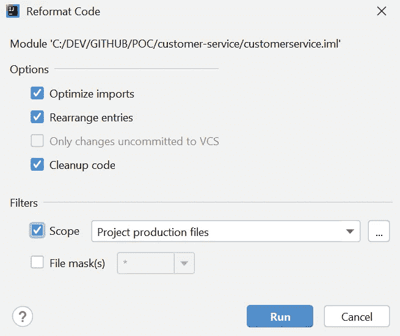
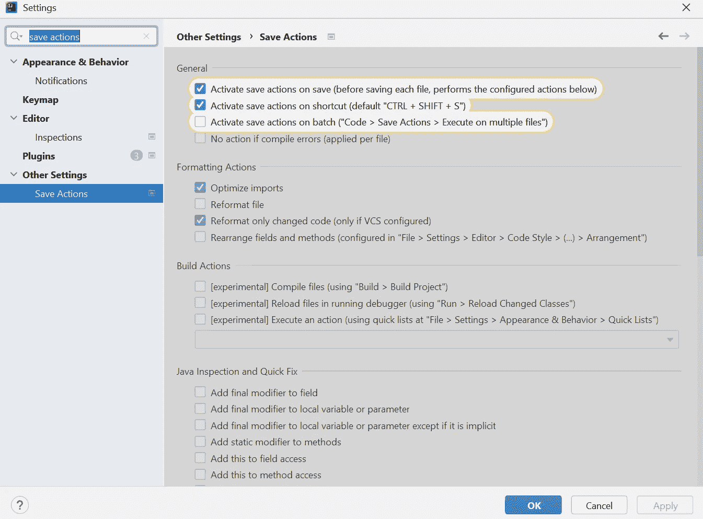
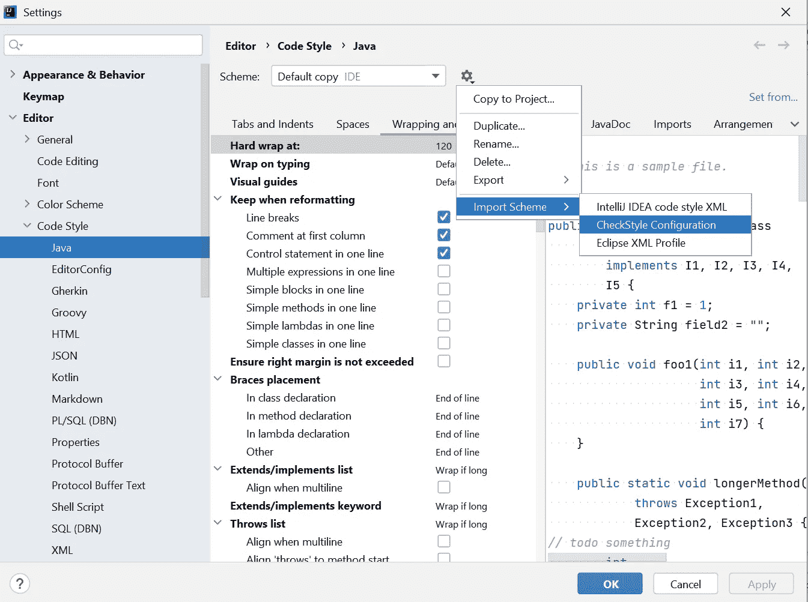

# Java 编码风格自动化

> 原文：<https://betterprogramming.pub/java-coding-style-automation-b44b82cec010>

## Oracle 代码约定和 Google Java 风格


作者图片

拥有统一的编码风格会带来许多好处，仅举几个例子:

*   提高软件可读性
*   最大限度降低软件维护成本
*   加速发展

# 编码风格选项

在用 Java 进行开发时，有两种主要的编码风格。

*   [甲骨文代码惯例](https://www.oracle.com/java/technologies/javase/codeconventions-contents.html)
*   [谷歌 Java 风格指南](https://google.github.io/styleguide/javaguide.html)

我们来对比一下这两个。

**最后更新日期:**

*   Oracle 代码约定:1999 年 4 月 20 日。这意味着较新版本 Java(如 Java 8)不包含在编码约定中。
*   谷歌 Java 风格指南:2018 年 5 月 22 日。

**IntelliJ 插件:**

*   Oracle 代码约定:没有 Oracle 代码约定的官方插件。
*   谷歌 java 风格指南:谷歌 Java 格式。

**检查样式:**

*   Oracle 代码约定:[check style/sun _ checks . XML at master check style/check style](https://github.com/checkstyle/checkstyle/blob/master/src/main/resources/sun_checks.xml)。
*   Google Java 风格指南:[check Style/Google _ checks . XML at master check Style/check Style](https://github.com/checkstyle/checkstyle/blob/master/src/main/resources/google_checks.xml)。

每种风格都有自己的优点和缺点。我们将利用这两个选项来探索编码风格自动化。

先试试 Google Java 风格吧。

# 开发期间自动化编码风格

在开发过程中，通过我们的 IDE，我们可以做两件事来自动化编码风格，例如 IntelliJ。

# google-java 格式插件

## 装置

一个 IntelliJ 插件，重新格式化 Java 源代码以符合 Google Java 风格。安装很简单，文件→设置→插件，然后点击“市场”标签，搜索“谷歌-Java-格式”。安装后，会提示您重新启动 IntelliJ。

## 激活

在您的 IntelliJ 重启后，您将被提示启用 google-java-format 插件。如果您错过了它，您可以随时进入文件→设置来搜索它，然后启用它。

## 格式化/重新格式化

一旦启用，您现在可以格式化/重新格式化您的文件，甚至整个项目！两种做法:“ctrl + alt + L”，或者代码→重新格式化代码。让我们仔细看看如何使用键盘选项。

打开你想要格式化/重新格式化的文件，使用键盘“ctrl + alt + L”，你会看到你的文件用谷歌 java 风格漂亮地格式化了！你可以对整个包甚至整个项目这样做，只需在 IntelliJ 中点击包文件夹，或项目根文件夹，使用键盘“ctrl + alt + L”，你会得到这个窗口的提示，前两个复选框是默认选中的，我也选中了“清理代码”，然后按“运行”来查看你的一堆文件得到重新格式化。



很好，现在现有的文件都被重新格式化了，我们如何确保新文件或现有文件中的修订块遵循相同的 google Java 风格？请继续阅读。

# 保存操作插件

这个插件是为了确保任何对文件的新更改在保存时都被格式化。它支持可配置的、类似 Eclipse 的保存操作，包括“优化导入”、“重新格式化代码”、“重新排列代码”、“编译文件”和一些针对 Java 的快速修复，如“添加/删除‘this’限定符”等。当文件在磁盘上同步(或保存)时，插件执行配置的动作。

## 装置

按照与 google-java-format 相似的步骤安装保存操作插件。

## 激活

进入文件→设置，搜索“保存动作”，然后勾选几个复选框来激活保存动作或快捷方式，同时选择格式化动作。您甚至可以通过选中底部的复选框来应用快速修复。



## 执行

现在来看看它的实际效果。一旦你编辑完一个文件，按下键盘“ctrl + shift + S”来触发保存操作，你会看到你的代码格式很好！

# 使用 Checkstyle 在代码推送中实施编码样式

为了完全实施编码风格，我们需要在构建/管道级别把关，以便在开发过程中捕捉任何丢失的格式或故障。要做到这一点，让我们探索 Checkstyle。

# maven-检查样式-插件

这个插件有两个预定义的配置: [Sun 风格的](https://checkstyle.sourceforge.io/sun_style.html)和 [Google 风格的](https://checkstyle.sourceforge.io/google_style.html)。对于 Google style，我们可以下载其内置的 [Google style xml 文件](https://github.com/checkstyle/checkstyle/blob/master/src/main/resources/google_checks.xml)。我们可以将其重命名为 checkstyle.xml，或者如果您的项目中已经有了该文件，则用新内容覆盖项目根目录下的 checkstyle.xml。在根 pom 中添加以下 maven 插件。

```
<plugin>
    <groupId>org.apache.maven.plugins</groupId>
    <artifactId>maven-checkstyle-plugin</artifactId>
    <version>3.1.2</version>
    <configuration>
        <configLocation>checkstyle.xml</configLocation>
        <encoding>UTF-8</encoding>
        <consoleOutput>true</consoleOutput>
        <failsOnError>true</failsOnError>
        <linkXRef>false</linkXRef>
    </configuration>
    <executions>
        <execution>
            <id>validate</id>
            <phase>validate</phase>
            <goals>
                <goal>check</goal>
            </goals>
        </execution>
    </executions>
</plugin>
```

有了上面的 maven 配置，如果我们运行`mvn clean install`命令，插件将扫描文件中的违规，如果发现任何违规，它将使构建失败。

这些问题将在`target/checkstyle-result.xml`文件中报告。按照`target/checkstyle-result.xml`中的错误细节修复代码，重复`mvn clean install` 直到所有错误都被解决。

如果您不是 Google Java 风格的忠实粉丝，并且希望坚持良好的传统 Oracle 代码约定，请按照下面的步骤使用 Oracle 代码约定自动化您的项目编码风格。

# 开发期间自动化编码风格

# 检查样式-想法

这个插件在 IDEA 中提供了 CheckStyle 对 Java 文件的实时和按需扫描。

## 装置

在 IntelliJ 中导航到文件→设置→插件，然后点击“市场”标签，搜索“CheckStyle-IDEA”，安装它，你将被提示重新启动 IntelliJ。

# checkstyle.xml

Checkstyle 有一个我们可以利用的 [Sun/Oracle 版本](https://github.com/checkstyle/checkstyle/blob/master/src/main/resources/sun_checks.xml)。请随意修改开箱即用版本，因为有些规则有点过于严格，例如所有成员变量都需要指定 javadoc。你可以把你认为限制性太强的部分注释掉。一旦完成，我们将把这个 checkstyle.xml 导入到 IntelliJ 中。导航到文件→设置→编辑器→代码样式→ Java，然后点击管理图标，见下面截图，导入方案→ CheckStyle 配置，然后只需从你的根项目导航到 checkstyle.xml，点击“应用”，然后“确定”。



## 格式化/重新格式化

您现在可以格式化/重新格式化您的文件，甚至整个项目！两种做法:“ctrl + alt + L”，或者代码→重新格式化代码。

为了确保新文件或现有文件中的修订块遵守相同的 Oracle 代码惯例，请遵循上面列出的保存操作插件安装、激活和执行说明。

要使用 checkstyle 在代码推送中实施编码风格，请确保用来自 [Sun/Oracle 版本](https://github.com/checkstyle/checkstyle/blob/master/src/main/resources/sun_checks.xml)的内容替换项目根的 checkstyle.xml 文件。

暂时就这样吧！无论您选择哪种编码风格，现在您都可以高枕无忧，享受自动化编码风格带来的美妙项目了！

编码快乐！手工制作快乐！

# **参考文献**

*   [Java 编程语言的代码约定:内容](https://www.oracle.com/java/technologies/javase/codeconventions-contents.html)
*   [谷歌 Java 风格指南](https://google.github.io/styleguide/javaguide.html)
*   [Java 编码惯例。要遵循哪些，为什么](https://codegym.cc/groups/posts/491-java-coding-conventions-which-ones-to-follow-and-why)
*   [哪里有最好的 Java 编码风格指南？不在甲骨文—艾伦·蔡奇克](https://alanzeichick.com/2016/11/wheres-best-java-coding-style-guide-not-oracle.html)
*   【Java 的编码标准和编程最佳实践。(第 1 部分，共 3 部分)
*   [check Style——谷歌的风格](https://checkstyle.sourceforge.io/google_style.html)
*   [check style/Google _ checks . XML at master check style/check style](https://github.com/checkstyle/checkstyle/blob/master/src/main/resources/google_checks.xml)
*   [Intellij 在文件保存时重新格式化](https://stackoverflow.com/questions/946993/intellij-reformat-on-file-save)