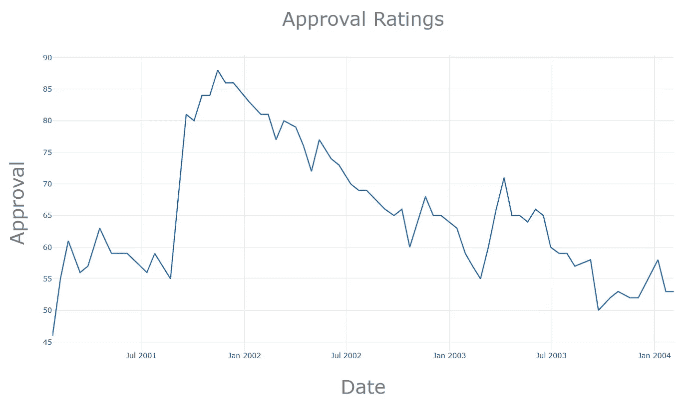
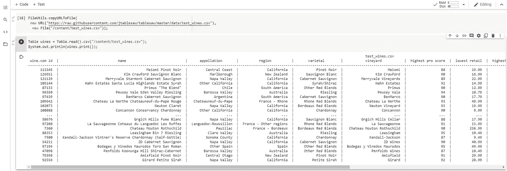
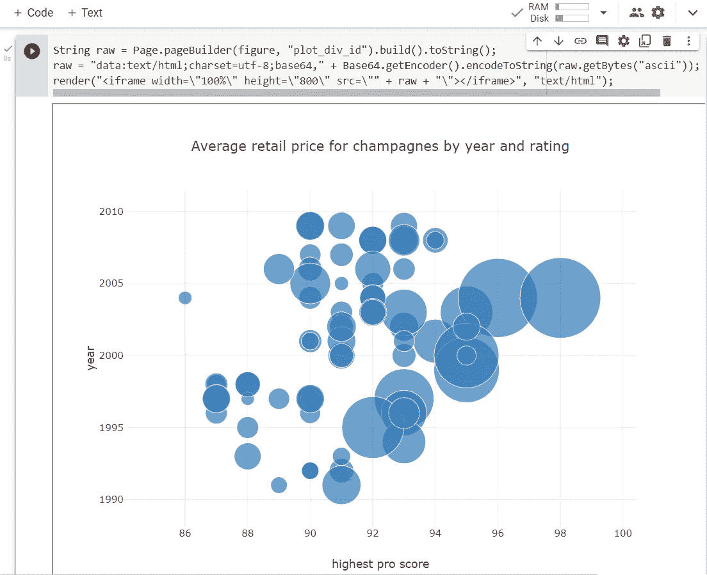
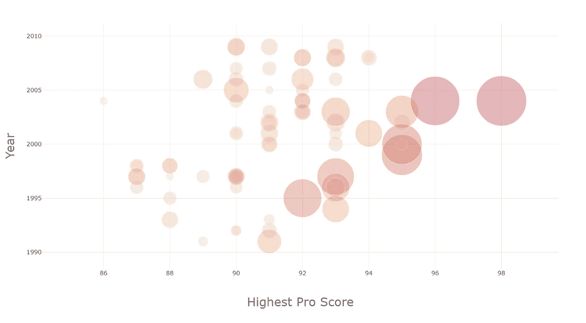

# Java、Jupyter 和 Plotly

> 原文：<https://betterprogramming.pub/java-jupyter-plotly-e1bbaa7f2be8>

## 使用 Java 包装器为运行 Java 内核的 Google Colab 笔记本(Jupyter)创建可视化



# 介绍

[Jupyter](https://jupyter.org/) 和 [Plotly](https://github.com/plotly) 不是你通常会联想到 Java 的两个包…

许多最流行的绘图库不是用 Java 编写的，这也不是什么秘密。不过，这并不妨碍我们利用现有的工具，比如 Plotly，而且为用其他语言编写的代码构建包装器并不是有些人会认为的*失礼行为*。

[Tablesaw](https://jtablesaw.github.io/tablesaw/) 为 Java 开发人员提供了一个这样的解决方案:

> 在 0.2.0 版本中,[Tablesaw]引入了一个新的绘图框架，它提供了一个围绕着 [Plot.ly](https://github.com/plotly) 开源 JavaScript 可视化库的 Java 包装器。
> 
> Plot.ly 基于非凡的 [D3(数据驱动文档)](https://d3js.org/)框架，无疑是任何语言中最好的开源可视化软件包之一。Plot.ly 非常优秀，它已经广泛应用于 Python 和 R 等 JavaScript 之外的语言中，这些语言已经有了可靠的可视化选项。

## 先决条件

至于 Jupyter 笔记本和 Java，我在以前的文章中已经详细介绍过这个主题:

*   [Java、Jupyter 和 Google Colab](https://medium.com/@gmsharpe/jupyter-java-and-google-colab-7a2f7fb08808)
*   [开始使用 Tablesaw 和 Google Colab](https://medium.com/@gmsharpe/getting-started-with-tablesaw-and-google-colab-65ef0cbe280c)

[斯潘塞公园](https://github.com/SpencerPark)，IJava 的开发者，另外[为我们设计了一种方式](https://github.com/SpencerPark/IJava/issues/49)在 Jupyter 笔记本上显示我们的 Tablesaw 图。

注意:如果你不熟悉如何同时使用 Java 和 Google Colab，上面列出的两篇文章可以帮助你入门。对于本文，我将假设您有一个配置了 Java 内核的 `*.ipynb*` *模板，在您的 Google Colab 主机上安装了内核，并连接到托管的运行时。*

## 入门指南

安装 Java 内核后，我们可以使用 Maven 和 [IJava 的 Magics](https://github.com/SpencerPark/IJava/blob/master/docs/magics.md) 加载依赖项。让我们从加载`tablesaw-core`和`tablesaw-jsplot`开始。在代码块中执行以下内容。

```
%%loadFromPOM
<dependency>
    <groupId>tech.tablesaw</groupId>
    <artifactId>tablesaw-core</artifactId>
    <version>0.41.0</version>
</dependency>
<dependency>
    <groupId>tech.tablesaw</groupId>
    <artifactId>tablesaw-jsplot</artifactId>
    <version>0.41.0</version>
</dependency>
```

接下来，我们将导入前进所需的许多包:

```
import tech.tablesaw.api.*;
import tech.tablesaw.columns.*;
import tech.tablesaw.plotly.*;
import tech.tablesaw.plotly.api.*;
import tech.tablesaw.plotly.components.*;
import tech.tablesaw.plotly.traces.*;
```

现在，在我们开始可视化*绝技之前，*我们需要将 Tablesaw 的 JsPlot 库连接到我们的 Jupyter 环境。

我可能最终会尝试剖析上述内容，并在本文的下一篇文章中对其进行分解。但是现在，我们将继续讨论情节本身。

# 绘图示例

从这一点开始，绘图相当简单。下面，我从 [Tablesaw 的收藏](https://github.com/jtablesaw/tablesaw/tree/master/jsplot/src/test/java/tech/tablesaw/examples)中的一个例子开始。

使用%Magic 导入 Apache Commons FileUtils，下载' test_wines.csv' &作为表导入



## 简单的气泡图

首先，我们将使用 Tablesaw 提供的[示例之一。在 Google Colab 笔记本的代码块中执行以下内容。](https://github.com/jtablesaw/tablesaw/blob/master/jsplot/src/test/java/tech/tablesaw/examples/)

查询葡萄酒，其中“葡萄酒类型”=香槟和起泡酒&“地区”=加利福尼亚

出现的气泡图是一个相对较小的图，具有最小的光斑。



## 自定义布局

我们可以更进一步，配置图的`Layout`，而不是使用`BubblePlot.create(...)`提供的缺省值。

在这里，我们既使用了`Layout`类，也使用了一个替代的构造函数来修改:

*   渲染图的高度和宽度，
*   字体系列、颜色和大小。
*   气泡的颜色和不透明度



# 结论

这旨在快速介绍如何使用 Jupyter，Java & Tablesaw 的 Plotly 实现。在 [Tablesaw 的 GitHub 库](https://github.com/jtablesaw/tablesaw/tree/master/jsplot/src/test/java/tech/tablesaw/examples)中还有几个例子。

我很乐意听到任何探索如何在笔记本环境中使用 Java 的人的反馈(Jupyter， [Zeppelin](https://zeppelin.apache.org/) 等)。)和命令行( [JShell](https://docs.oracle.com/javase/9/jshell/introduction-jshell.htm) )上使用 Tablesaw 等工具进行数据处理和可视化。给我发消息，特别是如果你已经在 Medium 上发表了任何材料，我很乐意在将来相关的时候链接到你的内容。