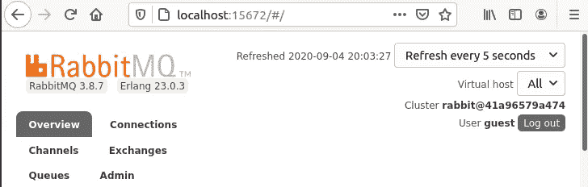
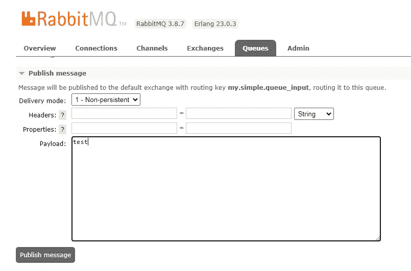
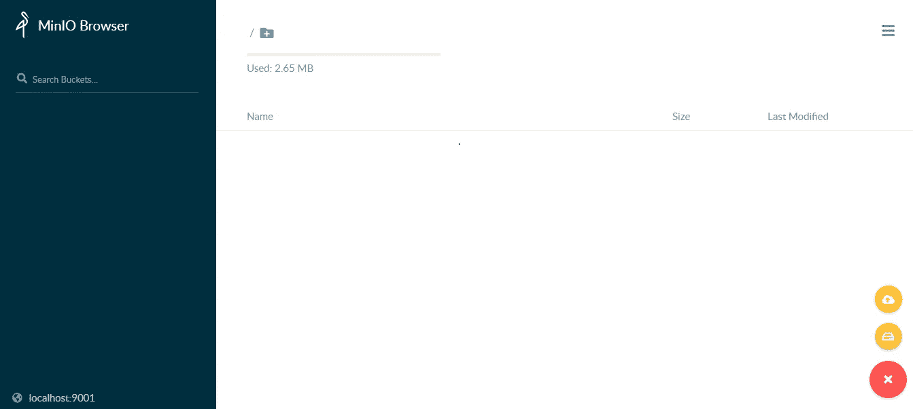
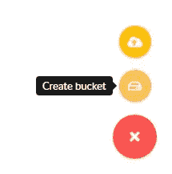
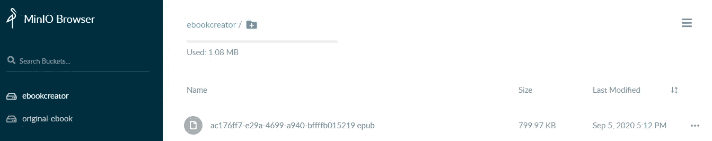
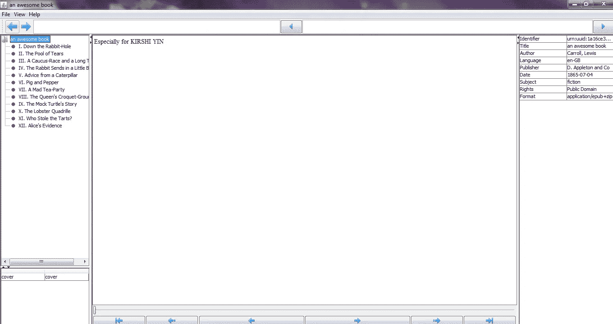

# Java:处理来自 RabbitMQ 的消息并将数据上传到 MinIO Cloud

> 原文：<https://betterprogramming.pub/java-process-messages-from-rabbitmq-and-upload-data-to-minio-cloud-b70ecd2e82be>

## 消费来自 RabbitMQ 的消息并将 epub 文件上传到 MinIO 云存储


照片由[杰佛森·桑多斯](https://unsplash.com/@jefflssantos?utm_source=medium&utm_medium=referral)在 [Unsplash](https://unsplash.com?utm_source=medium&utm_medium=referral) 上拍摄

在本教程中，我们将学习如何处理来自消息代理 [RabbitMQ](https://www.rabbitmq.com/) 的数据，并将文件上传到 [MinIO](https://min.io/) 云存储。为了让它更令人兴奋，我们将探索 [Epublib](http://www.siegmann.nl/epublib) ，一个 epub 处理器库来读取和修改电子书。然后我们将它上传到 MinIO，并提供下载。

让我们想象以下场景:你是一个慷慨的作家，你出版了一本免费的电子书。您希望您的读者能够以 epub 格式下载它，并在封面上放置特殊签名。例如，他们可以为他们的朋友制作一份礼物，并在封面上签上类似“特别为 XY”的字样

用专业术语来说:朋友的名字将作为消息来自 RabbitMQ。Epublib 将根据收到的名字创建电子书的封面。最后，我们将把新电子书上传到 MinIO Cloud，并提供下载链接。

我们开始吧！

# 安装消息代理

## 1.设置 RabbitMQ 环境

有各种各样的安装方法，但是在本教程中，为了简单起见，我使用 Docker 映像。有关如何开始的更多信息，请参考[文档](https://www.rabbitmq.com/download.html)。

*   如果您的机器上有 Docker，请在终端中键入以下命令来提取社区图像:

```
docker run -it --rm --name rabbitmq -p 5672:5672 -p 15672:15672 rabbitmq:3-management
```

*   为了避免每次都键入命令，创建一个名为`docker-compose.yml`的 Docker yml 文件，并键入以下配置:

## 2.测试安装

*   现在让我们通过运行这个`docker-compose`命令来启动 RabbitMQ:

`docker-compose up -d`

*   如果您在浏览器中导航到`localhost:15672`，系统会提示您输入用户名和密码。使用正式的测试凭证登录—“来宾/来宾”

您应该会看到这样一个页面:



登录后显示 RabbitMQ 屏幕的屏幕截图

# 准备 Java 客户端

我用 Java 连接 RabbitMQ。许多其他语言都被支持，所以如果你想试验，检查这个客户端库的[文档](https://www.rabbitmq.com/devtools.html)。

## 1.获取项目依赖关系

*   首先，在您最喜欢的 IDE 中创建一个新的 [Gradle](https://gradle.org/) 项目。
*   将此内容放入`build.gradle`文件:

我们的项目只需要这三个库。

## 2.创建 Java 类

*   在成功构建之后，创建一个`MessageReceiver.java`文件。这个类将包含我们的应用程序的逻辑。
*   让我们创建 RabbitMQ 连接:

请注意，我们希望等待连接建立。如果我们在所有尝试后都无法连接，我们将抛出一个异常。

*   然后让我们准备我们的消息队列。必须先声明才能使用。请注意，当只有一个客户端想要使用队列时，这将是声明队列的典型方式:它不需要众所周知的名称，没有其他客户端可以使用它(独占)，并且它将被自动清理(自动删除):

`prefetchCount`值定义了该通道上允许的未确认交付的最大数量。一旦数量达到配置的计数，RabbitMQ 将停止在通道上传递更多的消息，除非至少有一个未完成的消息得到确认。要了解更多关于确认的信息，请阅读[文档](https://www.rabbitmq.com/confirms.html)。

`QUEUE_INPUT`只是我们队列的一个常量名称:

```
**private static final** String ***QUEUE_INPUT*** = **"my.simple.queue_input"**;
```

*   现在我们必须创建一个通道来接收消息。创建一个`startWork()`方法来负责我们的执行逻辑。

```
**public void** startWork() **throws** IOException, TimeoutException, InterruptedException {

    Channel channel = createConnection().createChannel();

    prepareRabbitQueue(channel);

    System.***out***.println(**"Waiting for messages..."**);

}
```

*   创建一个将要启动应用程序的`AppRunner.java`类:

*   通过运行`AppRunner.java`类检查连接是否成功。

你应该可以像我们之前做的那样从浏览器登录 RabbitMQ。

*   现在让我们将消息消费者代码添加到相同的方法中:

```
DeliverCallback deliverCallback = (consumerTag, delivery) -> {
    String message = **new** String(delivery.getBody(), StandardCharsets.***UTF_8***);
    System.***out***.println(**" [x] Received '"** + message + **"'"**);

};
channel.basicConsume(***QUEUE_INPUT***, **true**, deliverCallback, consumerTag -> {
});
```

*   重新运行代码并导航到消息代理控制台。转到 Queues，在 PayLoad 部分输入一些内容，然后点击 Publish。



我的电脑上显示如何发布消息的屏幕截图

您应该会在 IDE 控制台中看到收到的消息。

# 准备 MiniIO 客户端

我们将使用 Docker 映像来安装 MinIO。如果您想探索其他安装方式，请参考[安装指南](https://docs.min.io/docs/minio-quickstart-guide.html)。

## 1.设置 MinIO 环境

*   将以下几行添加到`docker-compose.yml`文件中:

在这个配置中，我们在[分布式模式](https://docs.min.io/docs/distributed-minio-quickstart-guide.html)下运行 MinIO。基本上，它可以承受多个节点故障，同时确保全面的数据保护，因为驱动器分布在多个节点上。

要在这种模式下运行它，根据要求，我们需要四个磁盘。你可以看到我们把它们命名为`minio1, minio2, minio3, minio4`。

为了启动分布式 MinIO 实例，我们将驱动器位置作为参数传递给`minio`服务器命令。对于要连接的节点，所有节点都应该具有相同的访问密钥和秘密密钥。注意，我们已经创建了登录凭证`MINIO_ACCESS_KEY: minio`和`MINIO_SECRET_KEY: minio123`。你可以随意改变它们。

## 2.测试安装

*   现在像以前一样运行`docker-compose`命令:

`docker-compose up -d`

*   当应用程序启动时，使用 docker yml 文件中提供的凭证登录到`[http://localhost:9001/minio/login](http://localhost:9001/minio/login)`。

您应该会看到 MinIO 浏览器界面。



## 3.准备原版电子书

现在，按照我们的场景，我们必须上传原始电子书。我们的程序稍后将下载它并添加一个新的封面。

*   我将使用 Adobe 的免费样本库下载一本书。对于本教程，我选择了[爱丽丝梦游仙境](https://contentserver.adobe.com/store/books/aliceDynamic.epub)并命名为`alice.epub`。
*   我们必须使用 MinIO 接口创建一个 Bucket。单击加号并选择创建存储桶:



我的 MinIO 存储屏幕截图

姑且称之为`original-ebook`。

*   将 epub 文件上传到存储桶。这是我们计划的先决条件。

## 4.创建消息处理程序

现在我们已经有了云存储中的原始电子书，我们可以继续编码了。

我在本教程中使用的是 Java，所以让我们遵循 [Java 客户端库指南](https://docs.min.io/docs/java-client-quickstart-guide.html)。如果您愿意，可以查看[文档](https://docs.min.io/docs/)中其他支持的语言。

我们已经在`build.gradle`文件中提取了 MinIO 依赖项。

*   在`MessageReceiver.java`中创建 MinIO 连接:

*   然后用新方法创建下载文件的代码:

请注意，`bucket`和`object`名称必须与我们之前创建的名称相匹配。

*   创建另一种文件上传方法:

*   我们将为修改后的电子书创建另一个存储桶。我把它叫做`ebookcreator` **。**注意，这一次，如果存储桶不存在，程序将自动创建存储桶:

*   为了使文件可供下载，我们必须创建一个 URL:

这个网址两小时内有效。您可以使用`expiry`参数修改到期日期。

# 处理电子书文件

由于我们已经下载了 epub 处理器库的必要依赖项，我们只需创建电子书处理的代码。

创建另一个名为`EBookHandler.java`的类:

我们从我们的`MessageReceiver.java`类接收原书、读者姓名和新电子书的名称作为参数。

为了简单起见，我们将以编程方式创建一个非常基本的`signature.html`文件，该文件将显示读者的姓名。要探索 Epublib 的更多功能，请查看官方的[示例程序](http://www.siegmann.nl/epublib/example-programs)。

# 把所有东西放在一起

现在我们只需通过在`startWork()`方法中创建一个`Book`对象来将`EBookHandler.java`与`MessageReceiver.java`连接起来。

完整的方法应该如下所示:

使用`UUID.randomUUID()` Java 方法将唯一生成修改后的图书的文件名。

就是这样！

# 实际应用

让我们检查一下应用程序的功能。

*   启动应用程序。
*   使用 RabbitMQ 接口发布名称。
*   登录 MinIO 界面。

您应该看到我们名为`ebookcreator` 的新 bucket 包含一个新的 epub 文件:



我的电脑截图显示新上传的电子书

*   在链接过期前下载文件。
*   使用 epub 查看器打开它，或者使用官方库提供的独立 Java epub 查看器。可以从这里下载[。](https://medium.com/r?url=https%3A%2F%2Fgithub.com%2Fdownloads%2Fpsiegman%2Fepublib%2Fepublib-tools-viewer-latest.jar)

我将使用独立查看器打开新创建的 epub 文件。你的电子书的封面应该看起来像这样:



显示最终结果的我的电脑截图

# 结论

我希望你从这篇教程中学到了一些新的东西。

感谢您的阅读，祝您编码愉快！

# 参考

1.  [https://github.com/kirshiyin89/rabbitmq_minio_demo](https://github.com/kirshiyin89/rabbitmq_minio_demo)
2.  【https://www.rabbitmq.com/java-client.html 号
3.  【https://www.rabbitmq.com/tutorials/tutorial-one-java.html 
4.  [https://www.rabbitmq.com/confirms.html](https://www.rabbitmq.com/confirms.html)
5.  [https://docs.min.io/docs/](https://docs.min.io/docs/)
6.  [http://www.siegmann.nl/epublib](http://www.siegmann.nl/epublib)
7.  [https://github.com/psiegman/epublib](https://github.com/psiegman/epublib)
8.  [https://www . adobe . com/solutions/ebook/digital-editions/sample-ebook-library . html](https://www.adobe.com/solutions/ebook/digital-editions/sample-ebook-library.html)