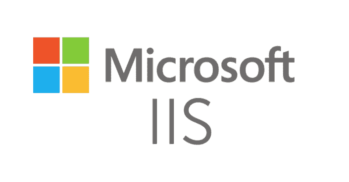
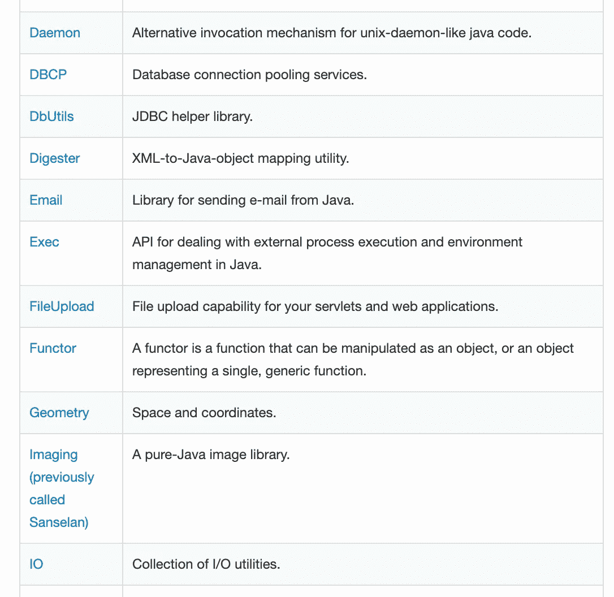
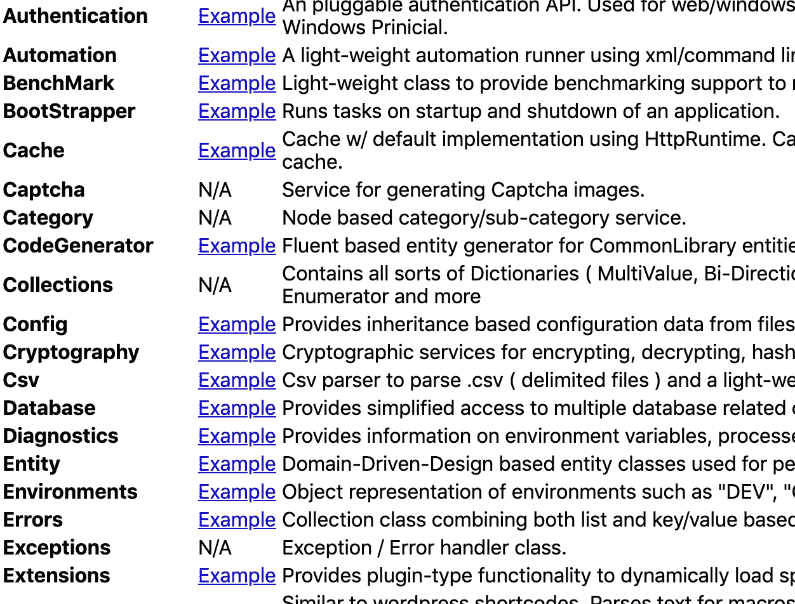

# Java 到 c#–c#到 Java

> 原文：<https://betterprogramming.pub/java-to-c-c-to-java-f766c9f659c4>

## 我们带给你一个非常需要的罗塞塔石碑——这两种技术之间的解释性桥梁


[戴恩·托普金](https://unsplash.com/@dtopkin1?utm_source=unsplash&utm_medium=referral&utm_content=creditCopyText)在 [Unsplash](https://unsplash.com/search/photos/sheet-music?utm_source=unsplash&utm_medium=referral&utm_content=creditCopyText) 上的照片

Java 和 C#非常相似。这两种语言都有点源自 C++和相似的基本原则。

Java 开发于 1995 年，旨在创建一种编程模型比 C++更简单的语言，同时仍保留一些相同的语言语法，以方便开发人员过渡到 Java。

C#是微软在 2000 年开发的，是其。NET drive，以便开发一种语言和一套技术来解决 C++语言的一些已知弱点。它的开发也受到了 Java 语言的大量“启发”。

尽管这两种语言之间有相似之处，并且有一些共同点，但是对于精通一种技术的开发人员来说，从一种技术转换到另一种技术可能会非常棘手。

当不同思维模式的人合作时，创新会发生得最好——然而 C#和 Java 的用户可能有点部落主义。

为此，我认为有必要编写一份指南，帮助人们思考或开始在这两种技术之间进行转换。在某种程度上促进这两个世界之间的更多合作也是很好的——希望尽我的一份力量来缩小它们之间存在的不必要的鸿沟。

## 有一些相似之处:

Java 是一种运行在[虚拟机环境(JVM)](https://medium.com/platform-engineer/understanding-jvm-architecture-22c0ddf09722) 中的语言，运行 Java 编译器生成的*字节码*。

对于 C#来说，情况也差不多。这是一种运行在[上的语言。NET 框架](https://docs.microsoft.com/en-us/dotnet/csharp/getting-started/introduction-to-the-csharp-language-and-the-net-framework)和 CLR 运行时。它使用一种类似于 Java 字节码的中间语言，叫做 MSIL，通过 CLR 运行。

# 命名和约定

术语、语法和约定方面的一些关键且最明显的差异是:

*   “项目”(Java)——“解决方案”(C#)
*   在 Java 中，方法使用 lower case(`bar.doAThing()`)，而在 C#中，公共方法使用 PascalCase ( `bar.DoAThing()`)
*   在 C#中，接口总是以 I 为前缀，如在`IUserService<T>`中，而不是在 Java 中的`UserService<T>`
*   在 Java 中，字符串是一个`String`**——在 C#中，字符串是一个`string`**
*   **“POJO”(Java)—“POCO”(c#)**
*   **包(Java) —名称空间(C#)**

****包(Java)****

```
package dev.andymacdonald;// Code goes here
```

****命名空间(C#)****

```
namespace Dev.AndyMacdonald 
{
  // Code goes here
}
```

# **句法**

## **Java 有`final`变量——C #有`readonly`**

**这里的一个关键区别是 Java `final`变量可以在类中的任何地方赋值一次，而 C#的`readonly`变量只能在构造函数中赋值。**

## **C#有`out`和`ref`参数允许通过引用传递参数——Java 没有**

**Java 实际上并不通过方法参数中的引用来传递。**

**它可以通过引用操作对象和变量，但是在方法中，这些参数是通过值传递的。使用 C#，我们可以用`out`和`ref`关键字来覆盖这种行为。**

## **注释(Java)-属性(C#)**

**这些基本上是等价的概念，只是实际语法不同。注释和属性都可以通过每种语言各自的反射 API 实现来访问。**

**Java 注释:**

```
@PersonallyIdentifiable
private String fullName;
```

**C#属性:**

```
[PersonallyIdentifiable]
private string fullName;
```

## **Lombok 项目的 Getters 和 setter(Java)-C #属性**

**C#凭借其内置的[属性](https://www.tutorialspoint.com/csharp/csharp_properties.htm) 特性真正超越了 Java。在标准 JDK 中，没有与此等效的方法，相反，在 Java 中，必须为每个需要访问器的字段编写 getters 和 setters。**

**这些通常只是由开发人员用他们的 IDE 作为一个欺骗来生成的…尽管还是有点乏味。**

**Java getters 和 setters:**

```
 public class Element 
{

  private String symbol;   
  private String name;   
  private int atomicNumber; public int getAtomicNumber() 
  {
    return this.atomicNumber;
  } public String getSymbol() 
  {
    return this.symbol;
  } public String getName() 
  {
    return this.name; 
  } public void setAtomicNumber(int atomicNumber) 
  {
    this.atomicNumber = atomicNumber;
  } public void setName(String name) 
  {
    this.name = name;
  } public void setSymbol(String symbol) 
  {
    this.symbol = symbol;
  }}
```

**许多 Java 项目合并了 [Project Lombok，](https://projectlombok.org/)Project Lombok 在编译时添加了 getters、setters、equals 和 hash 代码(以及其他有用的样板文件)。**

**Lombok 项目—不是标准库的一部分:**

```
@Getter @Setter
public class Element 
{

  private String symbol;   
  private String name;   
  private int atomicNumber;}
```

**C#内置属性功能:**

```
public class Element 
{ public string Symbol { get; set; }     
  public string Name { get; set; }     
  public int AtomicNumber { get; set; }}
```

## *****循环*****

**每个循环的 Java:**

```
List<Integer> fibNumbers = Arrays.asList(0, 1, 1, 2, 3, 5, 8, 13);
int count = 0;
for (int element: fibNumbers)
{
    count++;
    System.out.println(String.format("Element #%s: %s", count, element));
}
System.out.println(String.format("Number of elements: %s", count));
```

**每个循环的 C#:**

```
var fibNumbers = new List<int> { 0, 1, 1, 2, 3, 5, 8, 13 };
int count = 0;
foreach (int element in fibNumbers)
{
    count++;
    Console.WriteLine($"Element #{count}: {element}");
}
Console.WriteLine($"Number of elements: {count}");
```

## *****实现接口/继承*****

**这两种语言的继承和实现接口并没有太大的不同。Java 使用`extends`或`implements`关键字；C#使用 C++语法(派生声明)`B : A`来定义继承。**

**用 Java 中的方法定义和实现接口:**

```
package dev.andymacdonald;

import java.util.ArrayList;
import java.util.List;

interface Fish
{
   void swim();
}

class Salmon implements Fish
{

   public void swim()
   {
      System.*out*.println("Salmon.Fish");
   }
}

class Cod implements Fish
{
   public void swim()
   {
      System.*out*.println("Cod.Swim");
   }
}

public class Program
{
   public static void main()
   {
      List<Fish> fishes = new ArrayList<>();
      fishes.add(new Salmon());
      fishes.add(new Cod());

      for (Fish fish : fishes)
      {
         fish.swim();
      }
   }
}
```

**用 C#中的方法定义和实现接口:**

```
using System;
using System.Collections.Generic;namespace Dev.AndyMacdonald 
{
    interface Fish
    {
        void Swim();
    } class Salmon : Fish
    {
        public void Swim()
        {
            Console.WriteLine("Salmon.Fish");
        }
    } class Cod : Fish
    {
        public void Swim()
        {
            Console.WriteLine("Cod.Swim");
        }
    } class Program
    {
        static void Main()
        {
            List<Fish> fishes = new List<Fish>();
            fishes.Add(new Salmon());
            fishes.Add(new Cod());
            foreach (Fish fish in fishes)
            {
                fish.Swim();
            }
        }
    }
}
```

## *****指针*****

**很简单，Java 不做指针，而在 C#中可以做指针算术和操作。**

```
 unsafe {
  int a = 25;
  int * ptr = &a;
  Console.WriteLine($"Value of pointer is {*ptr}");
}
```

# **集成驱动电子设备**

## *****Visual Studio*****

**C#开发人员传统上通常使用 [Visual Studio IDE](https://visualstudio.microsoft.com/) 。这种情况产生于……的起源。NET 是一种闭源技术。微软开发 Visual Studio 是为了成为所有. NET 的一站式商店。**

**Java 走了一条不同的道路，从一开始就为开发人员提供了更多的工具选择。这就是为什么 Java 开发有更多 ide 的原因(例如 IntelliJ、Eclipse、NetBeans)。渐渐地。NET 开发人员已经发生了变化，这些年来提供了更多的 ide 和开发人员选择。**

## ****IntelliJ*(Java)——*Rider*(c#)*****

****

**JetBrains IDE 的用户会发现从一个 IDE 到另一个 IDE 的转换非常顺利，如果他们选择转换到他们所针对的技术的 JetBrains IDE。键盘快捷键、IDE 布局，甚至一些插件都是等价的或可比较的——实际上是同一个 IDE。**

# **依赖性管理**

## ****Maven*(Java)——*NuGet 和 dotnet CLI *(C#)*****

**Maven 是一个工具，负责依赖性管理和构建典型 Java 和 JVM 应用程序的生命周期。也就是说，它非常灵活，有 1000 多个插件，可以用来构建其他语言的应用程序，比如 PHP 和 JavaScript。**

**maven 的可配置单元是每个 maven 项目都有的一个`pom.xml`文件。对于项目的子模块，可能每个子模块都有一个从父模块继承的 pom 文件。Maven 使用某种远程服务器或存储库来托管和检索包。**

**Maven `pom.xml`文件(Java):**

```
<?xml version="1.0" encoding="UTF-8"?>
<project 
         xmlns:xsi="http://www.w3.org/2001/XMLSchema-instance"
         xsi:schemaLocation="http://maven.apache.org/POM/4.0.0 http://maven.apache.org/xsd/maven-4.0.0.xsd">
    <modelVersion>4.0.0</modelVersion> <groupId>dev.andymacdonald</groupId>
    <artifactId>fish-app</artifactId>
    <version>0.0.1-SNAPSHOT</version>
    <packaging>jar</packaging>

    <dependencies>
        <dependency>
            <groupId>org.projectlombok</groupId>
            <artifactId>lombok</artifactId>
        </dependency>
    </dependencies>

    <build>
        <plugins>
            <plugin>
                <groupId>org.springframework.boot</groupId>
                <artifactId>spring-boot-maven-plugin</artifactId>
            </plugin>
        </plugins>
    </build>

</project>
```

**在最简单的层面上，您可以使用以下命令测试和构建 Maven 项目:**

```
mvn clean install
```

**然后用这个创建一个包:**

```
mvn clean package
```

**最后，像这样部署一个包:**

```
mvn clean deploy
```

**[NuGet](https://www.nuget.org/) 履行了一个相似但不完全相同的角色。NET 到 Maven。NuGet 可以使用一些不同的配置文件，但通常使用`.csproj` *。与 Maven 一样，NuGet 使用一个可以托管包的服务器/存储库。***

**NuGet `.csproj`文件:**

```
<Project >
  <PropertyGroup>
    <AssemblyName>MSBuildSample</AssemblyName>
    <OutputPath>Bin\</OutputPath>
  </PropertyGroup>
  <ItemGroup>
    <Compile Include="helloworld.cs" />
  </ItemGroup>
  <ItemGroup>
    <PackageReference Include="MyDependency" version="1.0.0" />
  </ItemGroup>  
  <Target Name="Build">
    <MakeDir Directories="$(OutputPath)" Condition="!Exists('$(OutputPath)')" />
    <Csc Sources="@(Compile)" OutputAssembly="$(OutputPath)$(AssemblyName).exe" />
  </Target>
</Project>
```

**NuGet 的主要角色是包管理、构造和部署。Java 开发人员会注意到，它与 Maven 没有真正相同的构建阶段概念。此外，。NET 开发人员不像 Java 开发人员那样手动编辑他们的编译文件，而是更喜欢在他们的 IDE 中操作它们。**

**可以使用下面的`nuget`命令构建、打包和部署包到 NuGet:**

```
nuget spec
nuget pack {nuspec file}
nuget push {package file} {apikey} -Source {host url}
```

**如果你想测试你的。NET 应用程序，您可以运行以下 dotnet CLI 命令:**

```
dotnet test
```

**dotnet CLI [也可以用作 nuget 命令](https://docs.microsoft.com/en-us/nuget/reference/dotnet-commands)的包装器。**

# **应用服务器**

## ****Apache Tomcat*(Java)——*IIS*(ASP.NET)*****

****

**[Tomcat](http://tomcat.apache.org/) 是来自 Apache Foundation 的开源 web 服务器和 servlet 容器。尽管 Java 中广泛使用了许多其他应用服务器，但它是大多数企业软件公司的常见选择。它可以在几乎所有操作系统上运行(例如，Windows、Unix、Linux 和 Mac OS)。**

****

**。NET 项目通常部署在 [IIS](https://www.iis.net/) 上，这是一个只在 Windows 上运行的 web 服务器。虽然它的可移植性有限，但它是 Windows 开发人员的一个非常受欢迎的选择，因为它易于使用和简单，同时还提供一些高级配置选项。**

# **…但是等等！**

**还有就是。NET Core **、**允许你开发[跨平台的应用，而不仅仅局限于 Windows](https://stackify.com/cross-platform-net-core-apps/) 。**

**因为。NET 核心 web 应用程序，您可以将它们打包成独立的 web 应用程序运行，允许您像这样运行它们:**

```
dotnet <app_assembly>.dll
```

**同样，您可以运行一个[Java Spring Boot web](https://spring.io/guides/gs/spring-boot/)*应用程序(它有一个独立的 Tomcat 服务器):***

```
*java -jar <my-application>.jar*
```

***像这样访问您闪亮的新 web 应用程序:***

```
*http://<serveraddress>:<port>*
```

# ***库和框架***

## ******Spring 框架(Java)—ASP.NET(c#)******

***Spring 框架是 Java 的一个框架和 IoC 容器。简而言之，Spring 框架负责实例化对象(bean)并管理这些 bean 在内存中的生命周期。***

***创建一个`ApplicationContext` (类似 ASP 中的一个`Startup`的概念。网)。这个例子使用了 Spring Boot:***

```
*@SpringBootApplication
public class HumanApplication
{
   public static void main(String[] args) 
   {
      SpringApplication.run(HumanApplication.class, args);
   }
}*
```

***创建接口:***

```
*public interface Organ<T>
{  
   void function();
}*
```

***实现`Organ<T>`接口:***

```
*@Component
public class Heart implements Organ<Heart>
{
    public Heart() {} public void function() 
    {
        System.out.println("Buh-dump");
    }
}*
```

***构造函数将`Organ`依赖列表注入到`Human`服务中:***

```
*@Service
public class Human 
{
    private static final int MAX_SECONDS_OF_LIFE = 3000; private List<Organ> organs; public Human(List<Organ> organs) 
    {
        this.organs = organs;
    } @PostConstruct
    public void live() 
    {
        for (int i = 0; i < MAX_SECONDS_OF_LIFE; i++) 
        {
            organs.forEach(organ -> organ.function());
        }
    }
}*
```

***运行应用程序…***

***它还活着:***

```
*Buh-dump
Buh-dump
Buh-dump
Buh-dump
...*
```

***Spring 还附带了一套方便的模块和包。***

***在核心的 Spring 包中，以及在对框架的约定胜于配置扩展 Spring Boot 中，为希望访问公共库的开发人员提供了现有技术和定制技术的有用组合，以启动一个项目，提供他们可能需要的所有东西，而不是必须自己编写或跟踪这些实用程序:***

*   ***`RestTemplate` (spring-web —用于构造 REST 和 HTTP 请求)***
*   ***`JdbcTemplate` (spring-data —用于构建 JDBC 查询和语句)***
*   ***Spring Security(用于创建和管理应用程序安全模型)***
*   ***`ObjectMapper`(spring-core——Jackson 的 POJOs 映射实用程序)***
*   ***等等。***

***ASP.NET 在 C#世界中扮演着类似的角色，在单一框架中提供 IoC 功能、常用技术和实用程序。然而，ASP.NET 通常只为 web 应用程序提供 IoC 功能，而 Spring 框架为任何类型的应用程序都提供了 IoC 功能。***

***就依赖性反转而言，在 ASP.NET 可以做与 Spring 非常相似的事情。***

***像以前一样，定义所需的接口和具体实现:***

```
*public interface Organ<T>
{  
   void Function();
}public class Heart : Organ<Heart>
{
    public Heart() {} public void Function() 
    {
        Console.WriteLine("Buh-dump");
    }
}*
```

***调用注入依赖项的函数:***

```
*public class Human
{ private List<IOrgan> _organs;

   public Human(List<IOrgan> organs)
   {
      _organs = organs;
      this.Live();
   } public void Live()
   {
      organs.ForEach(organ =>
      {
         organ.Function();
      });
   }
}*
```

***定义一个`Startup`并注册服务:***

```
*public class Startup  
{    
  public void ConfigureServices(IServiceCollection services)
  {    
    services.AddTransient<IList<IOrgan>>(p => p.GetServices<IOrgan>().ToList());
  }
}*
```

***ASP。NET 还提供了许多有用的库和实用程序来加速项目的开发。***

## ******(Java)—LINQ(c#)******

***Java 和 C#都有简化数据集简化的机制——T0 流 T1 和 T2 LINQ T3。***

***这两种技术之间存在一些差异和差距，但是如果您熟悉其中一种技术，您将能够很快使用另一种技术。***

***Java 流:***

```
*List<Student> studentList = Arrays.asList( 
    new Student(1, "John", 18, 1),
    new Student(2, "Steve", 21, 1),
);List<String> studentNames = studentList.stream()
    .filter(s -> s.getAge() > 18)
    .filter(s -> s.getStandardID() > 0)
    .map(s -> s.getName()).collect(Collectors.toList());studentNames.forEach(name -> System.out.println(name));*
```

***LINQ 查询(C#):***

```
*IList<Student> studentList = new List<Student>() { 
    new Student() { StudentID = 1, StudentName = "John", Age = 18, StandardID = 1 } ,
    new Student() { StudentID = 2, StudentName = "Steve",  Age = 21, StandardID = 1 }
};var studentNames = studentList.Where(s => s.Age > 18)
                        .Where(st => st.StandardID > 0)
                        .Select(s => s.StudentName);foreach(var name in studentNames) {   
    Console.WriteLine(name);
}*
```

## ******Apache Commons(Java)—CommonLibrary.NET(c#)******

******

***[Apache Commons](https://commons.apache.org/components.html)***

***如果您需要一个处理 ZIP 文件的工具或一组处理数学表达式和公式的工具，那么 Apache Commons 可以满足您的需求。***

******

***以类似的方式，[CommonLibrary.NET](https://archive.codeplex.com/?p=commonlibrarynet)也涵盖了这些基础——在一些组件和模块的命名上有一些关键的不同，但是在大多数情况下，它们在目的上是非常等价的。***

***也就是说，与 Apache Commons 不同，CommonLibrary.NET 很老了，在项目中不再常用。如果您正在寻找每种技术的不断更新、精选的库列表，我强烈推荐这两个列表:***

***[](https://github.com/akullpp/awesome-java) [## akullpp/awesome-java

### Java 编程语言的优秀框架、库和软件的精选列表。- akullpp/awesome-java

github.com](https://github.com/akullpp/awesome-java)  [## quozd/awesome-dotnet

### 一个很棒的收藏。NET 库、工具、框架和软件- quozd/awesome-dotnet

github.com](https://github.com/quozd/awesome-dotnet)*** 

# ***测试库***

## *****JUnit*(Java)——*NUnit*(c#)******

***Java 的可靠的 JUnit 库在 C#中有直接的对等物。***

***NUnit 与 JUnit 的功能几乎相当，是 C#开发人员的热门选择。***

***JUnit:***

```
*@Test
**public** **void** complexNumberTest()
{
    ComplexNumber result = someCalculation(); Assert.assertEquals("Real", 5.2, result.getRealPart());
    Assert.assertEquals("Imaginary" 3.9, result.getImaginaryPart());
}*
```

***努尼特:***

```
*[Test]
**public** **void** ComplexNumberTest()
{
    ComplexNumber result = SomeCalculation(); Assert.Multiple(() =>
    {
        Assert.AreEqual(5.2, result.RealPart, "Real");
        Assert.AreEqual(3.9, result.ImaginaryPart, "Imaginary");
    });
}*
```

***(有传言称，NUnit 最初是通过修改 JUnit 源代码来运行 C#的。)***

## *****mock ITO*(Java)—*Moq*(c#)******

***与 JUnit 和 NUnit 一样，Java 的 [Mockito](https://site.mockito.org/) 和 C#的 [Moq](https://github.com/Moq/moq4/wiki/Quickstart) 库之间也存在类似的功能。***

***莫奇托:***

```
*Foo mockFoo = mock(Foo.class);
when(mockFoo.doSomething("ping")).thenReturn(true);*
```

***起订量:***

```
*var mock = new Mock<IFoo>();
mock.Setup(foo => foo.DoSomething("ping")).Returns(true);*
```

# ***就是这样***

***感谢阅读！***

***很明显，我无法在这篇文章中描述每一个不同点、相似点和细节——这篇文章已经太长了。***

***我希望至少我已经讲了足够多的内容，让你有信心做出改变，看看另一半是如何生活的。***