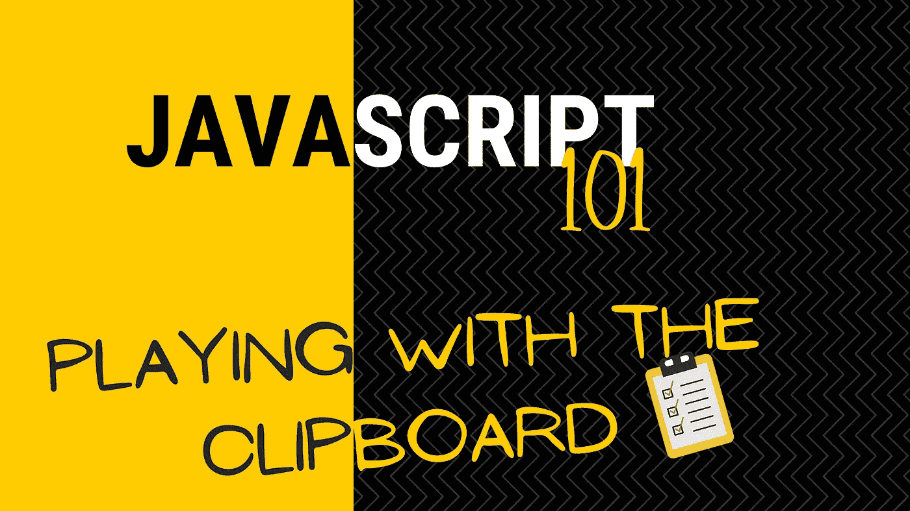
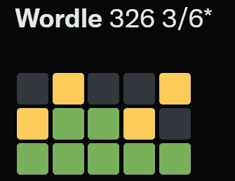
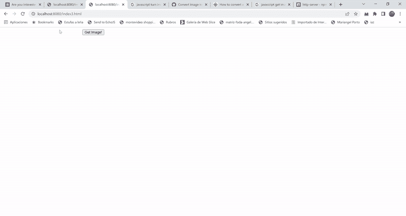

# JavaScript 101:访问剪贴板

> 原文：<https://betterprogramming.pub/javascript-101-accessing-the-clipboard-ad63f38e7d0>

## 比你想象的容易多了！

我们通常不会想太多，因为毕竟如果用户想从我们的页面获取一些东西到剪贴板，他们可以选择它，右键单击它，然后单击“复制”。简单对吗？

但是如果他们不能呢？如果出于某种原因，他们被限制使用额外的鼠标按钮甚至键盘按键，那该怎么办？

或者见鬼，如果他们想要复制的东西是不可见的呢？你见过 Twitter 上关于 Wordle 的经典帖子吗？

你可以通过点击一个“分享”按钮来获得所有的文本和文本框，但你不可能在他们的网站上找到。那么他们是如何做到的呢？

这其实很简单，今天我将向你展示如何与剪贴板进行交互。

# 访问剪贴板

除了 Internet Explorer 之外，大多数其他现代浏览器都可以访问`navigator.clipboard`全局对象，这是您在现代 web 应用程序中与剪贴板交互的方式。

这个全局对象有一些我们将要使用的有趣的方法:

*   `readText`:这个方法返回你之前复制到剪贴板的任何文本。
*   `read`:这个方法类似于`readText`，但是它返回剪贴板中可能存在的任何类型的数据(比如图像)。
*   `writeText`:这个方法只允许你复制文本到剪贴板。
*   `write`:你可能已经猜到了，用这种方法我们可以将任意数据复制到剪贴板上。这个特殊的方法可以用来实现复制命令，我们可以通过按 CTRL+C 来获得这个命令。

同样重要的是要提到，这些方法需要用户的特定许可才能启用。一个写(`clipboard-write`)，一个读(`clipboard-read`)。一会儿我将向您展示如何检查它，以确保您的代码能够工作。

# 将内容放入剪贴板

让我们从简单的开始:如何使用 JavaScript 将内容复制到剪贴板。

因此，让我们创建一个简单的页面，它有一个`textarea`元素和一个按钮，可以让您复制任何您想要写入的内容:

如你所见，我只是使用普通的 JavaScript，我们不需要框架来理解剪贴板。

在使用`document.getElementById`方法获得 TextArea 的引用后，我做的第一件事是查询 permissions API 以确保我有正确的权限。这是非常标准的，默认情况下，我们应该能够做到这一点。然后我们只需要`writeText`TextArea 元素中的值(第 12 行)。

*关于数据大小的说明*:我找不到官方文档说明剪贴板的实际大小限制。这意味着你可以用这种方法复制大量的信息。也就是说，我不鼓励这样做，因为剪贴板不是一个安全的存储。任何应用程序都可以访问它，甚至覆盖它。

## 将图像复制到剪贴板

写文本很容易，但是如果你想复制别的东西，比如图像，该怎么办呢？那么我们不能使用`writeText`方法——很明显——我们必须求助于更通用的`write`方法。

本质上，该方法的工作方式是相同的，但是它不是直接传递我们的数据，而是期望一个由 [ClipboardItem](https://developer.mozilla.org/en-US/docs/Web/API/ClipboardItem) 元素组成的数组。换句话说，无论我们想要复制什么，都需要包装到一个容器对象中，这样它就知道如何处理任何类型的二进制数据。

不过不要担心，这听起来需要做很多工作，但是非常简单。这里有一个例子:

对于这个例子，我使用 HTML IMG 标签只是为了获得`src`属性，因为我不能直接使用这个元素。API 需要我将图像转换成一个 Blob(本质上是说“这是一大块我不确切知道的东西”)。由于 DOM API 没有任何我可以使用的方法，所以我获取实际的图像，然后在响应对象上调用`blob`方法(第 11 行)。

剩下的和预期的一样，我用包含 blob 的`ClipboardItem`创建一个单元素数组，然后我将数组写入剪贴板。

你可以用上面的例子来推断你将如何复制其他的东西，比如一个 XLS 文件。您需要获取它，blob 它，并确保您使用了正确的 mime-type，这是我在`type`变量上的字符串。如果你不知道你的文件的 mime-type 是什么，只要在谷歌上搜索“mime-type for<your file ' s extension here>”，你就能找到了。

# 从剪贴板中读取

我不打算在这里详细介绍，因为正如你将要看到的，机制与写入它是一样的。

你必须确保你有正确的权限，然后使用`read`或`readText`。

因为我们想让这个变得有趣一点，所以我要创建一个页面，让你粘贴你剪贴板上的图像，不知从哪里复制的。

您可以看到两者，前一个例子将图像复制到剪贴板，新的例子将它粘贴到本地元素。

下面是后者的代码:

这里最重要的部分是，我们需要记住，当我们调用`write`时，我们传递一个数组，所以`read`方法也返回一个数组。这意味着我们需要迭代它，确保我们只处理图像(因此检查类型),然后使用方便的`URL.createObjectURL`方法，该方法获取 blob 并生成一个编码的 URL，使`img`标签能够理解。

# 剪贴板事件

最后，剪贴板 API 处理三个事件:剪切、粘贴和复制，当用户启动这些活动时，它们被触发。

为了让你知道你能做什么，让我们扰乱我们的用户，防止他们复制你网站的内容。但与其简单地禁用他们的能力，不如让我们给他们点颜色看看:

如您所见，我们可以将事件附加到特定的元素上，所以在这里我要确保您无法从我的整个页面中获得任何有趣的东西。当事件触发时，我用`document.getSelection`捕获选中的文本，然后打乱那个字符串。这样做所需的步骤是:

1.  通过对每个字符进行拆分，将字符串转换为字符数组。
2.  使用带有随机排序功能的`sort`方法打乱数组。
3.  将得到的数组重新组合成一个字符串。

简单！

然后我用混洗的字符串手动设置剪贴板的内容。这样他们确实得到了一些东西，但不是他们可以利用的东西(*邪笑*)。

你可以用另外两个事件做类似的事情，极限是你的想象力！

这就是 101 的全部内容，剪贴板是一个未被充分利用的特性，但是很容易掌握，所以我希望你今天能看到一些新的东西！

在这个 101 系列中，你有什么特别的话题想让我介绍吗？让我知道，我会写一篇关于它的文章！