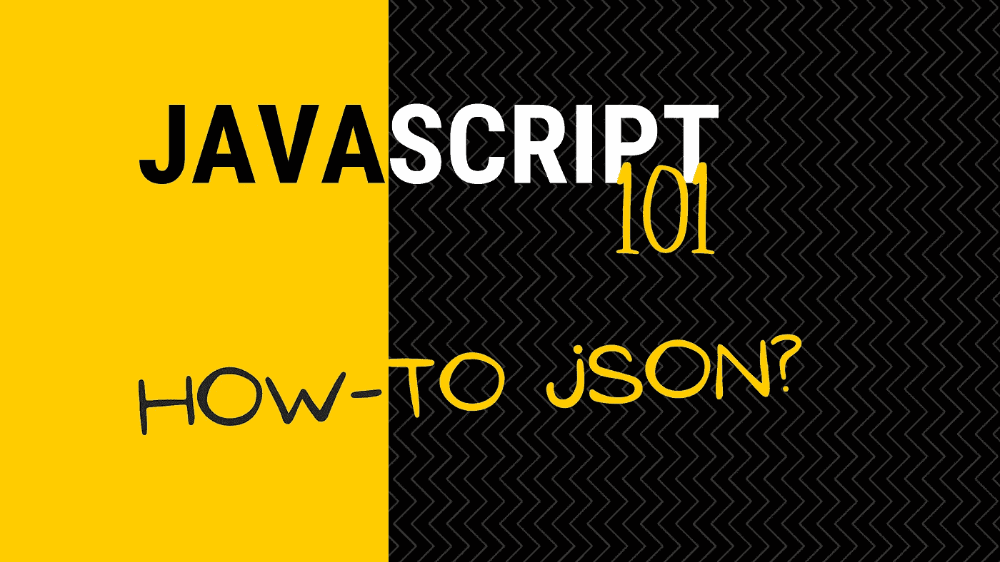
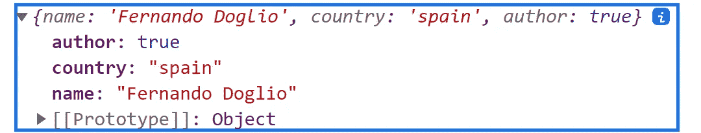

# JavaScript 101: JSON 一路向下

> 原文：<https://betterprogramming.pub/javascript-101-json-all-the-way-down-4d01d185236f>

## 你曾经想知道的关于 JSON 的一切，但是由于某种原因你不敢问



JSON 只是一种很好的数据传输格式，但有时我们会忘记它。我们专注于使用 CSV、XML 和 YAML 等其他工具，却忘记了 JS 开发人员应该永远记住的一个特殊事实:JSON 代表**J**ava**S**script**O**object**N**rotation。

换句话说，我们有现成的本机支持，所以让我们利用它！

# 用 JavaScript 解析 JSON

“解析”本质上意味着要么把一个字符串转换成别的东西。

现在有两个场景，在处理 JavaScript 中的 JSONs 时，这可能会派上用场。毕竟，我们确实喜欢这种格式，但是如果你是序列化的(字符串形式),你真的不能用它做什么，不是吗？

## 场景 1:将字符串转换成实际的对象

一个非常常见的场景可能是您读取字符串，或者从您的用户接收它作为输入，也许作为请求参数。关键是你面对的是这样一个字符串:

```
"{\n  \"name\": \"Fernando Doglio\",\n  \"author\": true,\n  \"age\": 38\n}"
```

这是一个有效的字符串，但是我们不能把它赋给一个变量，并把它当作一个对象，不是吗？

幸运的是，有一个非常简单的解析方法:用`JSON.parse`方法。

没错，有一个神奇的全局对象叫做`JSON`(注意大写名称)，可以用来解析(也可以是 stringify)一个 JSON 字符串。

所以我们要做的就是:

这就是你所需要的，现在你可以像例子中一样，把值当作一个对象。

## 场景 2:从 Node.js 中的文件读取 JSON

这是一个特殊的用例，虽然它可能不适用于所有人，但我认为理解它也很重要。

基于上面的例子，我们假设要读取一个 JSON 文件的内容，您必须用类似于`fs.readFile`的东西读取它，然后用`JSON.parse`解析它的内容。这是可行的。

然而，Node.js 使它变得更加简单，因为您可以简单地直接导入它，它会为您完成工作！

```
const myJSON = require("path/to/file.json")
```

当然，这是使用了`require`函数，因为来自 ES6 的`import`语句仍然不支持它。有一个关于 it 的[提案，目前处于第三阶段，所以也许有一天我们也能够“导入”它。](https://github.com/tc39/proposal-json-modules/issues)

## 但是如果 JSON 无效会发生什么呢？

关于这种格式，需要记住的重要一点是，它不像文字对象符号。

如果您不使用双引号，或者如果您在里面的某个地方留下了一个尾随逗号，那么 JSON 将是无效的，并且上面的任何一个方法都会抛出一个异常。

这就是为什么你通常想要用一个`try...catch`块来包装`parse`调用，当然，除非你绝对信任字符串的来源，但是为了仔细检查，确保总是添加块:

这将确保如果您的 JSON 出现问题，您的应用程序不会崩溃。如果错误信息不够清楚(有时可能有点晦涩)，你可以使用在线验证器，比如[https://jsonformatter.org/json-parser](https://jsonformatter.org/json-parser)。如果你不能发现文件的确切问题，这些工具将帮助你。

# 使用可选的 reviver 功能

虽然以上内容已经足够了，但是在解析 JSON 时，有时可能需要一些额外的帮助。也许在解析期间，您需要影响或者至少检查被解析的键和值。

也许你甚至需要删减一些值，因为你知道你不需要它们。解析之后肯定可以这么做。但是如果你可以使用一个可选的回调函数“reviver”(不知道为什么是这个名字，顺便说一下)和`parse`方法，并在那里处理它，为什么要等待呢？

这个函数将为 JSON 中的每个键调用，它将接收这个键及其相应的值。例如，如果您想将 JSON 中的每个字符串值都大写，您应该这样做:

当然，这段代码会输出:

```
Name: FERNANDO DOGLIO
Country: SPAIN
```

您还可以通过不返回它们的值来删除一些键(注意在我之前的例子中我是如何返回每个值的，即使它不是字符串):

这将输出如下所示的内容:



请注意我是如何方便地从解析结果中删除我的年龄的。

# 向 JSON 添加类型和结构检查

同样，这完全是可选的，但是如果您需要向 JSONs 添加一些数据类型检查，甚至是结构检查，以确保您没有遗漏强制属性，那么理解一件事很重要:您不能这样做。

我的意思是你可以，当然，但不是天生的。JSON 标准不支持这两种检查。开箱即用，您不能真正指定属性的类型，甚至不能强制指定一个属性。见鬼，这些检查并不基于任何模式，所以如果这是您所需要的，请停止阅读 JSON 文档。

相反，把你的注意力转向 [JSONSchema](https://json-schema.org/) 。这是向 JSONs 添加结构验证的正式方式。是的，它们将要求您添加一个额外的文件来声明您的模式，是的，您将需要添加一个外部库来支持它，因为它不是 JS 的 JSON 标准的一部分。

然而，由于这是开发人员支持这一功能的唯一真正的方法，所以有针对大多数通用语言的库。是的，这当然包括 JavaScript。

这里的是一个模式验证器的列表，您可以将它作为项目的依赖项。大多数都是这样工作的:首先编写模式，令人吃惊的是，它是 JSON 格式的，然后解析(加载)它，最后根据它验证您的 JSON。

这里有一个例子，是我到目前为止作为例子使用的 JSON 模式的样子:

我承认这有点冗长，但是它可以让您精确地指定每个属性应该是什么样子，最后您甚至可以指定哪些属性必须总是存在。因为当时我删除了`age`属性，所以我决定在这里让它可选。

前 5 个属性更适合解析器(`$schema`和`$id`)或者阅读模式的人(`title`和`description`)。

在像**API**这样的场景中，使用模式来验证 JSON 是非常常见的，在这种场景中，您希望某个有效载荷具有预定义的格式，您可以验证它，如果它不满足结构要求(如果模式没有通过验证)，则返回 4XX 错误。

另一个例子是加载 JSON 格式的**配置文件**。如果用户可以篡改该文件，您可能希望在使用该数据之前进行某种检查，以确保它是有意义的。

如果您正在考虑使用模式来验证您的 JSON，我强烈建议您阅读官方文档，它拥有您需要的一切。

JSON 格式非常强大，但有时人们会忽略它，因为他们认为它与 JavaScript 的对象文字符号完全一样。正如您所看到的，虽然有一些相似之处，但 JSON 允许更多。

如果您喜欢并学到了一些新东西，请留下您想了解的关于 JS 的另一个主题的评论，我将在我的下一篇“JavaScript 101”文章中介绍它。

*下次见！*