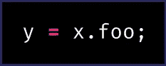
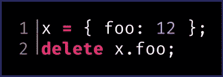
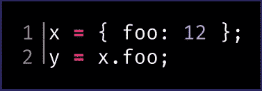
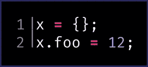
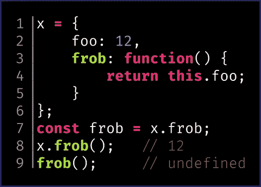

# JavaScript 201 —引用类型

> 原文：<https://betterprogramming.pub/javascript-201-references-2c2fb4a6f250>

*了解属性获取、属性分配、属性删除、*`*this*`*-绑定的关系*

在许多编程语言中，点运算符(`.`)通常被称为**属性访问符**运算符。我们在 C、Java、Python 和 JavaScript 等语言中看到了这一点。例如，陈述的结果

获取`x`上“foo”属性的当前值，并将其放入变量`y`。

特别是在 JavaScript 中，点运算符比简单的属性获取更微妙，这种微妙之处是`delete`运算符和`this`绑定等等背后的驱动因素。

在 JavaScript 中，点运算符表达式的结果是*而不是*简单地表示指定属性的当前值:如果是这样，下面的例子将是无意义的:

上述语句的意思是从`x`中删除名为“foo”的属性。*不是*的意思是从系统中删除 12 的值。

ECMAScript 标准(JavaScript 背后的语言定义)将[属性访问器表达式](https://www.ecma-international.org/ecma-262/10.0/index.html#sec-property-accessors)的结果定义为 [***引用***](https://www.ecma-international.org/ecma-262/10.0/index.html#sec-reference-specification-type) 。它不是保存一个简单的值，而是跟踪被访问的对象，这个对象被称为 ***基值***(`.`左边的值)*被访问属性的名称，被称为 ***引用名称***(`.`右边的名称)。*

*引用是 ECMAScript *规范类型*，这意味着您不能显式创建此类型的值，也不能在您的代码中直接使用此类型。它是运行时本身固有的，永远不会向您的代码公开——它只是运行时执行其他操作的一种机制。这些操作包括一些基本操作，例如:*

*   *属性获取*
*   *财产分配*
*   *属性删除*
*   *`this`-装订*

# *属性获取*

*这是显而易见的。引用类型用于从引用的*基值*中获取由*引用名*指示的属性的当前值。当引用出现在应该有值的位置时，运行时将对引用执行此操作，作为计算的一部分。*

**

*y 被赋值为 12。*

## *财产分配*

*当引用出现在[赋值表达式](https://www.ecma-international.org/ecma-262/10.0/index.html#sec-assignment-operators-runtime-semantics-evaluation)的左侧时，就会发生这种情况:运行时将表达式右侧的值赋给引用的*基值*上的*引用名*所指示的属性。*

**

*x 的“foo”属性被赋值为 12。*

## *属性删除*

*当使用`[delete](https://www.ecma-international.org/ecma-262/10.0/index.html#sec-delete-operator)` [运算符](https://www.ecma-international.org/ecma-262/10.0/index.html#sec-delete-operator)时，应用该操作:运行时将从引用的*基值*中删除被引用的*所指示的属性*。*

**

*从 x. 12 中删除了“foo”属性，但它仍然存在。*

## *`This-`装订*

*这就是事情变得有趣的地方。当一个函数被调用时，*如何为调用访问它是很重要的。考虑下面的片段:**

**

*在第七行，我们将来自`x.frob`的函数存储到`frob`变量中。这执行一个普通的*属性获取*操作，从`x`获取“frob”属性的当前值，这恰好是一个函数。我们现在可以通过从`x`的“foo”属性访问这个函数，如第八行所示，或者通过直接访问`frob`变量，如第九行所示。*

*但是，这两种访问方式*不同*，它们给出的*结果也不同*。这是因为第八行的`x.frob`并不是一个简单的*属性获取*操作来产生当前值:相反，它是一个 [*函数调用表达式*](https://www.ecma-international.org/ecma-262/10.0/index.html#sec-function-calls) ，其中被调用的函数由一个引用来指示，这使得函数被调用时`this`被设置为引用的*基值*。*

*在第九行，要调用的函数是引用所指示的*而不是*，因此调用[函数，并将](https://www.ecma-international.org/ecma-262/10.0/index.html#sec-ordinarycallbindthis) `[this](https://www.ecma-international.org/ecma-262/10.0/index.html#sec-ordinarycallbindthis)` [设置为*全局环境记录*](https://www.ecma-international.org/ecma-262/10.0/index.html#sec-ordinarycallbindthis) (例如，在浏览器运行时为`window`)。*

*两行中被调用的函数是相同的，但是为调用设置`this`的方式取决于如何访问该函数。*

*函数调用中`this`的绑定变得更加复杂，比如`apply`、`bind`和*粗箭头函数*。这些细节超出了本文的范围，但仍然很重要。*

# *为什么它很重要*

*你也许可以通过执行*属性获取*、*属性赋值*和*属性删除*来实现，而无需考虑引用类型，但是因为 JavaScript 函数是一级对象(也就是说，它们可以像任何其他值一样被传递)，理解以不同方式使用它们的后果是至关重要的。*

*您是将一个函数作为一个对象(以及什么对象)的属性来调用，还是作为一个空值来调用，这很重要，并可能导致非常不同的结果。理解引用为理解这些和相关概念如何工作提供了一个简单的模型，以避免混淆和错误。*