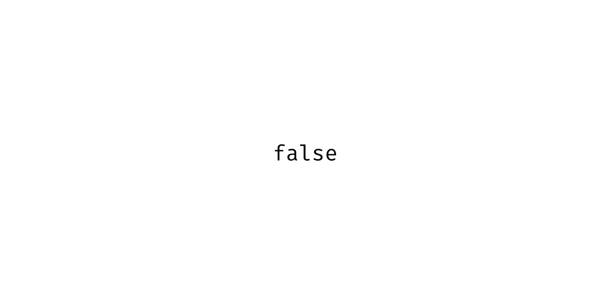

# JavaScript 布尔值:Falsy 实际上是假的吗？

> 原文：<https://betterprogramming.pub/javascript-booleans-is-falsy-actually-false-1faec9a67df>

## 对八种错误价值观的深入研究



JavaScript 布尔假值的图像

JavaScript 布尔值是出了名的棘手。即使是经验丰富的程序员有时也不能把它们做对。它们是 JavaScript 语言中的主要陷阱之一。本文深入探讨了 JavaScript 布尔值以及如何更好地理解它们。

# 真不是假，是吗？

我认为，许多 JavaScript 开发人员对布尔值有这样的问题是因为 JavaScript 英语不同于普通英语。如果某事不是真的，那么它就是假的。那毫无例外。然而，在 JavaScript 中，情况并非总是如此。这种差异让 JavaScript 程序员感到困惑，尤其是那些语言新手。

包括 JavaScript 在内的大多数编程语言的一个基本原则是，阅读代码就像大声朗读一样。但是，由于 JavaScript 对真和假的定义模糊不清，您阅读代码的方式很容易欺骗您。这很不幸，但并不意外。编程语言随着时间的推移而发展，就像口语一样，它们包含不规则性和异常。

为了解决这种模糊性，JavaScript 引入了真值和 T2 值的概念。这些对于 JavaScript 语言来说是必不可少的，甚至当你谈论 JavaScript 时，你也会用到它们。所以要掌握 JavaScript，你需要流利地知道什么时候用 truthy/falsy，什么时候用 true/false。

# 八个虚伪的价值观

JavaScript 中有八个 falsy 值。其中三个是数字 0 的变体。变量是正值、负值和零值的 BigInt 类型。人们有时称它们为六，因为他们认为所有的零值为一。不管是哪一种，JavaScript 开发人员都应该记住它们。有关这些的更多信息，请参考 MDN [falsy](https://developer.mozilla.org/en-US/docs/Glossary/Falsy) 或 [truthy](https://developer.mozilla.org/en-US/docs/Glossary/Truthy) 文档。八个 falsy 值是:

```
// The eight falsy valuesconst theValueFalse = false;
const theNumberZero = 0;
const theNegativeNumberZero = -0;
const theBigIntZero = 0n;
const anEmptyString = '';
const theNullObject = null;
const anUndefinedValue = undefined;
const theNotANumber = NaN;
```

当在一个 *if* 语句中使用时，这些都将被评估为 *false* 。以上任何一个的比较就是 JavaScript 所说的 *falsy* 。

```
if (oneOfTheEight) {
  // The value is falsy
} else {
  // The value is truthy
}
```

# 假设情况

当布尔值独立存在时，它们并不复杂。当问题出现在条件语句中时——比较一个值和另一个值时——几乎总是会出现问题。当他们两岁或更多时，事情开始变得复杂。为了进一步理解*真*和*真*之间的区别，请看以下假设情况:

```
// If something ...
if (variable) {
  // condition is truthy
}// If something is true ...
if (variable == true) {
  // condition is true
}// If something is strictly true ...
if (variable === true) {
  // condition is strictly true
}
```

在这里，语言障碍又回来困扰我们。说白了，上面的条件表达式都是一样的。在对话中使用时，它们在逻辑上表示相同的意思。在英语口语中，除非是严肃的话题，否则人们很少会问某事是否真实。然而，在 JavaScript 中，这些语句并不相同。更糟糕的是，根据代码中使用的变量类型，它们会产生不同的结果。

另一个需要小心的情况是短路评估。短路评估仅仅是一种假设情况的变体。

```
maybeThisOne && ifNotThenThisOne
```

# 虚假价值观的表现

让我们看看 *falsy* 价值观，以了解它们的行为方式以及为什么它们很难正确。开发者工具或 NodeJS 运行时中的控制台为我们提供了一个完美的实验平台。下面是 NodeJS 提示符的摘录。您可以运行这些示例，并在运行时使用它们。这样做是一种健康的锻炼。在编写 JavaScript 时，对八个 falsy 值以及它们的行为方式有所了解会有很大帮助。它使您更有准备在代码中的错误进入生产之前检测它们。

概括这八个值的一个简单方法是将它们全部放在一个数组中。这样做使得使用数组操作来观察它们的集体行为成为可能。下面是第一个元素为值 *false* 的八个值。

```
const falsyValues = [false, 0, -0, 0n, '', null, undefined, NaN];
```

现在，让我们看看当我们在条件语句中使用它们时会发生什么。有关以下代码的更详细解释，请参考附录。

从上面可以得出几个结论:

*   所有的*假值*评估为*假值*。这个结果是意料之中的；毕竟，他们是虚伪的。
*   严格比较将挑出*假*值，即值*假*是唯一严格等于*假*的值。它强调了*假*和*假*之间的区别，即一个值可以是*假*而实际上不是*假*。
*   非严格的相等比较会产生混乱的结果。

那么，你怎么知道什么时候用哪个呢？关键是要分离出八种错误价值观，并学会识别它们。使用 [*typeof*](https://developer.mozilla.org/en-US/docs/Web/JavaScript/Reference/Operators/typeof) 运算符，我们可以更深入地挖掘并找出它们的类型。让我们使用数组操作*映射*来收集它们的类型。

```
> falsyValues.map(v => typeof v)
[ 'boolean', 'number', 'number', 'bigint', 'string', 'object', 'undefined', 'number' ]
```

false 值是八个值中唯一具有布尔类型的值。这实质上意味着我们可以使用值的类型来区分八个*假值*中的值*假值*。

使用布尔比较的一些经验法则:

*   小心直接比较。
*   使用严格的相等比较`===` / `!==`。
*   非严格平等一塌糊涂。看这里的完整表格:【https://dorey.github.io/JavaScript-Equality-Table/】T2

# API 请求

程序员遇到的一个相对常见的情况是通过 API 传递布尔值。它可以是通过网络发送数据的客户端、库调用或类似情况。这里我们遇到两种可能的情况:

1.  通过 API 传递的值是纯布尔类型。它要么是严格的*真*要么是*假。*
2.  值为*真、*假或变量没有值，通常为*空*或*未定义。*

这两种情况之间的差别是微妙但重要的。如果您只遇到前一种情况，它很容易欺骗您，让您相信隐式检查值以辨别参数是*真*还是*假*是没问题的。

```
if (anArg) {
  // true
} else {
  // false
}
```

这在前一种情况下很好，在这种情况下，您知道该值严格地为*真*或*假*，但在后一种情况下就不行了。它具有欺骗性，因为所有的*假值*都以 else-case 结束，包括*空值*和*未定义值*。在这种情况下，通常最好先确保值为布尔类型。您应该通过严格的相等比较来检查这两个布尔值:

```
// Strict equality comparison
if (anArg === true) {
  // The argument has a "boolean" type, true
} else if (anArg === false)
  // The argument has a "boolean" type, false
} else {
  // The argument is either null or undefined
}
```

或者，您应该通过 *typeof* 操作符来检查参数的类型。

```
if (typeof anArg === 'boolean’)  {
  // The variable has a "boolean" type, true or false
} else {
  // The argument is either null or undefined
}
```

注意:这两种方法在两种情况下都有效。

让我们再来看看这些与八个虚假价值观的关系。

```
// Checking with strict equality comparison
> falsyValues.map(v => v === true || v === false)
[ true, false, false, false, false, false, false, false ]// Checking with typeof
> falsyValues.map(v => typeof v === 'boolean')
[ true, false, false, false, false, false, false, false ]
```

同样，只有*假值*具有布尔类型。这种区别很重要，因为存在真实的用例，我们需要将布尔与其他类型区分开来。

# falsy 对 truthy

需要注意的一点是，正如我们在 API 请求中看到的:通过比较来寻找*假*值与通过比较来寻找*真*变量是不同的。原因是*真值*比较将排除无效值*未定义*、*空、*或 *NaN* ，而假值比较将包括它们。

```
if (assumedToBeTrue) {
  // truthy
} else { 
  // falsy (e.g. null, undefined or NaN)
}
```

而不是

```
if (assumedToBeFalse) {
  // falsy (e.g. null, undefined or NaN)
} else {
  // truthy
}
```

检查错误值时要格外小心。

# 其他几个案例

最后，让我们看看其他一些案例以及八个错误值是如何表现的。

## 过滤

筛选假值将删除属于八个假值之一的任何成员。因此，用所有 falsy 值过滤数组会得到一个空数组。这对于我们希望数组只有真值的情况很有用。

```
> [false, 0, -0, 0n, '', null, undefined, NaN].filter(Boolean)
[]
```

## 传播虚假的价值观

使用 spread 运算符是有条件地将值包含在对象中的一个巧妙技巧。如果值为 *falsy* ，即八个 falsy 值中的任何一个，则该成员被排除在对象之外。

```
> {...false && { key: 'value' }}
{}
> {...true && { key: 'value' }}
{ key: 'value' }
```

因此，八个 falsy 值中的任何一个都将排除条件值，如下所示:

```
> [false, 0, -0, 0n, ‘’, null, undefined, NaN].map(v => ({
  ...v && { key: 'value' }
}))
[
 {}, {}, {}, {},
 {}, {}, {}, {}
]
```

# TLDR；

*   当你谈论布尔和比较时:说 JavaScript 英语而不是普通英语。用“真”和“假”来代替“真”和“假”(如果你没有明确表示值*真*或*假*)。
*   永远记住八个错误的价值观。如果有疑问，检查一下这八个人的行为。
*   使用严格的相等比较，并对想要挑选出布尔值的情况保持警惕。

如果你做到了这一步，感谢你的阅读，祝你布尔比较好运！干杯！

# 附录

本文使用数组操作来概述八个 *falsy* 值的行为。MDN 对[箭头函数](https://developer.mozilla.org/en-US/docs/Web/JavaScript/Reference/Functions/Arrow_functions)和数组函数[映射](https://developer.mozilla.org/en-US/docs/Web/JavaScript/Reference/Global_Objects/Array/map)有相当全面的解释。

下面是用于显示八个 falsy 值如何表现的映射函数的替换。它们都产生相同的结果:一个有八个假值的数组。

```
> falsyValues.map(Boolean)> falsyValues.map(value => Boolean(value))> falsyValues.map(function(value) {
  return Boolean(value);
})function isItTruthy(value) {
  return Boolean(value);
}
> falsyValues.map(isItTruthy);
```