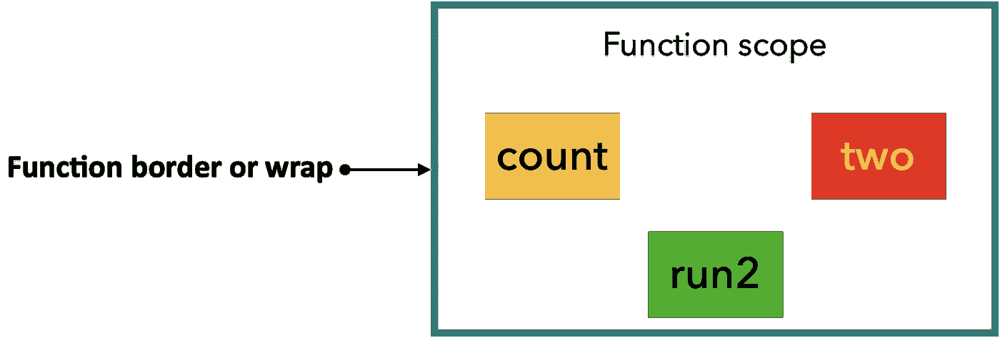
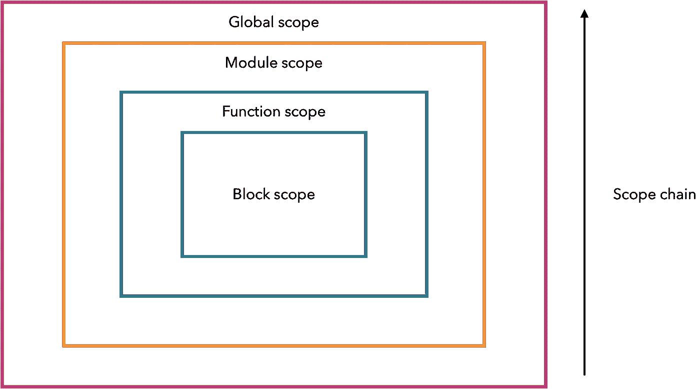
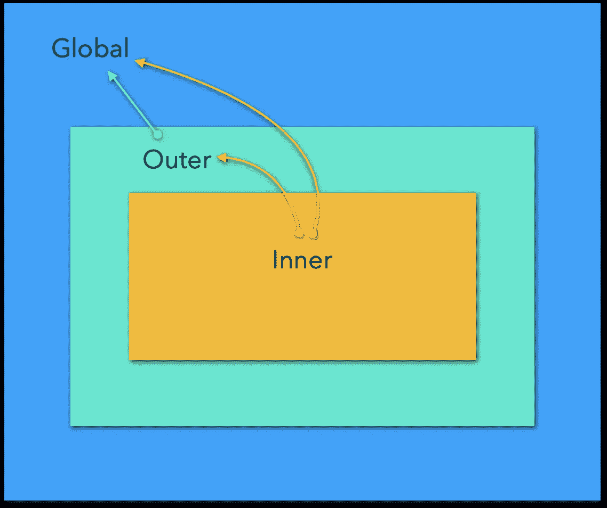
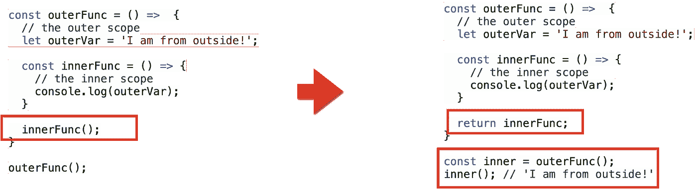
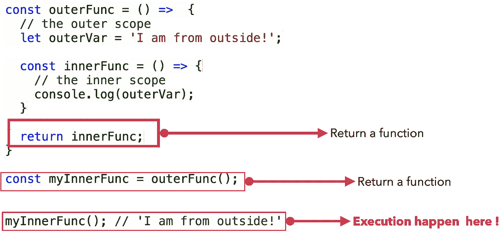
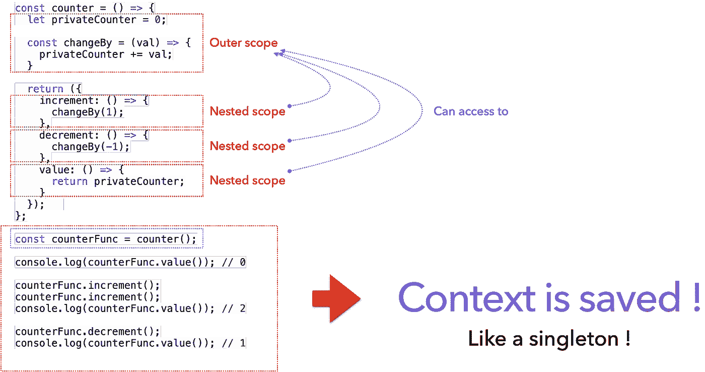
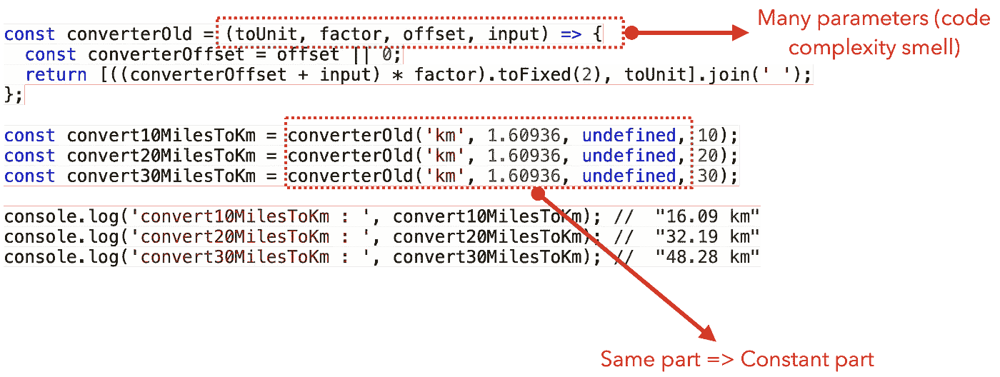
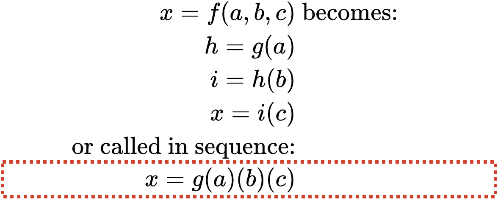
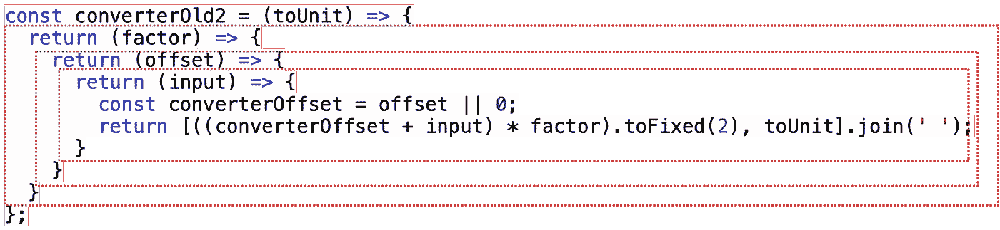

# Javascript 闭包和 Curried 函数

> 原文：<https://betterprogramming.pub/javascript-closures-and-curried-functions-63c75bcded11>

## 什么是闭包，为什么它是一个重要的概念，它有什么帮助？


卡罗琳·阿特伍德在 [Unsplash](https://unsplash.com?utm_source=medium&utm_medium=referral) 上的照片

# 关于 JavaScript 作用域的快速提示

## 什么是范围？

作用域提供了限制对变量或函数的访问并防止干预的能力。那是什么意思？

看看下面的例子:

JS 功能范围

`two`、`count`、`run2`的可见性仅限于函数边界。在功能范围内*可访问，在*范围外*不可访问:*



范围可访问性边框(图片由作者提供)

## 范围链

让我们看看下面这个神奇的例子:

正如你所看到的，我们有许多同名的变量，`message`和*它们的值没有被篡改！*

> 相同的标识符名称可以在多层嵌套作用域中指定，**这被称为“隐藏”(内部标识符“隐藏”外部标识符)**。
> 
> ——你不知道的 JS，scope&closures，Kyle Simpson。

每次，JavaScript 引擎都会试图找到最近的用名字`message`声明的变量*，并假设它是正确的。如果变量没有在块范围内定义，引擎将尝试在函数范围内，然后在全局范围内找到它。Thi ***s*** *就是我们所说的 JS 作用域链*:*



JS 范围链(图片由作者提供)

范围查找在找到第一个匹配项时停止。

*   **全局变量**可从任何范围(窗口、文档、流程……)访问。
*   每一个私有变量(没有被导出)都是模块的内部细节，模块作用域保护这些变量不被外部访问。
*   **函数**变量在函数范围内是可访问的，但在函数范围外是不可访问的。
*   **块**变量在块范围内可访问，但在块范围外不可访问。

⚠️ **代码块不会为** `**var**` **变量创建作用域，但函数体会:**

```
const outerFunc = () => {

  if (true) {
    // "if" block scope
    **var count = 12;**
    console.log(count); // 12
  }

  **console.log(count); // 12**
}

outerFunc();
**// console.log(count); // ReferenceError**
```

## 范围可以嵌套

让我们看看下面的例子:

*access 是如何组织的？*



范围气泡(图片由作者提供)

每当一个作用域被嵌套时，它从创建者那里继承上下文并用自己的变量扩展它:

*   **Outer** 是 global 的孩子——它可以访问所有 global，以及在 Outer 函数作用域中创建的变量。
*   **inner** 是 outer 的孩子，outer 是 global 的孩子——那么 Inner 就可以访问所有在 Inner 函数内部创建的全局、外部和变量。

*引擎将如何查找和解析变量？*

1.  我可以看到你定义了一个`globalVar`。好吧！
2.  我可以看到你定义了一个函数`outerFunc()`，它有一个变量`outerVar`。很好！
3.  在`outerFunc()`里面，我可以看到你定义了一个函数`innerFunc()`。
4.  在`innerFunc()`里面，我可以看到一个没有声明的变量`outerVar` *。*
5.  让我们来看看`outerFunc()`的内部。
6.  找到了！我认为`innerFunc()`中的变量`outerVar`与`outerFunc()`中的`outerVar`是同一个变量。
7.  在`innerFunc()`里面，我可以看到一个没有声明的变量`globalVar`、*。*
8.  我试图在`outerFunc()`范围内找到`globalVar`。
9.  不存在，我们就在全局范围内搜索吧。
10.  找到了！我认为`innerFunc()`中的变量`globalVar`与全局范围的变量`globalVar`是同一个变量。

## 让我们回顾一下

*   作用域是一个*空间安排*，它规定了变量的可访问性。
*   作用域是由代码块、函数和模块创建的。
*   在作用域内定义的变量只能在该作用域内访问，在作用域外是不可访问的。
*   范围可以嵌套。在内部作用域中，您可以访问外部作用域的变量。

那么，闭包和作用域之间有什么关系呢？让我们来了解一下！

# 关闭

让我们对最后一段代码做一些修改:



封闭概念(图片由作者提供)

有什么区别？在第一段代码中，我们在`outerFunc`内部执行`innerFunc`，在第二段代码中，我们返回`innerFunc`，它是从外部执行的！



innerFunction 的外部执行(图片由作者提供)

`innerFun()`调用发生在`outerFunc()`范围之外。

重要的是什么？

*   `innerFunc()`在其词法范围之外执行。
*   `innerFunc()`仍然可以从其词法范围访问`outerVar`,即使它是在其词法范围之外执行的。
*   `innerFunc()`从其词法范围中捕获或记忆变量`outerVar`。

事情是这样的。

> 闭包是一个访问其词法范围的函数，即使在其词法范围之外执行。

太神奇了！

> 闭包是一个函数，它从定义的地方记住变量，而不管它以后在哪里执行。

让我们看一个具体的例子:

`increment`和`decrement`在`counter`之外执行。在`increment`和`decrement`的不同操作期间，执行上下文被保存。这就像是单例模式！

*   在`line 21`我们实例化一个单例或沙箱或运行时池。
*   `increment`和`decrement`返回内部函数。
*   `increment`和`decrement`可以访问`privateCounter`和`changeBy`，即使它们是在它们的词法范围之外执行的。
*   `increment`和`decrement`持有`privateCounter`的同一个实例(同一个`counterFunc`实例)。



结束是如何工作的？(图片由作者提供)

神奇！再来看一个例子！

*   在`line 25`我们实例化一个单例，或者沙箱，或者运行时池。
*   `insert`和`removeAtIndex`返回内部函数。
*   `insert`和`removeAtIndex`可以访问`privateArray`、`addItem`和`removeItem`——即使它们是在它们的词法范围之外执行的。
*   `insert`和`removeAtIndex`持有`privateArray`的同一个实例(`arrayApi`的同一个实例)。

闭包有什么用？让我们一起发现吧！

# 简化的功能

## 什么是咖喱功能？

这个功能有什么问题？



不良功能气味(图片由作者提供)

以上功能:

*   需要很多参数。
*   因为 JS 不是类型化的，我们应该记住每个参数的类型和位置。
*   调用函数时有一些常量部分。

有没有减少参数数量的现有技术？是的:currying！

> 在数学和计算机科学中， **currying 是一种将接受多个参数的函数转换成一系列接受单个参数的函数的技术**。
> 
> —维基百科

那是什么意思？



Currying 和局部应用(图片由作者提供)

运用这一原则，我们的职能将转变为:

`kmConverter`现在是一个只有一个参数的函数。在每一步中，我们应用单个参数。

因为函数没有所有需要的参数，所以没有执行`kmConverterWithUnit`和`kmConverterWithFactor`函数。厉害！

> 我们已经将一个普通的运行完成函数转换成了一个懒惰函数。

`converterOld2('km')`返回另一个函数(`kmConverterWithUnit`):

```
(factor) => (offset) => (input) => {
     const converterOffset = offset || 0;
     return [((converterOffset + input) * factor).toFixed(2), toUnit].join(' ');
}
```

`converterOld2('km')(1.60936)`返回另一个函数(`kmConverterWithFactor`):

```
(offset) => (input) => {
     const converterOffset = offset || 0;
     return [((converterOffset + input) * factor).toFixed(2), toUnit].join(' ');
}
```

`converterOld2('km')(1.60936)(undefined)`返回另一个函数(`kmConverter`):

```
(input) => {
     const converterOffset = offset || 0;
     return [((converterOffset + input) * factor).toFixed(2), toUnit].join(' ');
}
```

`converterOld2`可以这样改写:

```
const converterOld2 = (toUnit) => {
  return (factor) => {
    return (offset) => {
      return (input) => {
        const converterOffset = offset || 0;
        return [((converterOffset + input) * factor).toFixed(2), toUnit].join(' ');
      }
    }
  }
};
```

这将创建一个*外-内模式*，因为我们每次都返回一个函数，所以我们创建闭包:



Curried 函数作为闭包应用程序(图片由作者提供)

多亏了闭包，上下文在调用之间被保存了！

## 用作模板

让我们回到我们的例子:

在最后一步中，我们解决了函数有多个参数的问题。但是常量部分呢？

```
converterOld2**('km')(1.60936)(undefined)**(10);
converterOld2**('km')(1.60936)(undefined)**(20);
converterOld2**('km')(1.60936)(undefined)**(30);
converterOld2**('kg')(0.45460)(undefined)(2.5);**
converterOld2**('kg')(0.45460)(undefined)(5);**
converterOld2**('kg')(0.45460)(undefined)(10);**
converterOld2**('degrees C')(0.5556)(-32)(98);**
converterOld2**('degrees C')(0.5556)(-32)(28);**
```

我们如何增强这一点？

**第一步:重命名我们的函数:**

```
const **universalConverter** = toUnit => factor => offset => (input) =>{
  const converterOffset = offset || 0;
  return [((converterOffset + input) * factor).toFixed(2), toUnit].join(' ');
};
```

**第二步:从这个通用转换器**创建不同的*模板*

```
const **universalConverter** = toUnit => factor => offset => (input) =>{
  const converterOffset = offset || 0;
  return [((converterOffset + input) * factor).toFixed(2), toUnit].join(' ');
};

// template for km
const **milesToKm** = universalConverter('km')(1.60936)(undefined); // template for kg
const **poundsToKg** = universalConverter('kg')(0.45460)(undefined); // template for degrees C
const **farenheitToCelsius** = universalConverter('degrees C')(0.5556)(-32);
```

每个模板都是一个函数，因为`universalConverter`是一个定制函数。

在这个级别，模板还没有被执行！

**第三步:执行我们的模板**

```
console.log(milesToKm(10)); //  "16.09 km"
console.log(poundsToKg(2.5)); //  "1.14 kg"
console.log(farenheitToCelsius(98)); //  "36.67 degrees C"
```

我们可以看到:

*   由于闭包(内部-外部函数)，上下文得以保存。
*   函数参数被简化为单个参数。

⭐ **提示** : `universalConverter`可能在通用`utils package`保持私有，我们只公开`templates`。

> Currying 和 functions as template 是减少函数参数数量的两种强大技术。

## 部分应用

我们来看看这个*万能匹配器*:

我们已经部分应用了论证:

*   我们从`pattern.`开始
*   然后是动态`value.`

同样的事情也适用于这个*通用的排序依据*:

我们已经部分应用了论证:

*   我们从`property`开始。
*   然后是`value`的动态。

## 这些有什么好处？

*   干:不要重复自己。
*   代码一次使用多次(通用函数和模板)。
*   抽象(通用函数)。
*   本地化重构(通用函数)。
*   部分应用:从多参数到单参数。
*   惰性求值:函数直到收到全部参数后才执行。

# 结论

在这篇文章中，我们回答了以下问题:什么是闭包？为什么它是一个重要的概念？终结怎么会有帮助呢？

闭包的神奇之处在于保存的上下文，就像单例一样，以及内部函数如何从定义变量的地方记住变量，而不管它们后来在哪里执行。

保存的上下文让我想起了一些数组函数的链和管道概念，尤其是`map` / `filter` / `reduce`。在不同的`map`之间，必须保存上下文(如`playWithArray`示例)。

Curried 函数也是闭包的一个重要应用。他们把一个有许多参数的函数分解成每个只有一个参数的函数。由于闭包(外部-内部模式)，函数调用之间的上下文得以保存。

currying 最重要的优点是函数的惰性求值:函数的执行被挂起，直到收到所有的参数。

最后，作为 currying 的结果，我们发现了两个有趣的概念:通用函数和模板，以及部分应用。

# 进一步的信息

[](https://www.amazon.fr/You-Dont-Know-JS-Closures/dp/1449335586) [## 你不知道 JS - Scope 和闭包

### 诺特/5。你不知道的范围和关闭和亚马逊股票上的数百万里弗

www.amazon.fr](https://www.amazon.fr/You-Dont-Know-JS-Closures/dp/1449335586) 

感谢您阅读我的文章。

您可以通过以下方式找到我:

推特:[https://twitter.com/b_k_hela](https://twitter.com/b_k_hela)

github:[https://github.com/helabenkhalfallah](https://github.com/helabenkhalfallah)