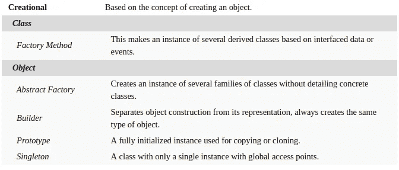
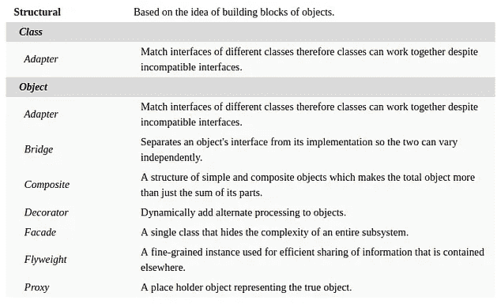
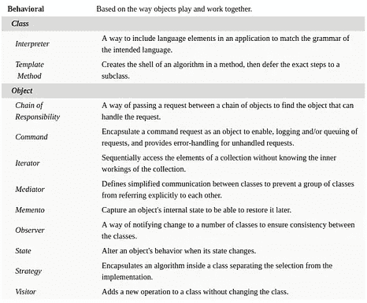
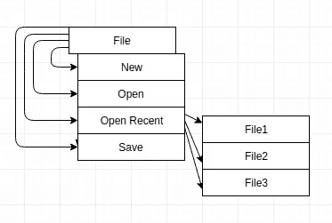

# JavaScript 设计模式

> 原文：<https://betterprogramming.pub/javascript-design-patterns-25f0faaaa15>

## 最有用设计模式的终极指南

> **更新注意:**更新了代理模式示例以使用 ES6 代理和反射。用**GitHub**gist 替换了源代码片段的图片。

在本文中，我们将讨论设计模式，它可以也应该被用来编写更好的、可维护的 JavaScript 代码。我假设您对 JavaScript 和类(JavaScript 中的类可能很复杂)、对象、原型继承、闭包等概念有基本的理解。

由于主题的性质，这篇文章作为一个整体是一篇很长的阅读，所以我尽量保持各部分独立。所以作为读者，你可以挑选特定的部分(或者，在这种情况下，特定的模式)，忽略那些你不感兴趣或者不熟悉的部分。现在，让我们开始吧。

> **注:**这里解释的所有设计模式实现的源代码在 [**GitHub**](https://github.com/drenther/js-design-patterns) 上。

# 介绍

我们写代码来解决问题。这些问题通常有许多相似之处，并且，当试图解决它们时，我们注意到几个共同的模式。这就是设计模式的用武之地。

> **设计模式**是软件工程中的一个术语，指的是软件设计中常见问题的通用、可重用解决方案。

设计模式的基本概念从一开始就存在于软件工程行业中，但是它们并没有被正式化。 [**设计模式:可重用面向对象软件的元素**](https://en.wikipedia.org/wiki/Design_Patterns) 由 **Erich Gamma，Richard Helm，Ralph Johnson** ，和**John Vlissides**——著名的四人帮(GoF)——撰写，在软件工程中推动设计模式的形式化概念方面发挥了重要作用。现在，设计模式是软件开发的重要组成部分，并且已经存在很长时间了。

原著中介绍了 23 种设计模式。

**GoF** 推出的经典 23 式

出于各种原因，设计模式是有益的。它们是业内资深人士已经尝试和测试过的成熟解决方案。它们是以广泛接受的方式解决问题的可靠方法，反映了帮助定义这些问题的行业领先开发人员的经验和见解。模式还使您的代码更具可重用性和可读性，同时大大加快了开发过程。

设计模式绝不是最终的解决方案。它们只为我们提供解决问题的方法或方案。

> **注意:**在本文中，我们将主要从面向对象的角度并在现代 JavaScript 的可用性背景下讨论设计模式。这就是为什么许多来自 GoF 的经典模式可能会被省略，而一些来自 [**Addy Osmani 的 Learn JavaScript 设计模式**](https://addyosmani.com/resources/essentialjsdesignpatterns/book/) 的现代模式将被包括在内。为了更容易理解，示例保持简单，因此不是它们各自设计模式的最佳实现。

# 设计模式的类别

设计模式通常分为三大类。

## 创造性的设计模式

顾名思义，这些模式用于处理对象创建机制。创造性设计模式基本上是通过控制对象的创建过程来解决问题的。

我们将详细讨论以下几种模式: ***构造器模式、工厂模式、原型模式、*** 和 ***单体模式。***

## 结构设计模式

这些模式与类和对象的组成有关。它们帮助构建或重组一个或多个部分，而不影响整个系统。换句话说，它们有助于在不破坏现有功能的情况下获得新功能。

我们将详细讨论以下模式: ***适配器模式、复合模式、装饰者模式、faade 模式、Flyweight 模式、*** 和 ***代理模式。***

## 行为设计模式

这些模式与改善不同对象之间的通信有关。

我们将详细讨论以下模式: ***责任链模式、命令模式、迭代器模式、中介器模式、观察者模式、状态模式、策略模式、*** 和 ***模板模式。***

# 构造器模式

这是一个基于类的创造性设计模式。构造函数是特殊的函数，可以用来用该函数定义的方法和属性实例化新对象。

它不是经典的设计模式之一。事实上，在大多数面向对象语言中，它更多的是一种基本的语言结构，而不是一种模式。但是在 JavaScript 中，对象可以动态创建，不需要任何构造函数或“类”定义。因此，我认为用这个简单的模式为其他模式打下基础是很重要的。

构造器模式是 JavaScript 中最常用的模式之一，用于创建给定类型的新对象。

在这个例子中，我们定义了一个具有像`name`和`specialAbility`这样的属性和像`getDetails`这样的方法的`Hero`类。然后，我们通过调用带有关键字`new`的构造函数方法实例化一个对象`IronMan`,将相应的属性值作为参数传入。

构造器模式

# 工厂模式

工厂模式是另一种基于类的创建模式。在这里，我们提供了一个通用接口，将对象实例化的责任委托给它的子类。

当我们需要管理或操作不同但具有许多相似特征的对象集合时，经常使用这种模式。

在这个例子中，我们创建了一个名为`BallFactory`的工厂类，它有一个接受参数的方法，根据参数，它将对象实例化的责任委托给相应的类。如果类型参数为`"football"`或`"soccer"`，则对象实例化由`Football`类处理，如果类型参数为`"basketball"`，则对象实例化由`Basketball`类处理。

工厂模式

# 原型模式

这种模式是基于对象的创造性设计模式。在这里，我们使用一种现有对象的“框架”来创建或实例化新对象。

这种模式对 JavaScript 特别重要和有益，因为它利用原型继承而不是传统的面向对象继承。因此，它发挥了 JavaScript 的优势，并拥有原生支持。

在这个例子中，我们使用一个`car`对象作为原型来创建另一个具有 JavaScript 的`Object.create` 特性的对象`myCar`，并在新对象上定义一个额外的属性`owner`。

原型模式

# 单一模式

Singleton 是一种特殊的创造性设计模式，其中一个类只能有一个实例。它是这样工作的——如果不存在 singleton 类的实例，那么创建并返回一个新的实例，但是如果一个实例已经存在，那么返回对现有实例的引用。

一个完美的真实例子是`mongoose`(著名的 MongoDB node . js ODM 库)。它利用了单例模式。

在这个例子中，我们有一个单独的`Database`类。首先，我们通过使用`new`操作符调用`Database`类构造函数来创建一个对象`mongo`。这一次实例化一个对象，因为不存在任何对象。第二次，当我们创建`mysql`对象时，没有实例化新的对象，而是返回对之前实例化的对象的引用，即`mongo`对象。

单一模式

# 适配器模式

这是一种结构模式，其中一个类的接口被转换成另一个类的接口。这种模式允许类一起工作，否则由于不兼容的接口而无法工作。

这种模式通常用于为新的重构 API 创建包装器，以便其他现有的旧 API 仍然可以使用它们。当新的实现或代码重构(出于提高性能等原因)导致不同的公共 API 时，通常会这样做，而系统的其他部分仍在使用旧的 API，需要进行调整才能协同工作。

在这个例子中，我们有一个旧的 API，即`OldCalculator`类，和一个新的 API，即`NewCalculator`类。`OldCalculator`类为加法和减法都提供了一个`operation`方法，而`NewCalculator`为加法和减法提供了单独的方法。适配器类`CalcAdapter`包装`NewCalculator`以将`operation`方法添加到面向公众的 API 中，同时使用其自己的加减实现。

适配器模式

# 复合模式

这是一种结构设计模式，它将对象组成树状结构来表示整体-部分层次结构。在这种模式中，树状结构中的每个节点可以是单个对象，也可以是对象的组合集合。无论如何，每个节点都被同等对待。

多级菜单结构

形象化这种模式有点复杂。考虑这个问题最简单的方法是以多级菜单为例。每个节点可以是一个不同的选项，也可以是一个菜单本身，其中有多个选项作为其子节点。有子节点的节点组件是复合组件，而没有子节点的节点组件是叶组件。

在这个例子中，我们创建了一个基类`Component`,它实现了所需的通用功能，并抽象了所需的其他方法。基类也有一个静态方法，利用递归来遍历由它的子类组成的复合树结构。然后我们创建两个扩展基类的子类——`Leaf`没有任何子类，而`Composite`可以有子类——因此有处理添加、搜索和删除子功能的方法。这两个子类用于创建一个复合结构——在本例中是一棵树。

复合模式

# 装饰图案

这也是一种结构设计模式，它关注于向现有类动态添加行为或功能的能力。这是另一个可行的替代分类的方法。

装饰类型行为很容易在 JavaScript 中实现，因为 JavaScript 允许我们动态地向对象添加方法和属性。最简单的方法是给一个对象添加一个属性，但是它不能被有效地重用。

事实上，有人提议在 JavaScript 语言中添加装饰器。看看 [**Addy Osmani 关于 JavaScript 中装饰者的帖子**](https://medium.com/google-developers/exploring-es7-decorators-76ecb65fb841) 。

如果你想了解 [**提案本身**](https://tc39.es/proposal-decorators/) ，请随意。

在这个例子中，我们创建了一个`Book`类。我们还创建了两个 decorator 函数，它们接受一个 book 对象并返回一个“装饰过的”`book`对象— `giftWrap`添加一个新属性和一个新函数，以及`hardbindBook`添加一个新属性并编辑一个现有属性的值。

装饰图案

# 立面图案

这是一种在 JavaScript 库中广泛使用的结构设计模式。它被用来提供一个统一的、更简单的、面向公众的接口，以方便使用，避免复杂的子系统或子类。

在像 jQuery 这样的库中，这种模式的使用非常普遍。

在这个例子中，我们用类`ComplaintRegistry`创建了一个面向公众的 API。它只公开了一个方法供客户端使用，即`registerComplaint`。它根据类型参数在内部处理所需的`ProductComplaint`或`ServiceComplaint`对象的实例化。它还处理所有其他复杂的功能，如生成唯一的 ID，将投诉存储在内存中等。但是，所有这些复杂性都被外观模式隐藏起来了。

立面图案

# 轻量级模式

这是一种结构设计模式，专注于通过细粒度对象实现高效的数据共享。它用于提高效率和节省内存。

这种模式可以用于任何类型的缓存目的。事实上，现代浏览器使用了一种 flyweight 模式的变体来防止两次加载相同的图像。

在这个例子中，我们创建了一个细粒度的 flyweight 类`Icecream`来共享关于冰淇淋口味的数据，还创建了一个工厂类`IcecreamFactory`来创建这些 flyweight 对象。为了节省内存，如果同一个对象被实例化两次，则对象将被回收。这是一个 flyweight 实现的简单例子。

轻量级模式

# 代理模式

这是一种结构设计模式，正如它的名字所暗示的那样。它充当另一个对象的代理或占位符来控制对它的访问。

它通常用于目标对象受到约束并且可能无法有效处理其所有职责的情况。在这种情况下，代理通常向客户端提供相同的接口，并添加一个间接层来支持对目标对象的受控访问，以避免对其造成不适当的压力。

代理模式在处理大量网络请求的应用程序时非常有用，可以避免不必要的或多余的网络请求。

在这个例子中，我们将使用 ES6 的两个新特性， [**代理**](https://developer.mozilla.org/en-US/docs/Web/JavaScript/Reference/Global_Objects/Proxy) 和 [**反射**](https://developer.mozilla.org/en-US/docs/Web/JavaScript/Reference/Global_Objects/Reflect) 。代理对象用于为 JavaScript 对象的基本操作定义自定义行为(记住，函数和数组也是 JavaScript 中的对象)。它是一个构造器方法，可以用来创建一个`Proxy`对象。它接受一个将被代理的`target`对象和一个将定义必要定制的`handler`对象。handler 对象允许定义一些陷阱函数，如`get`、`set`、`has`、`apply`等。用于将自定义行为添加到它们的用法中。另一方面，`Reflect`是一个内置对象，它提供了类似的方法，这些方法由代理的 handler 对象作为静态方法支持。它不是构造函数；它的静态方法用于可拦截的 JavaScript 操作。

现在，我们创建一个可以看作是网络请求的函数。我们将其命名为`networkFetch`。它接受一个 URL 并做出相应的响应。我们希望实现一个代理，如果缓存中没有响应，我们就只能从网络中获得响应。否则，我们只是从缓存中返回一个响应。

`cache`全局变量将存储我们缓存的响应。我们创建一个名为`proxiedNetworkFetch`的代理，用我们原来的`networkFetch`作为`target`，并在我们的`handler`对象中使用 apply 方法来代理函数调用。apply 方法在`target`对象本身上传递。这个值作为`thisArg`和参数以类似数组的结构`args`传递给它。

我们检查传递的 url 参数是否在缓存中。如果它存在于缓存中，我们从那里返回响应，从不调用原始的目标函数。如果没有，那么我们使用`Reflect.apply`方法调用带有`thisArg`的`target`函数(尽管在我们的例子中没有任何意义)和它传递的参数。

代理模式

# 责任链模式

这是一种行为设计模式，提供了一系列松散耦合的对象。这些对象中的每一个都可以选择处理客户端的请求。

责任链模式的一个很好的例子是 DOM 中的事件冒泡，其中一个事件通过一系列嵌套的 DOM 元素传播，其中一个元素可能附加了一个“事件监听器”来监听事件并对其进行操作。

在这个例子中，我们创建了一个类`CumulativeSum`，它可以用可选的`initialValue`实例化。它有一个方法`add`，将传递的值添加到对象的`sum`属性，并返回`object`本身，以允许链接`add`方法调用。

这是一个常见的模式，也可以在 jQuery 中看到，几乎所有对 jQuery 对象的方法调用都会返回一个 jQuery 对象，这样方法调用就可以链接在一起。

责任链模式

# 命令模式

这是一种行为设计模式，旨在将动作或操作封装为对象。这种模式通过将请求操作或调用方法的对象与执行或处理实际实现的对象分开，允许系统和类的松散耦合。

剪贴板交互 API 有点类似于命令模式。如果你是一个 [**Redux**](https://redux.js.org/) 用户，那么你已经遇到了命令模式。允许令人惊叹的时间旅行调试功能的动作不过是封装的操作，可以跟踪这些操作来重做或撤消操作。因此，时间旅行成为可能。

在这个例子中，我们有一个名为`SpecialMath`的类，它有多个方法，还有一个`Command`类，它封装了将在其主题上执行的命令，即`SpecialMath`类的一个对象。`Command`类还跟踪所有执行的命令，这可以用来扩展它的功能，包括撤销和重做类型的操作。

命令模式

# 迭代器模式

它是一种行为设计模式，提供了一种顺序访问聚合对象的元素而不暴露其底层表示的方法。

迭代器有一种特殊的行为，我们通过调用`next()`一次遍历一组有序的值，直到到达末尾。ES6 中迭代器和生成器的引入使得迭代器模式的实现非常简单。

下面我们举两个例子。首先，一个`IteratorClass`使用迭代器规范，而另一个`iteratorUsingGenerator`使用生成器函数。

`Symbol.iterator`(`Symbol`—一种新的原始数据类型)用于指定对象的默认迭代器。必须为集合定义它才能使用`for...of`循环结构。在第一个例子中，我们定义构造函数来存储一些数据集合，然后定义`Symbol.iterator`，用`next`方法返回一个对象进行迭代。

对于第二种情况，我们定义一个生成器函数，向它传递一个数据数组，并使用`next`和`yield`迭代地返回它的元素。生成器函数是一种特殊类型的函数，它作为迭代器的工厂工作，可以显式地维护自己的内部状态并迭代地产生值。它可以暂停和恢复自己的执行周期。

迭代器模式

# 中介模式

它是一种行为设计模式，封装了一组对象之间的交互方式。它通过促进松散耦合来提供对一组对象的集中管理，防止对象显式地相互引用。

在这个例子中，我们用`TrafficTower`作为中介来控制`Airplane`对象相互交互的方式。所有的`Airplane`对象向一个`TrafficTower`对象注册自己，并且是中介类对象处理一个`Airplane`对象如何接收所有其他`Airplane`对象的坐标数据。

中介模式

# 观察者模式

这是一个关键的行为设计模式，它定义了对象之间的一对多依赖关系，因此当一个对象(发布者)改变其状态时，所有其他依赖对象(订阅者)都会得到通知并自动更新。这也称为 PubSub(发布者/订阅者)或事件调度程序/侦听器模式。发布者有时被称为主体，订阅者有时被称为观察者。

如果您使用过`addEventListener`或 jQuery，您可能已经对这种模式有些熟悉了。`on`编写偶数处理代码。它对反应式编程也有影响(想想 [**RxJS**](https://rxjs-dev.firebaseapp.com/) )。

在这个例子中，我们创建了一个简单的`Subject`类，该类具有从订阅者集合中添加和移除`Observer`类的对象的方法。还有一个`fire`方法，将`Subject`类对象中的任何变化传播给订阅的观察者。另一方面，`Observer`类有它的内部状态和一个基于从它订阅的`Subject`传播的变化来更新它的内部状态的方法。

观察者模式

# 状态模式

它是一种行为设计模式，允许对象根据其内部状态的变化来改变其行为。状态模式类返回的对象似乎改变了它的类。它为有限的一组对象提供特定于状态的逻辑，其中每个对象类型代表一个特定的状态。

我们将以一个简单的交通灯为例来理解这种模式。`TrafficLight`类根据其内部状态改变其返回的对象，该对象是`Red`、`Yellow`或`Green`类的对象。

状态模式

# 战略模式

它是一种行为设计模式，允许封装特定任务的替代算法。它定义了一系列算法，并以这样一种方式封装它们，使得它们在运行时可以互换，而无需客户端干预或了解。

在下面的例子中，我们创建了一个类`Commute`来封装所有可能的通勤策略。然后，我们定义三种策略，即`Bus`、`PersonalCar`和`Taxi`。使用这种模式，我们可以在运行时交换用于`Commute`对象的`travel`方法的实现。

战略模式

# 模板模式

这是一种行为设计模式，基于定义算法的框架或操作的实现，但将一些步骤推迟到子类。它允许子类在不改变算法外部结构的情况下重新定义算法的某些步骤。

在这个例子中，我们有一个模板类`Employee`，它部分实现了`work`方法。子类实现责任方法使其作为一个整体工作。然后我们创建两个子类`Developer`和`Tester`，它们扩展了模板类并实现了所需的方法来填补实现的空白。

模板模式

# 结论

设计模式对软件工程至关重要，并且在解决常见问题时非常有帮助。但这是一个非常庞大的主题，不可能在一篇短短的文章中囊括所有的内容。因此，我选择简单明了地只谈论那些我认为在编写现代 JavaScript 时非常有用的内容。要深入探究，我建议你看看这些书:

1.  [**设计模式:可重用面向对象软件的元素**](https://en.wikipedia.org/wiki/Design_Patterns) 由*埃里希·伽马、理查德·赫尔姆、拉尔夫·约翰逊和约翰·维里西德斯(四人组)*
2.  [**通过 *Addy Osmani* 学习 JavaScript 设计模式**](https://addyosmani.com/resources/essentialjsdesignpatterns/book/)
3.  [**JavaScript 模式**](http://www.amazon.com/JavaScript-Patterns-Stoyan-Stefanov/dp/0596806752) 作者*斯托扬·斯特凡诺夫*