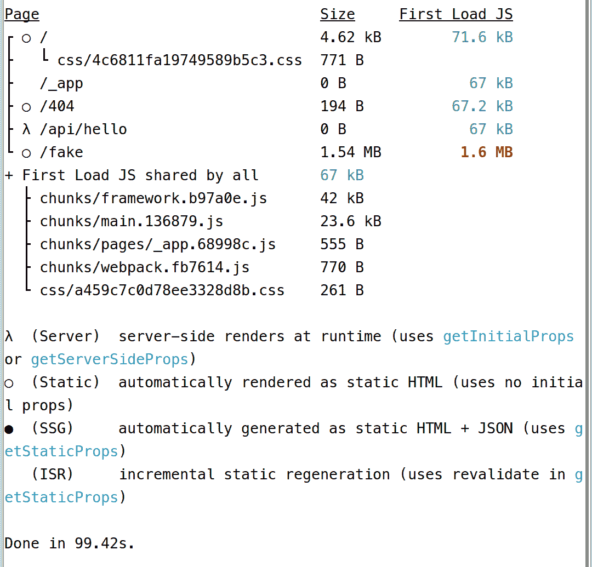
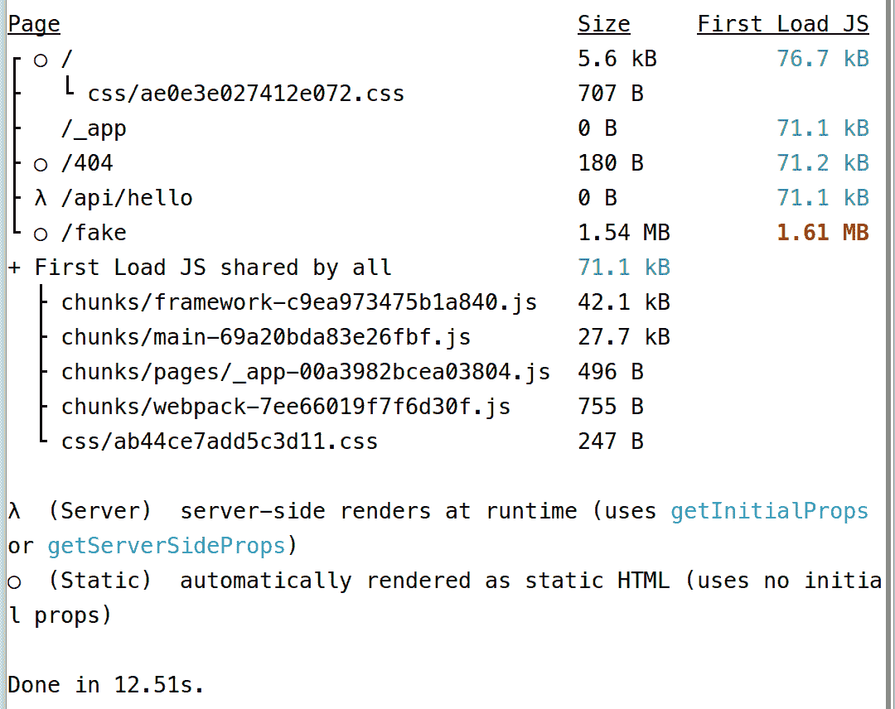

# JavaScript 开发人员正在使用闪亮生锈的工具。原因如下。

> 原文：<https://betterprogramming.pub/javascript-devs-are-using-shiny-rusty-tools-heres-why-a9421ead5ec7>

## Next.js 12 的基准测试结果令人信服。但这值得改变吗？

在我们最近的团队建设活动中，我做了一个关于为什么 JavaScript 开发人员将他们的工具转移到 Rust 的演讲。这是一个相当受欢迎的演讲，我们认为与世界分享它会很酷。这就是了。这是这篇演讲的编辑版本，为阅读而写，在我们的 Youtube 频道上还有一个[截屏。所以让我们直入主题吧。](https://youtu.be/9xggZA76wJ4)

# 背景

软件的一个共同趋势是用我们用来构建应用程序的相同语言来编写我们作为开发人员用来构建应用程序的工具。比如 pip 用 Python 写，Composer 用 PHP 写，Maven 用 Java 写等等。这是有意义的，因为大多数时候创建工具的人也是使用它们的人。所以用他们选择的语言工作更容易。

JavaScript 也不例外。从 Gulp 和 Bower 到 babel 和 Webpack，我们都是用 JavaScript 编写的。这对我们来说效果很好，但也有一些问题。

# JavaScript 的问题是

要了解这个问题，我们必须看看 JavaScript 的属性。JavaScript 是一种轻量级的网页脚本语言。当然，我们现在在任何地方都使用它，从后端到数据库，但它最初是为了让页面首先闪亮，然后其他一切，这是显而易见的。

它是一种解释语言，可以实时编译，并且是单线程的。是的，是的，我知道如何运行多个实例并与 web 工作人员交流……但在我看来，这不是多线程，这是一个奇怪的巫术解决方法，试图转移我们对事实的注意力**我们没有本地多线程**。

一个更大的问题是，与其他语言相比，它在控制台上相当慢。

虽然 JavaScript 在页面上很棒，但在控制台上却有点糟糕。

一天，一群 JavaScript 开发人员聚在一个黑暗的房间里，喝多了酒后，有人说:

***“嘿，伙计们，如果……听我说……如果我们不用 JavaScript 来编写构建我们的 JavaScript 的工具会怎么样？”***

有一个集体喘息，扔椅子，打架爆发，尘埃落定后，每个人都同意尝试一下。

好吧，我可能是瞎编的，但结果还是一样，我们现在用 JavaScript 之外的语言制作 JavaScript 构建工具。

# 但是为什么会生锈呢？

一句话…速度和缓冲区溢出😉。

Rust 是一种多范例、通用编程语言，旨在提高性能和安全性。这就像是 C++，但是是针对千禧一代和 zoomers 的。它是一种加强内存安全并具有“安全”并发性的系统语言。它在语法上类似于 C++，更重要的是，它几乎和 C++一样快。

## 有希望的索赔

现在有很多项目试图用基于 Rust 的工具来取代 JavaScript 工具。一些例子是 ParcelJS，Deno，ESBuild 和 Speedy Web 编译器(SWC)。他们都声称比他们试图取代的任何东西都要快，如果你想笑，可以看看 [esbuild 比较](https://esbuild.github.io/)。

在这篇文章中，我不会一一列举，但我会通过 Next.js 来近距离观察 SWC

## 快速网络编译器(SWC)

SWC 是一个可扩展的基于 Rust 的平台，用于下一代快速开发工具。这意味着，这是一个框架，以建立建设者。您可以使用 SWC 进行编译和绑定。它将使用现代 JavaScript 特性获取 JavaScript / TypeScript 文件，并生成所有主流浏览器都支持的有效代码。

## 最新 Next.js 生锈的工具

Next.js 在版本 12 中引入了基于 SWC 的 Rust 编译器。在 Next.js 网站上，他们声称本地更新速度提高了约 3 倍，生产构建速度提高了约 5 倍。

对我来说，这听起来像是一个可检验的主张。所以我测试了一下。

我在版本 11 和 12 中创建了完全相同的项目，并添加了相同的 400 个生成组件。为此我使用了 [React 基准生成器](https://github.com/multiprocessio/react-benchmark-generator)。这两个项目之间唯一的区别是 Next.js 的版本，其他的都是一样的。

结果相当令人信服。这是给 Next.js 11 的:

对于 Next.js 12，您可以这样做:

Next.js 12，花了 12 秒做了 next . js 11 1 分 40 秒做的事。这大约快了 8 倍。所以他们显然没有夸大其词。

我也没想到 Next.js 12 用了 12 秒。我想这是个幸福的巧合。

# 值得炒作吗？

现在显而易见的问题是:这值得吗？

我们最终构建的应用程序是一样的，对吗？这不会改变最终用户的体验，只会改变开发者的体验，所以为什么要这么麻烦呢？为什么要修复已经运行良好的东西？

因为它不太好用。正如我之前所说，JavaScript 在页面上很棒，但在控制台上很糟糕。开发者机器是强大的野兽，不利用这种力量是一种可怕的浪费。这也是一种昂贵的浪费。

假设您在一个由 20 名开发人员组成的团队中，从事一个在基于云的 CI 上部署和测试的大型项目。每天你团队的每个成员都会推出多个补丁和特性，下面是可能发生的事情。

如果您的 CI 提供无限的并发构建，但按构建分钟或按处理器时间秒收费，那么 Next.js 的成本将是 Next.js 12 的 8 倍。

另一方面，如果它给出了一个固定的价格和一个固定的并发构建数，那么如果您的构建队列增长，您将需要等待一段时间，或者您将不得不付费来增加您可以运行的并发构建数。

无论哪种方式，缓慢的构建花费你更多的时间和金钱，或者两者都有。

# 结论

JavaScript 是一种令人惊叹的语言，没有它，互联网就不会有今天。但是我们不一定要用它来构建我们的工具，因为有更难、更好、更快、更强的语言，比如 Rust，这没关系。它并没有剥夺 JavaScript，放弃基于 JavaScript 的构建工具，转而使用更快的基于 Rust 的工具，也不是背叛。让我们面对现实吧，我不会为了得到巫毒多线程而忍受多个 JavaScript 实例。