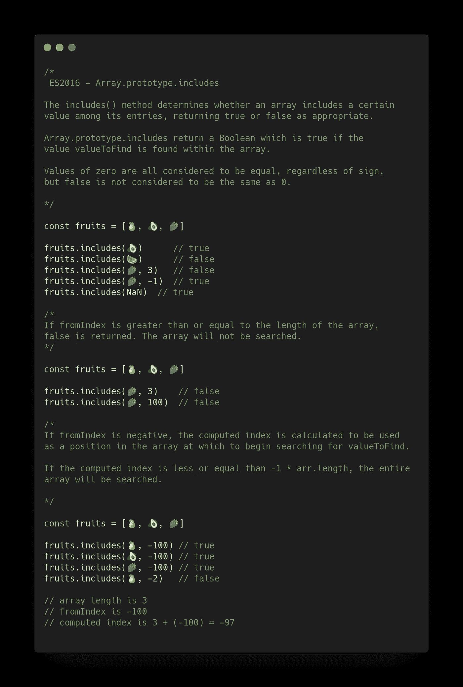
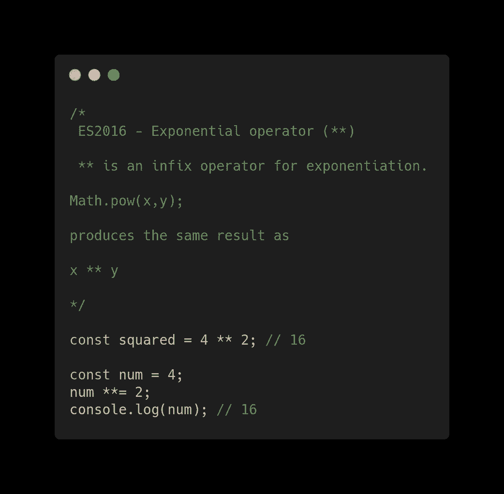

# JavaScript ES2016 特性及示例

> 原文：<https://betterprogramming.pub/javascript-es2016-features-with-examples-a41b7aead589>

## ES2016 又名 ES7 特性


圣 Kaÿzn 在 [Unsplash](https://unsplash.com/s/photos/2016?utm_source=unsplash&utm_medium=referral&utm_content=creditCopyText) 上拍摄的照片

# 介绍

今天，我们将了解 2015 年的 ECMAScript 特性:

*   ES2015 又名 ES6
*   [ES2016 又名 ES7](https://medium.com/better-programming/javascript-es2016-features-with-examples-a41b7aead589)
*   [ES2017 又名 ES8](https://medium.com/better-programming/javascript-es2017-features-with-examples-877f8406e770)
*   [ES2018 又名 ES9](https://medium.com/better-programming/javascript-es2018-features-with-examples-30fda8ac50fa)
*   [ES2019 又名 ES10](https://medium.com/better-programming/twelve-es10-features-in-twelve-simple-examples-6e8cc109f3d3)
*   [ES2020 又名 ES11](https://medium.com/better-programming/javascript-es2020-features-with-simple-examples-d301dbef2c37)

ES2016 又名 ES7，是对应于 2016 年的 ECMAScript 版本。这个版本没有 ES6 (2015)中出现的那么多新功能。但是，已经加入了一些有用的功能。

这篇文章通过简单的代码示例介绍了 ES2016 提供的功能。这样不需要复杂的解释就能快速理解新特性。

当然，它；有必要对 JavaScript 有一个基本的了解，以充分理解最好的介绍。

ES2016 中的新 JavaScript 功能包括:

*   `Array.prototype.includes`
*   取幂运算符

# 数组.原型.包含

`includes()`方法确定数组的条目中是否包含某个值，根据情况返回`true`或`false`。

如果在数组中找到值`valueToFind`，则`Array.prototype.includes`返回布尔值“T5”。

无论符号如何，0 的值都被认为是相等的，但是`false`不被认为与 0 相同。

```
**const** fruits = [🍐, 🥑, 🍇]fruits.includes(🥑)      // true
fruits.includes(🍉)      // false
fruits.includes(🍇, 3)   // false
fruits.includes(🍇, -1)  // true
fruits.includes(NaN)  // true
```

如果`fromIndex`大于或等于数组的长度，则返回`false`。不会搜索数组。

```
**const** fruits = [🍐, 🥑, 🍇]fruits.includes(🍇, 3)    // false
fruits.includes(🍇, 100)  // false
```

如果`fromIndex`为负，则计算出的索引将被用作数组中开始搜索`valueToFind`的位置。

如果计算出的索引小于或等于`-1 * arr.length`，将搜索整个数组。

```
**const** fruits = [🍐, 🥑, 🍇]fruits.includes(🍐, -100) // true
fruits.includes(🥑, -100) // true
fruits.includes(🍇, -100) // true
fruits.includes(🍐, -2)   // false// array length is 3
// fromIndex is -100
// computed index is 3 + (-100) = -97
```



# 指数运算符

指数运算符(**)是求幂运算的中缀运算符。

```
**Math**.pow(x,y);
```

…产生与…相同的结果

```
x ** y
```



# 结论

JavaScript 是一种活的语言，这对于 web 开发来说是非常有益的。自 2015 年 ES6 出现以来，我们一直生活在该语言的蓬勃发展中。在这篇文章中，我们回顾了 ES2016(又名 ES7)附带的功能。

尽管这些特性中的许多对于 web 应用程序的开发来说可能并不重要，但它们提供了以前只能通过技巧或大量赘述才能实现的可能性。