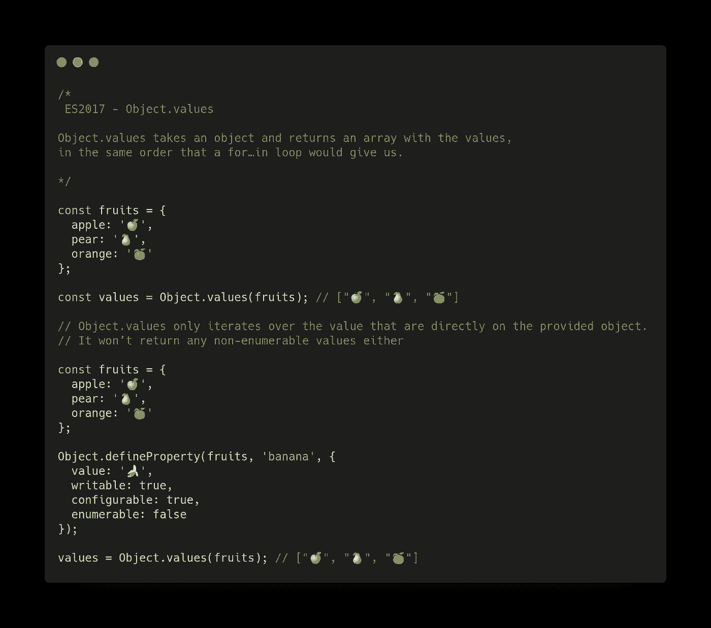
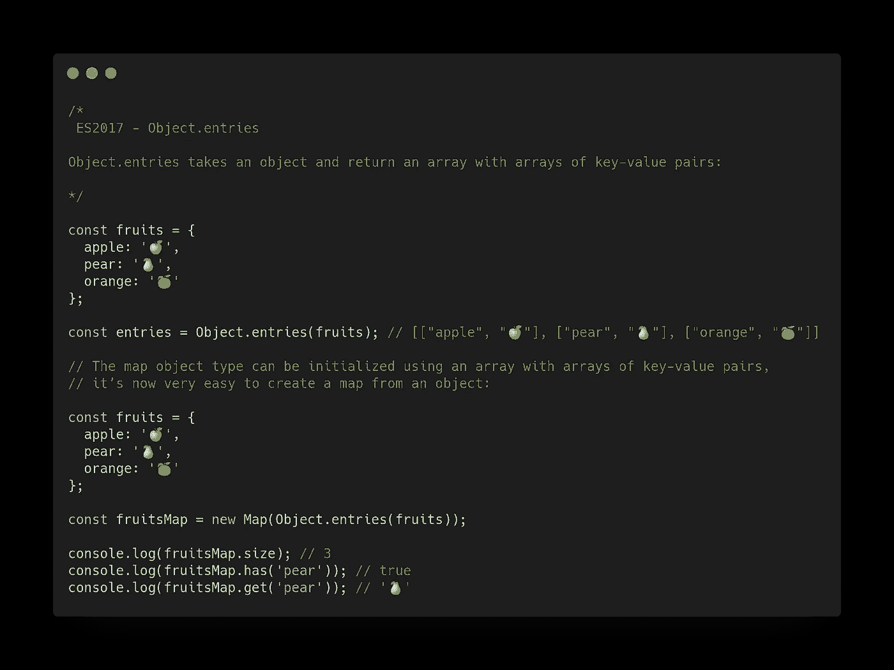
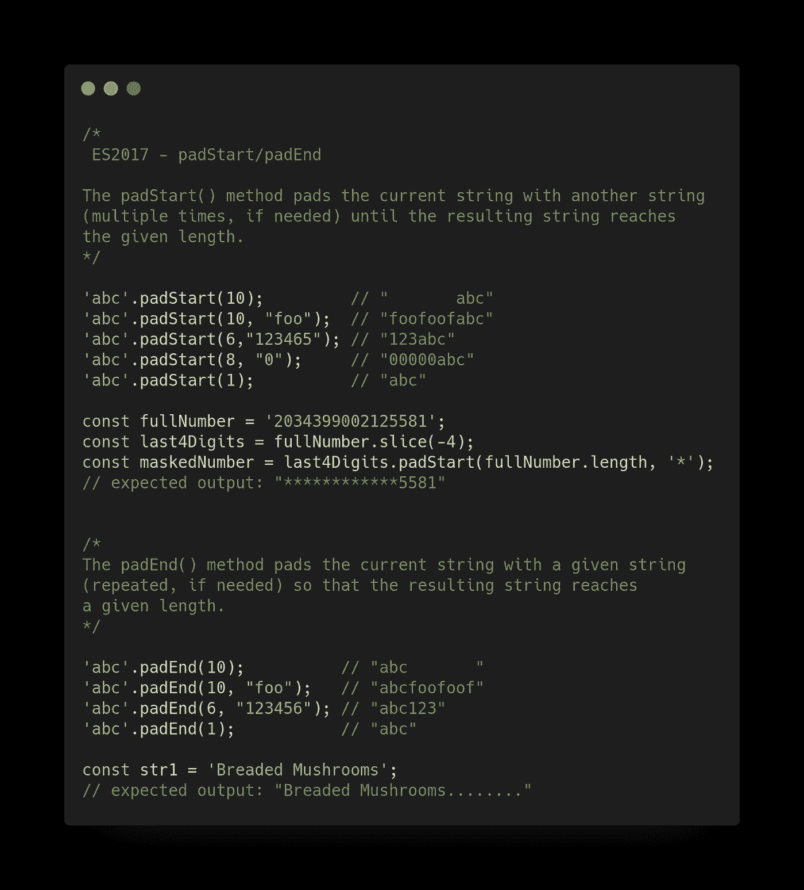
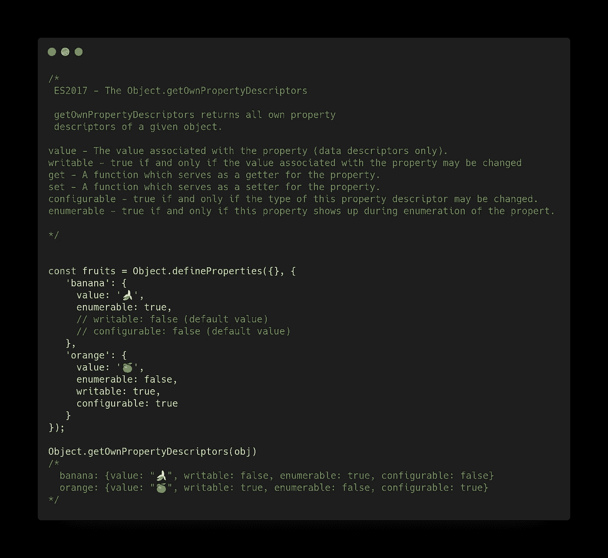
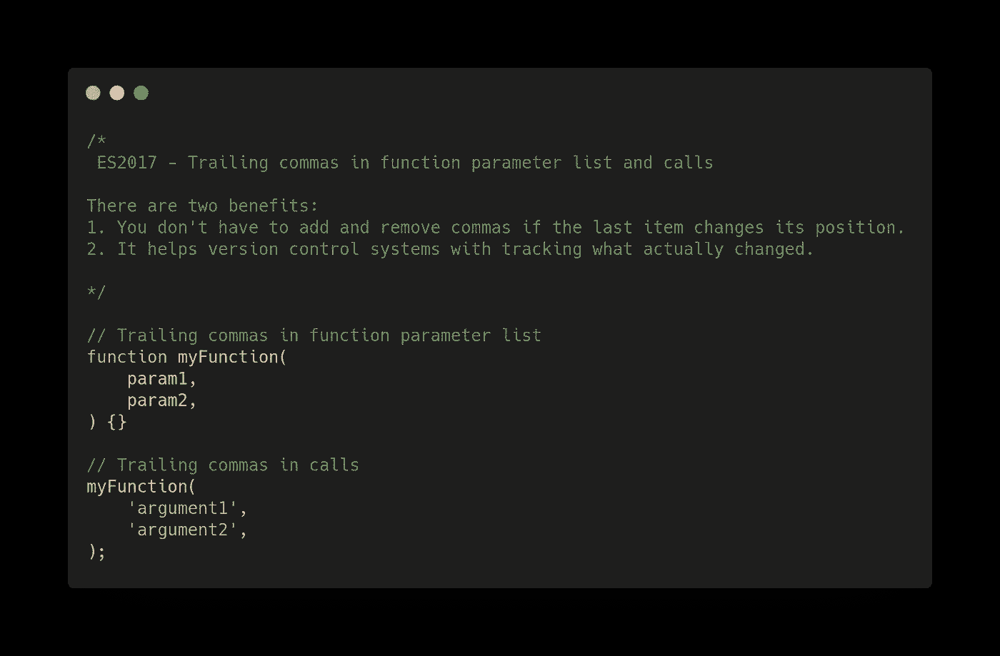
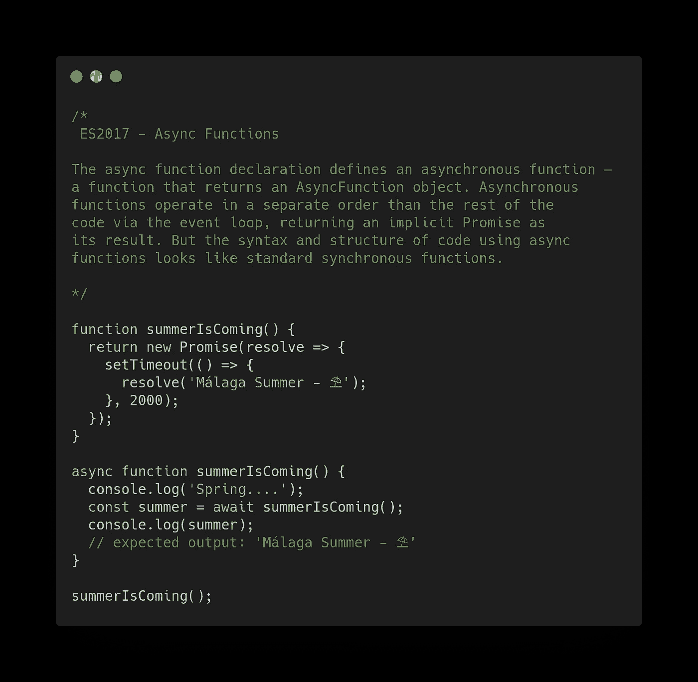
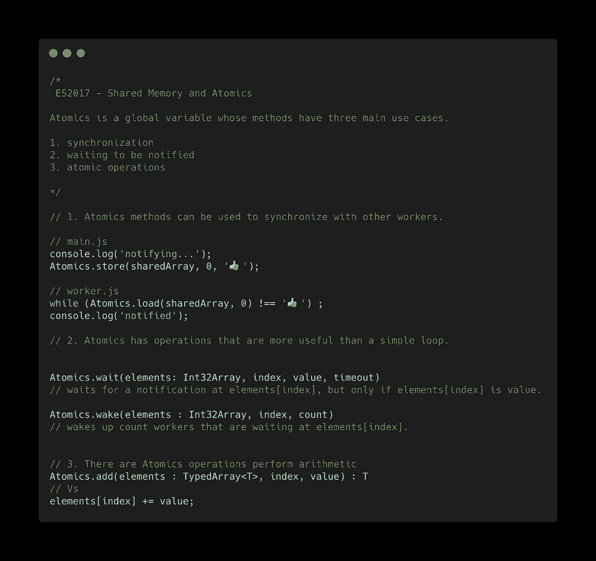

# JavaScript ES2017 功能及示例

> 原文：<https://betterprogramming.pub/javascript-es2017-features-with-examples-877f8406e770>

## ES2017 又名 ES8 特性

斯科特·韦伯在 [Unsplash](https://unsplash.com/s/photos/feature?utm_source=unsplash&utm_medium=referral&utm_content=creditCopyText) 上拍摄的照片

今天，我们将了解 2015 年的 ECMAScript 特性:

*   ES2015 又名 ES6
*   [ES2016 又名 ES7](https://medium.com/better-programming/javascript-es2016-features-with-examples-a41b7aead589)
*   [ES2017 又名 ES8](https://medium.com/better-programming/javascript-es2017-features-with-examples-877f8406e770)
*   [ES2018 又名 ES9](https://medium.com/better-programming/javascript-es2018-features-with-examples-30fda8ac50fa)
*   [ES2019 又名 ES10](https://medium.com/better-programming/twelve-es10-features-in-twelve-simple-examples-6e8cc109f3d3)
*   [ES2020 又名 ES11](https://medium.com/better-programming/javascript-es2020-features-with-simple-examples-d301dbef2c37)

# 介绍

ES2017 又名 ES8，是 2017 年对应的 ECMAScript 版本。该版本不包括 ES6 (2015)中出现的那么多新功能。但是，已经加入了一些有用的功能。

本文以简单的代码示例介绍了 ES2017 提供的功能。这样不需要复杂的解释就能快速理解新特性。

当然要有 JavaScript 的基础知识才能完全理解介绍的最好的。

ES2017 中的新 JavaScript 功能包括:

*   `Object.values` / `Object.entries`
*   ️️字符串填充
*   `Object.getOwnPropertyDescriptors`
*   函数参数列表和调用中的尾随逗号
*   异步函数
*   共享内存和原子

# Object.values/Object.entries

对象值接受一个对象并返回一个包含值的数组，其顺序与`for…in`循环给出的顺序相同。

另一方面，`Object.entries`接受一个对象并返回一个由键值对组成的数组。

# 字符串填充

`padStart()`方法用另一个字符串填充当前字符串(如果需要，可以多次填充)，直到结果字符串达到给定的长度。从当前字符串的开头应用填充。

`padEnd()`方法用一个给定的字符串
填充当前字符串(如果需要的话，可以重复)，这样得到的字符串达到
给定的长度。

# object . getownpropertydescriptors

`getOwnPropertyDescriptors`返回给定对象的所有自有属性
描述符。

*   `value` —与属性相关联的值(仅数据描述符)。
    `writable` —当且仅当与属性相关联的值可以改变时为真。
*   `get` —作为属性获取器的功能。
*   `set` —作为属性设置者的功能。
    `configurable` —当且仅当该属性描述符的类型可以改变时为真。
*   `enumerable` —当且仅当该属性在属性枚举期间出现时为真。

# 函数参数列表和调用中的尾随逗号

有两个好处:

1.  如果最后一项改变了位置，则不必添加和删除逗号。
2.  它帮助版本控制系统跟踪实际发生了什么变化。

# 异步函数

异步函数声明定义了一个异步函数——一个返回`AsyncFunction`对象的函数。

异步函数通过事件循环以独立于代码其余部分的顺序运行，返回隐式承诺作为其结果。但是使用异步函数的代码的语法和结构看起来像标准的同步函数。

# 共享内存和原子

`Atomics`是一个全局变量，其方法有三个主要用例。

1.  同步。
2.  等待通知。
3.  原子操作。

以下示例说明了使用案例。

# 结论

JavaScript 是一种活的语言，这对于 web 开发来说是非常有益的。自 2015 年 ES6 出现以来，我们正经历着该语言的蓬勃发展。

在本帖中，我们回顾了 ES2017(又名 ES8)中出现的功能。

尽管这些特性中的许多对于 web 应用程序的开发来说可能并不重要，但它们提供了以前只需技巧或大量赘述就能实现的可能性。