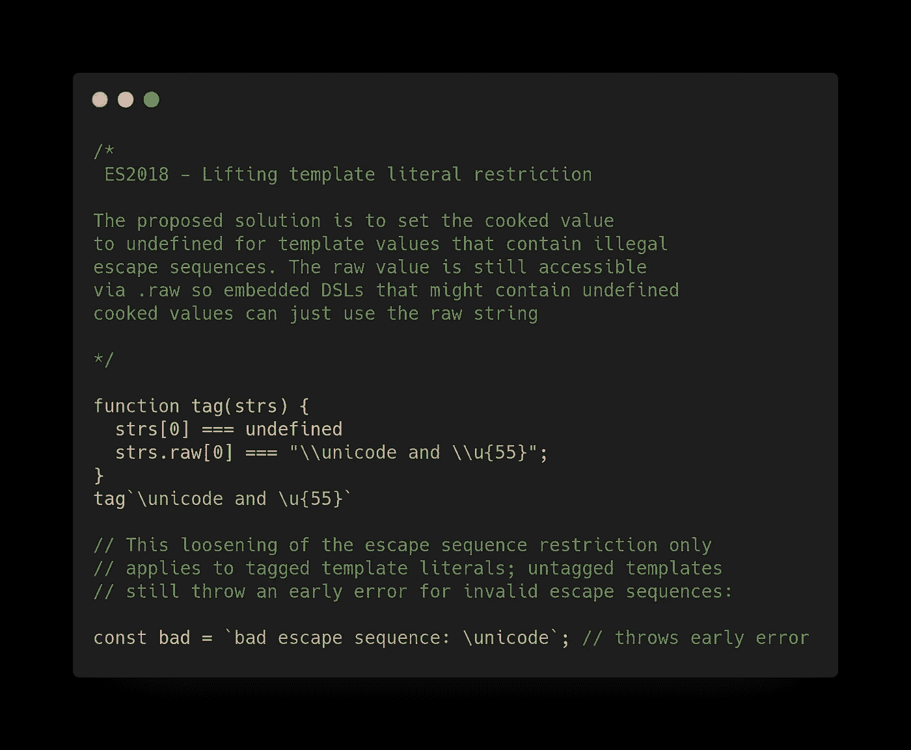
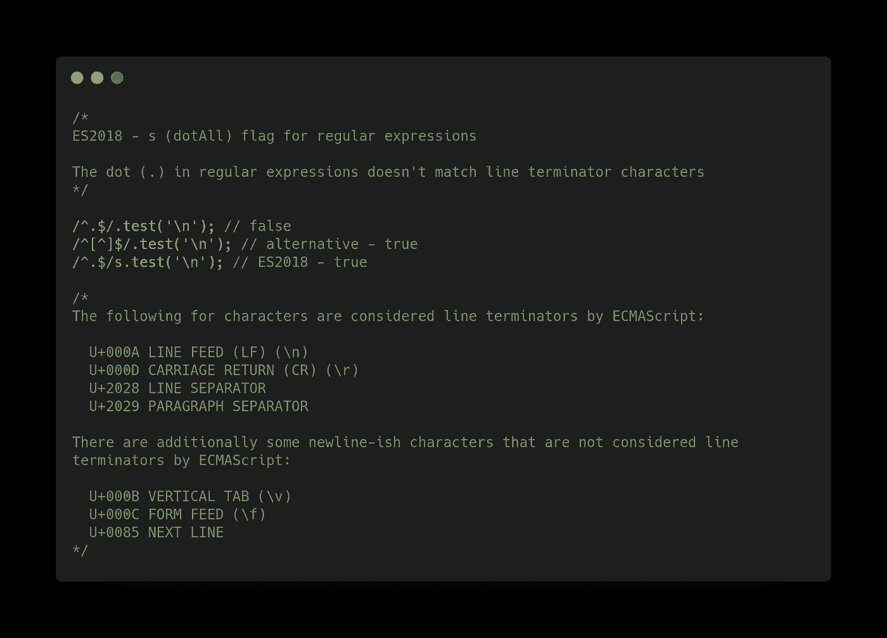
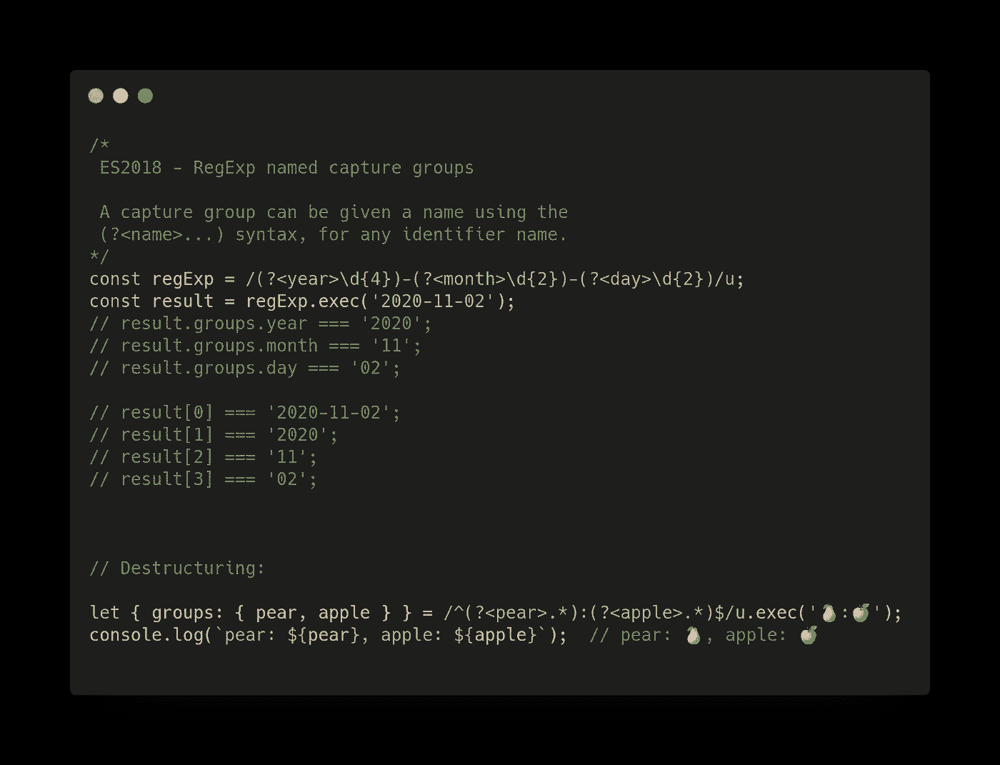
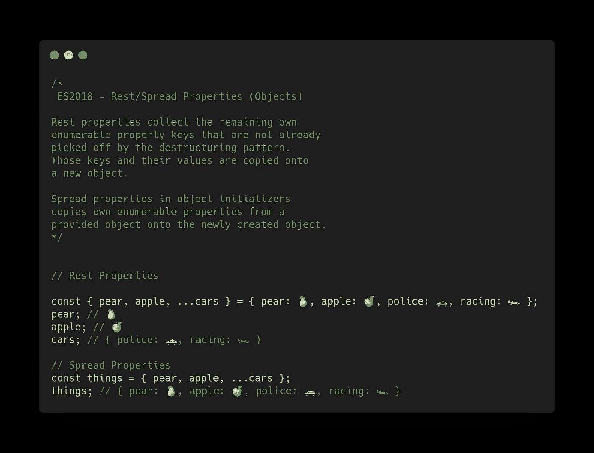
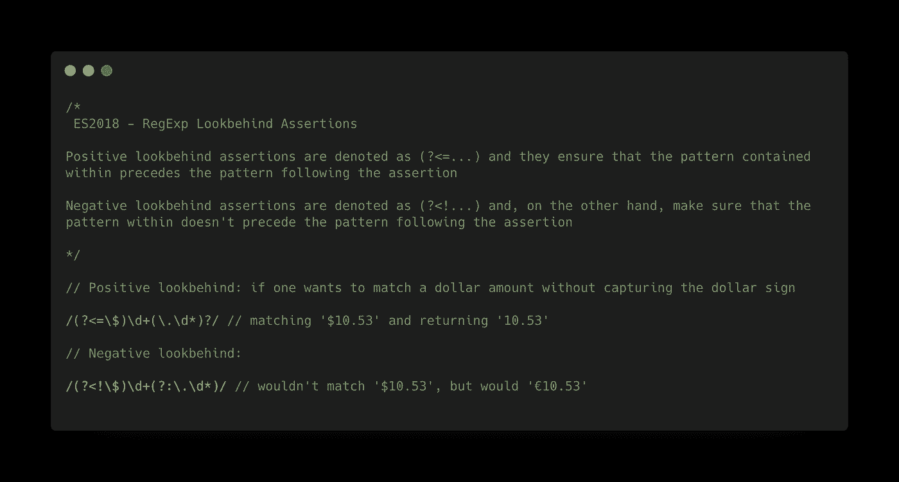
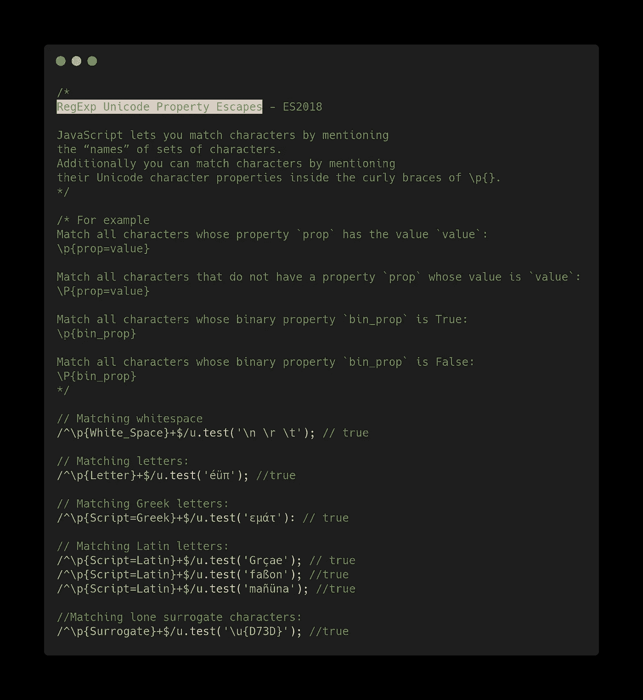
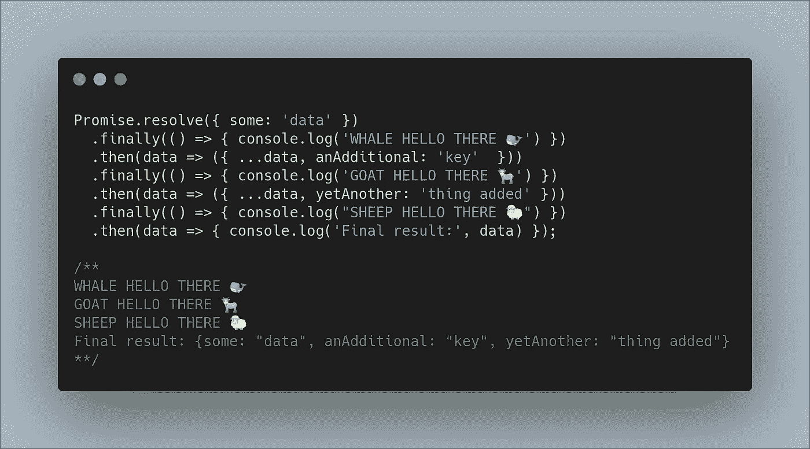
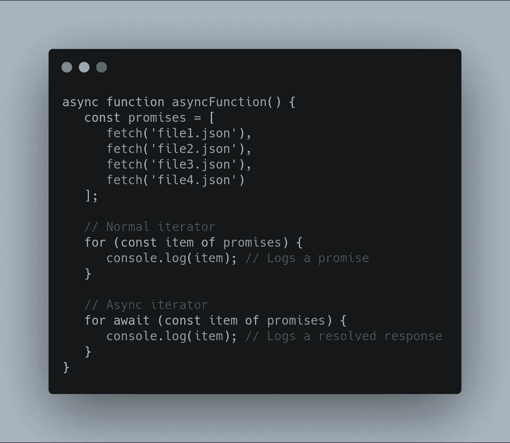

# JavaScript ES2018 特性及示例

> 原文：<https://betterprogramming.pub/javascript-es2018-features-with-examples-30fda8ac50fa>

## ES2018 又名 ES9 特性

照片由 [Nijwam Swargiary](https://unsplash.com/@pixel_talkies?utm_source=unsplash&utm_medium=referral&utm_content=creditCopyText) 在 [Unsplash](https://unsplash.com/s/photos/news?utm_source=unsplash&utm_medium=referral&utm_content=creditCopyText) 上拍摄

今天，我们将了解 2015 年的 ECMAScript 特性:

*   ES2015 又名 ES6
*   [ES2016 又名 ES7](https://medium.com/better-programming/javascript-es2016-features-with-examples-a41b7aead589)
*   [ES2017 又名 ES8](https://medium.com/better-programming/javascript-es2017-features-with-examples-877f8406e770)
*   [ES2018 又名 ES9](https://medium.com/better-programming/javascript-es2018-features-with-examples-30fda8ac50fa)
*   [ES2019 又名 ES10](https://medium.com/better-programming/twelve-es10-features-in-twelve-simple-examples-6e8cc109f3d3)
*   [ES2020 又名 ES11](https://medium.com/better-programming/javascript-es2020-features-with-simple-examples-d301dbef2c37)

# 介绍

ES2018，又名 ES9，是 2018 年对应的 ECMAScript 版本。该版本不包括 ES6 (2015)中出现的那么多新功能。但是，已经加入了一些有用的功能。

本文以简单的代码示例介绍了 ES2018 提供的功能。这样不需要复杂的解释就能快速理解新特性。

当然要有 JavaScript 的基础知识才能完全理解介绍的最好的。

ES2018 中的新 JavaScript 功能包括:

*   取消模板文字限制。
*   `s (dotAll)`正则表达式的标志。
*   Regexp 命名捕获组。
*   休息/传播属性。
*   Regexp lookbehind 断言。
*   Regexp Unicode 属性转义。
*   `Promise.prototype.finally`。
*   异步迭代。

# 取消模板文字限制

建议的解决方案是将包含非法转义序列的模板值的 cooked 值设置为 undefined。

原始值仍然可以通过`.raw`访问，因此可能包含未定义熟值的嵌入式 DSL 可以只使用`raw`字符串:

# 正则表达式的 s (dotAll)标志

目前，正则表达式中的点`(.)`不匹配行终止符(ES2018 之前)。提案指定了正则表达式标志`/s`。

# Regexp 命名的捕获组

编号的捕获组允许您引用正则表达式匹配的字符串的特定部分。

每个捕获组都被分配了一个惟一的编号，并且可以使用该编号进行引用，但是这会使正则表达式难以理解和重构。

对于任何标识符名称，可以使用(`?<name>...`)语法为捕获组命名。

日期的正则表达式可以写成`/(?<year>\d{4})-(?<month>\d{2})-(?<day>\d{2})/u`。每个名称都应该是唯一的。

# 休息/传播属性

ECMAScript 6 为数组析构赋值引入了 rest 元素，为数组文字引入了 spread 元素。

这个版本为对象的析构赋值引入了类似的 rest 属性，为对象文字引入了 spread 属性。

# regexp look back 断言

有两种版本的后视断言:肯定的和否定的。

肯定的后视断言表示为(`?<=...`)，它们确保断言中包含的模式在断言后的模式之前。

负的后视断言被表示为(`?<!...`)，另一方面，确保其中的模式不在断言之后的模式之前。

# Regexp Unicode 属性转义

JavaScript 允许您通过提及字符集的“名称”来匹配字符。此外，您可以通过在`\p{}`的花括号内提及字符的 Unicode 字符属性来匹配字符。

该建议解决了所有上述问题:

*   创建支持 Unicode 的正则表达式不再痛苦。
*   不依赖于运行时库。
*   正则表达式模式简洁易读——不再有文件大小膨胀。
*   不再需要创建在构建时生成正则表达式的脚本。
*   从开发人员的角度来看，使用 Unicode 属性 escapes 的代码“自动”保持最新:每当 Unicode 标准获得更新时，ECMAScript 引擎都会更新其数据。

# 承诺.原型.最终

一旦你的承诺以这样或那样的方式达成，回调执行逻辑。这绝对不会影响你的承诺的价值。

# 异步迭代

我们引入了 for-of 迭代语句的变体，它迭代异步可迭代对象。一个使用示例是:

# 结论

JavaScript 是一种活的语言，这对于 web 开发来说是非常有益的。自 2015 年 ES6 出现以来，我们正在经历该语言的蓬勃发展。

在本帖中，我们回顾了 ES2018(又名 ES9)中出现的功能。

尽管这些特性中的许多对于 web 应用程序的开发来说可能并不重要，但它们提供了以前只能通过技巧或大量赘述才能实现的可能性。