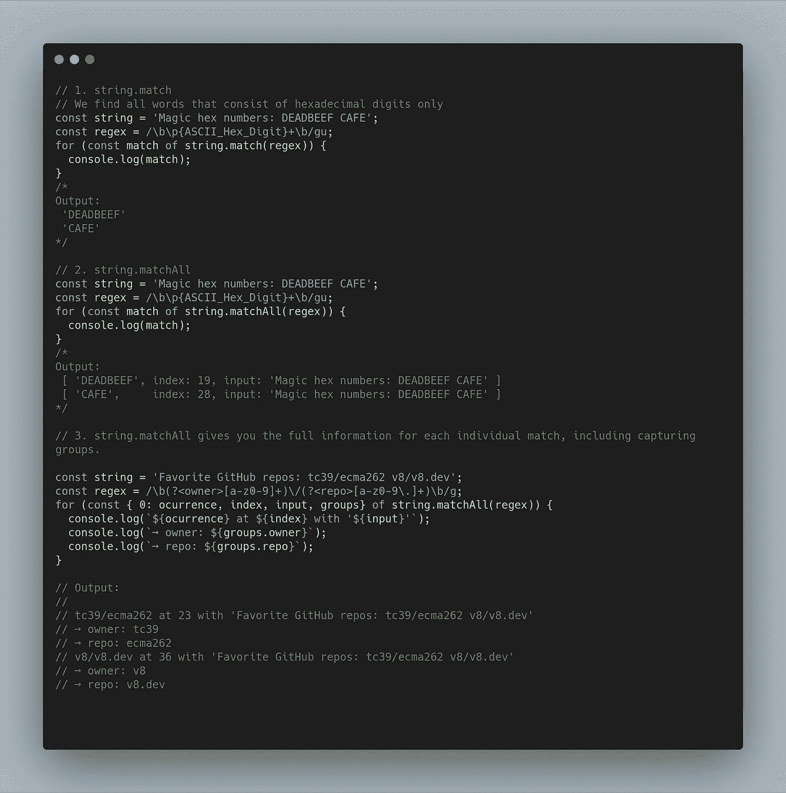
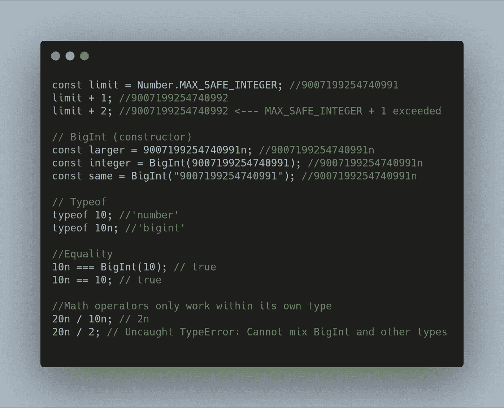
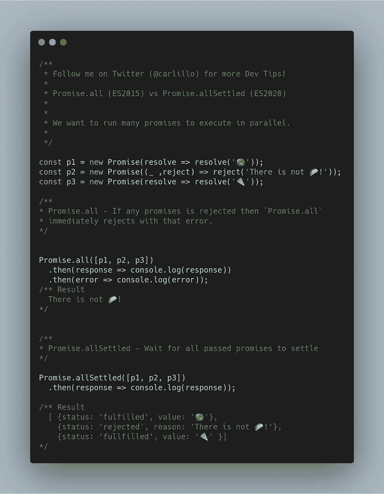
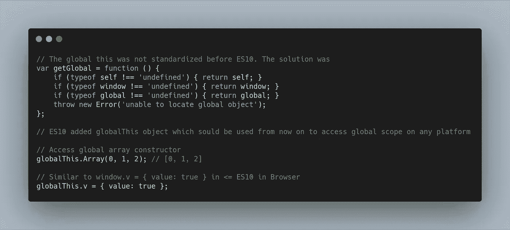
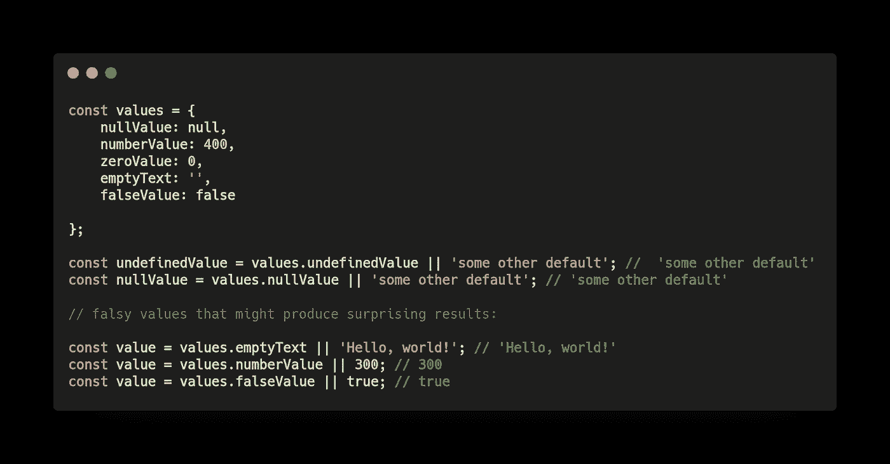
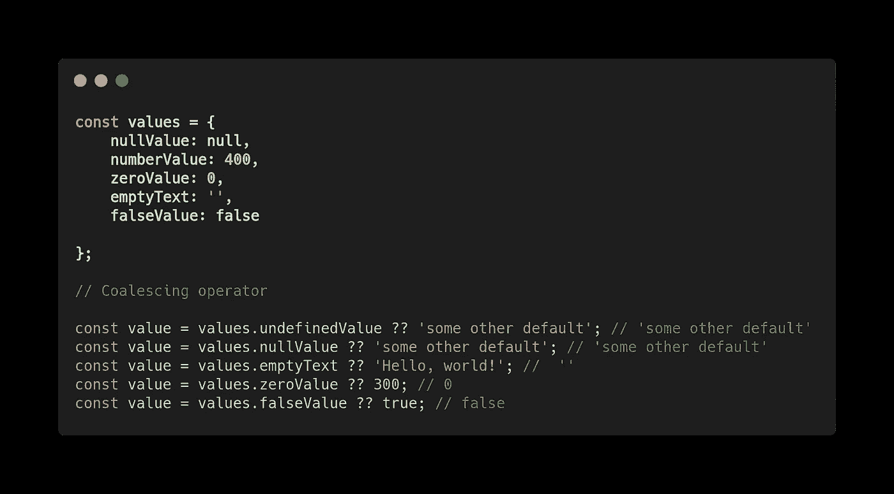
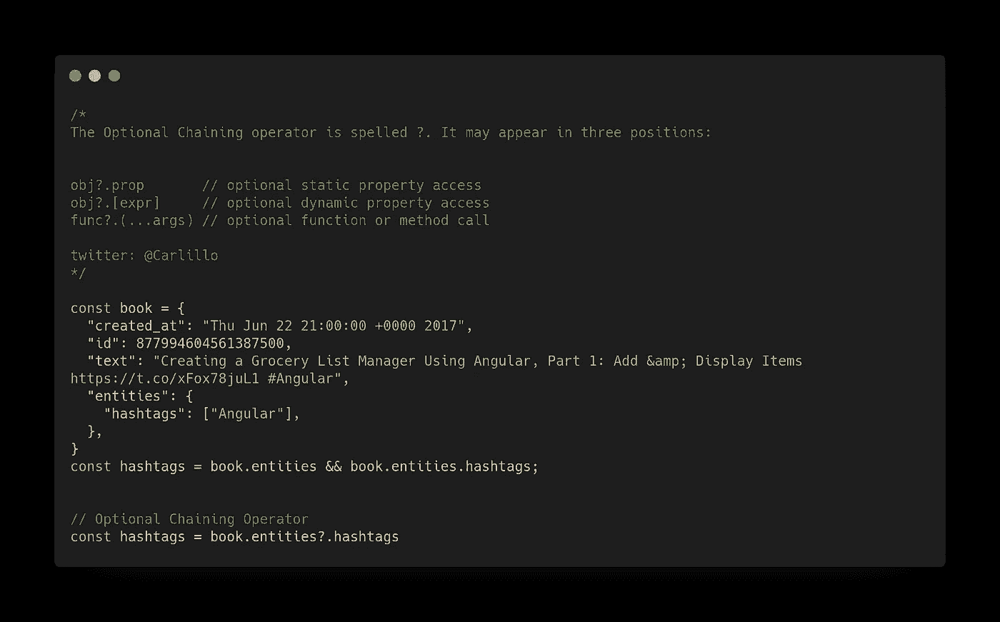
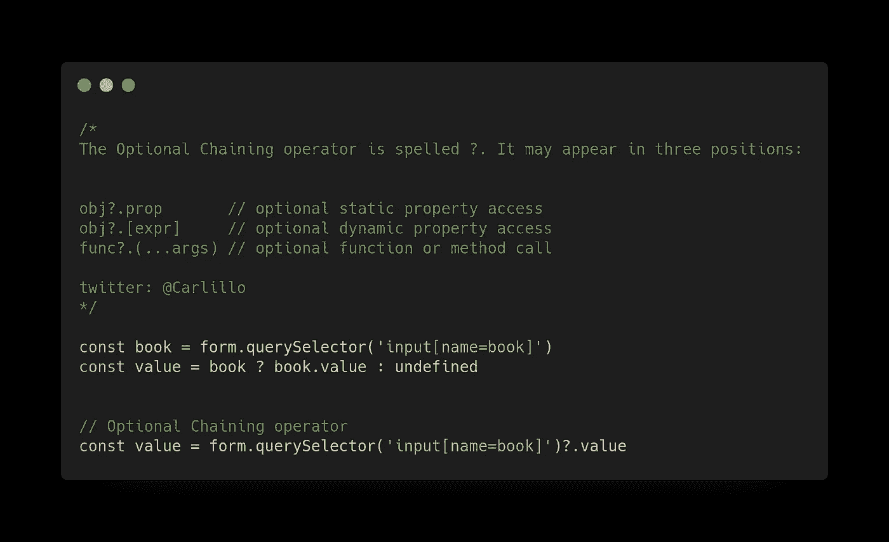
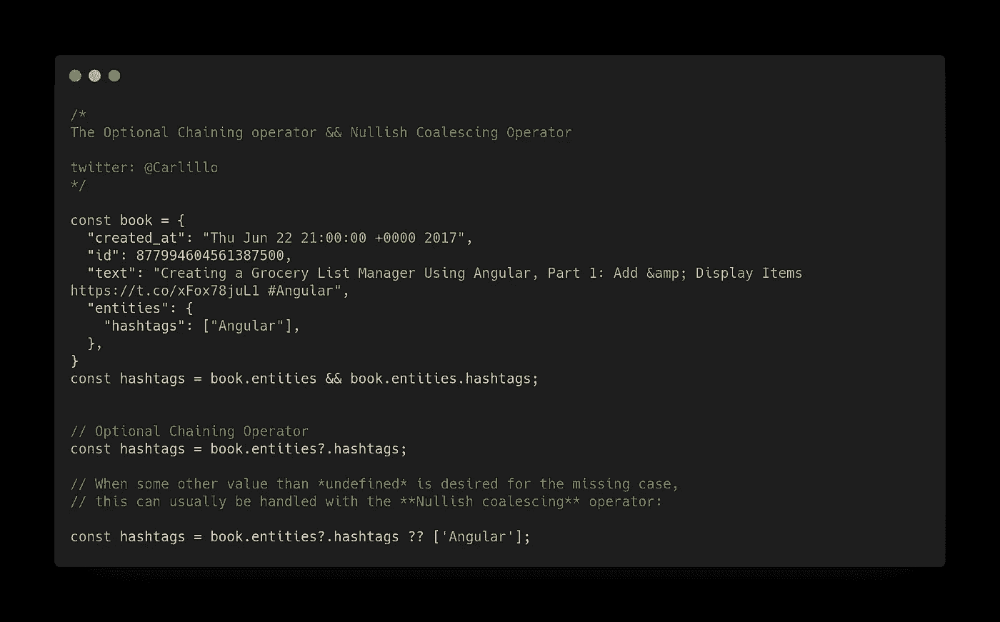

# 带有简单示例的 JavaScript ES2020 特性

> 原文：<https://betterprogramming.pub/javascript-es2020-features-with-simple-examples-d301dbef2c37>

## JavaScript 的最新进展

由[absolute vision](https://unsplash.com/@freegraphictoday?utm_source=unsplash&utm_medium=referral&utm_content=creditCopyText)在 [Unsplash](https://unsplash.com/s/photos/news?utm_source=unsplash&utm_medium=referral&utm_content=creditCopyText) 上拍摄

今天，我们将了解 2015 年的 ECMAScript 特性:

*   ES2015 又名 ES6
*   [ES2016 又名 ES7](https://medium.com/better-programming/javascript-es2016-features-with-examples-a41b7aead589)
*   [ES2017 又名 ES8](https://medium.com/better-programming/javascript-es2017-features-with-examples-877f8406e770)
*   [ES2018 又名 ES9](https://medium.com/better-programming/javascript-es2018-features-with-examples-30fda8ac50fa)
*   [ES2019 又名 ES10](https://medium.com/better-programming/twelve-es10-features-in-twelve-simple-examples-6e8cc109f3d3)
*   [ES2020 又名 ES11](https://medium.com/better-programming/javascript-es2020-features-with-simple-examples-d301dbef2c37)

# 介绍

ES2020 是对应于 2020 年的 ECMAScript 版本。这个版本没有 ES6 (2015)中出现的那么多新功能。但是，已经加入了一些有用的功能。

本文通过简单的代码示例介绍了 ES2020 提供的功能。这样不需要复杂的解释就能快速理解新特性。

当然，有必要对 JavaScript 有一个基本的了解，才能完全理解所介绍的最好的。

ES2020 中新增的 JavaScript 特性有:

➡️string . prototype . match all
➡️import()
➡️bigint
➡️promise . all settled
➡️global this
➡️for-in mechanics
➡️可选链接
➡️无效合并运算符

# String.protype.matchAll

`matchAll()`方法返回所有匹配正则表达式字符串的结果的迭代器，包括捕获组。

# 动态导入

Dynamic `import()`返回对所请求模块的模块名称空间对象的承诺。因此，现在可以使用`async/await`将导入赋值给一个变量。

# BigInt —任意精度的整数

BigInt 是第七种基本类型，它是一个任意精度的整数。变量现在可以代表`253`数字，而不仅仅是`9007199254740992`的最大值。

# 承诺。都解决了

返回用承诺状态快照数组实现的承诺，但仅在所有原始承诺都已完成之后；即要么被满足，要么被拒绝。

如果一个承诺不是悬而未决的，我们就说它是确定的；即它是被满足还是被拒绝。

# 标准化的全局对象

在 ES10 之前，全球没有标准化。
在生产代码中，您可以通过编写这个庞然大物来跨多个平台“标准化”它:

# For-in 力学

ECMA-262 几乎完全没有说明`for (a in b)`的顺序，但是真实的引擎至少在某些情况下是一致的。

历史上试图就 for-in 顺序的完整规范达成一致的努力一再失败。这在一定程度上是因为所有的引擎都有自己独特的实现，这些实现是大量工作的结果，他们并不真的想重新审视。

总之，不同的引擎已经同意在使用`for (a in b)`控制结构时如何迭代属性，从而使行为标准化。

# 零融合算子

当执行属性访问时，如果属性访问的结果为空或未定义，通常希望提供一个默认值。目前，在`JavaScript`中表达这种意图的典型方式是使用`||`操作符。

这对于空值和未定义值的常见情况很有效，但是有许多错误的值可能会产生令人惊讶的结果。

空值合并运算符旨在更好地处理这些情况，并用作对空值(空或未定义)的相等检查。如果`??`运算符左侧的表达式计算结果为 undefined 或 null，则返回其右侧的表达式。

# 可选链接

当在树状结构中查找属性值时，通常需要检查中间节点是否存在。

可选的链接操作符允许开发人员处理许多这样的情况，而无需重复自己和/或在临时变量中分配中间结果。

此外，许多 API 要么返回一个`object`要么返回`null/undefined`，用户可能希望仅在结果不为空时从结果中提取一个属性:

当对于缺失情况需要除*未定义*之外的某个值时，这通常可以用 Nullish 合并运算符来处理:

# 结论

JavaScript 是一种活的语言，这对于 web 开发来说是非常有益的。自 2015 年 ES6 出现以来，我们一直在经历这种语言的蓬勃发展。在本帖中，我们回顾了 ES2020 中出现的功能。

尽管这些特性中的许多对于 web 应用程序的开发来说可能并不重要，但是它们提供了以前可能通过技巧或冗长来实现的可能性。