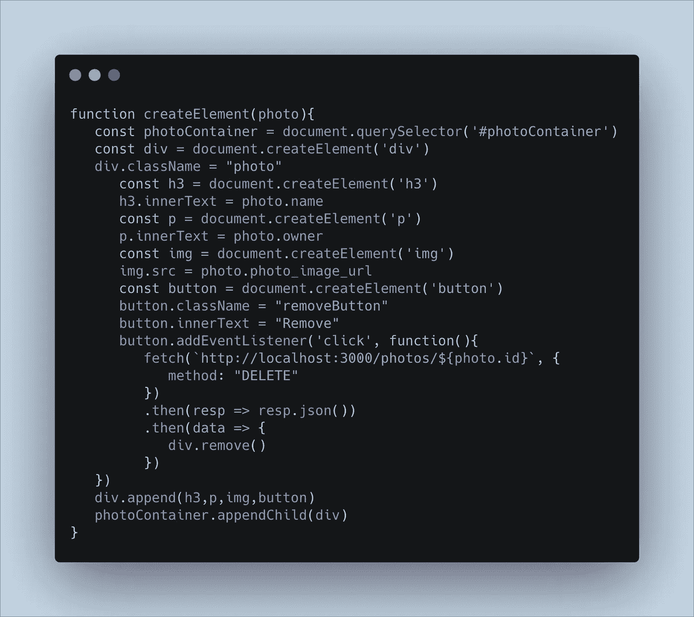
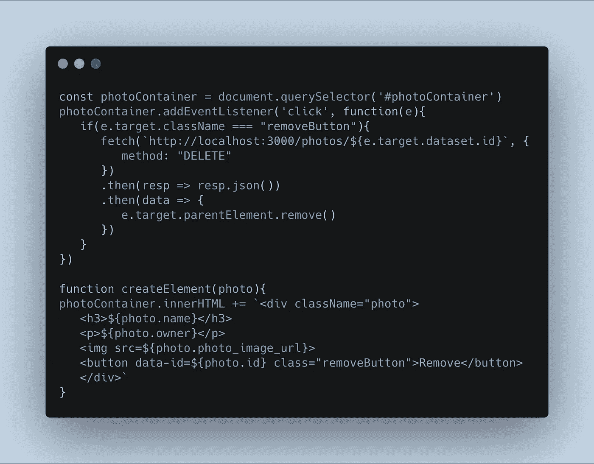

# Javascript 事件监听器:闭包与委托

> 原文：<https://betterprogramming.pub/javascript-event-listeners-closure-vs-delegation-e17552f1f59f>

## 熟练的 JavaScript 开发人员将两者结合起来以最大化效率

照片由 Artem Sapegin (Unsplash)拍摄

新的 JavaScript 开发人员在为文档对象模型(DOM)上的元素附加事件侦听器时经常面临的一个常见问题是决定采用哪种方法。

通常，在页面加载时，进行提取以获得数据数组。从那里，为每个对象生成元素，并添加到 DOM 上的现有元素中。在生成元素的同时，还附加了事件侦听器。但最大的问题是哪种元素？对于 JavaScript 开发人员来说，这就是这个过程开始出现分歧的地方。

通常，添加事件侦听器有两种主要方法:闭包和委托。更熟练的 JavaScript 开发人员能够将两者结合起来以最大化效率。出于本指南的目的，将单独讨论闭包和委托方法。

# 代码应用

这两种方法将用于实现相同的目标。我将引用我创建的存储库作为应用这些方法的例子。请参考:

 [## reireynoso/photo _ uploader _ lab _ js

### 我们有一个上传照片的应用。就是这样。所有照片都存储在 db.json 文件中。你会想…

github.com](https://github.com/reireynoso/photo_uploader_lab_js) 

对于本指南，将不遵循自述文件的要求。具体任务是:

1.  从`db.json`中取出，为每个照片对象生成元素并附加到 DOM 上；
2.  从 DOM 和数据库中删除照片对象。

在`index.html` 文件中，主要焦点是 ID 为`photoContainer`的`
`容器。包含照片信息的现有`
`已经存在。您可以随意删除该元素，因为它的某些功能以后可能不再适用。目标是在`
` `photoContainer`中添加任何新照片。我们开始吧！

在`src/index.js` *，*中已经写好了一些 JavaScript 代码。在注释 `//****Start coding below****//`下面，生成处理页面加载的代码，该代码负责从数据库中获取数据。返回的数据将代表一组照片。遍历照片，并在代码块中调用另一个传入照片对象的函数。对于第一种方法，将涵盖闭包。

用于处理页面加载时提取的函数

# 关闭

首先，什么是*闭包*？简而言之，闭包控制着某个函数中哪些变量是可访问的。根据事件侦听器的定义位置，回调函数可以访问不同的变量。我们来定义一下`createElement`函数。

使用闭包添加事件侦听器

对于 closure，一般的方法是创建每个元素并为这些元素赋值。使用这种方法，在内存中为每个

## 赞成/反对

通过为每个元素生成一个事件侦听器，可以占用更多的内存空间。如果应用程序是小规模的，这可能无关紧要，但是如果它是大规模的，这可能会影响性能。然而，整个过程很容易操作，因为事件监听器可以访问函数范围内的许多变量。

# 委托

什么是*委托*？通过委托，事件监听器被附加到主`
`容器，在本例中是`photoContainer`。每当涉及所述元素的事件发生时，回调函数被调用。然而，该事件可以被指定给`photoContainer`中的一个特定元素。让我们重组一下`createElement`函数。

使用委托来处理事件侦听器

对于授权，有必要做一些改变。首先，创建元素并将其附加到 DOM 的方式利用了。innerHTML 方法。第二，`photoContainer`是在全局背景下定义的。事件侦听器已附加，但带有一个条件。

必须利用事件`(e)`来获取基于所单击元素的信息。因为事件监听器在`createElement`函数之外，所以它不能访问与之关联的照片对象。因此，必须采用利用`e.target`的替代方案。一个数据集现在也包含在<按钮>中，作为传递照片 ID 的一种方式。

事件监听器仅在点击类名为 *removeButton* 的元素时才注册某个动作，在本例中是<按钮>。进行提取以删除与数据集相关联的照片，并且<按钮>的父元素，即< div >卡本身也被从 DOM 中移除。

## 赞成/反对

从语法上讲，生成元素的代码现在减少了，这可能是提高速度的首选方式。因为只有一个事件侦听器，所以内存空间也减少了。代价是从一种方法到另一种方法查找/传输信息可能很棘手。

# 结束语

当开始操作 DOM 时，最好选择一种方法并实践它。最终，人们可以理解它是如何工作的，同时也意识到它可能的局限性。这可能导致探索另一种方法，并最终将两者结合起来，以最大限度地发挥潜力。感谢您的阅读。

**还应归功于 db.json 中使用的照片 URL 的取消标记* *