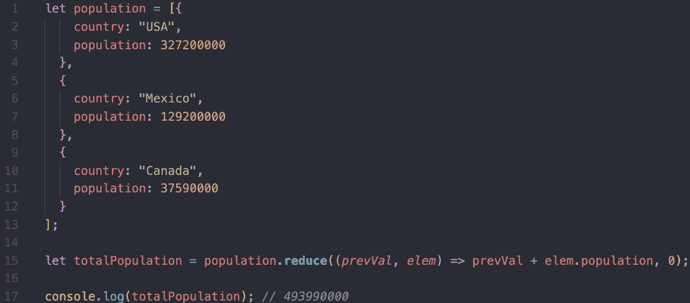
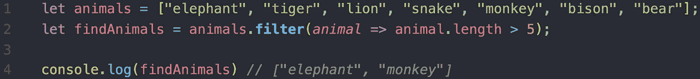
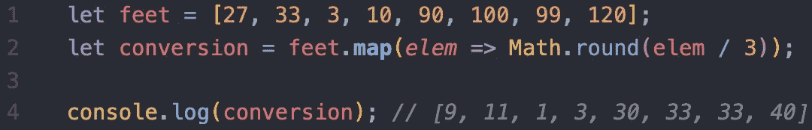
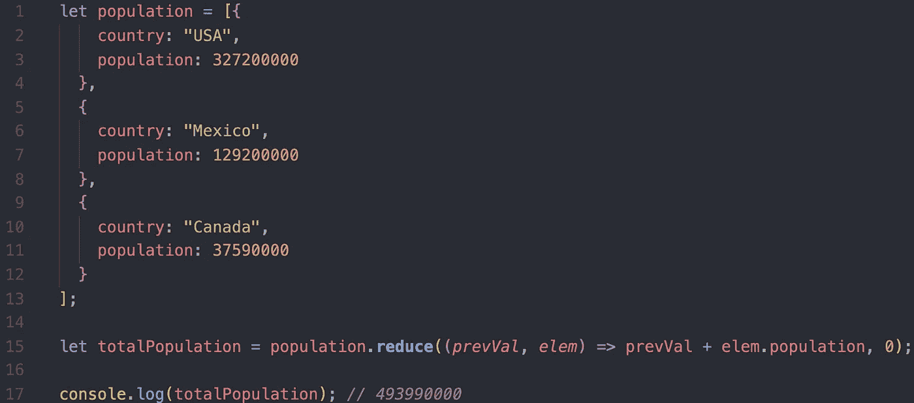

# JavaScript —过滤、映射、简化

> 原文：<https://betterprogramming.pub/javascript-filter-map-reduce-9ab7fbe6f193>

## 函数式编程入门

Filter、map 和 reduce 是可用于操作数组中数据的方法。自从 JS 在 2011 年引入这些方法以来，它们已经成为遍历数组的一些最常用的方法。

在 2011 年之前的几年里，开发人员会使用 For 循环，现在仍然可以使用；然而，这些方法将有助于管理复杂性，并使您的代码更具可读性。

# 过滤器

filter 方法做了您期望它做的事情—它将从数组中过滤出数据。例如，如果您想要查找一种长度超过五个字符的动物:

使用 ES6 箭头函数的过滤方法示例

**注意:**我们将一个箭头函数传入过滤方法。filter 操作符通常会接受参数(当前项、索引和整个数组)。

# 地图

当您希望对数组中的每个项目执行相同的操作时，可以使用 Map。在 map 遍历数组后，它将返回一个包含已转换元素的新数组。

Map 接受一个回调函数，和 filter 一样，它可以接受数组的当前项、当前项的当前索引和整个数组。以下是将英尺转换为码的示例:

使用 ES6 箭头函数的映射方法示例

正如您在与 for 循环比较时所看到的，您不必担心管理状态或您想要的项目的正确索引。

此外，您不必创建一个空数组，然后将所有新值推入该数组。Map 为您返回新数组—您只需将它赋给一个变量(在本例中，变量是 conversion)。

# 减少

“减少”类似于上面显示的贴图和过滤方法。Reduce 将把数组中的多个值减少为单个值。

例如，如果您想计算主要北美国家的人口:

计算三个国家人口的简化方法

reduce 方法的参数与 map 和 filter 稍有不同。第一个参数是结束值的当前值。此外，您必须在函数末尾设置初始值—在本例中为 0。第二个参数是数组中的当前项。第三个参数也是索引。最后一个参数是整个数组。

# 结论

正如您所看到的，当您的代码变得越来越长、越来越复杂时，map、filter 和 reduce 会非常有用。快速提醒:

*   如果您已经有了一个数组，并且想要从该数组中获取某些符合标准的值，例如偶数、长度超过 10 个字符的单词等，请使用 **filter** 。
*   如果您已经有了一个数组，并且希望对数组中的每个元素执行相同的操作，并返回新数组中相同数量的元素，请使用 **map** 。
*   如果你已经有了一个数组，但是你想使用数组中的值来创建新的东西，使用 **reduce** 。

更深入地理解这些方法的最好方法是使用它们——走出去编码！