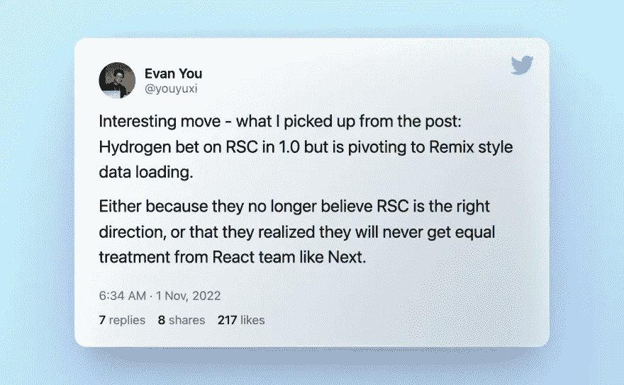
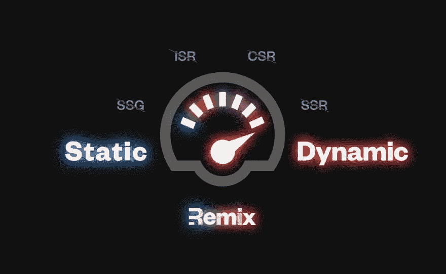

# 2023 年 JavaScript 全栈发展展望

> 原文：<https://betterprogramming.pub/javascript-full-stack-development-outlook-for-2023-dd1b689acd2f>

## 边缘、框架、API 和其他各种东西


年末是忘记我们过去的错误并积极展望未来的好时机。因此，作为一个狂热的 JS/TS 全栈开发爱好者，我决定鼓起勇气，对即将到来的一年做一些预测。它们可能都很有争议，所以希望它们能引发更有意义的讨论，我渴望听到你的意见。

# 边缘部署将成为主流

不管你有没有用过，你一定反复听说过 2022 年的《奔跑在边缘》。web 开发生态系统继续痴迷于优化 TTFB，并且支持在边缘上运行，对于框架构建者来说，这不仅是一件很酷的事情，现在也是必备的:

*   Next.js 将其“实验边缘”API 路由升级到 GA。它的 beta 版“React 服务器组件”支持和新的数据加载模式是完全边缘兼容的。
*   Nuxt.js 3.0 完全重建了其服务器引擎，并完全支持在边缘部署上运行。
*   Remix 正在积极推动 Cloudflare workers 等边缘服务上的部署。
*   SvelteKit 1.0，经过这么长时间的等待，终于登陆了，绝对没有错过 edge 支持。

最简单的意义上，Edge 是 CDN 升级，支持运行自定义代码；以便它不仅可以为客户提供静态资产，还可以为客户提供动态内容。实施边缘计算的挑战是安全、廉价且持续快速地执行代码。

像 CDN 一样，边缘网络应该大规模部署，并在许多租户之间共享。这要求隔离的执行上下文(这样数据就不会在租户之间泄漏)占用很少的内存(这样就可以在不影响性能的情况下频繁地创建和处理上下文)。NodeJS 过于臃肿，不是一个可行的解决方案。更精简的 Javascript 运行时，如 Next.js 的 [edge 运行时](https://nextjs.org/docs/api-reference/edge-runtime)，Cloudflare 的 [workerd](https://blog.cloudflare.com/workerd-open-source-workers-runtime/) ， [Deno deploy](https://deno.com/deploy) ，以及 [bun](https://bun.sh/) ，都是为了完成这个专门的工作而创建的。

今天，大多数 web 应用程序仍然部署在传统的托管环境中。很有可能许多人会尝试部署在 edge 上，有些人最终会选择它。借助对开发人员更友好的框架以及它们与托管提供商的更好集成，您通常可以迁移到边缘，而无需太多代码更改，并立即享受一些好处:

*   在许多情况下，SSR 页面应该立即加载得更快
*   边缘网络可以缓存您的数据，以减少数据存储的负载
*   内容个性化更容易实现，因为决策可以在边缘做出
*   你可能会用更少的成本获得更好的结果

但是优势并不是银弹。其未来最大的灰色地带之一是数据获取。今天的大多数数据库仍然不是全球分布的，这种情况不太可能很快改变。如果规划不当，从边缘网络访问集中部署的数据库会降低性能。查看以下视频，了解测量测试:

这就是为什么 Prisma，甚至积极开发和宣传其面向边缘的[数据代理](https://www.prisma.io/data-platform/proxy)，[坦诚地声称](https://www.prisma.io/blog/database-access-on-the-edge-8F0t1s1BqOJE#do-single-region-databases-and-the-edge-fit-together):

> *作为一个最佳实践，我们仍然建议通常尽可能靠近 API 服务器部署您的数据库，以最小化响应时间的延迟。*

这绝对是你在走向边缘之前应该权衡的事情。正如 Prisma 所暗示的，缓解措施是将您的边缘网络限制在离您的数据库足够近的区域。一些框架，例如 Next.js，已经支持在路由级别配置边缘区域。好吧，如果你已经在使用一个全球分布的数据存储，我没有什么要警告你的，只是送上我的祝贺。

# 关于数据加载模式的未解决的争论

当开发人员还在整理 CSR、SSR、SSG、ISR 等的时候。，Next.js 13 通过将 React 服务器组件作为其新的默认组件(尽管仍处于测试阶段)而成功登陆。

这为未来 web 应用程序的更好性能带来了相当多的兴奋，但无疑使事情变得更加混乱。然而，这个想法很酷:服务器组件呈现在服务器上，它们的代码保留在服务器上。

它可能会显著减少客户端捆绑包的大小，但同时会使网络边界比以前更加模糊。因此，你的应用程序的行为可能更难推理出来。

查看我的另一篇文章，获得对 Next.js 13 的 RSC 的更全面的解释:

[](/fun-with-next-js-13-server-components-fd5f886c31f3) [## 探索 Next.js 13 服务器组件

### Next.js 13 测试版特性的快速概述

better 编程. pub](/fun-with-next-js-13-server-components-fd5f886c31f3) 

关于在全栈 web 应用程序中加载数据的最佳方式，一直存在无休止的争论，而且这种争论还会继续变得更加激烈，因为没有一个最佳解决方案适合所有场景:

*   **您的后端数据读取速度是否很慢？RSC + streaming 提供了一个优秀的解决方案，以细粒度异步呈现和流式传输 UI。**
*   页面交互后，你应该更关心包的大小还是网络流量？
    当组件重新呈现时，RSC 以更多网络流量为代价减小了包的大小，因为它传输 UI(虚拟 DOM)而不是数据。而传统的基于路由器的数据加载，像 Remix 一直在做的，就不存在这样的问题。
*   **您更喜欢数据和组件的严格分离，还是更愿意将它们放在一起？** 这更多的是口味的问题。我们从大多数框架得到的最新建议是“提取”然后“渲染”(以避免渲染-提取瀑布)，但是 Next.js 13(带有 RSC 和内置的[提取去重复](https://beta.nextjs.org/docs/data-fetching/fundamentals#automatic-fetch-request-deduping))提供了一个有趣的机会来执行“渲染时提取”。

同时，不要忘记非反应式生态系统，如 Vue 和 Svelte，根本没有服务器组件的概念，它们的开发者做得很好。另一个有趣的事件是 [Remix 加入 Shopify](https://remix.run/blog/remixing-shopify) 。Shopify 的前端框架 [Hydroden](https://hydrogen.shopify.dev/) 最初押注于 RSC。有效收购 Remix 意味着它正在改变方向，至少目前是这样。这里有一个来自 Vue 的创造者的有趣的评论😄：



[https://twitter.com/youyuxi/status/1587211401453371393](https://twitter.com/youyuxi/status/1587211401453371393)

那么你应该如何在这个混乱的世界中生存呢？我建议根据其他方面来评估自己坚持什么框架。通常，一个现代框架的数据加载机制不会让你失望。他们有不同的偏好和侧重点，但通常对大多数场景都有足够好的解决方案。我喜欢 Remix 用“杠杆”作为比喻的想法。



[https://remix.run/blog/remix-and-the-edge](https://remix.run/blog/remix-and-the-edge)

框架会提供所有的杠杆，但是拉是你的责任。

# API 褪色

当然，我并不是说 API 正在消失。它们是网络的生命线，并且会变得更加重要。然而，在使用 Javascript 框架进行全栈开发的背景下，**显式地**设计和实现 API 的必要性越来越小。他们逐渐消失在框架中。

例如，从技术上讲，Next.js 的`getServerSideProps`和`getStaticProps`是 API，尽管你从来没有从你的客户端代码中显式地调用它们。Remix 中的`loader`和`action`也是如此，SvelteKit 中的`load`功能也是如此。网络通信，无论是时间还是格式，都被很好地封装起来，以至于你几乎意识不到它们是 API。您的客户机和服务器代码自然也共享类型定义(如果您使用 Typescript，是的，您应该这样做)。这些可能会解决您对 SSR、SSG 和部分客户端交互的所有需求。

大多数框架还允许您创建“显式”API 端点来支持更灵活的客户端交互。您最初的直觉可能是，我应该用它来构建 RESTful 或 GraphQL 服务吗？但是让我们再想一想:你的代码已经在 monorepo 中了，客户端和服务器端代码紧密地放在一起，用同一种语言编写。那么，为什么要费心引入一个工具链，并在它们之间建立一个如此严肃的通信规范呢？


API 困境

tRPC 给出了一个不太严谨的解决问题的奇妙方法。它充分利用了您的设置:monorepo、统一框架、公共语言(TS)，并将 API 构造有效地转化为编写方法并调用它们。让 API 以独立于框架的方式逐渐消失是另一种方法。

牺牲是显而易见的:你的 API 现在与你的应用程序(甚至是一个特定的框架)紧密绑定，不容易被第三方使用。但实际上，这通常不是什么大问题。

随着框架的数据加载特性和 tRPC 等大胆想法的推动，在 2023 年，我们应该会看到更多的人对构建 API“不那么认真”感到满意，相反，他们会更加专注于构建自己的产品。

# Web IDE 的流行

工具和框架的进步不仅给了我们解决问题的能力。它们也让我们在工作时有了更快的体验。值得注意的一个特殊领域是基于浏览器的 ide。

多年来，人们一直在使用类似于 [jsfiddle](https://jsfiddle.net/) 的工具进行快速实验，但它仅限于处理客户端的东西。然而，成熟的 web IDEs 将在 2022 年快速成熟。例如， [Codesandbox](https://codesandbox.io/) 现在通过旋转远程容器来运行服务器端工作负载，并为您模拟“本地”体验，从而为 Next 和 Nuxt 等全栈框架提供良好的支持。 [Gitpod](https://www.gitpod.io/) 采用了类似的技术，但在深入开发生命周期方面看起来更加雄心勃勃。
其中最激动人心的是[斯塔克布里兹](https://stackblitz.com/)。它迈出了勇敢的一步，用 Web Assembly 实现了完整的 NodeJS 实现(称为 [WebContainer](https://blog.stackblitz.com/posts/introducing-webcontainers/) )。这样，你的后端代码就可以在你的浏览器中运行了。不需要启动远程容器，也不需要通过网络来回传输数据。这是一个真正的本地环境。这种方法听起来是解决问题并将 Web IDEs 转化为主流应用的唯一可行的方法。

这仍然是一个不成熟的领域，但似乎正在快速发展。因此，我确实相信在 2023 年，有机会进行认真的采用，至少对于像代码审查或临时错误修复这样的任务。

真心感谢大家陪我到年底。对世界上许多地方来说，这又是一个艰难的时期。虽然这个世界充满了你无法控制的愚蠢，但学习、编程和分享想法总是一种极好的安慰。技术的进步，尤其是 OSS 的发展，不同的人联合起来超越他们的个人利益，证明我们仍然是一个充满希望的物种。

祝大家新年快乐，前程似锦。正如亚历山大·仲马所说，人类所有的智慧可以归结为两个词:等待和希望。

新年快乐！

```
Want to Connect?

I'm the creator of [ZenStack](https://zenstack.dev/?utm_campaign=medium&utm_medium=organic&utm_content=fullstack_outlook), a toolkit that supercharges
Prisma ORM with a powerful access control layer and
unleashes its full potential for full-stack development.
Our goal is to let you save time writing boilerplate code
and focus on building what matters - the user experience.
```