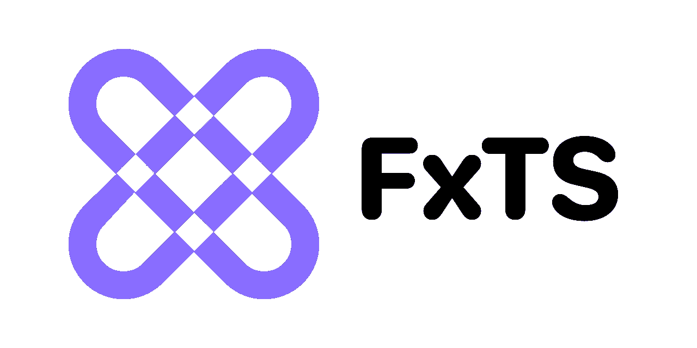
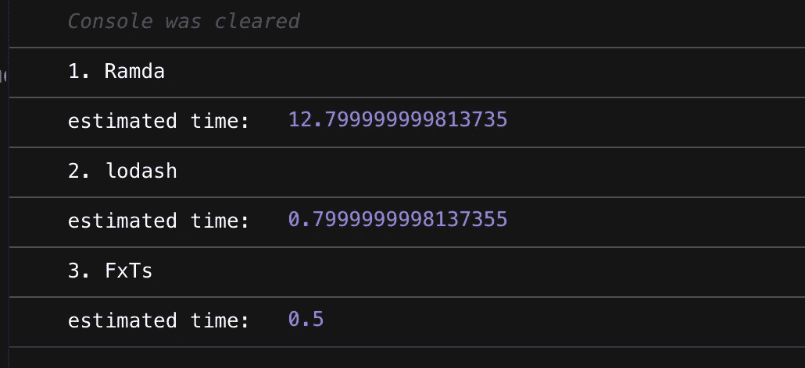
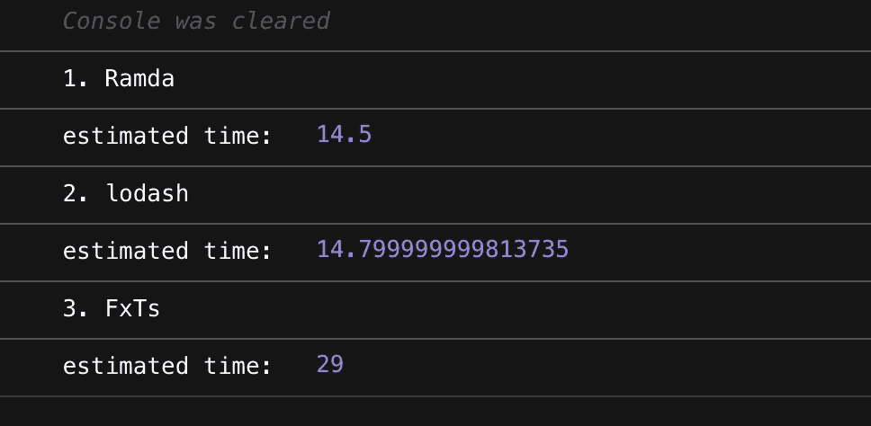
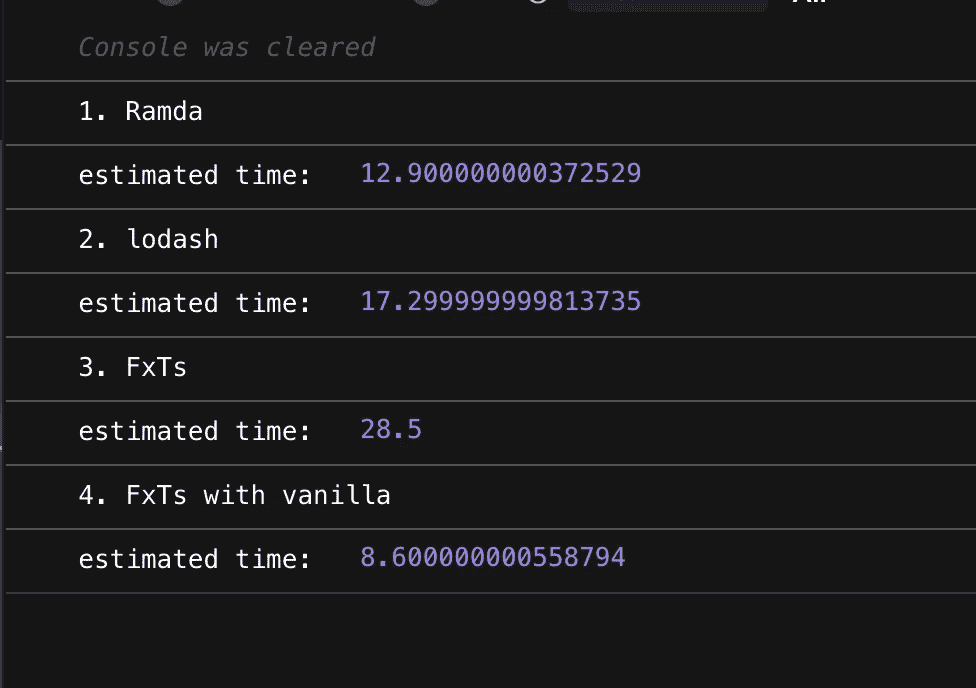
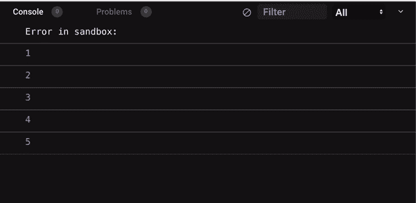

# 相比 Lodash 或 Ramda，我更喜欢 FxTS 的 6 个原因

> 原文：<https://betterprogramming.pub/javascript-functional-programming-with-fxts-a0e615f1c276>

## 用 FxTs 开始函数式编程

# 介绍

今天，作为一个热爱函数式编程的人，我要介绍一个函数库 [FxTs](https://fxts.dev/docs/index/) ，我相信你永远也不会知道。几年前，我偶然发现了一门在线函数式编程课程，作者是 FxJs(FxTs 的前一版本)的创始人“ [Indong Yoo](https://github.com/indongyoo) ”,他在从头创建函数库的同时教授函数式编程。

由于这个机会，我开始理解 FxTs 的目标和原则，并且我被函数式编程的美丽所吸引😍。在那之后，我开始在我的个人 vue2/vue3 项目中积极地使用这个库，这使得我的代码可读性更好，也更容易维护。

出于这个原因，我正在考虑将这个库用于我的一个项目，该项目将很快从 nuxt2 迁移到 nuxt3，因为 vue3 的组合 API 与函数式编程模式非常匹配。

# 等等，什么是函数式编程？

[函数式编程](https://en.wikipedia.org/wiki/Functional_programming)是一种范式，通过组合小函数来创建干净、可读的代码，并且没有副作用。

使用函数式编程，我们可以用可读性和可维护性更强的代码来代替命令式编程方法。例如，假设您要创建一个函数`getMalesAge`,从用户列表中只选择 n 名男性，并获得他们的年龄总和。

这里需要注意的是，循环语句(for，while)、条件语句(if)、控制语句(break)只能由函数编写。我们可以更明确地编写代码，而不是指出 sumAge 或 count 变量是如何变化的。

上面的函数风格例子是用 FxTs 编写的。那些功能如`map`、`filter`、`reduce`、`take`已经像大多数功能库一样被定制了。函数库的用法一般都是相似的，所以一旦你知道了一个，你就可以很快地使用另一个。

有著名的函数库如 lodashFP 和 Ramda，但我强烈推荐“FxTs ”,原因如下。

# 为什么我推荐你 FxTs 而不是 LodashFP，Ramda？

## 1.惰性评估支持

> 试试这个链接: [FxTs vs LodashFP vs Ramda 性能对比](https://codesandbox.io/s/performance-fxts-vs-lodashfp-vs-ramda-sb9jh?file=/src/index.ts)

首先，FxTs 中的所有函数都完美支持 ES6 规范[迭代器协议](https://developer.mozilla.org/en-US/docs/Web/JavaScript/Reference/Iteration_protocols)。换句话说，它将集合的创建延迟到最后，并在最后对其求值。这带来了其他库不具备的性能优势，比如 lodashFP 或者 Ramda。

如果实际测量性能，可以看到 FxTs 明显快于 Ramda，略快于 Lodash。随着阵列大小的增加，这种差异变得更大。

性能测试 Ramda vs lodash vs FxTs

为什么会有这么大的差别？为了考察它，我们在中间插入`tap`函数，了解一下 FxTs 的工作原理。在 Ramda 中也实现了`tap`函数，当您想要检查函数合成过程中值是如何变化的时，就可以使用它。

正如你看到的，FxTs 输出一个迭代器，不像 Ramda 输出一个数组。也就是说，每当执行`map`、`filter`时，Ramda 都会创建一个数组，这也是 Ramda 的性能明显低于 FxTs 的原因。

您可能会注意到，在函数合成的最后一步，FxTs 中有`toArray`。它有助于将迭代器转换成数组。

如果为了调试的目的想在迭代器中检索实际值，可以在 FxTs 的管道中间使用`peek`函数。

然而，需要注意的是:惰性求值并不总是高效的。如果我们去掉上面例子中的`take`，结果正好相反。

这是因为将迭代器转换成数组的`toArray`函数需要花费大量时间。当您需要通过只提取大量数组数据的一部分来执行操作时，惰性求值是很好的。否则，最好使用原生 JS 数组 API。

> 试试这个链接: [FxTs vs LodashFP vs Ramda 性能对比](https://codesandbox.io/s/performance2-fxts-vs-lodashfp-vs-ramda-cuej5?file=/src/index.ts) 2

因此，重要的是要知道在哪个时刻懒惰评估可以实现最大的性能。

如果你想知道更多关于迭代器协议如何与 FP 一起工作的信息，我推荐你阅读[这篇文章](https://medium.com/@woolim/build-our-own-functional-programming-library-from-scratch-with-es6-iterator-protocol-292085f66df2)。

## 2.简单的异步控制

> 试试这个链接:[异步测试 Fxts vs LodashFP vs Ramda](https://codesandbox.io/s/async-fxts-vs-lodashfp-vs-ramda-f2v97)

FxTs 有一个超级方便的方法来处理异步/同步功能。你可以很容易地以函数编程的形式实现`Promise.all`，而且，使用`Concurrency`特性可以控制执行多少函数。

LodashFP 和 Ramda 不支持库本身的异步函数。这是因为在创建库时，它并没有被设计成接收一个 Promise 对象。如果用 lodashFP 或 Ramda 执行下面的代码，那么`Promise`对象会保留在数组中。

带有 Ramda 的异步示例

然而，当通过迭代器从数组中检索值时，FxTs 通过`instanceof`在内部检查它是否是一个`Promise`对象。如果值是一个`Promise`，FxTs 通过`then`检索该值。

带有 FxTs 的异步示例

为此，在使用 FxTs 以外的其他库时，函数必须自己实现，检查`Promise`如下。

与 Ramda 异步示例 2

FxTs 还有一个很酷的功能`Concurrency`。在上面的例子中，像`Promise.all`一样同时执行 5 个异步函数，但是如果你使用`concurrent`函数，你可以控制同时执行多少个异步函数。

## 3.错误处理

> 试试这个链接:[错误处理测试 FxTs vs LodashFP vs Ramda](https://codesandbox.io/s/error-handling-fxts-vs-lodashfp-vs-ramda-m810d?file=/src/index.ts:95-423)

处理好错误直接关系到程序的健壮性。在 FxTs 中，可以使用`try catch`处理所有错误

例如，假设在对象应该存在的数据数组中间有 null。当访问 Ramda 和 lodashFP 中的 null 属性时，相应的错误不会出现在`try catch`中，库本身会崩溃。

## 4.使用方便

如果你有函数式编程的基础知识，了解迭代器协议，就可以用 FxTs 开始函数式编程了。由于它被设计为只实现 JS 中的数据类型，而不单独实现 Functor 或 Monad，因此它不需要对相关的库或函数式编程有很深的理解，因此它非常适合 FP 初学者。

你只需要理解 FxTs 中的 2 个基本概念:`Lazy`和`Strict`。

*   惰性函数使用惰性求值，返回一个迭代器，用在函数合成的开头或中间。
*   严格函数使用立即求值，返回一个值，用在函数合成的末尾。

我们举个例子。

懒惰函数如`map`、`filter`用在函数合成的开头或中间，严格函数用在最后，以产生有意义的值。你可以在这里看到懒惰函数和严格函数的列表[。](https://fxts.dev/docs/index/)

## 5.轻量级选手

FxTs 只包含函数式编程必不可少的函数，因此它适合作为函数式编程的入门。

它大胆地排除了普通 JavaScript 中不存在的单子和函子，并致力于仅使用基本 JavaScript 类型和`Promise`的轻量级函数式编程。它当然支持摇树。

# 6.有前途的开源软件

FxTs 最近在 [awesome-javascript](https://github.com/sorrycc/awesome-javascript) 中注册，并且越来越受欢迎。当然，它现在还没有 LodashFP 或者 Ramda 流行，但是考虑到我到目前为止提到的上述原因，它是值得被广泛使用的。

# 结论

FxTs 是由 [marpple](https://www.marpple.com/en/) dev 团队开发的开源库，得益于开发者 Indong Yoo 的函数式编程讲座，它在韩国的知名度越来越高。

对于通过本文对 FxTs 感兴趣的人，我链接了 Slack 社区作为参考。这仍然是一个新的图书馆，所以如果你想贡献，也许现在是一个机会

# 参考

*   [MDN 迭代器协议](https://developer.mozilla.org/en-US/docs/Web/JavaScript/Reference/Iteration_protocols)
*   [FxTs 官方文档](https://fxts.dev/)
*   [FxTs 英语社区](https://join.slack.com/t/fx-ts-en/shared_invite/zt-z3heqgyc-al69EU_l95xnjeMRfvdoMA)
*   [韩语 FxTs 社区](https://join.slack.com/t/fx-ts/shared_invite/zt-yw1x81zq-pNa8nM40X6mQAsu2L4m1Fw)