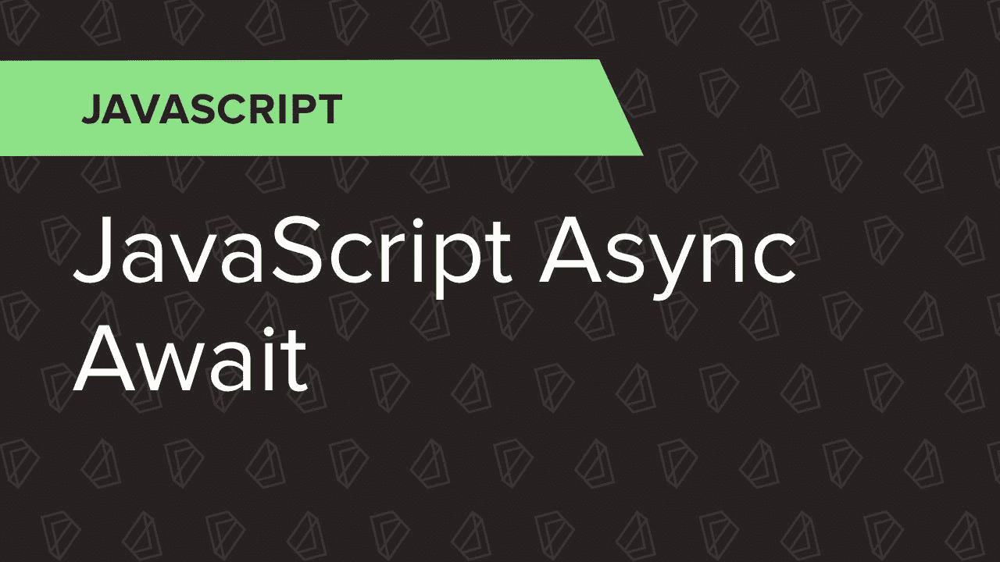
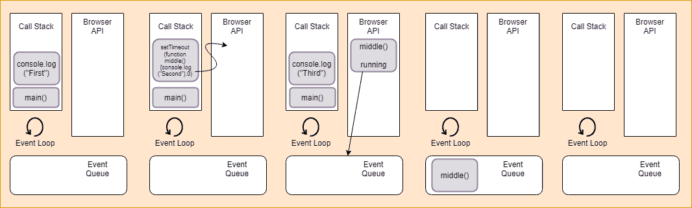
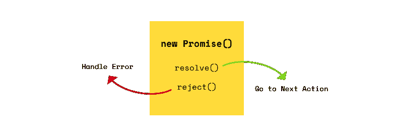
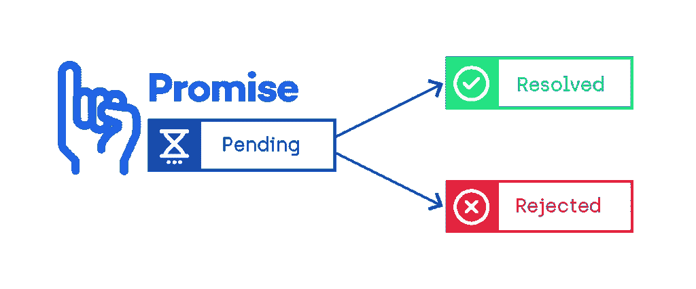

# JavaScript 基础:异步/等待

> 原文：<https://betterprogramming.pub/javascript-fundamentals-async-await-99bf7ad667d1>

## 利用 ES8 中的最佳功能，让您的代码更整洁、可读性更强

`Async-await`可能是 JavaScript 最近最伟大的新增内容之一。它不仅使程序员的工作更容易，还使代码看起来干净流畅。

JavaScript 是一种非常通用的语言，可以执行函数式编程、面向对象编程、服务器端和客户端优化等等。

很多时候，在我们日常的 JavaScript 代码中，我们可能需要在幕后执行许多异步任务。异步任务的实现变得复杂，因为 JavaScript 是一种同步语言。

在这篇文章中，我们将了解 ES8 发布后带来的两个新功能，即`async-await`。

在`async-await`的帮助下，我们现在可以编写看起来完全同步的代码，同时让他们在后台处理异步任务。

# JavaScript 作为一种同步语言

JavaScript 是同步单线程语言。异步行为不是 JavaScript 的直接组成部分。相反，它可以构建在核心 JavaScript 语言本身之上，并且可以通过浏览器 API 访问。

## 什么是事件循环，它是如何工作的？

为了理解事件循环背后的概念，我们首先需要看看调用堆栈是如何工作的。调用堆栈就像程序当前执行的日志。

我们使用调用栈是因为有时即使 JavaScript 引擎也很难跟踪所有的程序执行；它依靠调用栈来提供有价值的信息。

调用堆栈非常类似于具有相同操作的普通堆栈，即 push 和pop **。**一个栈数据结构遵循 LIFO(后进先出)的概念，通过 push ***，*** 我们的意思是把的东西放到栈里。

当一个函数首先执行/调用自身时，JavaScript 引擎会将该函数推入调用堆栈。每个函数调用都将自己按顺序推入调用堆栈。

同样，pop 的意思是从栈中取出某个东西。当位于堆栈最顶端的函数执行完毕时，它会从调用堆栈中移除，因为它遵循 LIFO 属性。

## 调用堆栈如何工作

现在我们知道了调用栈遵循什么属性和概念，让我们看看它实际上是如何工作的。看看这段代码:

在这段代码中，我们在`main()`函数中有三个`console.log()`语句，它只是在终端中记录字符串值。

其中两条语句分别出现在第二行和第六行的顶部和底部。另一个语句介于两者之间，将自己包装在一个`setTimeout` 调用中(使用浏览器 API，我们将在后面讨论),等待时间为零毫秒。

## 事件循环如何工作

*   当程序启动时，它进入主函数。因此，`main()`首先将自己作为一个帧推入调用堆栈。进入主函数后，执行的第一条语句是`console.log(“First”)`。这个语句也被浏览器推入堆栈。执行时，弹出画面并在控制台显示`*“*First*”*`。
*   在执行第一条语句时，下一条语句将其自身推入堆栈(`setTimeout`)。该语句使用浏览器 API 来延迟内部回调函数的执行时间。在将`middle()`函数交给浏览器执行后，这个框架将自己弹出堆栈。这是因为它是一个浏览器 API，它在零毫秒的某个时间执行。
*   在这个执行之后，第三个语句，或者说`console.log(“Third”)`，将自己推到调用栈中执行。这发生在定时器在后台运行以执行`middle()`功能时。一旦浏览器将这个框架推入调用堆栈，它就会执行并在控制台中显示`“Third”`，弹出最后一个框架。
*   `setTimeout` 函数获得零毫秒的延迟，导致浏览器一收到回调就将其添加到事件队列中，因为执行时间已经到期。
*   一旦最后一条语句执行并弹出调用堆栈，`main()`框架也会弹出，从而使其为空。为了让浏览器将事件队列中的任何消息推送到调用堆栈，它必须完全为空。这就是为什么即使延迟为零毫秒，回调仍然需要等待。
*   最后，回调`middle()`中的语句`console.log(“Second”)`将其自身推入调用堆栈并执行，从而将`“Second”`打印到控制台中。

这是 JavaScript 的事件循环:

# 什么是承诺？

JavaScript 中的承诺就像现实生活中的承诺一样。

想象一下，你已经答应一个朋友给他买他最喜欢的书。为了实现这一承诺，您需要:

*   去任何一家你可能找到这本书的书店。
*   买下来，带回去给他

当这一切发生的时候，你的朋友所做的一切都在等着你。

想象一下，如果承诺是别的东西，比如进入你最喜欢的公司，或者买一辆非常贵的车。这些承诺需要更长的时间来实现，因此需要更长的等待时间。

类似地，在 JavaScript 中，承诺是一个在未来某个时候给出一个值的对象。它可能会返回一个成功的输出或者给我们错误的结果，但是它不会中途停止程序的执行。

承诺包含三种状态:

*   感到满足的
*   拒绝
*   悬而未决的

## 承诺是如何运作的

承诺是一个能够从异步函数同步返回自身的对象。

如果你从一个程序(promise)中请求某样东西，它会一直处于等待状态，直到它结束/完成。

一旦条件得到满足，则承诺被解决(T0)，或被拒绝(T1)。承诺一旦兑现，就无法再兑现。

看一下这段代码:

在这段代码中，我们传递一个带有两个参数的承诺，`resolve` 和`reject`。它可以有任何名称，但这个例子有助于我们更好地理解。

在这个例子中，假设承诺被解决——它应该做的工作已经完成——并且我们使用`resolve()`方法传递它。

因为函数已经被解析了，所以它不会抛出任何错误。相反，它将执行 success 函数，在`first .then()`方法中打印消息。

看一下这段代码:

在这个代码片段中，我们做了同样的事情，但是假设我们想要从这个承诺中得到的请求/结果被拒绝/失败了。

在这种情况下，我们传递一个`reject()`方法，由 `.then()`方法再次处理。它自动调用错误函数(因为它属于`reject()`并且是一个错误)，然后显示错误消息。

## 承诺的重要规则

承诺的标准已经由[Promises/A+specification](https://promisesaplus.com/implementations)社区定义。通常，承诺总是遵循一套特定的规则:

*   promise 对象应该总是提供一个`.then()`方法。
*   待定的`promise` 将总是转换回解决或拒绝。
*   一个承诺，不管是解决了还是拒绝了，总是被解决了，不能转换到任何其他状态。
*   一旦承诺达成，它就有了价值。这一价值不能改变。

# 什么是异步等待？

到目前为止，我们一直使用承诺来处理代码中的异步。这很好，但是 ES8 中的新版本`async-await`在允许我们编写超级流畅、看起来同步的代码方面更有帮助。

据 [MDN](https://developer.mozilla.org/en-US/docs/Web/JavaScript/Reference/Statements/async_function) (Mozilla 开发者网):

> *“异步函数是通过事件循环异步运行的函数，使用隐式承诺返回其结果。但是使用异步函数的代码的语法和结构更像是使用标准的同步函数。”*

现在，我们来解开上面这句话的含义。

*   `Async-await`非常容易使用，就像任何其他 JavaScript 函数一样，它也通过我们之前讨论过的事件循环异步运行。
*   它与承诺隐式相关，并使用它来返回结果。
*   语法结构与编写同步函数相同。

## 异步ˌ非同步(asynchronous)

`Async-await`只是承诺的延伸。它使我们能够在不阻塞执行线程的情况下同步编写基于承诺的代码。一个`async` 函数意味着一个承诺值将会返回。

它通过事件循环异步工作。一个`async` 函数总是返回一个值。如果没有得到承诺作为返回，JavaScript 会自动返回一个解析值。

为了理解这一点，让我们看一下这段代码:

运行上面的代码将给出一个带有字符串消息`Hello World`的警告输出。

这意味着默认情况下，已解决的承诺成功返回。如果反过来，`.then()`方法就不会执行。

## 等待

关键字`await` 处理`async-await`块的等待部分。该运算符用于等待承诺。

它在`async` 块中起作用，并等待承诺返回结果。`Await` 仅使`async` 功能块等待，而不是整个程序。

让我们通过查看以下代码来理解这一点:

当我们最后调用`display()`函数时，它会调用包含在`await` 块中的`AwaitExample()`函数。

这意味着在承诺在`AwaitExample()`函数上自我解析之前，`await` 关键字将保持`display()`方法的执行。

它不会停止程序运行，而只会持有`display()`方法。两秒钟或 2000 毫秒后，承诺解决，然后控制台显示。

## 使用 async-await 时要遵循的规则

在我们的代码块中使用 async-await 之前，我们应该注意一些规则。这些规则是使您的功能正常工作所必需的。

让我们快速看一下:

*   我们不能在普通函数中使用`await` 关键字。你必须有一个`async`函数才能在里面使用`await` 。
*   `Async-await`使执行始终按顺序进行。并行执行一定会更快。

`Async-await` 非常强大，但也有一些注意事项。如果我们正确使用它们，它们有助于使我们的代码非常可读和高效。

# 顺序执行与并行执行

## 顺序执行

顾名思义，顺序执行意味着按顺序执行代码。如果我们将其与并行执行相比较，这个过程会慢一点，因为在顺序执行中，一行必须在执行下一行之前完成处理。

让我们借助一个例子来理解这一点。看一下这段代码:

在这个例子中，我们只是返回两个承诺函数。但是当第一个调用自己时，需要两秒钟来执行。与此同时，另一个`await` 功能只是坐在那里。

第一个承诺解决后，下一个`await` 才开始执行。与并行执行相比，这个过程非常耗时。

## 并行执行

处理更快执行的更有效的方法是通过并行执行。

基本上，如果不止一个在场，它不会停止其他`await` 方法的执行。

它并行处理所有的`await` 方法。这种类型的处理使用`promise.all()`方法。让我们借助这个例子来理解这一点:

在这个代码片段中，我们使用了一个叫做`promise.all()`的方法。这个方法的作用是首先解析 iterable 内部的所有承诺，然后返回最终结果。

因此，由于各个函数并行运行，因此与顺序执行相比，执行速度要快得多。

# 异步等待中的错误处理

异步函数的另一个非常好的特性是`async-await`可以同步处理错误，也可以借助 try 和 catch 块。

根据值是被解析还是被拒绝，我们的 try 和 catch 块将显示所需的输出，流程流也将是同步的。

让我们来看一个例子:

在这个例子中，我们观察到，根据由`val` 变量生成的随机值，承诺要么得到`resolved` 要么得到`rejected` 。

如果该值为 1，则它进行解析，稍后在 try 块中处理自身。如果反过来，那么 JavaScript 拒绝这个承诺，并在 catch 块中处理自己，从而给我们一个平滑的执行流程。

这就把我们带到了这篇文章的结尾。我希望你喜欢现在学习`async-await`对 JavaScript 世界的影响。

感谢您的阅读。再见。✌️