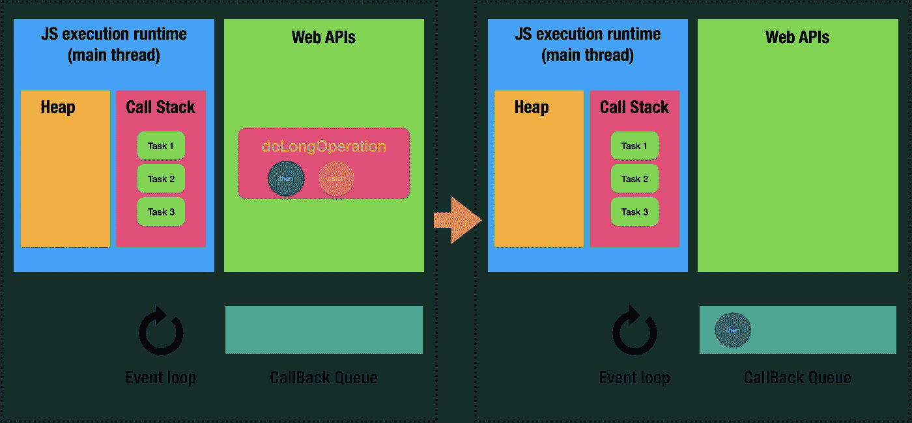
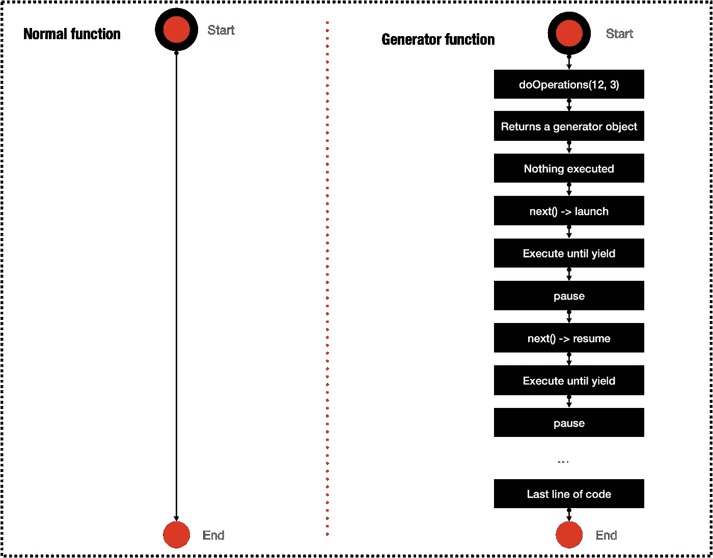
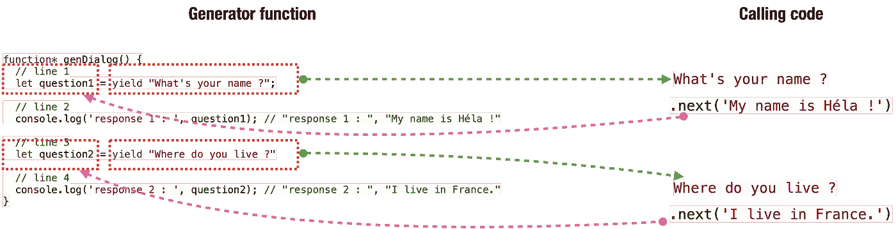

# JavaScript 生成器——实际用例

> 原文：<https://betterprogramming.pub/javascript-generators-practical-use-cases-945d512ef252>

## 什么是发电机？它能有什么帮助？发电机有具体和实际的用例吗？


卡斯帕·卡米尔·鲁宾在 [Unsplash](https://unsplash.com?utm_source=medium&utm_medium=referral) 上拍摄的照片

# JavaScript 中的函数类型

## 运行至完成功能

让我们来看看这个函数:

一旦被调用，这个函数将运行到最后一行:一个不可停止的或运行到完成的函数。执行上下文将在完成后释放。

从运行到完成的功能是关于现在的:我们需要马上得到结果。

如果`operation1`的执行时间很长怎么办？由于 JavaScript 是一个单线程，所有进一步的处理都将被阻塞，直到`operation1`完成它的计算。

我们能做得更好吗？是的，让我们看看。

## 异步函数

考虑下面的函数:

让我们了解一下发生了什么:

*   `async/await`返回一个`Promise`。
*   `doOperations`是一个异步函数。
*   我们现在不等待结果，而是等待未来。
*   我们直接前进到剩余的处理。
*   一旦`doOperations`完成执行，将执行`then`或`catch`块。

异步函数是关于未来的:当结果可用时，我们需要它，而不阻塞主线程的执行。

主线程通过`then`和`catch`信号与异步代码通信。这就好像主线程已经订阅了`doOperations`事件。一旦被通知，主线程将永远不会被挂起，但是`then`或`catch`块将被添加到当前任务列表的底部。



JS 执行运行时(图片由作者提供)

好吧，这不是魔术，这就是 JavaScript 执行异步代码的方式。

神奇的事情发生在这一行:`const operation1 = await doLongOperation(x + y);`。让我们再次看看执行步骤:

```
1\. "Lets resolve the operation"
2\. "Lets continue others staff"
3\. "operation1 : ", 5
4\. "operation2 : ", 3
5\. "operation3 : ", 17
6\. "value : ", 17
```

`operation2`直到`operation1`解决后才执行。这是不寻常的。A `Promise`一般代表未来，但这里是现在(马上解决或拒绝)。

怎么会这样？怎样才能暂停函数执行？挂起只针对异步代码吗？

显然关键字`await`有一些内在的魔力。让我们深入探讨一下。

> "异步函数本质上是生成器上的糖，所以它们属于同一类."— [高性能 ES2015 及以后](https://v8.dev/blog/high-performance-es2015)

什么是发电机？他们有什么特别的？

## 发电机功能

考虑下面的函数:

```
**function*** doOperations() {
  **yield** 2;
  yield 3;
  yield 4;
}doOperations();
```

调用`doOperations()`没有任何作用。为什么？

`doOperations`现在是一个特殊的函数，因为神奇的`*`，它发出特殊的生成器函数类型的信号。

那么，如何执行生成器呢？

为了推动函数执行，我们必须调用`next`:

```
const operations = doOperations();**// "operations : ", [object Generator] { ... }**
console.log('operations : ', operations);/*
"next : ", {
  done: false,
  value: 2
}
*/
**console.log('next : ', operations.next());**/*
"next : ", {
  done: false,
  value: 3
}
*/
**console.log('next : ', operations.next());**/*
"next : ", {
  done: false,
  value: 4
}
*/
**console.log('next : ', operations.next());**/*
"next : ", {
  done: true,
  value: undefined
}
*/
**console.log('next : ', operations.next());**
```

*   第一次调用`doOperations`会给出一个`Generator object`。
*   每次我们调用`next`，我们都会得到一个对象`{ done: true|false, value: number| undefined }`。
*   `next`和`yield`允许作为调试器逐行运行函数。

让我们更深入地探讨一下:

```
function* doOperations() {
  console.log('1');
 ** yield 2;**
  console.log('2');
  **yield 3;**
  console.log('3');
  **yield 4;**
  console.log('4');
}const operations = doOperations();/*
"1"
"next : ", { done: false, value: 2 }
*/
console.log('next : ', operations.next());
```

*   调用第一个`next`，该功能一直执行到遇到`yield`。
*   `yield`暂停功能的执行。
*   要恢复执行，我们必须再次调用`next`。

```
function* doOperations() {
  console.log('1');
  yield 2;
  console.log('2');
  yield 3;
  console.log('3');
  yield 4;
  console.log('4');
}const operations = doOperations();/*
"1"
"next : ", { done: false, value: 2 }
*/
console.log('next : ', operations.next());/*
"2"
"next : ", { done: false, value: 3 }
*/
console.log('next : ', operations.next());
```

生成器函数保持运行-停止-运行的生命周期，直到不再有代码要运行:



生成器函数生命周期(图片由作者提供)

那么最后的`next`返回将是:`{ done: true, value: undefined }`。

简单地说，生成器是可以暂停和恢复的函数。

如果我们想让生成器保存这些值，那么每次调用`next ()`是很繁琐的，对吗？我们怎么做呢？

让我们来看看 MDN 的描述:

> “生成器对象由生成器函数返回，它符合可迭代协议和迭代器协议。”— [MDN 网络文档](https://developer.mozilla.org/en-US/docs/Web/JavaScript/Reference/Global_Objects/Generator)

这意味着生成器可以通过循环和递归(`for-of`循环、扩展操作符等等)产生值序列:

```
function* doOperations() {
  yield 2;
  yield 3;
  yield 4;
}/*
"values : ", [2, 3, 4]
*/
console.log('values : ', [...doOperations()]);const operations = doOperations();/*
"value : ", 2
"value : ", 3
"value : ", 4
*/
for (const val of operations) {
  console.log('value : ', val);
}
```

厉害！这意味着我们可以创建自己的迭代器。

## 从发电机返回

让我们对我们的`doOperations`函数做一个小小的修改:

```
function* doOperations() {
  yield 2;
  yield 3;
  yield 4;
  **return 'end of generator !';**
}
```

这次处决给了我们:

```
console.log('next : ', operations.next());console.log('next : ', operations.next());console.log('next : ', operations.next());console.log('next : ', operations.next());"next : ", {
  done: false,
  value: 2
}"next : ", {
  done: false,
  value: 3
}"next : ", {
  done: false,
  value: 4
}"next : ", {
  done: true,
 ** value: "end of generator !"**
}
```

最后一个值现在是`end of generator !`而不是`undefined`。

返回值`end of generator !`不包含在 iterable 中:

```
// "arrays : ", [2, 3, 4]
console.log('arrays : ',[...doOperations()]);
```

太神奇了！

## 生成器:提前完成(取消执行)

让我们看看这个例子:

```
function* doOperations() {
  yield 2;
  yield 3;
  yield 4;
}const operations = doOperations();/*
"next : ", {
  done: false,
  value: 2
}
*/
console.log('next : ', operations.next());/*
"next : ", {
  done: false,
  value: 3
}
*/
console.log('next : ', operations.next());**/*
"forcedResult : ", {
  done: true,
  value: 12
}
*/
const forcedResult = operations.return(12);
console.log('forcedResult : ', forcedResult);**/*
"next : ", {
 **done: true,
  value: undefined**
}
*/
console.log('next : ', operations.next());/*
"next : ", {
 **done: true,
  value: undefined**
}
*/
console.log('next : ', operations.next());
```

`return(x)`正在强制退货`x`在那个时候被处理。

> "一旦生成器正常或提前完成，它就不再处理任何代码或返回任何值."——[你不知道的 JS: ES6 &超越](https://github.com/getify/You-Dont-Know-JS/blob/1st-ed/es6%20&%20beyond/README.md#you-dont-know-js-es6--beyond)凯尔·辛普森著

## 生成器:引发异常

让我们对我们的`doOperations`函数做一个小小的修改:

```
function* doOperations() {
  yield 2;
  yield 3;
  yield 4;
 ** throw new Error('Problem!');**
}
```

这次处决给了我们:

```
console.log('next : ', operations.next());
console.log('next : ', operations.next());
console.log('next : ', operations.next());
console.log('next : ', operations.next());"next : ", {
  done: false,
  value: 2
}"next : ", {
  done: false,
  value: 3
}"next : ", {
  done: false,
  value: 4
}Uncaught Error: Problem!"
```

这意味着`next()`可以产生三种不同的结果:

*   对于迭代序列中的`yield x`，它返回`{ done: false, value: x}`。
*   对于具有值`return`的迭代序列的结尾`b`，它返回`{ done: true, value:b }`。
*   对于异常，它抛出该异常。

## 生成器:提前中止

让我们看看这个例子:

```
function* doOperations() {
  yield 2;
  yield 3;
  yield 4;
}const operations = doOperations();/*
"next : ", {
  done: false,
  value: 2
}
*/
console.log('next : ', operations.next());/*
"next : ", {
  done: false,
  value: 3
}
*/
console.log('next : ', operations.next());**try {
 operations.throw( "An error was occurred !" );
}catch (error) {
 console.log('Exception: ', error); 
// Exception: An error was occurred!
}**/*
"next : ", {
  **done: true,
  value: undefined**
}
*/
console.log('next : ', operations.next());/*
"next : ", {
  **done: true,
  value: undefined**
}
*/
console.log('next : ', operations.next());
```

## 生成器:双向数据流

让我们看看这个例子:

```
function* genDialog() {
  // line 1
  let question1 = **yield "What's your name ?";** // line 2
  console.log('response 1 : ', question1); 
  // "response 1 : ", "My name is Héla !" // line 3
  let question2 = **yield "Where do you live ?"** // line 4
  console.log('response 2 : ', question2); 
  // "response 2 : ", "I live in France."
}// line 5
let generatorDialog = genDialog();// line 6
console.log(`question 1: ${**generatorDialog.next('Hi !').value**}`);
// "question 1: What's your name ?"// line 7
console.log(`question 2: ${**generatorDialog.next('My name is Héla !').value**}`);
// "question 2: Where do you live ?"// line 8
console.log(**generatorDialog.next("I live in France.")**);
// {done: true, value: undefined}
```

*   第一个`next('Hi')`开始执行。它达到第一个产量。
*   然而，值`Hi`被忽略，因为没有`yield`接收它。
*   发电机保持的电流值为`What's your name ?`。
*   `line 1`被执行，当前保存的值被返回到调用代码`line 6`。
*   第二个`next('My name is Héla!')`将第一个`yield`的结果`'My name is Héla!'`传回给发生器，并继续执行。
*   它到达第二个`yield`，成为发电机调用`line 7`的结果。
*   发电机保持的电流值现在是`Where do you live ?`。
*   第三个`next('I live in France.')`将`'I live in France.'`作为第二个`yield`的结果传递给发生器，并继续执行，直到函数结束，因此`done = true`。

这就像是生成器和调用代码之间的对话。



生成器和调用代码对话框(图片由作者提供)

一个很棒的图案。这让我想起了异步流:

*   启动异步功能。
*   当它完成工作时，它将结果返回给调用函数。

## 发电机组成:产量*

让我们看看这个例子:

```
**function*** generateCharSequence(start, end) {
  for (let i = start; i <= end; i++) yield String.fromCharCode(i);
}**function*** generateAPassword() {
  // 0..9
  **yield*** generateCharSequence(48, 57); // A..Z
  **yield*** generateCharSequence(65, 90); // a..z
  **yield*** generateCharSequence(97, 122);
}let password = '';for (let code of generateAPassword()) {
  password += code;
}console.log('password : ', password);
// "password : ", "0123456789ABCDEFGHIJKLMNOPQRSTUVWXYZabcdefghijklmnopqrstuvwxyz"
```

`yield*`指令将执行委托给另一个生成器。

生成器组合是将流从一个生成器插入到另一个生成器的自然方式。

上面的代码相当于:

```
function* generateAPassword() { // yield* generateCharSequence(48, 57);
  **for (let i = 48; i <= 57; i++) yield i;** // yield* generateCharSequence(65, 90);
  **for (let i = 65; i <= 90; i++) yield i;** // yield* generateCharSequence(97, 122);
  **for (let i = 97; i <= 122; i++) yield i;**}
```

这是一个非常有用的模式，可以保持生成器的小规模和可读性。

这种模式的一个实际应用:

[](https://redux-saga.js.org/docs/advanced/SequencingSagas/) [## 测序传奇|还原传奇

### 您可以使用内置的 yield*运算符以连续的方式编写多个传奇。这允许您对您的…

redux-saga.js.org](https://redux-saga.js.org/docs/advanced/SequencingSagas/) 

让我们看看其他一些更实际的使用案例，在这些案例中，发电机大放异彩。

# 发电机的实际使用案例

## 按需转换阵列(数据流)

让我们看看这段代码:

```
function* transform(iterable, transformFunc) {
    for (const x of iterable) {
        yield transformFunc(x);
    }
}**const transformGen = transform([1, 2, 3], x => x * x);**/*
"transformGen : ", {
  done: false,
  value: 1
}
*/
console.log('transformGen : ', transformGen.next());/*
"transformGen : ", {
  done: false,
  value: 4
}
*/
console.log('transformGen : ', transformGen.next());/*
"transformGen : ", {
  done: false,
  value: 9
}
*/
console.log('transformGen : ', transformGen.next());/*
"transformGen : ", {
  done: true,
  value: undefined
}
*/
console.log('transformGen : ', transformGen.next());
```

我们还可以做:

```
**// "transform the whole array : ", [1, 4, 9]**
console.log('transform the whole array : ', **[...transform([1, 2, 3], x => x * x)]**);
```

魔法。

上面的代码和这个有什么区别？

```
const transform = (array, f) => {
  const arrayCopy = [
    ...array || [],
  ];
  if (arrayCopy && arrayCopy.length && f) {
    for (let i = 0; i < arrayCopy.length; i++) {
      arrayCopy[i] =  f(arrayCopy[i]);
    }
  }
  return arrayCopy;
}
```

使用`transform`的生成器版本，我们可以选择:

*   逐个元素转换并返回:按需转换。
*   使用`for…of`或扩展操作符变换整个数组。

按需转换有什么帮助？

让我们假设我们有这个`json`格式:

```
[{
 "id": 1,
 "name": "Leanne Graham",
 "username": "Bret",
 "email": "[Sincere@april.biz](mailto:Sincere@april.biz)",
 "address": {
  "street": "Kulas Light",
  "suite": "Apt. 556",
  "city": "Gwenborough",
  "zipcode": "92998-3874",
  "geo": {
   "lat": "-37.3159",
   "lng": "81.1496"
  }
 },
 "phone": "1-770-736-8031 x56442",
 "website": "hildegard.org",
 "company": {
  "name": "Romaguera-Crona",
  "catchPhrase": "Multi-layered client-server neural-net",
  "bs": "harness real-time e-markets"
 }
}]
```

然而，对于 UI 显示(list + load more ),我们需要这样的格式:

```
[{
 "id": 1,
 "name": "Leanne Graham",
 "username": "Bret",
 "email": "[Sincere@april.biz](mailto:Sincere@april.biz)",
 **"address": "Kulas Light, Apt. 556, Gwenborough 92998-3874",**
 "phone": "1-770-736-8031 x56442",
 "website": "hildegard.org",
 **"company": "Romaguera-Crona, Multi-layered client-server neural-net, harness real-time e-markets"**
}]
```

`address = street, suite, city, zipcode`。

`company = name, catchPhrase, bs`。

我们有许多解决方案:

*   我们可以在显示之前对整个数组进行变换(普通变换、`for…of`或展开)。
*   我们可以按需转换项目(`next`):每次我们在底部滚动并加载更多的项目。

解决方案二更具性能，尤其是如果 UI 显示使用类似于`load more`或`lazy load`或`pagination`的机制。解决方案一不是高性能的，因为用户可能不会滚动到底部或移动到下一页。

我们可以有自己的`map`:

```
function* transform(iterable, transformFunc) {
    for (const x of iterable) {
        yield transformFunc(x);
    }
}function* map(iterable, mapFunc) {
   ** yield* transform(iterable, mapFunc);**
}**// "map the whole array : ", [2, 4, 6]**
console.log('map the whole array : ', [...map([1, 2, 3], x => x + x)]); **const mapGen = map([1, 2, 3], x => x * x);**/*
**"map only the first element : "**, {
  done: false,
  value: 1
}
*/
console.log('map only the first element : ', mapGen.next());
```

还有我们自己的`filter`:

```
function* filter(iterable, filterFunc) {
    for (const x of iterable) {
        if (filterFunc(x)) {
            yield x;
        }
    }
}// "keep only even : ", [2, 4]
console.log('keep only even : ', [**...filter([1, 2, 4, 3], x => x%2 === 0)]**);const filterGen = filter([1, 2, 4, 3], x => x%2 === 0);/*
**"get the first matched element : "**, {
  done: false,
  value: 2
}
*/
console.log('get the first matched element : ', filterGen.next());
```

按需转换是内存和计算高效的，因为我们只转换我们需要的和按需的(像[流](https://nodejs.dev/learn/nodejs-streams)，一段一段地读取，一个块一个块地读取)。

## 队列(先进先出)

让我们来看看这个神奇的 HTTP 承诺执行者:

以下是这段代码的执行轨迹:

```
**// init generator**
"onTaskSuccess requestId : ", null
"onTaskSuccess requestResponse : ", undefined
"onTaskSuccess responsesStack : ", []**// first promise**
"onTaskSuccess requestId : ", "1"
"onTaskSuccess requestResponse : ", "Albert Einsten"
"onTaskSuccess responsesStack : ", ["Albert Einsten"]**// second promise**
"onTaskSuccess requestId : ", "2"
"onTaskSuccess requestResponse : ", "Nicolas Tesla"
"onTaskSuccess responsesStack : ", ["Albert Einsten", "Nicolas Tesla"]**// third promise**
"onTaskFail requestId : ", "3"
"onTaskFail requestError : ", "taskFn is not a function"**// last promise**
"onTaskSuccess requestId : ", "4"
"onTaskSuccess requestResponse : ", "Marie Curie"
"onTaskSuccess responsesStack : ", ["Albert Einsten", "Nicolas Tesla", "Marie Curie"]
```

你可以看到我们可以得到:

*   请求的 ID
*   对请求的响应(如果成功)
*   请求失败的原因(如果失败)
*   当前持有的响应堆栈

我们也可以取消请求:

```
httpRequestsExecutor.executeTask('1', celebrities => Promise.resolve([...celebrities, 'Albert Einsten']));httpRequestsExecutor.executeTask('2', celebrities => Promise.resolve([...celebrities, 'Nicolas Tesla']));**asyncHttpFifoExecutor.cancel();**httpRequestsExecutor.executeTask('3', null);httpRequestsExecutor.executeTask('4', celebrities => Promise.resolve([...celebrities, 'Marie Curie'])); **// init generator**
"onTaskSuccess requestId : ", null
"onTaskSuccess requestResponse : ", undefined
"onTaskSuccess responsesStack : ", []**// first promise**
"onTaskSuccess requestId : ", "1"
"onTaskSuccess requestResponse : ", "Albert Einsten"
"onTaskSuccess responsesStack : ", ["Albert Einsten"]**// second promise**
"onTaskSuccess requestId : ", "2"
"onTaskSuccess requestResponse : ", "Nicolas Tesla"
"onTaskSuccess responsesStack : ", ["Albert Einsten", "Nicolas Tesla"]
```

其余的任务没有被执行。我们可以取消承诺。

## 设计我们自己的异步/等待

我们可以在不使用 async/await 的情况下实现异步。让我们看看这个例子:

太神奇了。会发生什么？

*   第一个`yield`会回报一个承诺。
*   然后我们尝试解决承诺(第 10 行)。
*   在第 11 行，我们得到了第一个承诺的响应。
*   我们将此响应反馈给`generator`以从线路`yield response.json()`恢复(乒乓)。
*   在第 15 行，我们因为`response.json()`返回一个新的承诺。
*   既然是承诺，我们可以链。
*   在第 17 行，我们得到了最终结果，因为没有其他的`yield`可以运行。

当我们想要执行一步一步的 HTTP 请求，并且想要在任何步骤控制取消-暂停-恢复时，这种模式非常有用。

这就像一个线程 API:

*   我们可以叉一根新线。
*   并控制其生命周期(开始-停止-取消-恢复)。

# 发电机的其他鼓舞人心的例子

## **Redux saga**

[](https://redux-saga.js.org/) [## 一个直观的 Redux 副作用管理器。还原传奇

### 您的 Docusaurus 站点没有正确加载。一个非常常见的原因是错误的 site baseUrl 配置。当前…

redux-saga.js.org](https://redux-saga.js.org/) 

## **状态机**

[](https://egghead.io/lessons/egghead-create-a-state-machine-with-a-generator) [## 创建一个带生成器的状态机

### 由于生成器可以接受初始值并公开下一个可以对初始值进行更新的方法，所以它…

蛋头](https://egghead.io/lessons/egghead-create-a-state-machine-with-a-generator) 

## **可观测量(RxJS 的本地替代)**

[](https://exploringjs.com/es6/ch_generators.html#sec_generators-as-observers) [## 22.发电机

### 22.1.概述 22.1.1。什么是发电机？22.1.2.发电机的种类。用例:实现 iterables…

exploringjs.com](https://exploringjs.com/es6/ch_generators.html#sec_generators-as-observers) [](https://medium.com/javascript-scene/the-hidden-power-of-es6-generators-observable-async-flow-control-cfa4c7f31435) [## ES6 发电机的隐藏能量:可观测的异步流量控制

### 在我用 JavaScript 编写斐波那契生成器时学到的 7 件令人惊讶的事情中，我介绍了 ES6 的一个明显的用例…

medium.com](https://medium.com/javascript-scene/the-hidden-power-of-es6-generators-observable-async-flow-control-cfa4c7f31435) 

## 协同程序(协同多任务处理)

[](https://exploringjs.com/es6/ch_generators.html#sec_generators-as-coroutines) [## 22.发电机

### 22.1.概述 22.1.1。什么是发电机？22.1.2.发电机的种类。用例:实现 iterables…

exploringjs.com](https://exploringjs.com/es6/ch_generators.html#sec_generators-as-coroutines) 

# 结论

在本文中，我们一起看到了一种新类型的 JavaScript 函数:生成器。

生成器的价值在于一步一步执行函数的可能性，不像运行到完成的函数。

多亏了`yield`和`next`，我们可以启动-暂停-恢复一个功能。例如，使用这个模式，我们可以控制一个承诺的执行流程。

生成器函数可以提前完成(提前返回以取消执行)或提前中止(例如通过抛出异常)。

一个生成器可以作为一个强大的迭代器运行:一个流一个块地或者按需一个一个地完成计算。当我们应该做一个`lazy loading`或`load more`或`pagination`时，这个技巧是很有用的。

惰性求值机制将表达式的求值延迟到需要它的值时。价值是按照我们的要求计算的。

惰性计算对内存使用有直接影响。仅生成和计算所需的值。对于从运行到完成的函数，我们必须预先生成所有的值，并保留它们以备将来使用。

生成器的另一个好处是一次性访问。一旦所有的值都用完了，我们就不能再迭代了。为了再次生成值，我们应该实例化一个新的生成器对象。

此外，生成器对象不允许随机访问(对于数组也是如此)，因为值是逐个生成的。这有助于形成一个队列(FIFO:先进先出)。

最后，当我们想从头开始编写一个像 async/await 这样的 API 或者一个线程 API(协程、协作多任务、fork、cancel、suspend、resume 等等)时，生成器非常有用。

感谢您阅读我的文章。

你可以在 GitHub 找到我:[https://github.com/helabenkhalfallah](https://github.com/helabenkhalfallah)