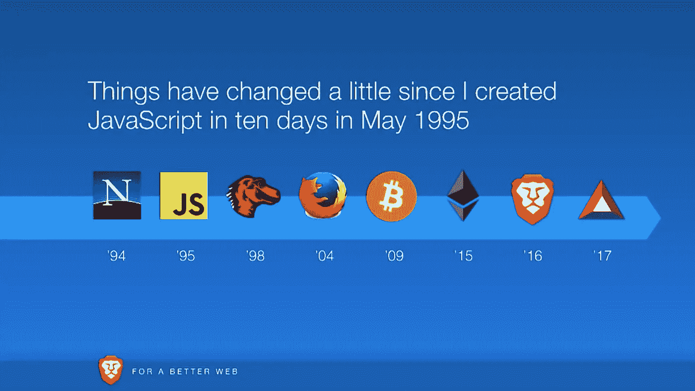

# JavaScript 的 25 年

> 原文：<https://betterprogramming.pub/javascript-history-and-future-71b0ceb737aa>

## [网页开发](https://rakiabensassi.medium.com/list/software-engineering-7a179a23ebfd)

## 从简单的脚本语言到每个现代 web 应用程序的基础

来自 Brendan Eich 的《[JavaScript 简史](https://www.youtube.com/watch?v=GxouWy-ZE80)

2020 年标志着 JavaScript 诞生 25 周年。在这种情况下，让我们回顾一下塑造语言历史的一些主要里程碑，并展望一下它在未来将如何发展。

# 1995 年 5 月:诞生

1995 年 12 月 4 日，Netscape 与 Sun Microsystems 合作，宣布了一种称为 JavaScript 的新编程语言，它是一种开放的、独立于平台的语言，专门用于互联网。从一开始，我们的主要目标之一就是创造一种简单但功能强大的语言。

为此，Netscape 正在寻找一个人，他可以提供具有类似 C 语言语法的 Lisp 方言方案，并将其集成到内部的 web 浏览器导航器中。布伦丹·艾希在 1995 年 2 月才加入网景公司，他承担了这项任务。1995 年 5 月，他只用了 10 天时间就为网景浏览器写了一个原型，在那段时间里，他几乎没有睡觉。

该语言最初被称为 Moca，后来被称为 LiveScript，最后被重命名为 JavaScript(作为 Java 的伴侣语言)。

# 1997 年 6 月， ECMAscript 1

网景公司在早期阶段就已经将 JavaScript 提交给 ECMA 进行标准化。1997 年 6 月，语言规范 ECMAScript 出现了。

# 1999 年 12 月:ECMAscript 3

1999 年 12 月，发布了该语言的第三版，增加了如下功能:

*   正则表达式
*   更好的字符串处理
*   新控制语句
*   try/catch 异常处理
*   更严格的错误定义
*   数字输出的格式

第四个版本一直没有出现，因为不同的浏览器制造商不能就一个共同标准达成一致。ECMAScript 3 在很长一段时间内都是当前的状态。

# 2001 年 4 月:JSON

> 道格拉斯·克洛克福特指定了 JSON (JavaScript 对象符号)，这是一种基于 JavaScript 子集的轻量级数据交换格式。JSON 数据在前端更容易加载和处理，到 2020 年，它将取代 XML 成为网络上的数据交换格式。”—[js25.org](https://js25.org/)

# 2009 年 3 月:服务器上的 JavaScript

值得注意的是，JavaScript 从一开始就不仅仅是为客户端设计的语言，也是为服务器设计的语言。Netscape 的新闻稿已经提到，JavaScript 可以用来访问服务器端的数据库，并动态地呈现网站。虽然在客户端上很快取得了成功，但它最初并没有出现在服务器上。

这只是随着 Ryan Dahl 开发并于 2009 年发布的 [Node.js](https://nodejs.org/) 项目而改变，该项目是 JavaScript 的服务器端运行时环境，后来成为开发可扩展的复杂 web 和云应用程序的最重要平台之一。

# 2009-2015 年:ECMAscript 5 和 6

在 2009 年 12 月和 2011 年 6 月，随着版本 5 和 5.1 的发布，我们看到 JavaScript 有了轻微的改进。大受欢迎的版本计划在代号为“和谐”的第 6 版中推出，然后逐年推迟。该版本最终在 2015 年夏天以 [ECMAScript 2015](http://www.ecma-international.org/ecma-262/6.0/) 的名字出现。

# 2016–2020:异步编程

在计划遵循年度出版周期后，ECMAScript 已经出现了 2016、2017、2018、2019 和 2020 版本。这一时期最大的变化是引入了两个关键字`async`和`await`，这大大简化了异步编程。

虽然 JavaScript 世界的高速确保了充满活力的社区不断地建设性地和创造性地发展，但长期的可靠性受到了损害。这带来了新的挑战，尤其是在企业环境中。

# 【2020 年 5 月:德诺

> Deno 是 JavaScript 和 TypeScript 的运行时，它基于 V8 JavaScript 引擎和 Rust 编程语言。它是由 Node.js 的原创者 Ryan Dahl 创作的，是他在 JSConf EU 2018 上发表的演讲《Node.js 让我后悔的 10 件事》中宣布的。Deno 在一个可执行文件中明确地扮演运行时和包管理器的角色，而不需要一个单独的包管理程序。—[js25.org](https://js25.org/)

# 企业中的 JavaScript

JavaScript 已经征服了企业界。这是因为在过去的 10 年中，语言和生态系统的巨大专业化，也是因为打字稿。这种语言增加了一个静态类型系统，它有很大的帮助和安全性，特别是在大型复杂的项目中。

我们最近看到的 JavaScript 的一个值得注意的发展是脸书引入的 JSX 扩展。它用一种 XML 数据类型来补充这种语言，利用这种数据类型，HTML 可以原生嵌入到 JavaScript 中。 [TypeScript 4.1](https://medium.com/better-programming/typescript-new-release-19f1238c6a68) 现在通过两个新的编译器选项支持`jsx`和`jsxs`工厂函数。

# 光明的未来

jQuery 和 Node.js 等项目在展示 JavaScript 在客户端和服务器端的能力方面发挥了重要作用。随着 WebAssembly 成为与其他语言互操作的有希望的标准，JavaScript 现在比以往任何时候都更是现代应用程序开发的优秀基础。它已经证明了自己，并保持了其最初的目标，即以优雅的方式将简单性和功能结合起来。毫无疑问，未来仍将如此。

25 岁生日快乐，JavaScript，你已经走出婴儿期了！

你对世界上最流行的编程语言有什么体验？你第一次使用它是什么时候？请随意与它分享您的经验。

🧠💡我为一群聪明、好奇的人写关于工程、技术和领导力的文章。 [**加入我的免费电子邮件简讯独家访问**](https://rakiabensassi.substack.com/) 或在此注册媒体。

*你可以在 Udemy 上查看我的* ***视频课程****:*[*如何识别、诊断、修复 Web Apps 中的内存泄漏*](https://www.udemy.com/course/identify-and-fix-javascript-memory-leaks/) *。*