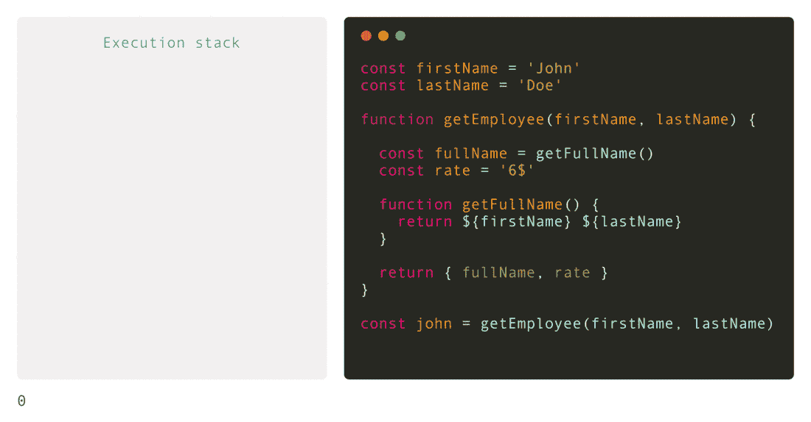
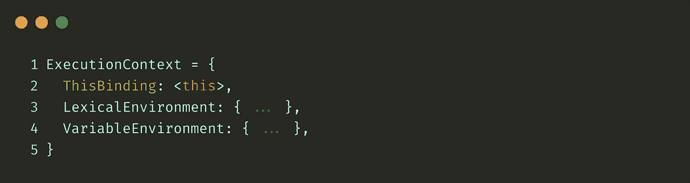
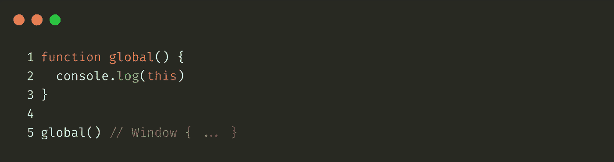
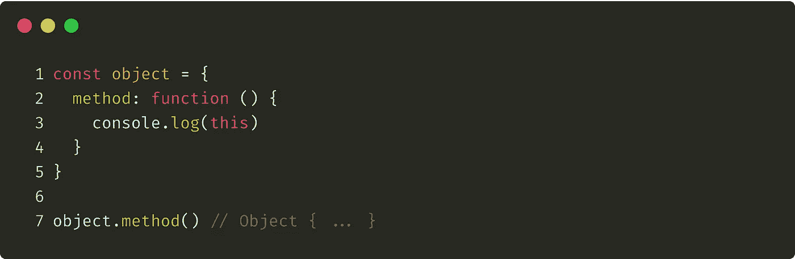
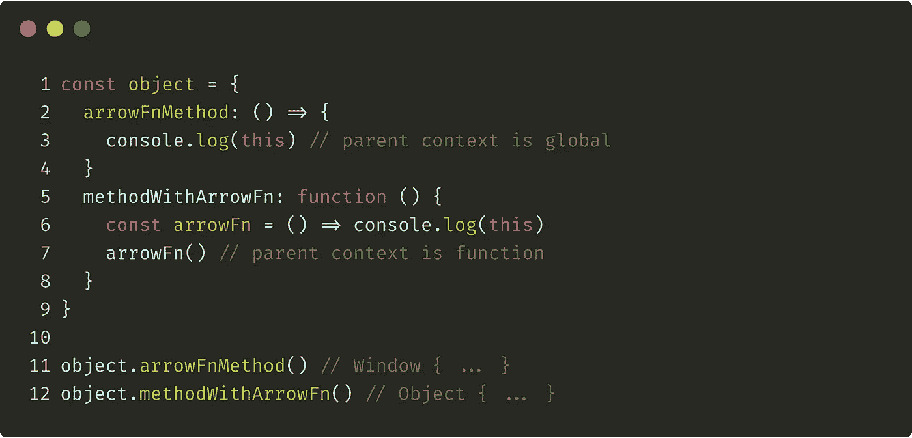
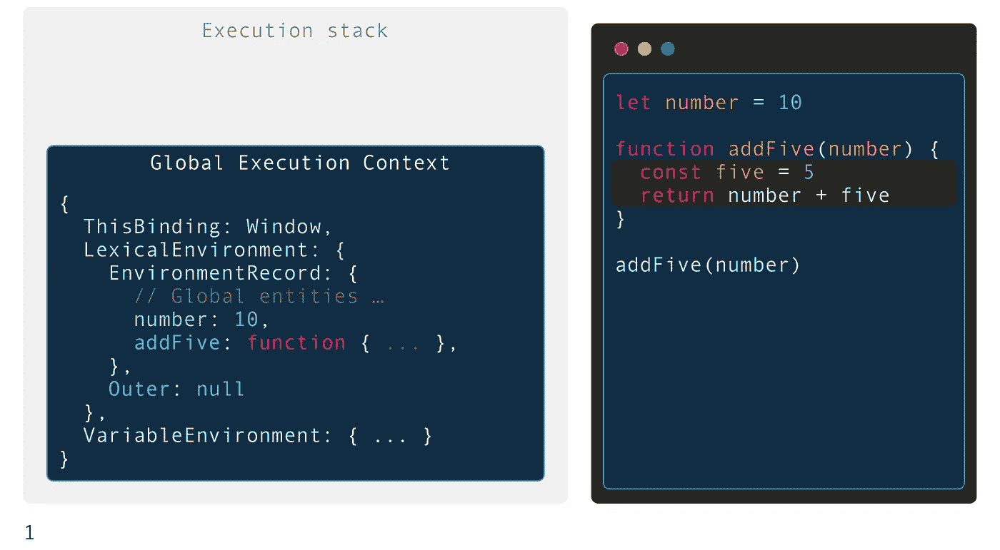
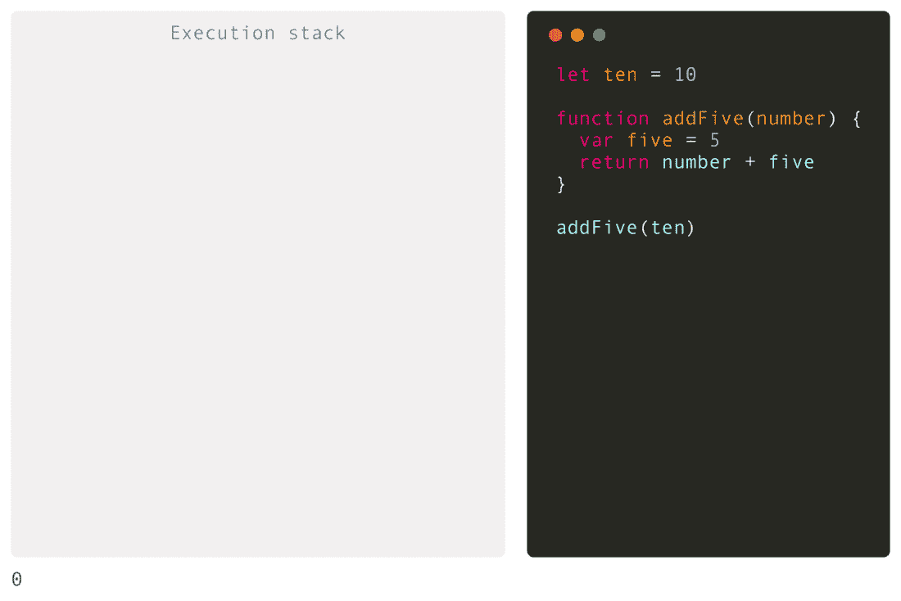
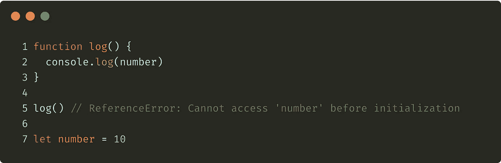
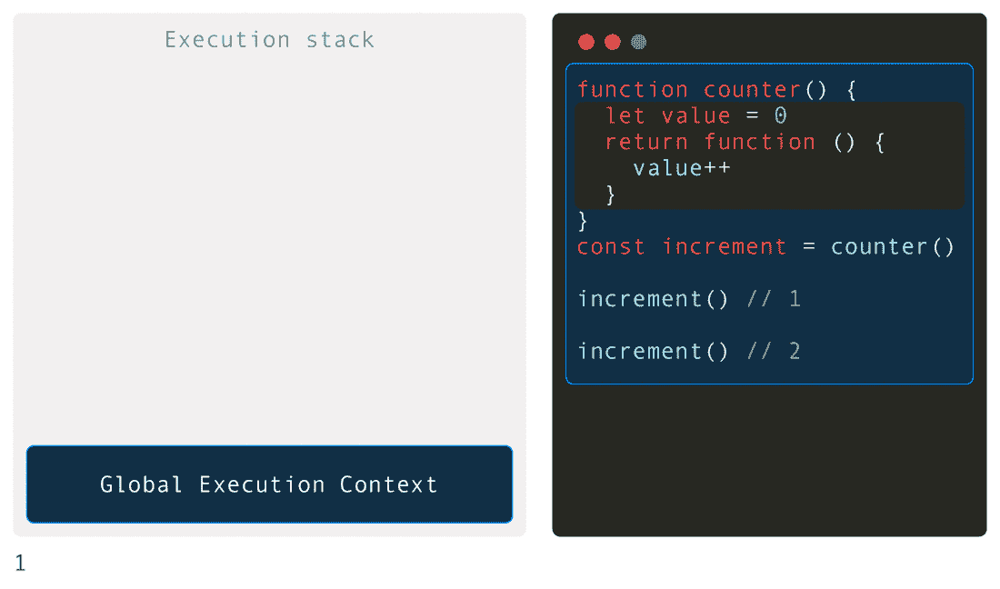

# JavaScript 内部:执行上下文

> 原文：<https://betterprogramming.pub/javascript-internals-execution-context-bdeee6986b3b>

## 调用堆栈中存储了什么

伊瓦·拉乔维奇在 [Unsplash](https://unsplash.com?utm_source=medium&utm_medium=referral) 上的照片

# 介绍

在这篇文章中，我们将看看 JavaScript 最重要和最基本的部分之一，执行上下文。我们将定义一个上下文的结构，它的生命周期，以及执行栈(调用栈)是如何形成的。
之后，我们将处理提升、范围和闭包等臭名昭著的概念。

# 执行上下文

ECMAScript 代码有三种类型:全局代码、函数代码和 eval 代码(本文不涉及)。每个代码都在其自己的执行上下文 *t* 中进行评估。

执行上下文是一个描述代码执行环境的概念。简单地说，它只是一组由 [JavaScript 引擎在运行时](https://medium.com/better-programming/javascript-internals-under-the-hood-of-a-browser-f357378cc922)创建和使用的对象。

在 JavaScript 引擎开始执行脚本文件之前，会创建全局执行上下文。不属于函数体的每一行代码都是全局代码。这样的代码在全局上下文中执行，每个程序只能有一个全局上下文。

在全局代码的执行期间，JavaScript 引擎可以到达函数调用指令。当发生这种情况时，创建函数执行上下文并执行函数代码。

因此，可以说一个执行上下文可以创建另一个执行上下文，即一个函数调用另一个函数(或者全局上下文调用一个函数)，等等。这些创建的上下文一起形成了执行堆栈。

# 执行堆栈

执行堆栈也称为调用堆栈，是一种后进先出(LIFO)的数据结构。它由 JavaScript 引擎创建和管理，用于在运行时存储执行上下文。

创建(*调用*)另一个上下文的上下文称为*调用方*。正在创建的上下文被称为*被调用者*。

当调用方创建被调用方时，调用方暂停其执行，并将控制流传递给被调用方。被调用方被推送到堆栈上，并成为一个正在运行的(活动的)执行上下文。在被调用方的代码被完全执行后，它将控制权返回给调用方，调用方的上下文评估继续进行(它可能会激活其他上下文)直到结束，依此类推。

执行堆栈

在上面的例子中，全局执行上下文被创建并放到堆栈上。然后在每次函数调用时，函数执行上下文被创建并放到堆栈上。在函数完全执行后，它的上下文将从堆栈中移除。

JavaScript 是一种单线程语言。引擎总是执行位于执行堆栈顶部的函数。

现在我们知道在 JavaScript 中有两种主要的执行上下文类型——全局和函数。它们由 JavaScript 引擎创建，并存储在执行堆栈(调用堆栈)中。他们的目标是描述代码执行的环境。

你可能想知道*环境*到底是什么意思。

# 执行上下文结构

首先，我们需要定义执行上下文的结构。它可以表示为具有三个属性的对象:

执行上下文结构

让我们弄清楚每个属性的含义，然后讨论上下文创建和执行步骤。

## 这个绑定

在全局执行上下文中，`this`保存对全局对象的引用。在浏览器中，它是一个`window`对象。

`ThisBinding`在全球执行背景下

在函数执行上下文中，`this`的值取决于如何调用函数。如果它作为一个对象的方法被调用，`this`的值被设置为该对象。否则，`this`的值被设置为全局对象或`undefined`(在严格模式下)。

函数执行上下文中的 ThisBinding

使用箭头函数时，`this`完全不绑定。它只是从父执行上下文(被调用方)继承而来。

箭头函数中的这种绑定

## 词汇环境

词汇环境由两个条目组成:

*   环境记录——一种将标识符映射到其相关词汇环境范围内的值的结构。此类记录存储用`let`或`const`关键字声明的标识符的值。
*   外部引用—保存对父词法环境的引用。这意味着 JavaScript 引擎可以在外部环境中寻找变量，如果在当前的词法环境中找不到的话。

在全局执行上下文中，`outer` 引用被设置为`null`。在环境记录中，嵌入的语言实体(如对象、数组等)以及您定义的全局变量都是可用的。

全局执行上下文(词汇环境)

在函数执行上下文中，`outer`引用被设置为父词法环境。它可以是全局上下文，也可以是函数上下文，这取决于调用函数的位置。用户在函数中声明的变量存储在它的环境记录和类似于`arguments`数组的对象中。

函数执行上下文(词汇环境)

## 可变环境

ECMA-262 规格 [sais](http://www.ecma-international.org/ecma-262/10.0/index.html#sec-execution-contexts) :

> 执行上下文的词汇环境和变量环境组件始终是词汇环境。Variable Environment 标识词法环境，其 EnvironmentRecord 保存由 VariableStatements 在此执行上下文中创建的绑定。

换句话说，变量环境在其执行上下文中存储用`var`关键字声明的标识符-值映射。

# 上下文创建和执行

在 JavaScript 中，每个执行上下文有两个独立的阶段:创建阶段和执行阶段。

在创建阶段，`window`和`this`被创建(如果我们在全局上下文中)，环境记录中的变量声明被赋予默认值`undefined`(或`uninitialized`)，每个函数声明都被完全放入内存中。

一旦我们进入执行阶段，JavaScript 引擎就开始逐行执行代码，并将实际值赋给已经存在于内存中的变量。

执行上下文阶段

在创建阶段，用`let`和`const`关键字声明的变量被赋予默认值`uninzialized`。这就是为什么，当你试图访问这样的变量时，你会得到`ReferenceError`。

参考误差

# 范围、提升和关闭

知道了上下文的结构及其生命周期，我们就可以很容易地理解提升、范围和闭包的含义。

**提升**就是在创建阶段给变量声明赋一个默认值，并将函数声明放入内存的过程。在你的代码中实际上什么也没有移动。

**闭包**是从堆栈中移除函数的执行上下文后，将函数的词法环境保存在内存中的一种方式。闭包让您可以从内部函数访问外部函数的词法环境。只需在另一个函数中定义一个函数，然后返回它或传递给另一个函数。

JavaScript 闭包

范围只是谈论词汇环境的另一种方式。它就像一个边界，定义了在当前执行上下文中可以访问哪些变量。

# 结论

现在，您应该对 JavaScript 引擎执行代码时发生的事情、执行上下文和执行堆栈中存储的数据、变量和函数的提升方式以及它们的值是如何确定的有了更好的理解。

写 JavaScript 代码不需要这么深入的知识。但是它有助于理解像提升和闭包这样的概念，这些概念在开发中是常用的。

请点击拍手👏，如果上面的文章对你有帮助。

# 参考

http://www.ecma-international.org/ecma-262/10.0/index.html

 [## JavaScript。核心。

### 阅读这篇文章:日语，德语，俄语，法语，波兰语。注意:本文的第二版现已推出…

dmitrysoshnikov.com](http://dmitrysoshnikov.com/ecmascript/javascript-the-core/)  [## выполнения，вызовов

### вы - JavaScript-разработчик、стать、это значит、что、нужно разбираться

habr.com](https://habr.com/ru/company/ruvds/blog/422089/)