# JavaScript 内部:原型继承

> 原文：<https://betterprogramming.pub/javascript-internals-prototypal-inheritance-14b009dd89c8>

## 用构造函数和对象实现继承

[布莱森锤](https://unsplash.com/@trhammerhead?utm_source=medium&utm_medium=referral)在 [Unsplash](https://unsplash.com?utm_source=medium&utm_medium=referral) 上拍照

# 介绍

在这篇文章中，我们将讨论 JavaScript 的一个令人困惑的部分——原型继承。因为 JavaScript 是一种非常灵活的语言，所以有很多方法可以创建对象以及实现继承。使用新的 ES2015 `Class`语法，事情变得不那么明显了。

我将关注对象如何继承数据和行为，以及如何在没有`class`关键字的情况下实现继承。

# 什么是继承？

继承是面向对象编程的核心概念之一，它定义了一种在对象之间共享功能的机制。继承使我们的代码可重用。

在基于类的语言中，如 Java 或 C++，如果你想创建一个对象，你必须定义它的类。例如，`Car`类是一个抽象，它代表汽车的集合。

一个实例，特定的对象，是一个类的成员。在我们的例子中，它可能是一个`BMW`。您可以通过创建子类来扩展一个类。例如，`Sedan`可以表示从`Car`类继承方法和属性的更具体的汽车。

JavaScript 不是基于类的语言。即使 ES6 引入了类，这样的语法也没有为 JavaScript 引入新的面向对象的继承模型。尽管如此，继承是基于*原型*。

# 什么是原型？

原型是包含特定状态和行为的对象。它可以与其他对象链接以扩展它们的功能。

首先，让我们从调查一个普通的 JavaScript 对象开始。通常，我们使用对象文字语法创建它。

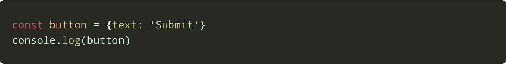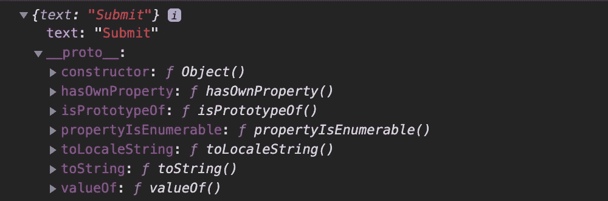

对象的[[原型]]

JavaScript 中的每个对象都有一个特殊的隐藏属性`[[prototype]]`，在控制台中显示为`__proto__`属性。

该属性由 JavaScript 引擎隐式管理。它可以是`null`或者对一个对象的引用。这种物体被称为*原型*。

在我们的例子中，它是`Object.prototype`对象。如果我们使用返回`target`的`[[prototype]]`的`Object.getPrototypeOf(target)`方法，我们可以检查它。

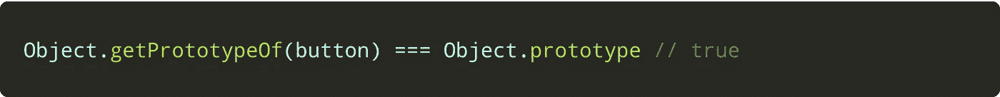

当您创建一个对象文字时，JavaScript 引擎会将`[[prototype]]`的值设置为`Object.prototype`。

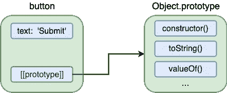

[[原型]]参考

这种行为允许我们使用`Object.prototype`中定义的方法。

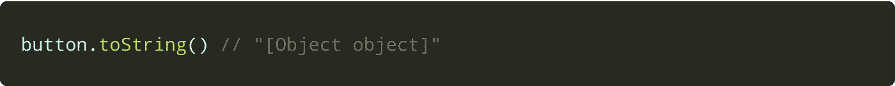

每当您试图访问一个特定对象中不存在的属性时，JavaScript 引擎会自动查看它的原型。

如果原型对象没有所需的属性，引擎将在原型的原型中查找*。这样的搜索一直发生，直到引擎到达原型`Object.prototype`，也就是`null`。在这种情况下，返回`undefined`。*

在我们的例子中，我们试图访问没有在`button`中定义的`toString`方法。因此，引擎将遵循指向`Object.prototype`的`[[prototype]]`参考。之后会执行`toString`。

一个对象中的两个或多个原型形成一个*原型链*。`Object.prototype`永远在它的上面。例如，如果我们创建一个数组，我们可以发现一个原型链:

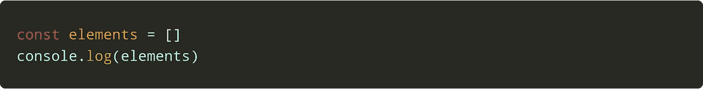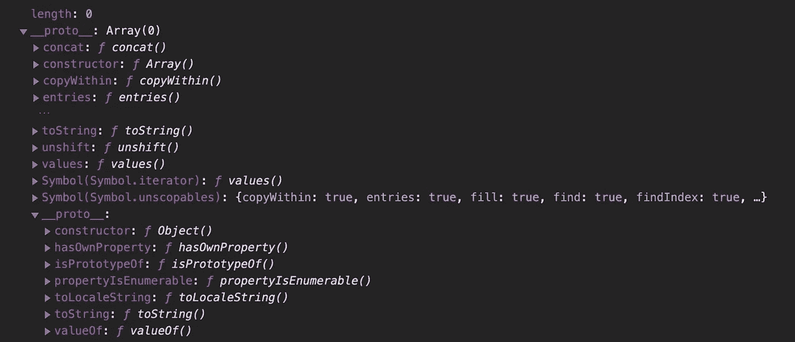

如我们所见，我们在链中有两个原型。第一个是`Array.prototype`，第二个是`Object.prototype`。我们可以使用`Array.prototype`方法，也可以使用`Object.prototype`方法。

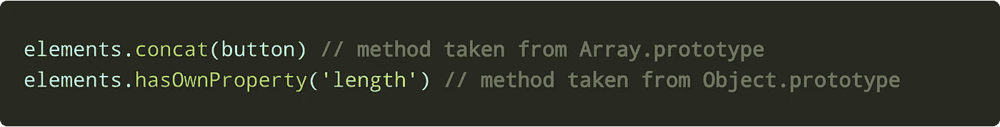

如果我们用相同的构造函数创建许多不同的对象，它们将共享相同的原型*。*

例如，如果我们创建许多数组，它们的`[[prototype]]`属性将引用同一个`Array.prototype`对象。理解这一点很重要，在 JavaScript 中，对象是通过引用传递的。

对原型的引用指向同一个内存空间。因此，`Array.prototype`对象的变化将影响其所有实例。

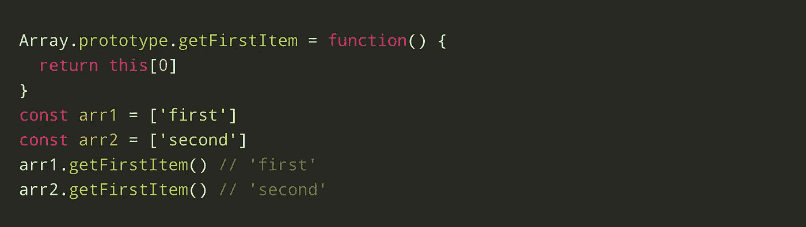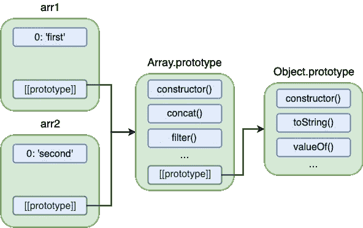

原型链

考虑到这一点，我们可以说，在 JavaScript 中，对象从其他被称为*原型*的对象继承而来。现在剩下的就是找出如何将物体与我们自己的原型联系起来。

# 链接原型

有几种方法可以将原型链接到对象。

我们可以使用一种伪经典的方式，使用普通的旧构造函数或 ES2015 类，它们在幕后使用所有相同的构造函数。或者，我们可以使用一种对 JavaScript 更自然的方式，使用`Object.create`或`Object.setPrototypeOf`方法。

# 构造函数

在前面的例子中，我们已经看到了像`Array`或`Object`这样的内置构造函数。JavaScript 引擎将他们的`prototype`属性设置为我们的`button`和`elements`对象。

基本上，构造函数是用`new`关键字调用的函数。原来任何函数都可以是构造函数。将构造函数的名字大写以区别于常规函数是一种惯例。

构造函数创建并返回一个名为*的对象实例*。在创建之前，可以使用`this`关键字在构造函数和原型方法中访问实例。

JavaScript 引擎将实例属性`[[prototype]]`设置为构造器属性`prototype`的值。

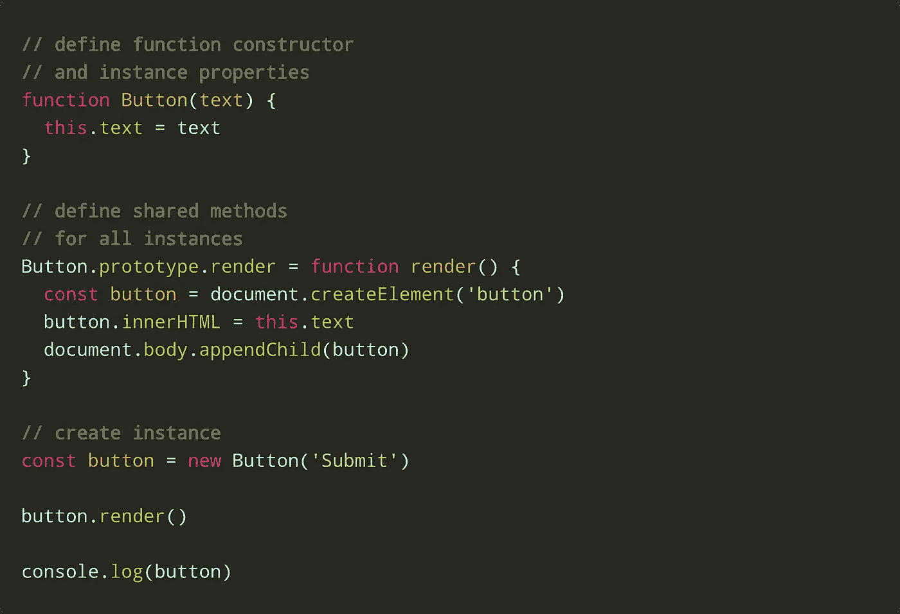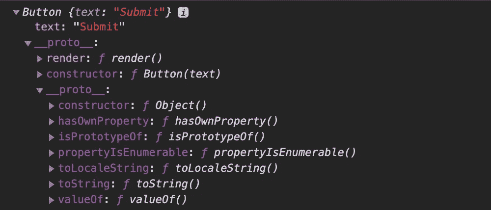

构造函数原型

在上图中，`Button`实例的`text`属性被设置为`Submit`，它的原型有两个属性——我们的`render`方法和`constructor`，后者指向用于创建实例的构造函数。

当我们使用`Button`构造函数创建对象时，它们共享同一个`prototype`。

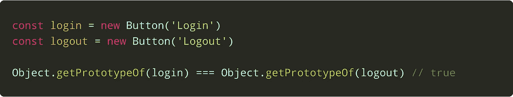

当我们需要一种方法来创建许多具有相同“类型”的对象时，构造函数会很有用。`instanceof` 运算符用于在运行时检查对象的类型。

如果对象是特定类的实例，它返回`true`。换句话说，对象必须在其原型链中有一个特定构造函数的原型。

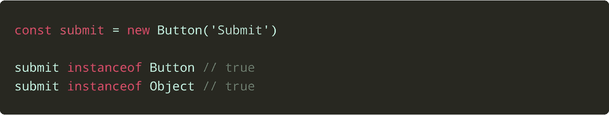

# 直接链接

`Object.create`或`Object.setPrototypeOf`方法是设置对象的`[[prototype]]`属性的另一种方式。与构造函数不同，我们需要做的就是创建子对象和父对象，并构建一个原型链。

`Object.setPrototypeOf(target, proto)`将`target`的`[[prototype]]`设置为`proto`对象或空。

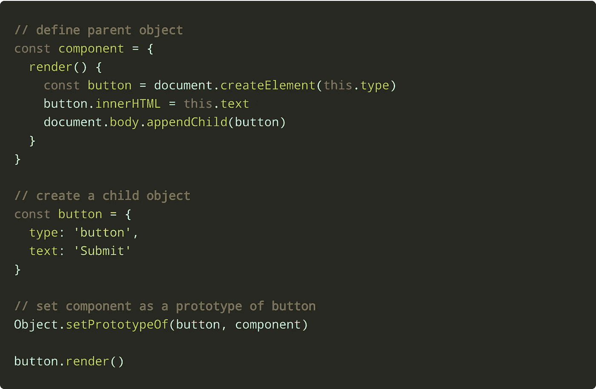

`Object.create(proto[, propertyDescriptor])`返回一个空对象，其中`proto`为`[[Prototype]]`。可选地，您可以传递一个[属性描述符](https://www.javascripture.com/PropertyDescriptor)来为一个新对象添加属性。

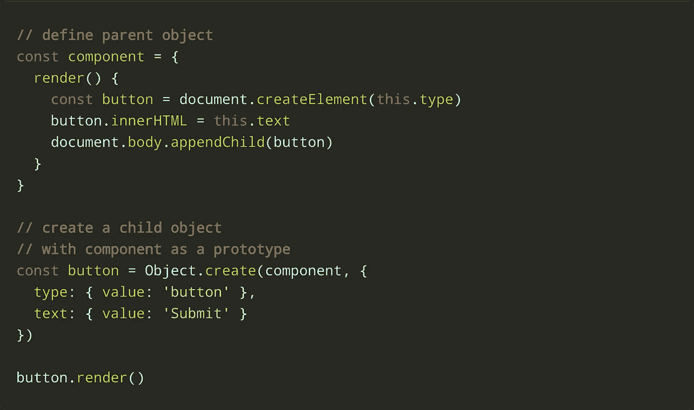

我们可以看到`Object.setPrototypeOf`更新了一个指定对象的原型链，而`Object.create`创建了一个链中只有一个原型的新对象。在这两种情况下，我们得到相同的结果:

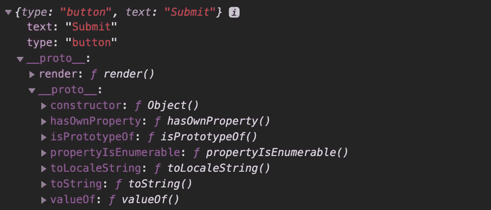

链接原型

使用`Object.create`更有效，因为改变原型链会破坏 JavaScript 引擎优化。`Object.setPrototypeOf`可以在构建贯穿整个程序生命周期的长期原型链时使用。

使用这些方法的主要优点是它们允许我们直接从其他对象继承。

它们通常被用作设置对象的`[[prototype]]`的简单方法。每当你想使用一个构造函数来实例化一个对象的时候，用`Object.create`来代替它可能会更好。

# 子类

有时候，我们想从几个对象中继承。在 JavaScript 中，要创建一个“子类”，只需在原型链中再添加一个对象。

例如，我们需要在新的仪表板页面上呈现一个可拖动的`clock`组件。

有了描述呈现元素的基本功能的`component`抽象，我们可以定义一个`widget`来抽象可拖动的元素。

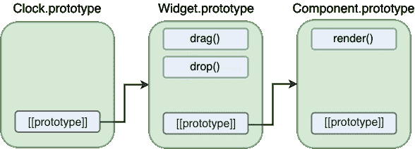

原型遗传

用*直接链接*可以很容易地做到这一点。我们可以使用`Object.setPrototype`将`component`和`widget`对象的原型链链接到`clock`对象。

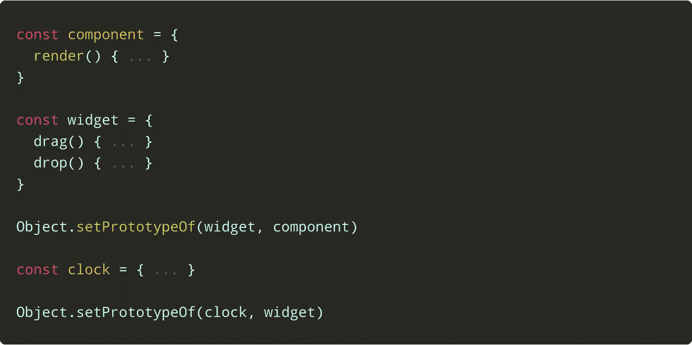

在上面的例子中，我们用需要的方法创建了两个基本对象，`component`和`widget`。

之后，我们使用`Object.setPrototypeOf`将它们链接在一起。我们做的最后一件事是创建我们的`clock`对象，并将其与原型链链接。

关于函数构造函数，创建`clock`需要更多的代码。首先，我们必须定义`Widget`、`Component`和`Clock`构造函数及其方法:

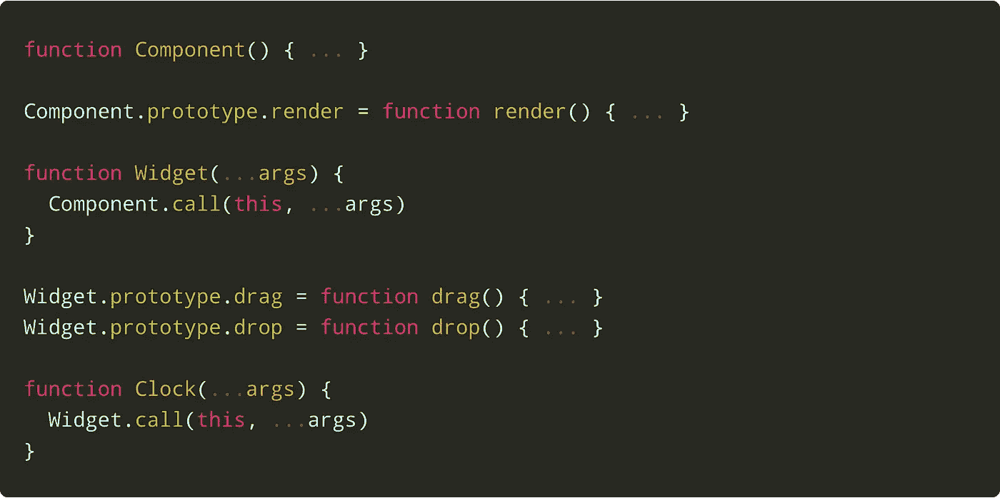

注意带有`Component.call(this, ...args)`和`Widget.call(this, ...args)`代码的行。在子函数构造函数中，我们必须用子上下文执行父构造函数。这样做是为了将父构造函数逻辑应用到子构造函数。

下一步是将我们的构造器原型链接在一起:

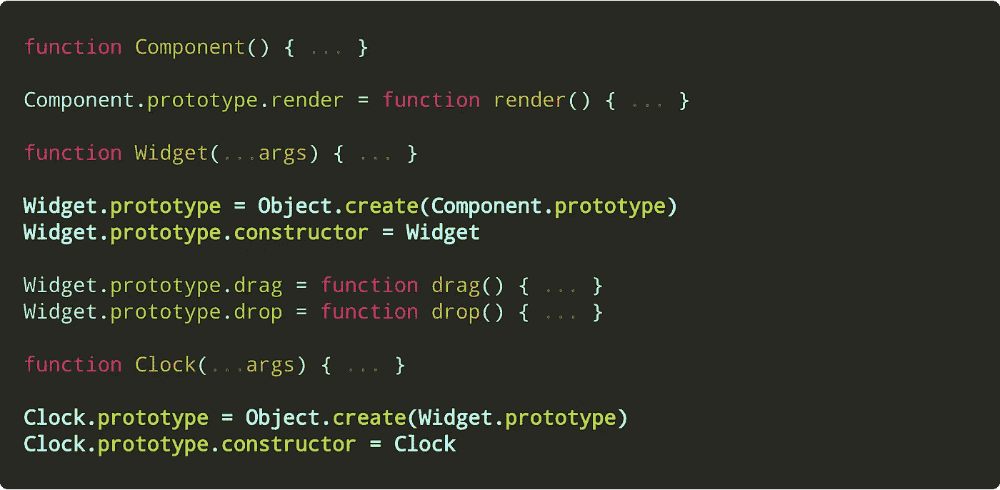

我们使用`Object.create`方法创建一个带有指定原型的空对象，如`Component.prototype`或`Widget.prototype`。

由于我们完全重新定义了`prototype`属性，我们需要手动为`constructor`属性分配一个构造函数。因此，我们有:

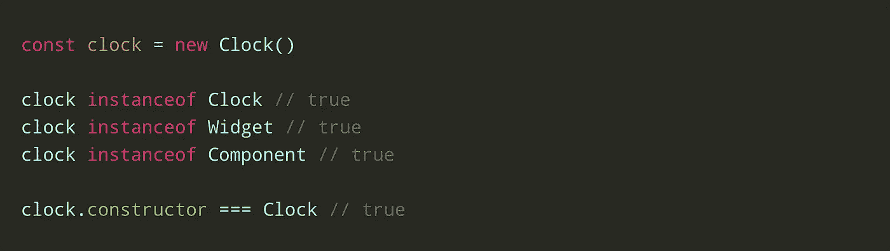

# 结论

当然，您可以使用 ES2015 类来保持简单。而且，在很多情况下，这已经足够了。但是，了解语法糖背后发生的事情会让你有能力发掘原型的全部潜力。