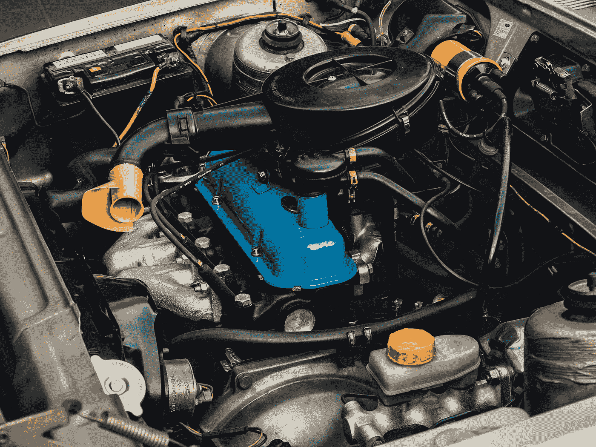
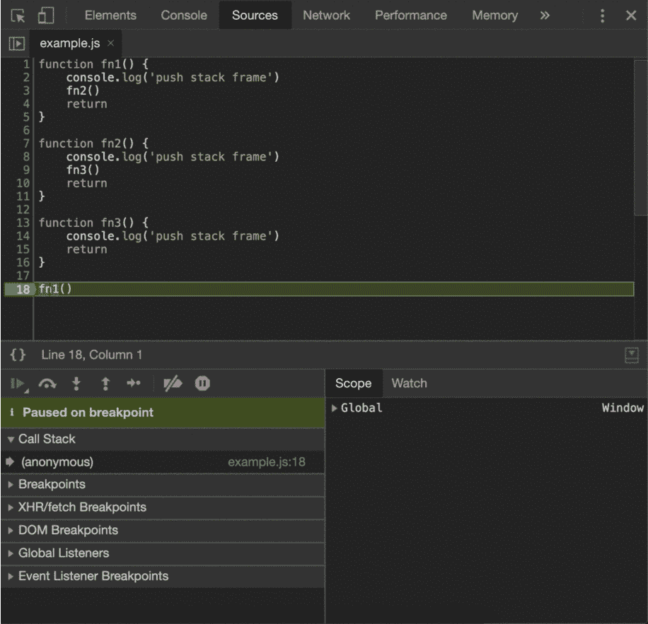
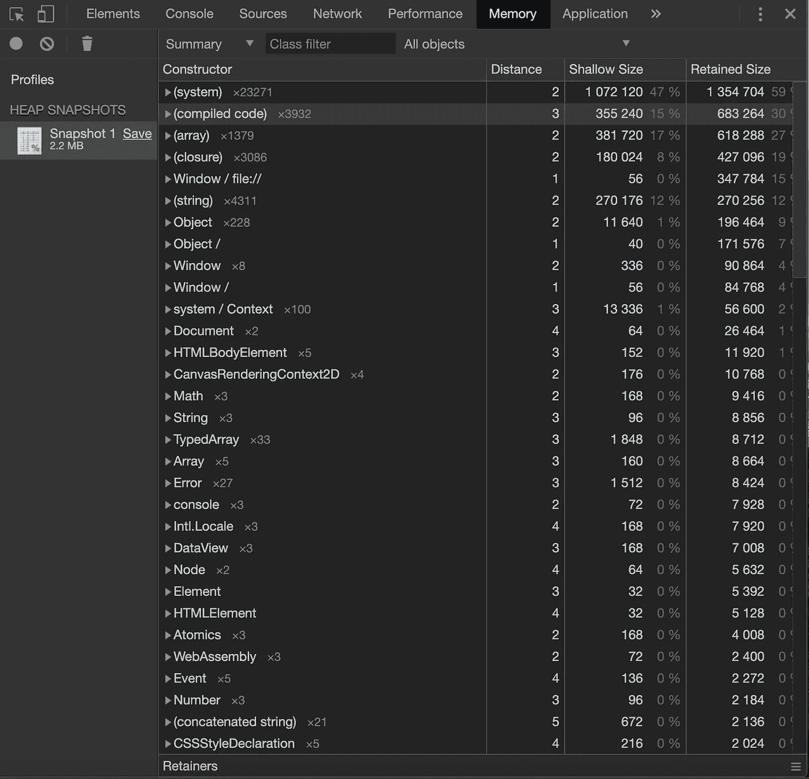
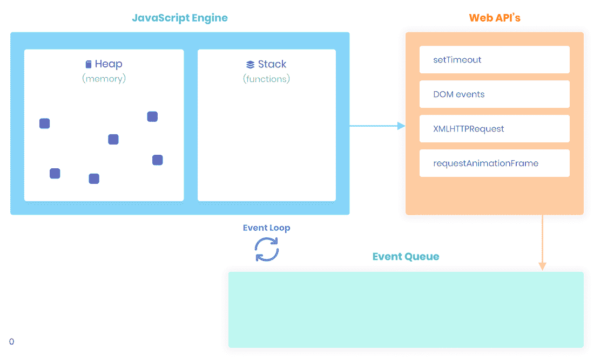
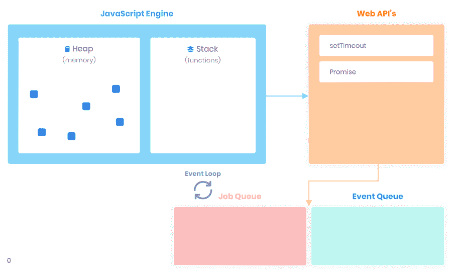
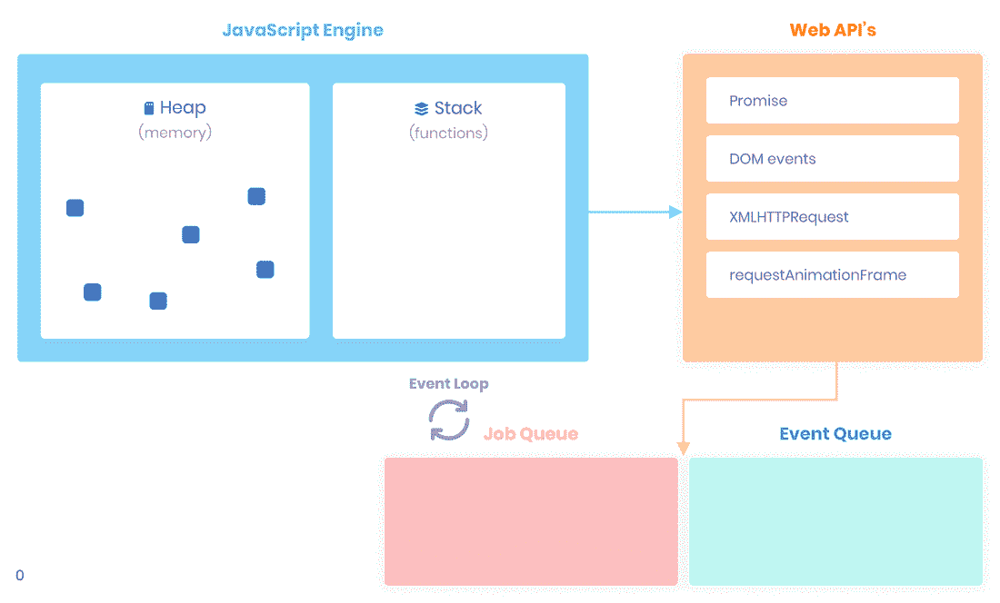

# JavaScript 内部:在浏览器的引擎盖下

> 原文：<https://betterprogramming.pub/javascript-internals-under-the-hood-of-a-browser-f357378cc922>

## 如何在浏览器中执行代码



# 介绍

Javascript 很奇怪。有人喜欢，有人讨厌。它有很多独特的机制，这些机制在其他流行语言中没有出现，也没有对应的机制。例如，代码执行顺序，有时可能不直观，但肯定很突出。

了解浏览器环境，它是由什么组成的，它是如何工作的，会让你在编写 JavaScript 时更有信心，并为可能发生的潜在问题做好充分准备。

在这篇文章中，我将试着解释一下 Chrome 浏览器背后发生的事情。我们来看看:

*   V8 Javascript 引擎——编译步骤、堆和内存管理以及调用堆栈。
*   浏览器运行时—并发模型、事件循环以及阻塞和非阻塞代码。

# JavaScript 引擎

最流行的 JavaScript 引擎是 V8，它是用 C++编写的，被 Chrome、Opera 甚至 Edge 等基于 Chromium 的浏览器使用。

基本上，引擎是一个将 JavaScript 翻译成机器代码并在计算机的中央处理器(CPU)上执行结果的程序。

## 汇编

当浏览器加载 JavaScript 文件时，V8 的解析器会将其转换成抽象语法树(AST)。这个树由 Ignition 使用，Ignition 是一个产生字节码的解释器。字节码是机器代码的抽象，能够通过编译成非优化的机器代码来执行。V8 在主线程中执行它，而优化编译器涡扇在另一个线程中进行一些优化，并产生优化的机器代码。

这个管道叫做[实时(JIT)编译。](https://en.wikipedia.org/wiki/Just-in-time_compilation)


## 调用栈

JavaScript 是一种具有单一调用堆栈的单线程编程语言。这意味着您的代码是同步执行的。每当一个函数运行时，它将在任何其他代码运行之前完全运行。

当 V8 调用您的 JavaScript 函数时，它必须将运行时数据存储在某个地方。*调用堆栈*是内存中由堆栈帧组成的位置。每个堆栈帧对应于一个尚未因返回而终止的函数调用。堆叠框架由以下部分组成:

*   局部变量
*   自变量参数
*   回信地址

如果我们执行一个函数，V8 会将 frame 推到栈顶。当我们从一个函数返回时，V8 从框架中弹出。



Chrome 开发工具中的调用堆栈

正如你在上面的例子中看到的，在每次函数调用时创建一个框架，并在每次返回语句时移除*(更多关于调用堆栈中存储的内容，你可以在这里阅读*[](https://medium.com/better-programming/javascript-internals-execution-context-bdeee6986b3b)**)*。*

*其他所有东西都被动态分配到一个叫做*堆*的大型非结构化内存中。*

## *许多*

*有时 V8 在编译时不知道一个对象变量需要多少内存。此类数据的所有内存分配都发生在堆中——内存的非结构化区域。在我们退出分配内存的函数后，堆上的对象仍然存在。*

*V8 有一个内置的垃圾收集器(GC)。垃圾收集是内存管理的一种形式。它就像一个收集器，试图释放不再使用的对象所占用的内存。换句话说，当一个变量丢失了它所有的引用时，GC 会将这个内存标记为“不可访问”并释放它。*

*您可以通过在 Chrome Dev Tools 中制作快照来研究 heap。*

**

**Chrome 开发工具中的堆快照(空白页 2.2 MB！)**

*每个被实例化的 JavaScript 对象都被分组到其构造函数类下。带括号的分组表示不能直接调用的本机构造函数。如你所见，有许多`(compiled code)`和`(system)`实例，但也有一些传统的 JavaScript 对象，如`Math`、`String`、`Array`等等。*

# *浏览器运行时*

*因此，V8 可以根据标准同步执行 JavaScript，使用单个调用堆栈。但是我们对此无能为力。我们需要呈现用户界面。我们需要处理用户与 UI 的交互。此外，我们需要在发出网络请求的同时处理用户交互。但是当我们所有的代码都是同步的时候，我们如何实现并发呢？多亏了浏览器引擎才有可能。*

*浏览器引擎负责用 HTML 和 CSS 渲染页面。在 Chrome 中它被称为 Blink。它是 [WebCore](https://en.wikipedia.org/wiki/WebKit#WebCore) 的分支，WebCore 是一个布局、渲染和文档对象模型(DOM)库。Blink 是用 C++实现的，它公开了 Web APIs，比如 DOM 元素和事件、`XMLHttpRequest`、`fetch`、`setTimeout`、`setInterval`等等，可以通过 JavaScript **访问。***

*让我们考虑下面这个`setTimeout(onTimeout, 0)`的例子:*

**

*Chrome 开发工具中超时的调用堆栈*

*正如我们所见，`f1()`和`f2()`函数首先被推入堆栈，然后`onTimeout`被执行。*

*关键的一点是，我们注册了一个稍后运行的函数。无论是用户点击还是超时。我们的异步回调只有在相应的事件被触发后才由 V8 执行。*

*那么上面的例子是如何工作的呢？*

## *并发*

*在执行完`setTimeout`函数后，浏览器引擎将`setTimeout`的回调函数放入*事件表* **。**这是一个将注册的回调映射到事件的数据结构，在我们的例子中`onTimeout`函数映射到超时事件。*

*一旦定时器到期，在我们的例子中，当我们将 0 ms 作为延迟时，事件被触发，并且`onTimeout`函数被放入*事件队列* (也称为回调队列或消息队列或任务队列)。事件队列是一种数据结构，由将来要处理的回调函数(任务)组成。*

*最后但同样重要的是，*事件循环*，一个持续运行的循环，检查调用栈是否为空。如果是这样，则执行事件队列中第一个添加的回调，并将其移动到调用堆栈中。*

*函数的处理继续进行，直到调用堆栈再次为空。然后事件循环将处理事件队列中的下一个回调(如果有的话)。*

```
*const fn1 = () => console.log('fn1')
const fn2 = () => console.log('fn2')
const callback = () => console.log('timeout')fn1()
setTimeout(callback, 1000)
fn2()// output:
// fn1
// fn2
// timeout*
```

**

*ECMAScript 2015 引入了*作业队列* (又名微任务队列)的概念。这个队列充满了承诺`resolve`和`reject`功能。作业队列中的回调比事件队列中的回调具有更高的执行优先级。这意味着事件循环将在事件队列中的任何其他回调之前逐个执行它们。*

```
*const fn1 = () => console.log('fn1')
const fn2 = () => console.log('fn2')
const onTimeout = () => console.log('timeout')
const onResolve1 = () => console.log('resolved1')
const onResolve2 = () => console.log('resolved2')fn1()
setTimeout(onTimeout, 0)
Promise.resolve()
  .then(onResolve1)
  .then(onResolve2)fn2()// output:
// fn1
// fn2
// resolved1
// resolved2
// timeout*
```

**

*注意`onResolve1`、`onResolve2`、`onTimeout`回调的执行顺序。*

## *阻塞与非阻塞*

*简单来说，所有的 JavaScript 代码都被认为是*阻塞了*。当 V8 忙于处理堆栈帧时——浏览器卡住了。你的应用的用户界面被阻止。用户将无法点击、导航或滚动。在 V8 完成工作之前，不会处理来自网络请求的响应。*

*想象一下，您必须在浏览器中运行的程序中解析一幅图像。*

```
*const fn1 = () => console.log('fn1')
const onResolve = () => console.log('resolved')
const parseImage = () => { /* long running parsing algorithm */ }fn1()
Promise.resolve().then(onResolve) // or any other Web API async fn
parseImage()*
```

**

*在上面的例子中，事件循环被阻塞。它不能处理来自*事件/作业队列*的回调，因为*调用栈*包含帧。*

*Web API 让我们有可能通过异步回调编写*非阻塞*代码。当调用像`setTimeout`或`fetch`这样的函数时，我们将所有的工作委托给运行在单独线程中的 C++本地代码。操作一完成，回调就被放入*事件队列*。同时，V8 可以继续进一步执行 JavaScript 代码。*

*有了这样的并发模型，我们可以处理网络请求、用户与 UI 的交互等等，而不会阻塞 JavaScript 执行线程。*

# *结尾部分*

*理解 JavaScript 环境是由什么组成的对于每个想要解决复杂任务的开发人员来说是至关重要的。现在我们知道了异步 JavaScript 如何工作，调用栈、事件循环、事件队列和作业队列在其并发模型中的作用。*

*正如你可能已经猜到的，V8 引擎和浏览器引擎背后有更多的东西。然而，我们大多数人只需要对所有这些概念有一个基本的了解。请点击拍手👏，如果上面的文章对你有帮助。*

# *参考*

*[](https://medium.com/dailyjs/understanding-v8s-bytecode-317d46c94775) [## 理解 V8 的字节码

### V8 是谷歌的开源 JavaScript 引擎。Chrome、Node.js 和其他许多应用程序都使用 V8。这篇文章…

medium.com](https://medium.com/dailyjs/understanding-v8s-bytecode-317d46c94775) [](https://medium.com/fhinkel/confused-about-stack-and-heap-2cf3e6adb771) [## 对栈和堆感到困惑？

### 坦白说，我总是很难把堆栈和堆分开。是的，我读过内存管理，然后…

medium.com](https://medium.com/fhinkel/confused-about-stack-and-heap-2cf3e6adb771) [](https://blog.sessionstack.com/how-javascript-works-memory-management-how-to-handle-4-common-memory-leaks-3f28b94cfbec) [## JavaScript 如何工作:内存管理+如何处理 4 种常见的内存泄漏

### 几周前，我们开始了一个系列，旨在更深入地挖掘 JavaScript 及其实际工作方式:我们认为…

blog.sessionstack.com](https://blog.sessionstack.com/how-javascript-works-memory-management-how-to-handle-4-common-memory-leaks-3f28b94cfbec) [](https://blog.sessionstack.com/how-javascript-works-inside-the-v8-engine-5-tips-on-how-to-write-optimized-code-ac089e62b12e) [## JavaScript 如何工作:V8 引擎内部+如何编写优化代码的 5 个技巧

### 几周前，我们开始了一个系列，旨在更深入地挖掘 JavaScript 及其实际工作方式:我们认为…

blog.sessionstack.com](https://blog.sessionstack.com/how-javascript-works-inside-the-v8-engine-5-tips-on-how-to-write-optimized-code-ac089e62b12e) [](https://v8.dev/blog/ignition-interpreter) [## 启动点火解释器 V8

### 编辑描述

v8.dev](https://v8.dev/blog/ignition-interpreter)  [## 使用 Chrome 调试器工具，第 6 部分:堆分析器

### 上一次，我谈到了 Chrome 内置的 CPU profiler，它可以让您检测 Javascript 代码并…

commandlinefanatic.com](https://commandlinefanatic.com/cgi-bin/showarticle.cgi?article=art038)*