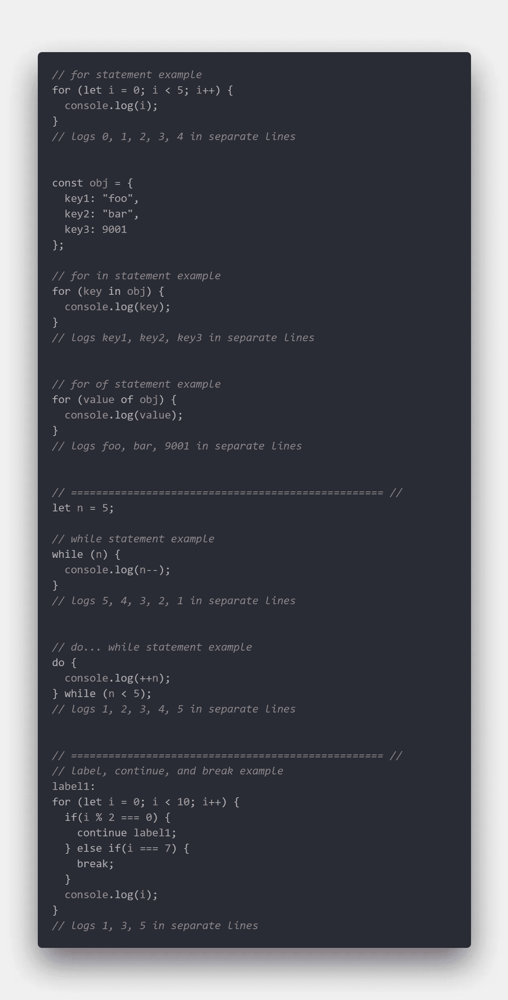
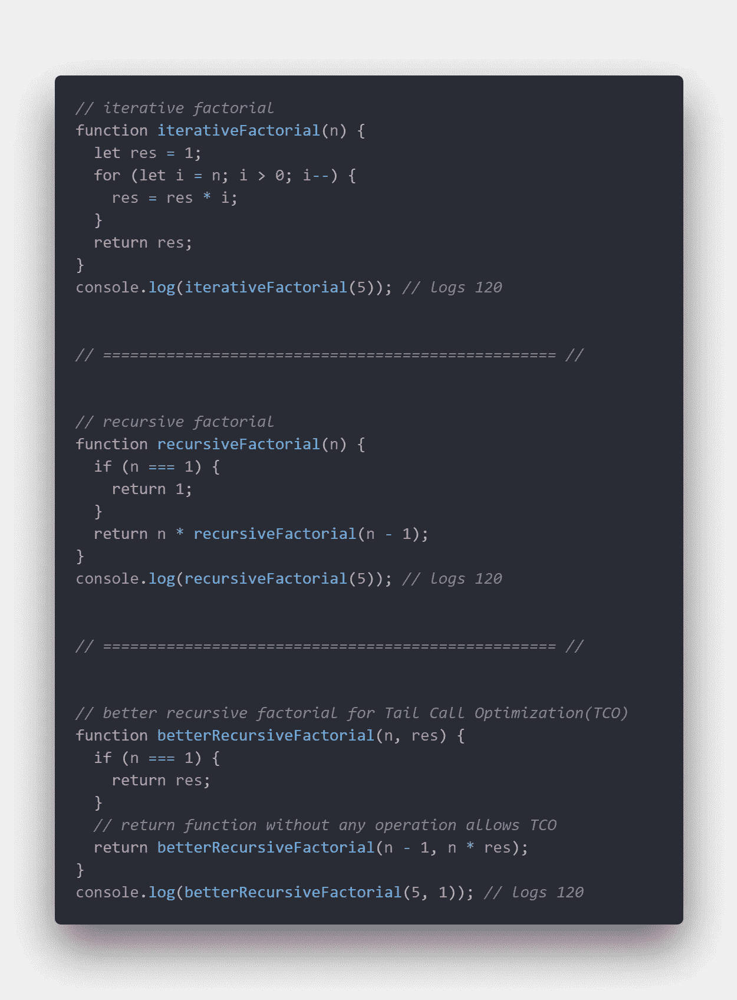
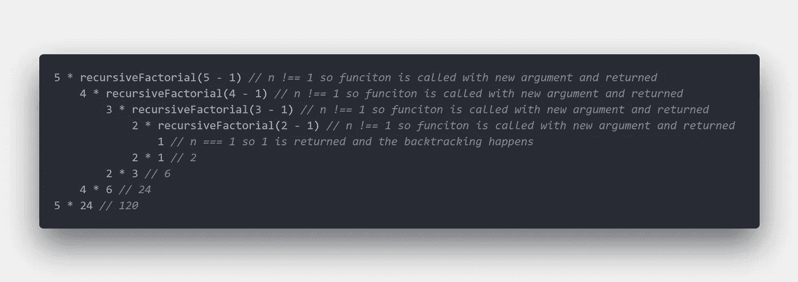
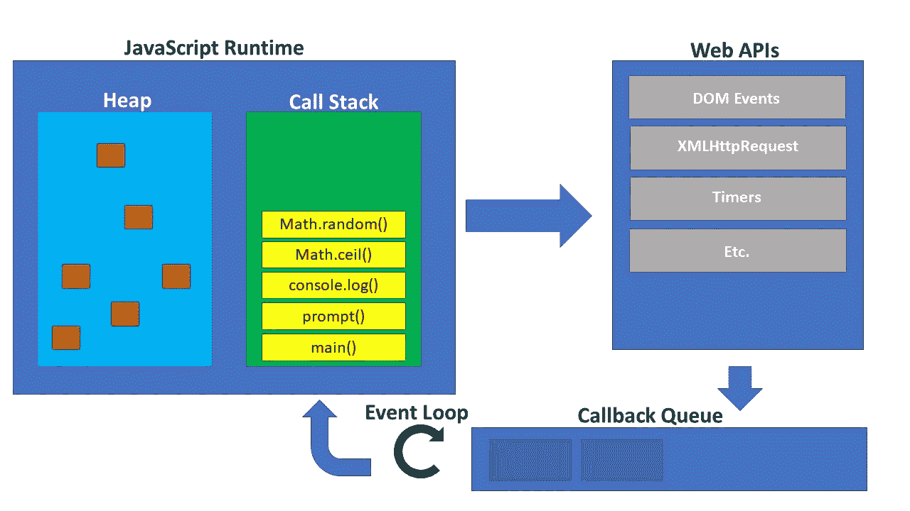
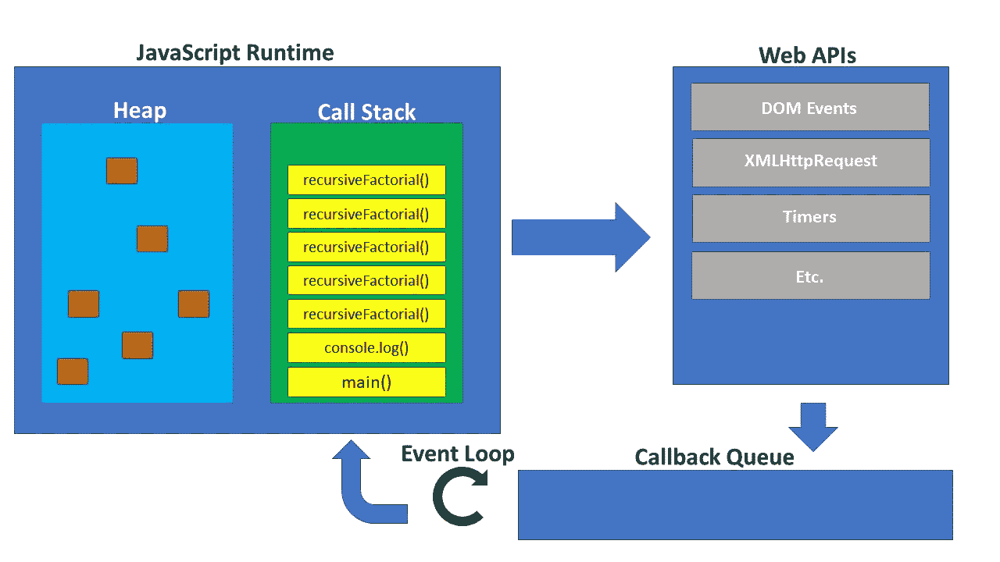

# JavaScript 中的迭代与递归

> 原文：<https://betterprogramming.pub/javascript-iteration-v-s-recursion-and-behind-the-scene-e12fe1756343>

## ***幕后观察差异以及如何做出正确决定使用***

照片由[Tine ivani](https://unsplash.com/@tine999?utm_source=medium&utm_medium=referral)在 [Unsplash](https://unsplash.com?utm_source=medium&utm_medium=referral) 拍摄

# ***迭代***

控制流中最重要的工具之一是迭代语句的使用。这些迭代语句通常以下列形式出现:

*   **用于声明**
*   **for in 语句**
*   **for of 语句**
*   **while 语句**
*   do…while 语句

在这些迭代语句中，“**标签语句**”、“**继续语句**”和“**中断语句**”可以结合使用，以进一步控制循环行为。

除了上面提到的迭代语句，还有迭代数组方法，例如:

*   **forEach**
*   **地图**
*   **过滤器**
*   **减少**

这些方法与前面提到的不同之处在于，这些迭代数组方法需要一个回调函数。这是这些迭代数组方法与上面的传统迭代语句在操作方式上的根本区别，当我们在幕后观察时就会看到这一点。

# 递归

现在我们已经了解了什么是迭代，让我们来看看递归以及它们之间的区别。

递归描述了递归函数的行为，即调用或调用自身。用于计算阶乘迭代和递归的基本比较如下所示:

*边注:尾部调用优化(TCO)是由编译器或引擎执行的优化，它允许“循环”继续而不增加堆栈。尽管 ES6 将 TCO 作为其新标准的一部分，但所有主流浏览器在实现它的过程中都经历了坎坷，到目前为止，它一直处于不确定状态。也就是说，最好记住如何转换一个以降低总拥有成本。看看* [*这里的*](https://stackoverflow.com/questions/54719548/tail-call-optimization-implementation-in-javascript-engines) *了解更多关于 JavaScript 实现历史的细节。*

当调用 *recursiveFactorial* 时，会发生以下情况:

我们可以看到，除了最初调用 *recursiveFactorial* 之外，它本身被额外调用了四次，在到达 n=== 1 的 ***基例*** 之后，它一路回溯，完成每一次后续计算达到 120。

在深入了解代码之前，让我们具体定义一下递归函数的组件。有两个必要的组件使得递归函数具有理想的功能:递归*和基础用例*。**

*****递归*** 是调用函数的部分，在我们的阶乘示例中是***recursiveFactorial(n-1)***。请注意，函数本身可以在多个地方调用，也可以在同一个表达式中使用不同的参数多次调用。这在技术上足以使一个函数递归，但这是不可取的，因为它会因堆栈溢出错误而崩溃。**

****

*****基本情况*** 是我们定义停止条件的地方。在我们的阶乘例子中，基例是***if******(n = = = 1)***。请注意，算法需要多少基本情况就有多少。**

# **走向幕后**

**首先，我们需要明白 JavaScript 是一种单线程并发编程语言。这意味着 JavaScript 一次只做一件事(JavaScript 运行时),并且通过与 Web APIs、回调队列和事件循环的合作关系，允许调度形式的“多任务”。**

**下面展示了 JavaScript 的不同组件:**

****

****JavaScript 运行时**或 JavaScript 引擎(Chrome 的 V8，FireFox 的 SpiderMonkey)包含**堆**和**调用栈**。**堆**是一个非结构化的内存区域，在这里为所有变量和对象分配内存。**调用堆栈**是一种数据结构，遵循后进先出(LIFO)系统，跟踪堆栈帧中的函数调用(在上图中用黄色矩形表示),其中包含函数及其参数和局部变量。**

****Web API**是浏览器的一部分，包含允许 JavaScript 以并发方式运行的基本 API。例子包括 DOM 事件，比如点击和滚动事件、AJAX 请求和 setTimeOut 函数。**

****回调队列**是遵循先进先出(FIFO)系统的数据结构，将 Web APIs 解析的函数排队。**

****事件循环**的目的是当调用栈*为空*时，从**回调队列**向**调用栈**添加一个队列项。**

**— — — — — — — — — — — — — — — — — — — — — — — — — — — — — — —**

**你能看到递归的例子中调用栈是如何变化的吗？：**

****

**有了更完整的描述，让我们回到迭代和递归。**

**在迭代中，循环依赖于自身。调用堆栈几乎没有变化。然而，在递归中，循环依赖于对自身的重复调用，这因此为每个函数调用向调用堆栈添加了一个堆栈帧。这也意味着要进行大量的删除和添加，这反过来又会因为调用数量的增加而增加运行时的负担。当数据集或输入很小时，迭代和递归在时间上的差别是不明显的，否则，迭代通常表现得更好。**

**在迭代中出现非常大的循环甚至无限循环的情况下，浏览器选项卡似乎对用户在页面上采取的任何操作都没有反应。这是因为发生在调用堆栈中的循环阻塞了来自回调队列的任何项。也就是说，其他选项卡将正常工作，因为只有那个选项卡的进程被停止。**

**在发生足够大的递归的类似情况下，JavaScript 实际上会由于堆栈溢出而崩溃。每个浏览器都有一个堆栈限制，如果超过这个限制，就会导致堆栈溢出错误。**

**通常，迭代可以转换为递归，反之亦然。因此，除了性能之外，在选择使用哪种方法时，还需要考虑可读性和可维护性。递归，由于其算法的本质，往往需要更少的代码行。此外，某些算法通过递归编程比迭代编程更容易理解和直观。最后，在选择要使用的工具和技术时，这完全取决于项目的范围、分配的资源、平台和受众规模等因素。**