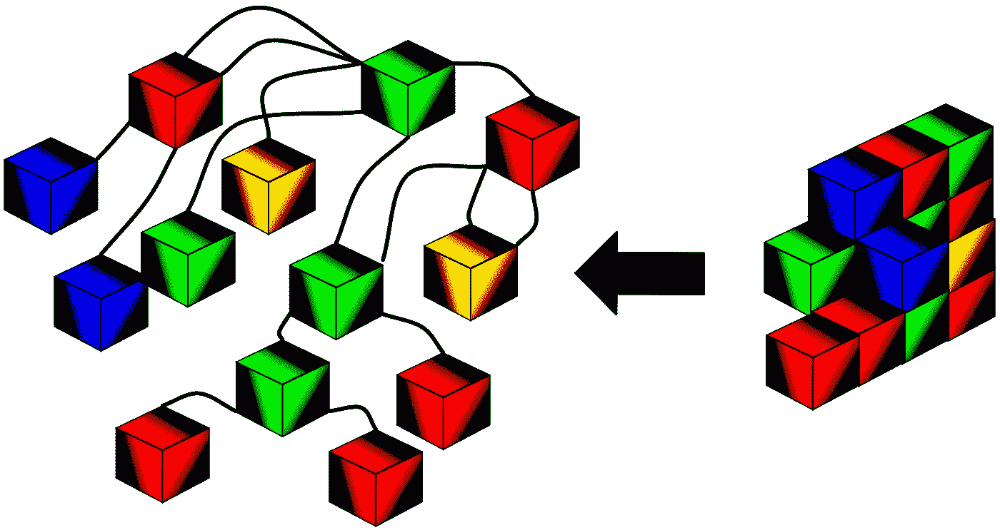
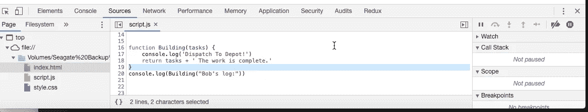
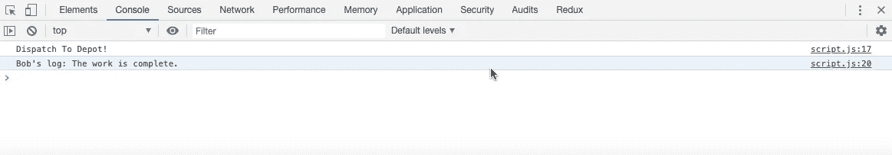
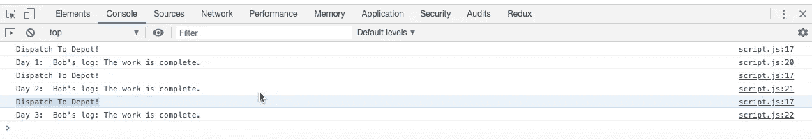
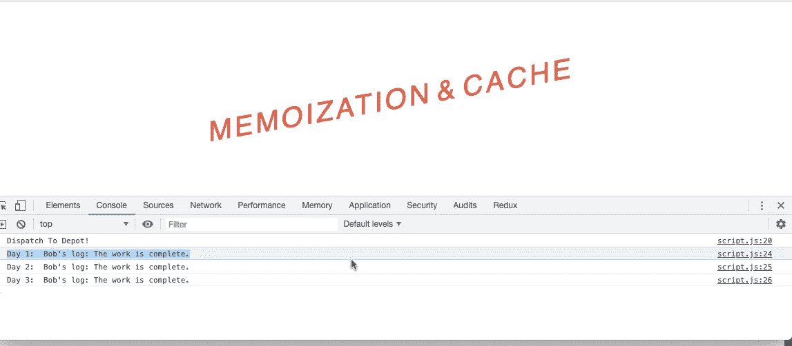
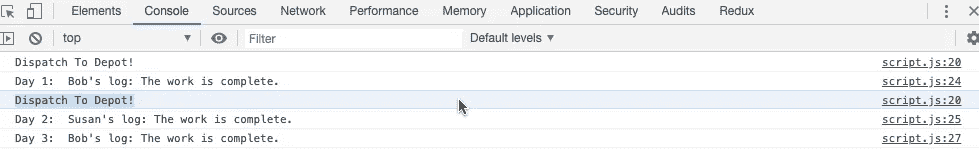

# JavaScript 记忆化和昂贵的代码

> 原文：<https://betterprogramming.pub/javascript-memoization-and-expensive-code-1a0aaa37a241>

## 构造函数示例


Agnieszka Boeske 在 [Unsplash](https://unsplash.com/s/photos/browser?utm_source=unsplash&utm_medium=referral&utm_content=creditCopyText) 上拍摄的照片

每个主流浏览器都有自己的 JavaScript 引擎，以实现高性能和优化。

[源代码](https://github.com/01Clarian/Memoization-Cache-Guide) — [视频教程](https://www.youtube.com/watch?v=4U4Yv7Su6Zk&list=UUDoV8qhKxPN4UkKOkXD0QSw&index=1)

现实情况是，JavaScript 引擎(如 Google 的 V8)的性能非常好，以至于对于运行时复杂度较低的小程序来说，速度几乎是不言而喻的，对于一个普通的开发人员来说，速度通常不是他们最关心的问题。

在这种情况下，可以理解像析构函数这样冗长的有价值的编码技巧，或者像记忆化这样的技术可能看起来像来自另一个世界的模糊的、遥远的杂音，没有真正直接的实际含义。

# 当记忆变得可行时

现在，当你用一个小的计算脚本和一个文件构建一个像计算器一样的基本程序时，这是非常公平的。然而，如果你的胃口开始增加，从制作计算器和俄罗斯方块到全栈电子商务网站，那么你就进入了一个全新的复杂领域。

突然间，曾经来自遥远的学术文献和虚拟课程领域的优化技术的回声变成了维持有竞争力的功能应用的必要工具。

可广泛访问的应用程序随着使用的增加而扩展，更极端的例子包括 **Youtube** 或 **AirBnb** ，需要更昂贵的运行时复杂性——这就是像 memoization 这样的技术成为不可或缺的工具的地方。

# 打破记忆

作为一种技术，当有条件地应用于 JavaScript 函数时，记忆化可以极大地提高应用程序的执行速度。

内存化是一种特定类型的缓存系统，能够通过存储函数调用的昂贵结果并在相同的输入再次出现时返回缓存结果来提高性能。

在这种情况下，昂贵的结果指的是耗时的计算，可能会降低应用程序的速度。然而，从这个意义上说，这种缓存技术为函数提供了一个人造的内部存储空间。

就像这样，如果结果已经被缓存，函数可以通过返回缓存的结果来减少计算开销。

更简单地说，从某种意义上来说，*记忆*就是*记忆*或者存储数据——让被记忆的函数更快地访问数据。



存储昂贵的函数调用允许更快的访问和返回。

在继续前进之前，让我们停下来喝一口咖啡，整理一下思绪。

如果这些概念是新的，到目前为止似乎很难掌握，没有必要担心——这一点也不奇怪。

这些本质上是 JavaScript 中记忆化理论用例的核心原则。通过将这些要点应用到以下文档中的相关类比和测井测试结果，我们的目标是通过实际应用巩固我们对记忆化的理论理解。

所以让我们做我们最擅长的事情:多喝点咖啡，打开文本编辑器，开始编码。

# 示例功能设置和比较

为了说明记忆一个函数的价值，我们将使用提供的相关上下文构建一个函数，记忆那个函数，然后比较和对比结果。

这种记忆的相关类比功能将被称为构造功能。首先，打开文本编辑器，创建一个链接到 script.js 文件的 index.html 文件。

```
<script type="text/javascript" src="script.js"></script>
```

接下来，用以下注释适当地注释标题构造函数:

```
**// MEMOIZATION AND CACHING: THE CONSTRUCTION FUNCTION EXAMPLE**// In order to better our understanding of Memoization, we will write a function// entitled '**Building**' and apply various logged results to observe the behaviour// of JavaScript.
```

附加说明:

```
// In this example, you are the boss of a construction company.// The construction company will be a reference to your Application.// Javascript execution commands will be traced by a reference to  // your Construction  Companies employees: Bob and Susy. 
```

在下面的例子中，你是一家建筑公司的老板。首先，创建一个名为`Building`(表示您正在构建的站点)的函数，第一个参数是`tasks`(表示要在建筑物上做的工作)。

接下来，发送一个雇员，我们称之为`Bob`的字符串，来完成建筑工地的任务。

Bob 还有指示说建筑工地可能有破裂的管道。鲍勃必须先去现场，看看他需要什么来修理管道，然后分派到一个仓库，带回必要的工具。

*这将表示为以下日志:*


在日志分派之后，返回**任务**和一个连接的字符串，表明工作已经完成。

最后，让 Bob 知道记录`Building` 的结果，以便 Bob 可以获得工作报酬。

*Building*函数现在看起来应该是这样的:

```
function **Building**(tasks) { console.log('Dispatch To Depot!') return tasks + ' The work is complete.'}console.log(**Building**("Bob's log:"))
```

在浏览器中运行 index.html 文件，并检查开发工具以获得以下结果:



源部分开发工具



控制台部分开发工具

根据这些结果，我们现在可以看到 Bob 做了以下事情。

*   进入大楼，找到了修理管道所需的工具。
*   派遣**ed 到仓库获取工作所需的工具。**
*   **返回** ed 完成工作所需的任务。
*   **日志**退出工作序列以获得报酬。

考虑到这些结果，我们公司的工作流程似乎没有问题。Bob 执行了他的所有任务，并相应地记录了他的结果。

对于一个一次性的工作来说，这一切似乎都进行得很好，没有发生任何事故。但是，如果这是一项为期三天的工作，Bob 必须返回该站点三次才能完成工作，会发生什么情况呢？

为了进一步说明这种类比，让我们将函数的任务设置为三次**鲍勃的日志**的字符串，用每个唯一的日期字符串指定每个日志:

```
function Building(tasks) { console.log('Dispatch To Depot!') return tasks + ' The work is complete.'}console.log('**Day 1**: ', Building("Bob's log:"))console.log('**Day 2:** ', Building("Bob's log:"))console.log('**Day 3**: ', Building("Bob's log:"))
```

刷新浏览器并检查以下结果:



我们现在看到 Bob 完成了三天的所有任务并记录了结果。看起来一切都很顺利，那还有什么问题呢？好吧，让我们沉思地呷一口乔，然后考虑一下。

你猜对了！尽管 Bob 已经完成了三天的工作，但如果您还记得我们公司的类比，他还必须去仓库修理管道。

这很好，函数仍然像预期的那样工作。然而，如果 Bob 开车去仓库花了几个小时才买到供应品呢？当我们提到**昂贵的通话**时，这就是我们所说的记忆化。

如果 Bob 将这些工具存放在现场附近，岂不是更有意义，并为公司节省了宝贵的时间和金钱？

同样，Bob 可以通过将他需要的工具存储在站点附近以备将来访问来节省昂贵的调用，因此 JavaScript 可以将昂贵的函数调用存储在缓存中，然后在必要时返回缓存。当相同的输入(Bob 的日志)再次出现时，我们的记忆化函数将返回缓存结果，这可能会节省宝贵的计算运行时间。这种技术被称为记忆化。

现在明白了吗？

# 为昂贵的结果存储缓存范围

让我们继续实现这个为我们的`Building` 函数设置的记忆，并看看它是如何工作的。

首先，创建一个设置为块范围**的对象缓存，让**位于我们的`Building` 函数之上。这将是调度日志的存储对象。

写 I**f else**condition**检查任务是否已经作为数组发送到对象缓存。如果缓存已经接收到任务，那么只返回需要完成的任务。否则，记录字符串“发送到仓库！”并返回任务等于原始连接字符串的缓存，“工作完成。”**

**我们的脚本文件现在应该修改为:**

```
let cache = {};function Building(tasks) { if(tasks in cache) { return cache[tasks] } else { console.log('Dispatch To Depot!') return cache[tasks] = tasks + ' The work is complete.'}}console.log('Day 1: ', Building("Bob's log:"))console.log('Day 2: ', Building("Bob's log:"))console.log('Day 3: ', Building("Bob's log:"))
```

**再次刷新浏览器中的 index.html 文件，并检查开发工具以获得以下结果:**

****

**检查 CSS 标题样式的源代码:)**

**现在，我们的结果将连续三次执行工作的数据发送给我们，而不必每次都调用调度日志。**

**Dispatch 只需要调用一次，因为我们的数据现在可以被对象的缓存访问。如果调度控制台日志是一个耗费数千毫秒的函数，那么这个系统将会节省我们脚本宝贵的运行时间。我们现在清楚地展示了记忆的价值。**

# **结论**

**将 JavaScript 与我们的建筑公司进行比较，也可以清楚地看到通过记忆化我们将如何为公司节省昂贵的时间。**

**Bob 不再需要每次都去取修理破裂管道所需的工具，因为这些工具都存放在本地，他现在可以更快地获得它们。例如，如果 Bob 在第二天请了病假，而我们让另一名员工 Susan 去上班，结果就会改变。**

**我们可以通过将第二个日志中建筑物的输入字符串切换到“Susan 的日志”来看到这一点。**

```
console.log('Day 1: ', Building("Bob's log:"))console.log('Day 2: ', Building("Susan's log:"))console.log('Day 3: ', Building("Bob's log:"))
```

****

**如果第二个日志是 **Susan 的日志**的预期结果**

**由于输入是不同的，Susan 在缓存对象中没有先前的存储，因此再次初始化分派日志。但是，第 3 天日志不需要记录派单，因为它记录的是 Bob，可以直接从缓存中获取数据。这就是它的要点。**

**有了这些知识，我们现在可以期待为公司和我们的应用程序节省大量的时间复杂性。**

**感谢阅读这个建筑公司关于 JavaScript 中的记忆化和缓存的类比！**

**如果你有任何问题，请留下你的评论，或者随时查看这篇文章顶部的代码和视频解释。**

**最后，我希望您能从中找到一些有用的东西，并了解如何通过这个简单的记忆化函数实现，我们可以通过增强应用程序的整体性能和可用性来节省宝贵的处理时间！**