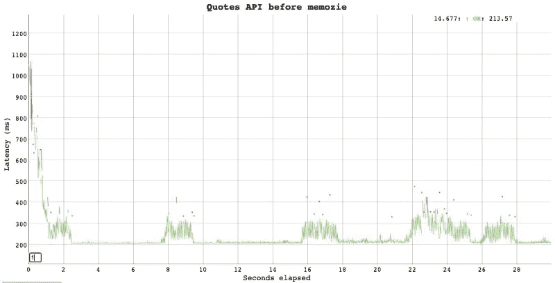
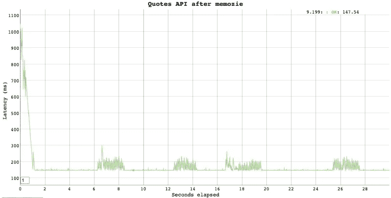
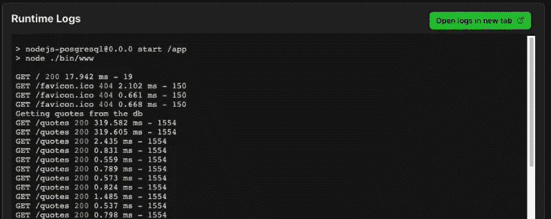

# 想要构建更快的 Web 应用程序吗？使用 JavaScript 记忆

> 原文：<https://betterprogramming.pub/javascript-memoization-dca99a5614fe>

## 更好的 HTTP 性能的实际例子

戴维·贝克尔在 [Unsplash](/?utm_source=unsplash&utm_medium=referral&utm_content=creditCopyText) 上的照片

记忆化就是简单地缓存一个函数的输出，以便后续调用只使用缓存的结果，消除任何繁重的计算。如果实现得当，JavaScript 中的记忆化也可以产生惊人的性能优势。

你想让你的 JavaScript 代码运行得更快吗？在本文中，我们将看看 JavaScript 记忆化的一个实际例子。

剧透:你不会看到下面提到的斐波那契或阶乘。

# 什么是记忆化？

记忆化的一个过于简单的定义是，当你运行一个带有参数 a 和 b 的昂贵函数时，你将缓存那个函数的结果。当使用相同的参数 a 和 b 调用相同的昂贵函数时，由于输出是已知的并且在缓存中，缓存的结果被发送回来。

[维基百科](https://en.wikipedia.org/wiki/Memoization)将记忆化定义为:

> 在计算中，记忆化是一种优化技术，主要用于通过存储昂贵的函数调用的结果并在相同的输入再次出现时返回缓存的结果来加速计算机程序

它进一步补充说:

> “记忆功能‘记住’与某组特定输入相对应的结果。具有记忆的输入的后续调用返回记忆的结果，而不是重新计算它，从而消除了使用给定参数调用的主要开销，除了使用这些参数对函数进行的第一次调用。

专业提示:记忆化对于软件的可伸缩性也很有用。我们将在本文后面了解这一点。

# 不是另一个阶乘或斐波那契的例子

老实说，我已经厌倦了用同样的斐波那契和阶乘的例子来解释记忆化。维基百科和谷歌搜索“JavaScript memoization”的十个结果中的八个都使用 factorial 或 Fibonacci 作为例子。是的，我们曾经在大学里做过，也许是为了理解递归。但是在日常的实际编码中，我在过去的 14 年中没有使用过像阶乘或斐波那契这样的东西。

如果你还想阅读其中的一些例子，请阅读[这些帖子](https://flaviocopes.com/javascript-memoization/)。自由代码营上的一个甚至展示了如何构建自己的记忆功能。但是我们在这里不是为了建造一个，我们在这里是为了更实际地使用一个。我们将在下一部分看到如何实现。

# 假设

在我们进入代码之前，下面是我们正在做的一些假设:

1.  您通常知道 JavaScript 中的承诺和异步代码是如何工作的。
2.  您已经了解了 REST APIs 是如何工作的。
3.  你知道谁应该用编程语言编写一个基本的 API，用关系型 DBMS 作为数据存储。

让我们开始吧！

# 实际例子:Web 响应的 Javascript 记忆化

我们将举一个例子引用 API 并记忆响应，这是一个使用 [p-memoize](https://github.com/sindresorhus/p-memoize) 库的承诺。当然，还有其他选择。例如，lodash.memoize、mem 和 fast-memoize 是一些[超受欢迎的](https://www.npmtrends.com/p-memoize-vs-memoizee-vs-memoizejs-vs-fast-memoize-vs-memoize-one-vs-mem-vs-lodash.memoize)。

类似地，最流行的是 mem(至少在我的比较中)，p-memoize 是 mem 的 promise/async 版本。mem 和 p-memoize 都是由同一个开发者开发的。

因为我在过去使用过 p-memoize，所以在这个例子中我将坚持使用它。我们的示例货币转换器 API 是[开源的](https://github.com/geshan/nodejs-posgresql)并部署在 [Zeet](https://geshan-nodejs-posgresql.zeet.app/quotes) 上。如果您有兴趣以每月 0 美元的价格托管 Node.js 应用程序，请阅读更多关于免费 Node.js 托管的信息。

我选择 Zeet 是因为它不是无服务器的，所以在实现内存化后，我们会看到响应时间明显减少。接下来，我们将看到 JavaScript 内存化如何加快响应时间。

## JavaScript 记忆前的响应时间

在我们记忆这个函数之前，让我们看一下`/routes/quotes.js` [文件](https://github.com/geshan/nodejs-posgresql/blob/master/routes/quotes.js)中的代码:

这是一个简单的 Express.js 路径，我们从`quotes.getMultiple`获取行。在这种情况下，它将在每次调用时运行一个[数据库查询](https://github.com/geshan/nodejs-posgresql/blob/d51ef7298cba039130fe8bf98486ba32bf19ad7d/services/quotes.js#L7)。

让我们快速看一下这种方法的响应时间。我们将使用[贝吉塔负载测试](https://geshan.com.np/blog/2020/09/vegeta-load-testing-primer-with-examples/)工具运行一个简单的负载测试，每秒两个请求，持续 30 秒。我们可以运行如下命令:

当上述贝吉塔负载测试运行 30 秒时，它将向我们显示如下输出:

JavaScript 记忆前 30 秒 50 RPS

我们可以看到，我们得到的最快响应是~205 ms，最慢是 1.5 s，我故意做到了每秒 50 个请求。那些红点是由数据库连接问题引起的 500 个错误。

在最初的几个请求之后，响应时间非常好，因为我们使用了一个数据库连接池。

## JavaScript 内存化后的响应时间

接下来，我们将使用 JavaScript 内存化和 p-memoize 库来内存化报价服务上的`getMultiple`函数。做`npm i p-memoize`后`routes/quotes.js`文件的变化如下:

我们来分析一下我们在这里改变的东西:

1.  我们在第 4 行添加了 p-memoize 库。
2.  接下来，我们将常数设置为 60000 毫秒，相当于 1 分钟，这是我们在内存上完成的 JavaScript 内存化缓存的缓存生存期。
3.  因此，我们使用 p-memoize 来记忆第 6 行的`quotes.getMultiple`函数。
4.  稍后在 get 路径中，我们将使用 memoized 函数，而不是原来的函数。

我们也可以参考这个[拉取请求](https://github.com/geshan/nodejs-posgresql/pull/17)的变化。当我们在 30 秒内以每秒 50 个请求的速度运行相同的负载测试时，会产生以下结果:

它会导致:

JavaScript 记忆后 30 秒 50 RPS

这里与上面的负载测试相比，我们得到的最快响应时间大约是 157 毫秒，最慢的(可能是第一个)是 1.05 秒。总的来说，我们可以清楚地看到，与之前的测试相比，每个请求减少了 50-75 毫秒。

我们的另一个优势是，对于 1500 (30*50)个请求，数据库仅在 30 秒内被命中一次。

类似地，来自 Zeet 的这个分支部署的日志如下:

JavaScript 内存化后的服务器日志—数据库仅命中一次

正如这里看到的，第一个请求命中数据库，显示日志为`Getting quotes from the db`，然后在接下来的一分钟内，它不会命中数据库。

因此，在我们的负载测试中，所有剩余的 1499 个请求都获得了用于获取多个引号的内存化(缓存)结果。前两个请求花了大约 320 毫秒，之后花了 0.5 毫秒到 2.4 毫秒，这都要归功于内存化。

如果我们在本地运行测试，记忆化后的结果会快得多，因为它不需要使用互联网。本地测试也可以避免任何复杂性，比如 [SSL 握手](https://www.cloudflare.com/en-gb/learning/ssl/what-happens-in-a-tls-handshake/)。

无论如何，我想展示一个更实际、更真实的 JavaScript 记忆化的例子，因为我对所有的阶乘和斐波那契例子都感到厌烦。

我使用了 p-memoize，但是你可以使用任何库。我建议看看快速记忆法或者 T4 记忆法。Fast-memoize 还致力于成为“JavaScript 中最快的支持 N 个参数的记忆库”旋转一下。

# 其他考虑

根据您使用的库，请注意以下事项:

1.  当 memoizing 可能只是缓存第一个参数，给出意外的结果。例如，在 p-memoize 中，如果有多个参数，我们需要[连接](https://github.com/sindresorhus/mem#caching-strategy)参数。
2.  并非所有语言都支持它。例如，没有直接的本地方法来记忆一个函数的返回值，因为所有的 PHP 进程都会根据请求加速或停止。同样的逻辑也适用于无服务器功能。
3.  很明显，只有返回值的函数才能被记忆。[无效功能](https://www.cs.fsu.edu/~cop3014p/lectures/ch7/index.html)无法记忆。

在这个例子中，我们还可以利用`Cache-Control`响应[头](https://developer.mozilla.org/en-US/docs/Web/HTTP/Headers/Cache-Control)在浏览器上缓存响应。如果您想探索的话，这将是 HTTP 级别的缓存选项。

# 结论

对记忆化的理解有所不同，并更多地将其用于实际目的。

打破 JavaScript 内存化只能用于阶乘和斐波那契这样的事情的观念，将它用于任何可以缓存的资源密集型事情，比如 GET 请求。

我希望你学到了更多关于记忆化的东西，特别是 JavaScript 中的记忆化。继续学习！