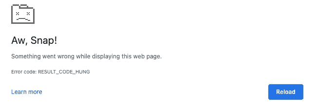
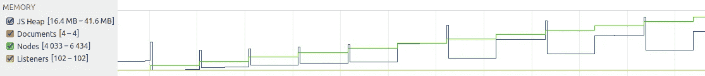
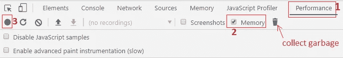
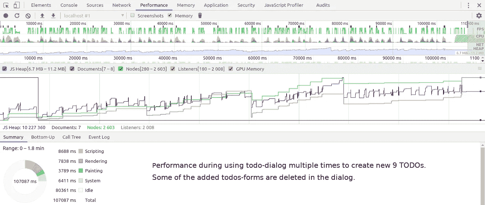
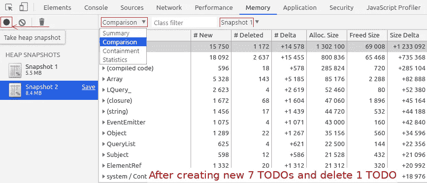
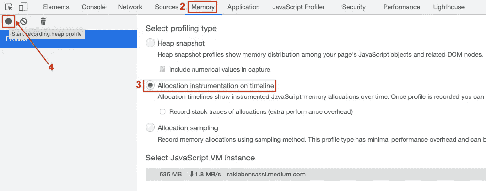
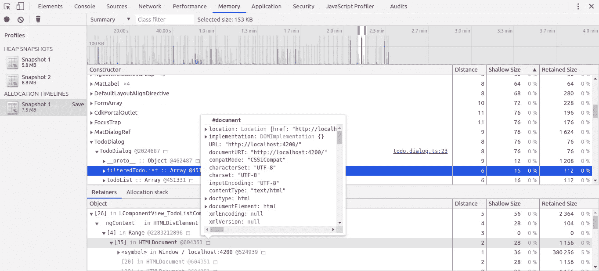
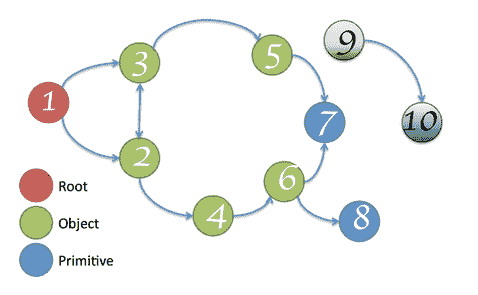
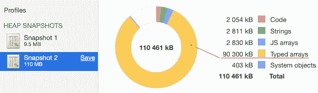

# 内存泄漏 101:检测和修复 Web 应用程序中内存泄漏的基本指南

> 原文：<https://betterprogramming.pub/javascript-memory-leaks-390957523a9e>

## 通过编写优化的代码和使用 Chrome DevTools 来提升你的 web 应用程序的性能


来自[佩克斯](https://www.pexels.com/photo/photo-of-gray-faucet-2339722/?utm_content=attributionCopyText&utm_medium=referral&utm_source=pexels)的[路易斯·金特罗](https://www.pexels.com/@jibarofoto?utm_content=attributionCopyText&utm_medium=referral&utm_source=pexels)的照片

*如果你喜欢观看，你可以在这里查看* [*我的视频课程*](https://www.udemy.com/course/identify-and-fix-javascript-memory-leaks) *其中包含了更多关于 JavaScript 内存泄漏的细节。*

它无辜地坐在那里。

然而，它继续吞噬你越来越多的宝贵资源。

它开始慢下来，让你沮丧不已。你只想尽快完成你的任务。因此，你不是按你面前的按钮一次，而是“按 100 次，因为，当然，这样会让它走得更快*。*

你的 Chrome 表现不一样。它的耐心耗尽了，它只是崩溃标签，并向你展示著名的"*啊，啪！*”页。



Chrome 浏览器“哇，啪！”页面(作者截图)

你不能相信你的眼睛。你在表格中输入的所有数据都永远消失了。

你哭泣，因为你不明白为什么你的会议以这种方式结束。

如果这种情况发生在你身上，那是因为你在浏览器上打开了一个不整洁的网页。这个应用程序编码很差，最终会占用你有限的内存。换句话说，它遇到了内存泄漏。

我们来解决这个问题，好吗？

在这篇文章中，我们将看到如何有效地跟踪内存泄漏，并了解导致它们的原因。您将深入了解如何更加尊重最终用户设备的资源。你也可以避免这样的情况:你揪着自己的头发，试图了解自己的表现。

> "一盎司的预防抵得上一磅的治疗."

```
**Table of Contents**[What's a Memory Leak?](#ee7c)[A Brief History](#4125)
   ∘ [The beginning of the web performance story](#4513)
   ∘ [The rise of JavaScript memory leaks issue](#cea3)[2 Types of Web Performance Problems](#2fb0)
   ∘ [Type 1: Directly after calling a web app on the browser](#f8ae)
   ∘ [Type 2: After a long session — Runtime performance](#afe9)[Signs that Your App Is Leaking Memory](#9eb1)
[Identifying Memory Leaks with Chrome DevTools](#3516)
   ∘ [Performance Timeline Record](#1609)
   ∘ [Heap Snapshots](#7bd0)
   ∘ [Heap Profile](#42f1)[7 Coding Patterns that Leak JS Memory](#8d06)
   ∘ [Global Variables](#4c72)
   ∘ [Cache](#164e)
   ∘ [Collections](#f56f)
   ∘ [Event Listeners](#0ac3)
   ∘ [Timers](#3574)
   ∘ [Closures](#fb3d)
   ∘ [Infinite and Detached DOM](#98df)
[Final Thought](#8f27)
```

# 什么是内存泄漏？

内存泄漏是指不正确的资源分配管理，它会导致性能下降，因为计算机程序不会释放它不再需要的内存。相反，它在运行时会不断消耗越来越多的内存。

几乎每种编程语言的内存生命周期都是这样工作的:**分配内存**，**使用内存**，**释放内存**。

JavaScript 内存泄漏是偷偷摸摸的，很难定位，因为它们可能在一段时间内不被注意到。即使您的性能越来越差，在运行泄漏的应用程序时，您也不会在浏览器上看到抛出的错误，因为导致内存泄漏的不是无效代码，而是其中的逻辑缺陷。

# 简史

## web 性能故事的开始

> “直到 2004 年，随着高速互联网连接和电子商务网站(通常带有精心制作的过度 Flash 动画介绍)开始主导数字市场，高速网站和商业收入之间的关系变得足够明显，以至于一些绩效工程师，如谷歌的[伊利亚·格里戈利克](http://www.igvita.com/)和雅虎的[史蒂夫·索德斯](http://stevesouders.com/)，开始积极宣传这个话题的重要性。
> 
> 到 2007 年初 iPhone 年——Souders 开始谈论和写博客，他称之为“网络性能”,在那年晚些时候出版了一本名为*高性能网站*的书，并在 2008 年共同创立了 Velocity，这是一个致力于该主题的流行会议系列。"
> 
> — [智能熊](https://smartbear.com/learn/performance-monitoring/what-is-website-monitoring/)

## JS 内存泄漏问题的兴起

在智能手机发布和移动应用普及之后，网络开发者受到了启发，开始改变他们设计和构建网页的方式。

很久以前，web 开发领域被使用诸如 Java/JSP、PHP、ASP 和 Ruby 等服务器端技术的*多页面应用(MPAs)* 所主宰。因此，我们称它们为服务器渲染应用**。**

当时一个正常的网站，实际上是一个 MPA。它通过在客户端和服务器之间发出多个请求来工作:网站的每个页面都向服务器发送一个请求，并完全*更新所有数据*。

*   2004 年，web 开发人员对 AJAX (异步 JavaScript 和 XML)越来越感兴趣，它允许更新网页而无需重新加载。这种方法为 *SPA(单页面应用)*铺平了道路。
*   2009 年发布的 Backbone.js 提供了一个轻量级的客户端框架。
*   大约在 2010 年， [AngularJS](https://angularjs.org/) 提出了客户端模型-视图-控制器(MVC)架构、双向数据绑定、模板和依赖注入等特性，成为第一个真正的 SPA 框架。


单页应用(SPA) vs 多页应用(MPA) ( [图片来源](https://asperbrothers.com/blog/spa-vs-mpa/):作者编辑)

单页应用程序不是加载整个新页面，而是通过用新数据更新当前网页来与用户交互的 web 应用程序。这使得网站感觉更像一个本地应用程序，并提供更好的交互性。

在 SPA 中，页面永远不会刷新，因为架构的安排方式是，当您转到一个新页面时，只有一部分内容被更新。所有必要的 HTML、JavaScript、CSS 代码和资源要么由浏览器在[初始加载](https://levelup.gitconnected.com/load-time-performance-metrics-5a105b190665)时检索，要么动态添加到页面以响应用户动作。

这提供了更流畅的用户体验，因为内容似乎可以立即加载，几乎不需要等待时间。

然而，从构建服务器呈现的网站到客户端呈现的 spa 和类似应用程序的行为的转变需要更多地关注用户设备上的资源，这为新一类问题打开了大门，这些问题在以前的模式中并不存在，例如:

*   耗尽手机电池。
*   让笔记本电脑的风扇旋转。
*   阻塞用户界面线程。

对于老式的网页(MPAs)，我们可能不会看到内存管理不足的严重后果，因为每次在页面之间导航时，都会加载新的页面，浏览器会清除内存。

但是自从 SPA 兴起以来，我们需要更加关注与内存相关的 JS 编码实践，因为它们会严重影响性能，甚至导致浏览器的 tab 崩溃。

# Web 性能问题的类型

网络表演有很多种。为了简化事情，让我们考虑两种类型。

## 类型 1:直接在调用网页后

如果您的 web 应用程序需要很长时间才能加载，或者在完成加载后性能很差，就像下面的例子显示了 Chrome Lighthouse 上的一些结果:


Lighthouse 在 Chrome DevTools 中测量的糟糕性能示例(图片由[作者](/angular-onpush-change-detection-f629cbce0bfa)提供)

这并不意味着您有内存泄漏。这表明您应该采取以下一项或多项措施来优化性能:

*   将大的组件和 JS/TS 文件拆分成较小的组件。
*   删除不用的文件和死代码。
*   通过使用记忆和缓存等技术来减少 HTTP 请求的数量。
*   使用`webpack-bundle-analyzer`来分析你的捆绑包，确定一些庞大的第三方库是否值得使用。

## 类型 2:长时间会话后—运行时性能

如果您注意到在很长一段时间没有重新加载(使用 F5)的情况下玩网页后性能下降，这可能是内存泄漏的迹象。

识别内存泄漏的来源并修复它将通过减少最终用户花费的时间来优化运行时性能。它允许他们完成一些场景，同时减少会话期间消耗的资源数量。

# 您的应用程序正在泄漏内存的迹象

您可能不知道是您导致了内存泄漏，直到它们在生产中出现并最终造成严重破坏。

以下是识别它的常见模式:

1.  速度变慢:在长时间(可能是几个小时，甚至一天)使用应用程序后，UI 变得更慢，反应迟钝。
2.  网页崩溃。
3.  应用程序经常暂停。
4.  JS 堆结束时比开始时高。
5.  您会看到节点大小和/或侦听器大小不断增加。



JS 堆和节点大小结束时比开始时高([图片来源](https://auth0.com/blog/four-types-of-leaks-in-your-javascript-code-and-how-to-get-rid-of-them/))

# 使用 Chrome DevTools 识别内存泄漏

要检查上述最后两个内存泄漏的迹象，可以使用 Chrome DevTools。

## 绩效时间表记录

性能时间线记录帮助您找到影响页面性能的内存问题，例如频繁的垃圾收集、内存膨胀和内存泄漏。

要制作这张唱片:

1.  打开 DevTools 上的性能面板，
2.  然后启用内存复选框，
3.  并做记录。



chrome DevTools 上的性能时间线记录(截图来自[作者](/build-me-an-angular-app-with-memory-leaks-please-36302184e658)

单击开始按钮后，您需要使用应用程序:多次打开一些视图或对话框，创建新项目，删除或更新一些项目，在一些表单中输入数据，多次单击按钮。

停止记录，等待直到您看到结果，结果可能类似于下面的结果:



演出时间线记录(截图由[作者](/build-me-an-angular-app-with-memory-leaks-please-36302184e658))

我们可以通过以下方式细分该性能时间线记录中的内存使用情况:

*   JS 堆(蓝线):代表 JavaScript 需要的内存。在这个例子中，它结束时比开始时高(表示内存泄漏)。
*   文件(红线)
*   DOM 节点(绿线):结束时比开始时高(表示内存泄漏)。
*   Listeners(黄线):结束时比开始时高(表示内存泄漏)。

垂直的蓝色线条是*频繁上升和下降的* JS 堆，这意味着频繁的垃圾收集，对于性能来说也不是一个好兆头。

## 堆快照

Chrome DevTools 的另一个特性是内存面板。它让您可以拍摄连续的堆快照，并对它们进行比较，以了解您的网页已经分配和消耗了多少内存，以及它是如何在 JavaScript 对象、原语、字符串、函数、DOM 节点等之间分配的。

1.  打开 DevTools 上的内存面板。
2.  启用堆快照复选框。
3.  点击“拍摄快照”按钮。等待几秒钟，直到“快照 1”准备就绪。


Chrome DevTools:堆快照(截图由[作者](/build-me-an-angular-app-with-memory-leaks-please-36302184e658)提供)

4.玩你的网络应用。

5.然后单击“拍摄堆快照”图标拍摄第二张快照。如果第二个记录的快照比第一个大，并且接下来的记录继续具有增加的模式，这可能是由内存泄漏引起的。

6.点击“总结”，然后点击“比较”以查看不同之处。

*   列“# New”显示了第二个快照中分配的对象:新数组、闭包、事件发射器、主题等等。
*   列“# Deleted”显示已删除的对象。



比较两个堆快照(截图来自[作者](/build-me-an-angular-app-with-memory-leaks-please-36302184e658)

## 堆配置文件

如果我没有提到您也可以从 DevTools 内存面板中的堆配置文件中受益来跟踪内存分配，那我就失职了。

1.  打开 DevTools。
2.  转到内存面板。
3.  选择单选按钮“时间线上的分配工具”
4.  按下按钮“开始记录堆配置文件”



Chrome DevTools:记录堆配置文件(作者截图)

5.使用您的应用程序，执行您怀疑导致内存泄漏的场景或操作。

6.然后按下红色圆圈按钮“停止录制”



在 chrome DevTools 的内存面板上使用“时间线上的分配工具”(截图来自[作者](/build-me-an-angular-app-with-memory-leaks-please-36302184e658))

垂直的蓝色线条代表一些 JS 对象的内存分配。蓝色线*过一会儿*不消失，变成灰色线，代表已经分配但没有释放的内存。

您可以用鼠标选择这样一行，以查看有关它的更多详细信息。

# JavaScript 中泄漏内存的 7 种编码模式

如果你让我用一个词来总结泄漏的主要原因，那就是*不需要的引用*。

如果您有一些不需要的对象、元素或变量，但是它们仍然可以从您的应用程序的某些部分访问到，JS 垃圾收集器将无法清除它们，因为它不会触及被引用的内存。

好消息是，如果您知道要寻找什么，甚至在部署之前，您就可以在源代码中捕获产生这种场景的模式。以下是七种可能导致泄漏的常见编码模式:

## 1.全局变量

全局变量可以从根访问，不会被垃圾收集。

如果你没有使用`strict`模式，你给一个未声明的变量赋值，你会使它成为全局变量。但是不要担心，如果你使用的是 [EcmaScript](https://javascript.plainenglish.io/node-js-esm-npm-yarn-deep-dive-adda15dabce#99c0) 5 或更高版本，你不需要像以前那样自己在源代码中写`use strict`。ES5 会帮你做，防止你这种意外泄露。

像 [Redux](https://redux.js.org/) 这样的全球商店是全球变量的一个很好的例子。如果你不小心的话，你可以处理大量的信息，并不断地向你的存储器中添加内存，而它永远不会被清理掉。

如果你的全局变量存储了大量的数据，当不需要的时候，考虑将它们清空或者重新分配。

## 2.隐藏物

增加内存消耗的另一个常见原因是在缓存中存储重复使用的数据。

当从细节导航到列表视图时，我们更喜欢从缓存中获取数据，而不是每次都请求服务器。底层数据会每 10 秒更新一次。

这是一种快得多的方法，节省了整个网络的往返行程。它改善了用户体验，尤其是当最终用户使用慢速网络或带宽受限的设备时。

然而，和金钱一样，我们需要节约。

如果我们继续将对象追加到缓存中，而不清除未使用的对象，并且没有一些限制大小的逻辑，缓存将无限制地增长，导致高内存消耗。这是警钟应该响起的地方。缓存大小必须有一个上限。

## 3.收集

如果您使用 DevTools 为几个 web 应用程序拍摄堆快照，并检查它们的内存是如何分配的，您可能会注意到数组和字符串的大小非常小。

与保留大小不同，保留大小指的是删除对象及其依赖对象后释放的内存，浅大小指的是仅由对象本身持有的内存大小。



从内存图的根不可到达的所有对象都被垃圾收集。([图片来源](https://developer.chrome.com/docs/devtools/memory-problems/memory-101/))

在下面的示例中，您可以看到堆快照的大小增加了大约 100MB，这主要是由类型化数组(超过 90MB)和 JS 数组(大约 3MB)引起的。

***注意:*** *JavaScript 的类型化数组是类似数组的对象，允许你在内存缓冲区中读写原始的二进制数据。*



在堆快照中保存超过 90MB 的类型数组([作者截图](/web-performance-and-tensorflow-js-3db05b1de958)

使用 Chrome DevTools 内存分析器拍摄并比较两个堆快照

数组、映射和集合允许您存储数据，但是如果您没有明智地实现代码，它们可能会永远保留引用，您最终会发生泄漏。

这是一个非常简单的跟踪用户行为的电子商务应用程序。它将每个访问过的视图、每个选中的产品和每个从搜索中返回的产品添加到`checkedItems`集合中，然后定期将数据发送到服务器:

如果您在将数据发送到后端后忘记清除`checkedItems`数组，这将导致泄漏。原因是，只要用户没有关闭选项卡，您就可以继续保留对该数据结构中的对象的引用，并继续添加新的对象。

## 取消引用数组的两种方法

**例 1:**

将数组设置为`[]`将取消对其中所有元素的引用，只要没有其他对该数组或其元素的引用:

在这段代码中，`i`、`j`和`n`保留在内存中，因为它们仍然被`list2`引用。

**例 2:**

您也可以通过将数组的长度设置为 0 来清除数组，这样它的所有引用都将被清除。这里，我直接修改了`list1`属性，而不是将其重新分配给`[]`:

结果是`list1`和`list2`都被清除，并且`i`、`j`和`n`将从存储器中删除。

同样，对`list1`中对象的任何外部引用都会将这些元素保存在内存中。在下一段代码中，`i`和`j`将保留在内存中，因为`list2`仍在引用它们:

## 4.事件监听器

如果您的 web 应用程序必须侦听键盘事件、鼠标事件和滚动事件，那么您应该记住，所有这些都是很容易通过错误代码泄漏内存的模式。

事件侦听器防止在其范围内捕获的对象和变量被垃圾收集。因此，如果你[忘记停止监听](https://levelup.gitconnected.com/angular-most-common-pitfalls-78a2baf860f5#e9f5)，你可以预期内存泄漏。

`addEventListener`是 JavaScript 中添加事件侦听器的最常见方式，它将保持活动状态，直到:

*   你用`removeEventListener()`显式删除它，或者
*   关联的 DOM 元素将被删除。

在 JavaScript 中添加/删除事件监听器

在上面的例子中，你不能删除`document`。这意味着如果你不通过调用`removeEventListener()`来清理的话，你将被`doSomething()`监听器和它范围内的任何东西卡住。

如果您只需要触发一次事件监听器，您可以向`addEventListener()`添加第三个参数`{once: true}`，这样监听器功能将在执行其工作后自动移除:

## 5.定时器

永远运行的计时器保持分配的对象，这可能会泄漏内存。JavaScript 中处理计时事件的两个关键方法是`[**setTimeout**](https://developer.mozilla.org/en-US/docs/Web/API/WindowOrWorkerGlobalScope/setTimeout)(function, milliseconds)`:

JavaScript 中的 setTimeout

还有`[**setInterva**](https://developer.mozilla.org/en-US/docs/Web/API/WindowOrWorkerGlobalScope/setInterval)**l**(function, milliseconds)`:

在 JavaScript 中使用 setIntervall

如果你创建了一个每`40`秒运行一次的循环定时器，那么你需要用`clearTimeout`或`clearInterval`来清理它。

## 6.关闭

> “一个**闭包**是一个函数的组合，该函数被捆绑在一起(被封闭)并引用其周围的状态(即**词法环境**)。换句话说，闭包让您可以从内部函数访问外部函数的范围。”
> — [Mozilla](https://developer.mozilla.org/en-US/docs/Web/JavaScript/Closures)

因为闭包可以保存对外部函数变量的引用，所以它可以防止垃圾收集器释放这些变量所保存的内存。让我们看一个例子:

JavaScript 函数

*   这里，`displayName`是对运行`outerFunc`时创建的函数`innerFunc`实例的引用。
*   闭包`innerFunc`可以访问父作用域中的`name`。
*   因为`innerFunc`维护了对其词法环境的引用，所以变量`name`仍然可用，即使外部函数在调用`displayName`后已经完成了它的执行。

## 7.无限和超然的世界

**无限 DOM:** 如果您的应用程序中有一个无限滚动特性，类似于脸书上的“*显示更多帖子*或 YouTube 上的“*加载更多视频*”，那么文档对象模型(DOM)节点的数量将会无限增长。您可以通过使用[虚拟化](https://github.com/WICG/virtual-scroller#readme)来解决这个问题。

**被引用的分离的 DOM:** 如果一个 DOM 元素不再被使用，那么就不应该从 JavaScript 中引用它，否则它不会被垃圾回收，即使是在从 DOM 树中移除它之后。

下一个示例中的代码创建了一个`div`元素，并将其附加到`document.body`中。然后在`deleteDivElement()`内部调用`removeChild()`。这个逻辑不会像预期的那样工作，因为有一个变量`detachedDiv`仍然指向`div` 并且堆快照将显示分离的 HTMLDivElement:

创建一个分离的 DOM 元素

然而，如果我们将指向 DOM 元素的变量`detachedDiv`移动到函数`appendDivElement()`的局部作用域，我们可以修复这种情况，并且在调用`deleteDivElement()`之后将没有被引用的分离的 DOM 元素:

避免分离的 DOM 元素

# 最终想法

在极端情况下，寻找内存泄漏问题是一个复杂的问题，调试它们可能是一项艰巨的任务。为了避免在你的应用中出现这样的问题，你需要意识到这一点并保持警惕。

请记住，您设计和编写代码的方式决定了一块内存是否会返回给操作系统。

希望这篇文章中的见解能对你优化代码设计和修复应用有所帮助。你不必一次做所有的事情。选择适合您的情况的技巧，并不时地应用，直到您驯服了内存泄漏这头野兽。

```
**Want to Connect?**If you liked what you read, here’s a [list of similar articles](https://rakiabensassi.medium.com/list/software-engineering-7a179a23ebfd) that you might enjoy.I write about engineering, technology, and leadership for a community of smart, curious people. [Join my free email newsletter for exclusive access](https://rakiabensassi.substack.com/).
```

*多多感谢* [*纳比尔*](https://medium.com/u/7e6956110712?source=post_page-----390957523a9e--------------------------------) *为同行评审。*