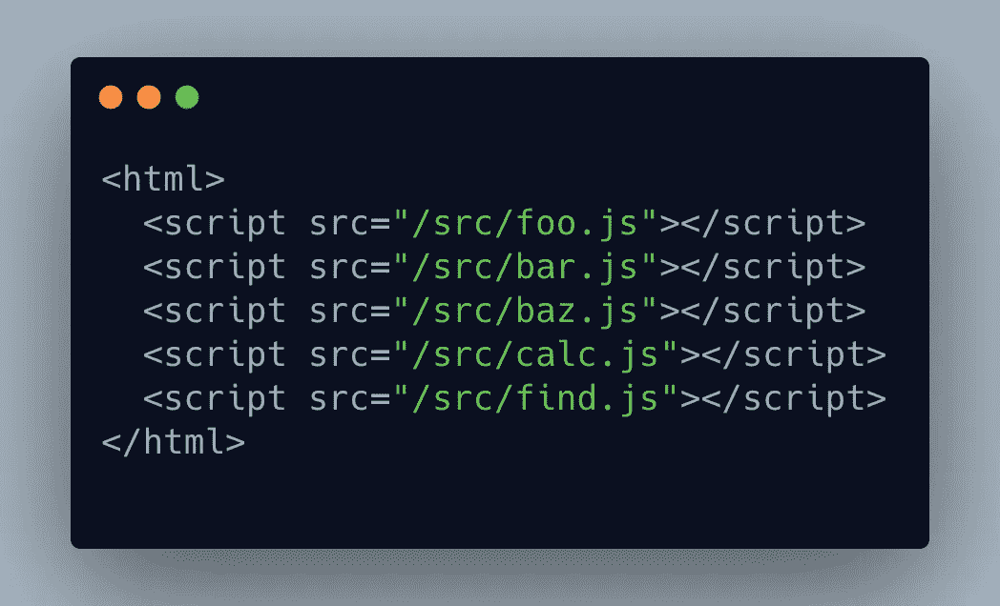
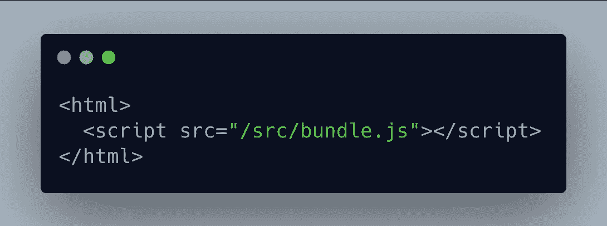
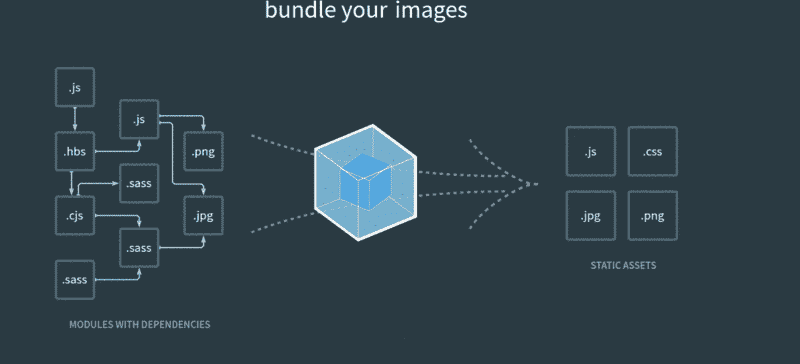

# 5 分钟内完成模块打包——什么、为什么和什么

> 原文：<https://betterprogramming.pub/javascript-module-bundlers-2a1e9307d057>

## 了解模块捆绑器在 web 开发中的作用，并使用三个流行的选项

背景图像—无飞溅

模块打包工 —你可能已经听说过他们一千次了，但是你有没有想过他们的必要性或者他们在幕后做什么？为了理解它们的作用，我们需要回到过去一点。所以，让我们开始吧。

# 为什么我们需要一个模块捆绑器？

回到古代，建立一个网站只需要 HTML、JS、CSS，事情就简单多了。但当互联网呈指数级增长时，构建更复杂的网页和应用程序的需求也在增长。想象一下，我们正在用传统的方式编写一个复杂的网站，只使用这三个。在理想的情况下，为了简单起见，我们将 JS 分成不同的文件，并将它们包含在 HTML 中。这里有一个例子:

但是在这种情况下，每个文件将发出单独的 HTTP 请求，这导致了加载应用程序工作所需的所有内容的五个请求。为了避免这种情况，我们可以将它们合并成一个文件，其中包含所有内容，如下所示:

但是这使得手动管理文件变得复杂和庞大。这不是一个容易或简单的过程。例如，两个文件可能具有相同的函数和变量，在部署之前解决问题将是一件令人头疼的事情。

让我们考虑一个更现代的项目例子，它是用 Angular 这样的 JS 框架构建的，并且使用了 npm 的库。这在部署时会导致更多的问题。在构建时，我们会有太多的文件需要手动跟踪。如果项目依赖于某个库，那么该库可能依赖于多个其他库才能工作。这将要求开发人员在构建时创建一个复杂而庞大的依赖关系图。

另一个问题是确保您编写的或库使用的 JS 代码在所有浏览器上的工作方式都是一样的。您可能需要为一些功能编写不同的代码集，以便在传统浏览器上工作。

即使我们克服了上述所有问题，以某种方式合并了所有内容——没有任何名称冲突或范围问题——在花费了太多的开发时间后，它可能会创建一个巨大的 JS 文件。这个文件将大大增加我们网站的加载时间，因为所有的东西都以一种非优化的方式捆绑在一起。不用说，所有这些花在开发应用上的时间实际上可以用来开发更多的功能或增强我们的 web 应用。

# 什么是模块捆绑器？

用最简单的术语来解释，模块捆绑器是一个开发工具，它可以修复上面提到的所有问题，从而节省时间并优化我们的应用程序以获得最佳性能。模块捆绑器最重要的任务之一是获取多个 JS 文件，并将它们组合起来创建一个文件，该文件包含我们编写的代码以及加载到浏览器中所需的库。

项目中的库可能有多个依赖项，每个依赖项可能都有自己的依赖项。bundler 创建一个依赖图来跟踪这一点，我们所要做的就是指定项目的入口点。例如，如果 App.js 是我们的入口点，那么 bundler 将扫描文件的依赖性，然后扫描每个产生的依赖性文件来创建图形。这是非常重要的——没有它，浏览器就不知道在哪里寻找我们在项目中使用的任何模块。

模块捆绑器如何将项目提取到静态资产中的示例。

bundler 还通过将所有 CSS 文件合并到一个缩小的文件中，为 CSS 等其他文件创建类似的过程。图像、字体等资产。，也被映射并捆绑在一起以获得最佳性能。捆绑器还允许您定制整个过程，以满足项目的各种需求。

总而言之，现代 web 项目需要模块捆绑器，因为:

*   它帮助开发人员管理项目中的依赖关系，如果手动完成，这将花费大量时间。此外，它还可以帮助您按照依赖顺序加载模块。
*   避免浏览器不完全支持模块系统的问题。
*   它有助于转换、优化和精简我们的代码，使其正常工作
*   它有助于优化和加载资产，如 CSS，图像等。，按照它们的依赖顺序

现在让我们来看看一些最流行的模块打包器

# 1.网络包

Webpack 是目前最流行的静态模块打包工具之一。它按照模块捆绑器应该工作的方式工作——通过构建依赖图来映射项目需要的每个模块。Webpack 的一些优点和缺点包括:

*   基于可定制的配置生成输出。我们可以定制分割点，在同一个项目中创建单独的包。
*   更多地控制如何对待遇到的不同资产。
*   丰富灵活的插件基础设施。
*   需要时间来学习，包括理解复杂的配置文件，它的语法有点难以掌握。

# 2.卷曲

[Rollup](https://rollupjs.org/) 是另一个流行的模块捆绑器，它使用 JavaScript 的 ES6 修订版中包含的代码模块的新标准化格式，而不是以前的特殊解决方案，如 CommonJS 和 AMD。选择汇总时需要注意的一些要点是:

*   与 Webpack 相比，Rollup 生成的包要小得多，并且没有**模块映射。**
*   汇总具有用于导入/导出的节点聚合填充。
*   Rollup 支持配置中的相对路径。
*   所有的模块都被**【展平】**成的包，还有没有功能包装的模块。这在许多情况下非常有用，但是当存在循环依赖时，它并不总是工作得很好。
*   它不支持异步/等待开箱即用。

# **3。包裹**

Parcel[与其他两个类似，除了它比其他两个做得更有效率。比如*死码消除*或者更俗称*树摇。*包支持 ES6 和 CommonJS 模块的树摇动。选择要构建的宗地时，您会得到以下结果:](https://parceljs.org/)

*   对 JS、CSS、HTML、图像等的现成支持。，不需要插件。
*   它可以拆分输出包，使我们能够只加载最初需要的内容。
*   当出现错误时，它可以精确定位代码帧，因此我们可以更快地定位问题。

# 4.积雪场

在这个列表中，Snowpack 是我个人最喜欢的，也是 bundler 世界的最新成员。由于同样的原因，它有很多优点，也有一些局限性。为了增加视角，Webpack 在 2012 年发布——甚至在 ES 模块存在之前。而 Snowpack 是在 2019 年现代浏览器支持 ES 模块和 ESNext 的时候出现的。

当其他打包程序转换你的代码时，Snowpack 更多的是一个安装时工具，而不是。例如，Webpack 具有令人印象深刻的捆绑功能，每次我们对项目进行更改时，它都需要时间来生成构建。另一方面，Snowpack 不需要花时间来做这件事，因为它不需要为每一个变化重新构建项目。使用 Snowpack 的一些主要优点是:

*   直接为浏览器编写 ES 模块，允许即时预览代码。
*   仅重建已更改的特定文件，而不是重建所有依赖项。
*   更高效的缓存——如果代码或 npm 依赖项发生变化，访问网站的用户只需下载发生变化的确切文件和依赖项。不多不少！

# 结论

好了，暂时就这样了。如果你以前没有用过 Snowpack，你可能想试试它，看看它有多简单和高效。

此外，如果您不熟悉整个模块捆绑器的概念，了解它们的最佳方式是尝试创建一个非常简单的项目，并使用不同的捆绑器和不同的配置来实验构建它。比较结果，然后尝试在更大的项目中根据您的需要定制它们，以掌握捆绑的艺术，从而创建更快、更高效的 web 应用程序。