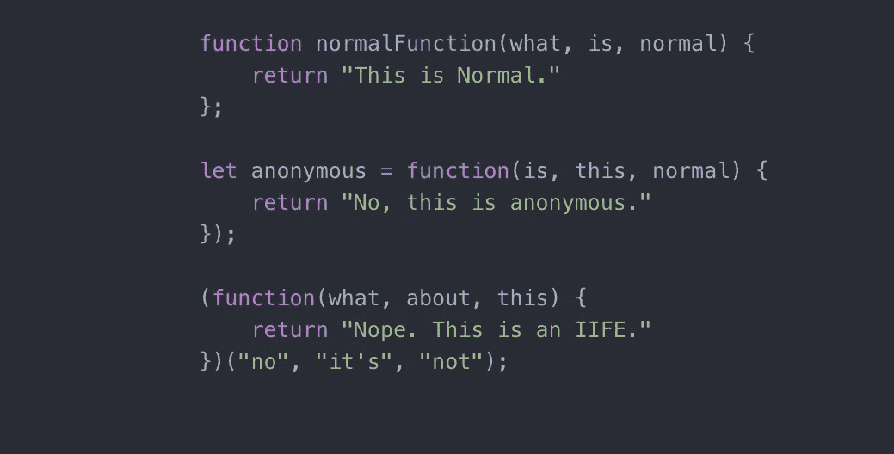
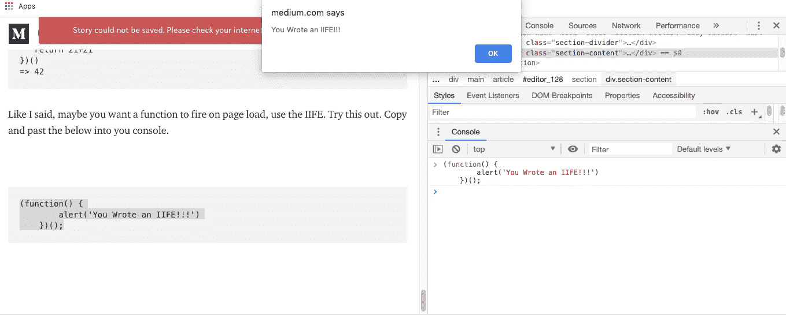

# JavaScript:普通函数、匿名函数和生活函数

> 原文：<https://betterprogramming.pub/javascript-normal-anonymous-and-iife-functions-11505360e4d1>

## 为什么函数有用，它们有什么作用



九天的全职 JavaScript。来自 [Ruby](https://www.ruby-lang.org/en/) ，我完全忘记了如何在 JavaScript 中定义一个函数(我以前确实有过一些经验，都被遗忘了)。

幸运的是，一些概念和 Ruby 是一样的，Ruby 是我在六周前学的语言。我深情地回忆起那些日子。简单。灵活性。句法微风！

我只能拿 JavaScript 和 Ruby 比，我只懂 Ruby。从 Ruby 过渡到 Javascript 起初是一个令人沮丧的过程(尽管比什么都不学编程语言要容易得多)。

# 功能

请允许我描述一下函数为什么有用以及它们的作用。

打个比方:你在一家超级繁忙的餐馆工作。超级忙。他们只供应千层面。你的工作是用微波炉加热每一片千层面一分钟。

你一小时要做 59 片。输入 1，然后 0，再 0，然后开始会消耗太多时间。你的老板 Guido Salami 开始生气了，因为你在过去的一个小时里只生产了 58 片。

然后你注意到微波炉上的一个按钮，它显示*一分钟* **。由于你正在做一项远低于你认知能力的工作，你推断这个按钮被预先设定为一分钟，按下后就会启动。**

所以，现在你要做的就是放入一个冷切片，关上门，按一分钟。第二个小时你做了 60 片千层面，你的创新给 Guido 留下了深刻印象，他给你加薪升职，你拒绝了，成为了一名 JavaScript 开发人员。

这就是函数的作用。它为您执行重复的数据任务，因此您不必在每次需要时都键入行为。

多么有趣的类比。

# 基础和正常/声明的函数

学习 JavaScript 时，我注意到的第一件事是编写函数时的一些通用规则。首先，你必须让 JavaScript 知道它是一个函数。

这是你怎么做的。

```
function
```

好，我给你一个函数的真实例子。

```
function realExample(){}
```

函数名为`camelCase`。在定义这种类型的函数时，花括号是必要的，它是函数的主体，是你操作数据的地方。

当您的`index.js`页面加载时，它保存这些函数供以后使用(不立即执行)。

## 使命感；责任感

如何不调用函数？

```
realExample*=> ƒ realExample(){
}
this merely returns what your function is.*
```

如何调用函数？

```
realExample()
 *runs the function*
```

调用这种类型的函数时，括号是必需的。

好了回到我们的`realExample` 用函数体来运行*。*

```
function realExample(){
   21+21
}
```

从逻辑上讲，你会假设当我调用`realExample()` *，* 42 将是返回值。让我们来测试一下。

```
function realExample(){
    21+21
} => *undefined*realExample()
=> *undefined*
```

啊哦。发生了什么，我们如何解决？第一件事。函数值必须显式返回！

如何在函数中显式返回值？

```
function realExample(){
    **return** 21+21
}
=> 42
*There you go. The answer to life, universe, and everything.*
```

让我们通过添加参数来增加这个函数的复杂性。我们把它们放在括号里。

示例:

```
function realExample(num1, num2){
    return num1+num2
}
```

这是函数的功能真正变得有用和动态的地方。示例:

```
realExample(21,21)
=> 42
*The meaning of everything.*
```

现在，无论何时你想把两个东西加在一起，你都可以使用函数。

```
realExample("forty","-two")
=> "forty-two"
*Universe.*
```

酷毙了。下一个。

# **匿名函数**

匿名函数是匿名的函数。它没有名字。然而，它可以存储在一个变量中，并以基本相同的方式运行。

示例:

```
let universe = function (num1, num2){
return num1+num2
}*Notice the lack of function name, we've saved it to a variable. This is what makes it anonymous.*
```

## **调用匿名函数**

这与调用常规函数非常相似，但是你调用变量名，因为没有函数名。如果你愿意，你可以把它保存到一个不同的变量中。

示例:

```
let universe = function (num1, num2){
    return num1+num2
}universe(21,21)
=> 42let everything = universe(21,21)everything
=> 42let nothing = universe(0,0)nothing
=> 0
```

# IIFE(立即调用的函数表达式)

这是一个多汁的。它用来节省空间，让你的代码看起来更整洁。编码是关于效率和清晰的。

当你有一堆函数需要在页面加载时立即调用时，使用 IIFE 来节省空间并使你的代码更具可读性。

我们再来看看正常的方式。

```
function realExample(){
 return 21+21
}universe()
=> 42
```

相当于生活。

```
(function(){
   return 21+21
})()
=> 42
```

值会立即返回。这是正在发生的事情的概述。

你在括号里写一个未命名的函数，然后在后面加一组括号，来调用它。

```
*start with empty parenthesis*
1\. (); 
*write unnamed function inside those parenthesis
2.(function(){
   return 21+21
});
call function by adding a set of parenthesis at the end.
3\. (function(){
   return 21+21
})(); => 42*
```

现在，您可以传入参数来增加复杂性和动态性。

```
(function(num1,num2){
    return num1+num2
})(21,21); => 42
```

正如我所说的，如果你想要一个函数在页面加载时触发，使用 IIFE。

试试这个。将以下内容复制并粘贴到您的控制台中(左键单击页面上的任意位置，单击控制台选项卡，粘贴代码，然后按 enter 键)。

```
(function() {
        alert('You Wrote an IIFE!!!')
    })();
```

希望你能收到这个提醒。

此外，你可以看到我写这篇文章的时候，我想到了这个比喻，什么即兴创作！



写生活有几种语法方法，我喜欢先简化，然后再扩展。

注意那些语法错误。


我发誓是插入语。

尽情享受吧！

# **资源**

*   [W3schools](https://www.w3schools.com/js/js_function_definition.asp)
*   [MDN 功能](https://developer.mozilla.org/en-US/docs/Web/JavaScript/Reference/Functions)