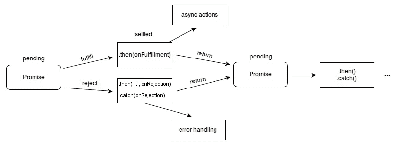
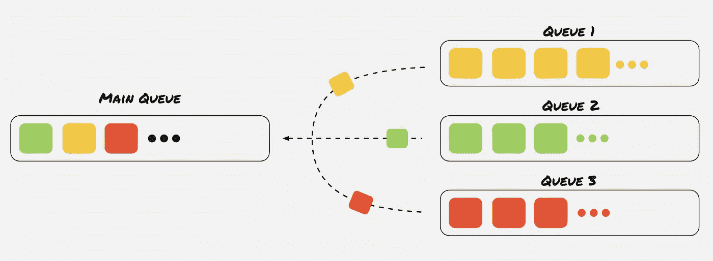
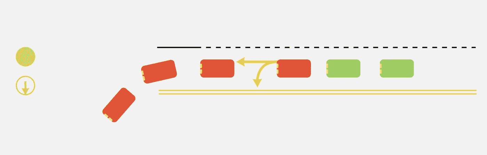
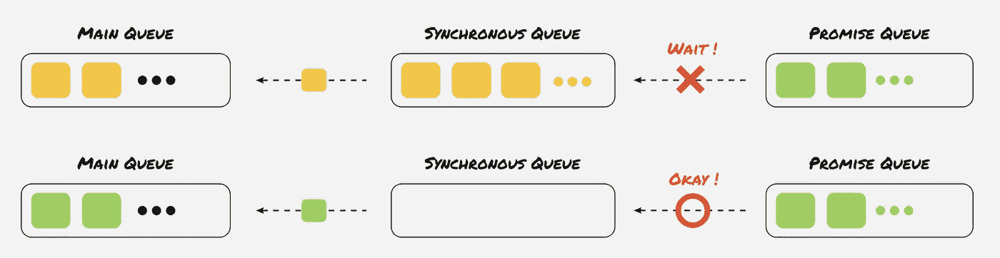

# JavaScript 承诺:知道何时使用它以及它是如何工作的

> 原文：<https://betterprogramming.pub/javascript-promise-know-when-to-use-it-and-how-it-works-b8671e585e53>

## promise 不是 async/await 的旧版本


[好色之徒 WOW Tech](https://unsplash.com/@womanizer?utm_source=medium&utm_medium=referral) 在 [Unsplash](https://unsplash.com?utm_source=medium&utm_medium=referral) 上拍摄的照片

许多日常使用 JavaScript 的开发人员喜欢使用`async/await`语法。它不仅易于学习和使用，而且还可以使您的代码更具可读性和可理解性。然而，你知道有时候你需要使用`Promise`语法而不是`async/await`语法吗？

在这篇文章中，我将解释`Promise`是如何工作的，以及何时应该使用它。

# 先决条件

你应该已经知道`Promise`的基本用法了。

# 承诺是如何在幕后运作的



《无极》工作流程(作者)。

我想你们很多人已经知道`Promise`的阶段是什么了。一旦你完成了在一个`Promise`构造函数中所做的任何事情，它就会返回另一个`Promise`并等待你在构造函数中所写的事情被完成。这将是`fulfilled`或`rejected`。

让我们看一个简单的例子:

你能猜出结果吗？

显然`1`首先会被打印出来。由于`setTimeout`是一个异步函数，您会想，“它将在以后的某个时候被执行。”然后，你遇到了`Promise`。“嗯，一个`Promise`也是一个异步的东西，所以我猜这个会在`setTimeout`之后执行，因为我先遇到了`setTimeout`。”

所以你很确定答案是`1-2-3-4`或`1-3-2-4` …哪个是错的。

我遇到的许多开发人员都知道`Promise`被认为是异步的，但是他们并不真正知道*为什么*被认为是异步的。

我将提出几项声明。看看你认为有多少是正确的:

*   JavaScript 是一种单线程语言。(O/X)
*   JavaScript 有多个任务队列。(O/X)
*   JavaScript 一次只运行一个任务。(O/X)
*   JavaScript 可以在内部区分不同任务的优先级。(O/X)

答案都是 o。都是正确的。众所周知，JavaScript 是一种单线程编程语言，在这种语言中，一次只能运行一个任务。不过，它可以决定你处理不同任务的顺序，从而有效地管理几个任务。JavaScript 有几个任务队列，我会进一步解释。

## 任务队列看起来像什么？



队列的工作流程…但是 JavaScript 不是这样工作的(太简单了)。

这是它们的样子。

JavaScript 有几个任务队列——可能有三个或更多——当您逐行阅读代码时，每个相关的任务都进入一个队列。例如，如果您阅读:

```
console.log(1);
```

这不会立即执行。内容为“在控制台上打印 1”的新任务进入其任务队列(上面工作流中的黄色、绿色或红色队列)。而一旦到了执行这个任务的时候，你终于可以看到印在控制台上的数字了。我不会深入研究这个问题，因为它对你来说太基础了。

但问题是“我怎么知道当前任务去哪个任务队列？”

## 你如何知道每个代码何时被执行？



由于这个帖子是关于`Promise`的，所以我主要试着用`Promise`来解释一下。

让我们考虑一个交通信号和想要左转或直行的司机。

*   红色汽车:想左转的司机。
*   绿色汽车:想直行的司机。

红色的车正在左转，因为左转的标志亮了。但是所有红色车后面的绿色车呢？他们想直行并穿过十字路口，然而他们不得不等待所有的红色汽车离开。

这个简短的演示类似于`Promise`任务的工作方式。

JavaScript 在内部将命令分成几部分。本文中您应该记住的一点是，`Promise`与其他任务的分类不同，例如`console.log`、`new Date()`或其他不被认为是异步的任务。

在上面的演示中，`Promise`任务是等待轮到他们直行穿过十字路口的绿色汽车。而其他的同步任务就是左转的红车。`Promises`必须等到同步任务的队列空了，就像绿色的车必须等到所有要走左边的车都走了。由于这非常重要，我将重复我自己的话:`Promises`必须等到所有同步任务执行完毕。

因为`Promise`的构造函数内部的区域不是异步的，所以`“resolve”`将首先被记录。它向`Promise.then`发送另一个`Promise`和消息`“resolve”`。这是一个异步区域，所以它必须等到所有其他同步任务都执行完。下面有一个无限循环，所以程序会永远卡在那里。你将永远没有机会看到`Promise.then`的日志。



承诺(异步)和同步任务之间的关系。

上图解释了`Promises`和同步任务的关系。

# 什么时候应该使用承诺？

## 当按您想要的顺序排列任务时

`Promise`任务只有在同步任务队列为空后才执行，所以用`Promise`代替`async/await`是非常有益的。

假设您使用`async/await`语法来获取一些 API。

`changeUIComponents`应在获取`login` API 后运行，`reloadPage`应在获取`updateProfile` API 后运行。在这段代码中，您的程序必须等到`login`和`updateProfile`每行都返回一个结果:

然而，有了`Promise`，你可以通过推迟任务的执行，在你想按特定顺序排列的任务中建立更安全的序列。

前两行`changeUIComponents`和`updateProfile`将在`goto`完成运行后执行，这是在同步队列为空之后。一旦`updateProfile`返回结果，就会执行`reloadPage`。

## 当增强性能时

让我们看看这个例子。

在`my-page`页面上，用户等待获取和加载三条信息(用户信息、账单历史和朋友列表)。

页面上最重要的数据是关于我的信息。所以让用户等待获取相关数据似乎更好，但是其他数据呢？不需要预先获取用户的账单历史或者用户有多少朋友。因此，我会稍微重构一下这段代码:

现在，当第一次呈现页面时，只获取用户信息。之后，账单历史和朋友列表将被提取。

用户不必在第一次呈现时等待不太重要的数据。

# 结论

在执行之前，A `promise`必须一直等待所有同步任务完成。事实上，JavaScript 规范在普通任务队列中调用同步任务所在的队列，在微任务队列中调用`Promises`所在的队列。

我还提到，通过将`Promise`放在适当的位置，您可以使用`Promise`来获得更好的性能。