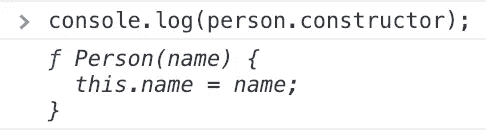
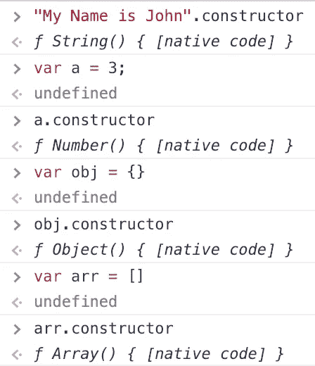
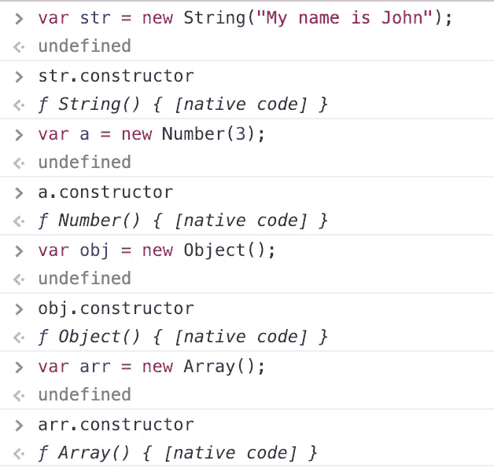
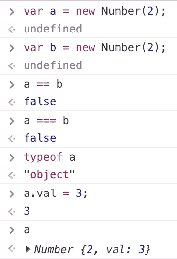
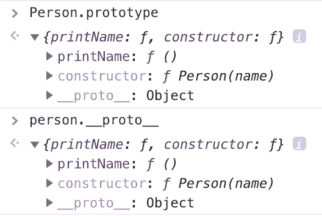
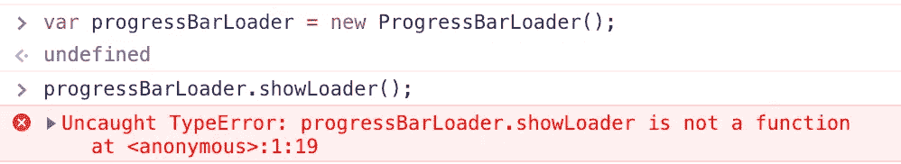
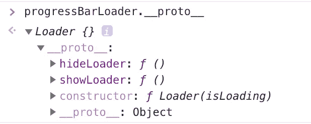

# JavaScript:对原型继承的深入研究

> 原文：<https://betterprogramming.pub/javascript-prototypal-inheritance-in-depth-fb46ea20b9cd>

*借助代码示例和控制台输出，深入了解 JavaScript 继承和实现它所涉及的概念。它的目标读者是对 JavaScript 如何工作有基本了解，并且希望以一种详细的方式理解 JavaScript 继承的人。我们将把范围限制在 ECMAScript5，这是 ECMAScript6 (ES2015)之前的版本。*


图片由 [Taras Shypka](https://unsplash.com/photos/86b0GW7aLUw?utm_source=unsplash&utm_medium=referral&utm_content=creditCopyText) 在 [Unsplash](https://unsplash.com/search/photos/chrome-extensions?utm_source=unsplash&utm_medium=referral&utm_content=creditCopyText) 上拍摄

## JavaScript 继承很难

人们经常认为 JavaScript 的继承比其他编程语言(如 Java)中典型的经典继承模式更容易理解，因为它冗长且概念复杂，如变量作用域(`private`、`protected`、`friend`、`interface`等)。)在这些语言中找到。虽然这些概念在 JavaScript 中并不存在，但它有自己的一套特性和概念，并不总是容易理解，例如`this` **、** `call` **、** `prototype` **、** `new` **、**函数构造函数**、**`constructor`**、**等等。

到目前为止，作为一名前端开发人员，我发现我的大部分工作都围绕着使用 JavaScript 库/框架，而不是原生 JavaScript。这些库很好地抽象了这些语言特性，并为我们提供了它们自己的 API，这导致了更快的应用程序设置，并使编写应用程序代码变得更快更容易。然而，这样做的缺点是，随着时间的推移，不使用原生 JavaScript 会削弱我们对这些概念的理解——一切都变得有点模糊。当然，我们可以只用标准的 JavaScript APIs 来构建应用程序，很多人更喜欢这样。但是 JavaScript 社区的很大一部分，尤其是前端的，通常都使用库。要成为一名更好的开发人员，我们必须很好地掌握这些概念。今天，我们将致力于加强控制。

# 班级

与其他编程语言不同，JavaScript 没有任何名为`class`的语言结构。

> JavaScript 中的类是使用函数实现的。每当我们使用一个函数来创建一个类时，它就被称为函数构造器。所有对象都是使用函数构造函数和关键字`*new*`创建的。

JavaScript 的新版本 ES2015 引入了`class`关键字，但这仅仅是在函数构造函数上的语法糖衣。“函数构造函数”和“类”可以互换使用，因为它们在 JavaScript 中表达了相同的概念。稍后我们将看到*为什么*这样的函数被称为函数*构造函数*。让我们创建我们的第一个类:

```
function Person(name) {
  this.name = name;
}var person = new Person('John');
```

虽然语法非常简单，但这里有几个概念。让我们试着去理解它们。

## 新建，构造函数

首先，我们创建一个函数`Person`(它还不是函数构造器！).第一个字母大写仅仅是一种约定，表示它将被用作函数构造函数。接下来，我们使用`new`操作符创建一个`Person`的实例。让我们看看`new`在引擎盖下做了什么:

*   它将`this`的值设置为正在创建的实例。通常，`this`指向调用*函数的对象。*如果`new`没有执行这一步，`this`就会指向语句`var person = new Person('John')`执行的上下文中的对象。你可以在这里阅读更多关于`this` [的内容](https://developer.mozilla.org/en-US/docs/Web/JavaScript/Reference/Operators/this)。
*   从函数中隐式返回`this`，也就是说，我们不必在函数的末尾写`return this;`。请注意，这种隐式返回只发生在我们没有显式指定要返回什么的时候。
*   将`person`的`constructor`设置为`Person`。这是`Person`成为`person`的函数*构造器*的步骤。如果您记录了`person.constructor`，您将会看到以下输出:



让我们在关键字`constructor`上多停留一会儿。在基于类的语言中，每当我们创建一个类蓝图时，我们在类中显式地指定它的`constructor`函数，并且每次从类中创建一个新对象时运行它。构造函数的工作是初始化被创建的对象。

那么，我们如何指定一个 JavaScript 类的构造函数呢？我们没有。在 JavaScript 中，类的构造函数就是类本身。每次创建新对象时，都会运行函数构造函数。

> 我们可以通过查询`*object.constructor*`知道任何对象的函数构造器/类。

注意这里的*对象*不能被解释为对象文字——它们也可以是原始数据类型。

让我们来看看 JavaScript 中一些常见数据类型的内置函数构造函数，以便更清楚地理解:



你们中的一些人可能会想，“*嘿，我们没有在这里使用* `new` *来创建一个实例。那么，为什么在* `Person` *的例子中需要而在这里不需要呢？背后的原因是所有这些实例都是使用内置函数构造函数创建的。JavaScript 为我们提供了更简单的 API 来初始化这样的实例，并且不需要我们使用`new`来创建它们。但这并不意味着我们*不能*利用`new`来创造它们:*



**注意:**使用`new`创建内置函数构造器的实例可能会导致潜在的错误。例如，考虑以下代码:



在上面的例子中，你会期望`a`和`b`相等，但是它们不相等。为什么？因为:

> `*new*`总是创建`*object*`数据类型的实例。创建的实例，不管它包含什么数据类型，都遵循普通对象的所有规则。

`a`和`b`不相等，因为它们是对象，并且两个对象不会被`==`或`===`视为相等，除非它们指向内存中的同一个对象，而不管它们是否具有相同的值。乍一看，这似乎是反直觉的，尤其是在这个例子中，因为我们期望存储相同数字的两个变量是相等的。

# 原型遗传

JavaScript 遵循原型继承模式。让我们通过一个一个的概念来理解它。

## 原型

创建类时的一个常见用例是向它添加方法。让我们看看如何做到这一点:

```
function Person(name) {
  this.name = name;
  this.printName = function() {
    console.log('Hi! My name is ' + this.name);
  }
}var john = new Person('John');
john.printName();               /**/ Hi! My name is John**
var jane = new Person('Jane');
jane.printName();               **// Hi! My name is Jane**
```

这种方法的问题是，对于每个新的`Person`实例，都会创建一个新的`printName`副本，它存在于实例中，浪费了不必要的内存。我们真的不需要在每次创建一个实例时都有一个新的`printName`副本，因为它是恒定的，并且在所有实例中表现相同。为了解决这个问题，我们使用了`prototype`关键字。

> JavaScript 中的所有函数默认都有一个`*prototype*`属性，其值是一个对象。如果一个函数被用作函数构造器，那么所有使用该函数创建的对象都可以访问该函数的原型对象。

```
function Person(name) {
  this.name = name;
}Person.prototype.printName = function() {
  console.log('Hi! My name is ' + this.name);
}var john = new Person('John');
john.printName();               **// Hi! My name is John**
var jane = new Person('Jane');
jane.printName();               **// Hi! My name is Jane**
```

现在，`printName`在定义`Person`
时只在内存中创建一次，它存在于`Person.prototype`上。除了节省内存之外，向`prototype`添加方法和变量的另一个很大的好处是，无论我们何时向`prototype`添加任何东西，所有创建的实例都可以立即访问它，而不管它们是何时创建的。例如:

```
function Person(name) {
  this.name = name;
}var person = new Person('John');Person.prototype.printName = function() {
  console.log('Hi! My name is ' + this.name);
}person.printName();       **// Hi! My name is John**
```

如果我们在上面的例子中没有使用`prototype`而直接在`Person`上定义了`printName`，那么`person`对象将无法访问`printName`，因为`person`是在`printName`被添加到`Person`之前被实例化的。通常，我们并不知道在定义类的时候需要添加到类中的所有方法/常量。`prototype`
使我们能够在以后向一个类中添加内容，并使这些内容在所有实例中可用——即使它们是在过去创建的。

## 原型链

当我们调用`person.printName`时，`printName`并不直接存在于`person`上。那么，JavaScript 是怎么知道它会存在于`Person.prototype`上的呢？`person`上一定有*的东西*告诉它使用`Person.prototype.printName`。那东西就是`__proto__`属性。

> JavaScript 中的所有对象都有一个名为“dunder proto”的`*__proto__*`属性，通常表示为`*[[Prototype]]*`，它包含对创建对象的类的`*prototype*`的引用。

在上面的例子中，当我们做`person.printName`时，实际发生的是 JavaScript 首先检查`printName`是否直接存在于`person`上。它没有，所以使用`person.__proto__`来访问找到`printName`的`Person`的`prototype`。下面是`person.__proto__`的样子:



如果`Person`的原型上没有`printName`会怎样？如果是这种情况，那么`Person.prototype.__proto__`将被查询，以此类推。这种顺序的自底向上查找来评估对象的属性被称为*原型链接*。

还记得我们在关于`constructor`关键词的部分做了`person.constructor`吗？`constructor`是否直接存在于`person`上？答案是否定的。`person.constructor`实际上指的是`Person.prototype.constructor`。我们已经知道，无论何时创建一个函数，它都有一个默认的包含原型对象的属性。默认情况下，这个原型对象的`constructor`属性也设置为函数本身，这样每当我们引用使用该函数创建的任何对象上的`constructor`时，都可以使用它。

那么，这个原型链有多高呢？JavaScript 中的所有类都继承自`Object`类。每当我们查找一个对象的属性时，`Object.prototype`就是查找过程的范围。换句话说:

> `*Object*`是 Javascript 中所有类的基类，因此`*Object.prototype*`是原型链的根。

如果那份财产甚至在`Object.prototype`上都不存在，那么它就被视为不存在。

让我们来看看一个我们大多数人都用过的原型链接的简单实例:

```
var arr = new Array(1, 2, 3);
arr.forEach(function(item) {
  console.log(item);
});
```

当执行`arr.forEach`时，JavaScript 首先检查`forEach`是否直接存在于`arr`上。它没有，所以它在内部检查`arr.__proto__`，因为`Array`是`arr`的函数构造器，所以它指向`Array.prototype`。它在那里找到`forEach`并调用它。`toString`是遍历原型链后发现的另一个方法的例子。它住在`Object.prototype`。

**注意:**`__proto__`属性不应该被覆盖，因为它会破坏原型链。它也不应该用于读取值，因为访问它非常慢。你可以在这里详细了解[。](https://developer.mozilla.org/en-US/docs/Web/JavaScript/The_performance_hazards_of__%5B%5BPrototype%5D%5D_mutation)

# 创建子类

子类是这样一个类，它从另一个类继承属性，但也有自己的唯一属性，这些属性覆盖父类的属性或不存在于父类中。让我们创建第一个子类:

```
**// base class**
function Loader(isLoading) {
  this.isLoading = isLoading;
}Loader.prototype.showLoader = function() {
  console.log('loader visible!');
}Loader.prototype.hideLoader = function() {
  console.log('loader hidden');
}**// subclass**
function ProgressBarLoader(isLoading, loadedPercent) {
  Loader.call(this, isLoading);
  this.loadedPercent = loadedPercent || 0;
}ProgressBarLoader.prototype = Object.create(Loader.prototype);
ProgressBarLoader.prototype.constructor = ProgressBarLoader;ProgressBarLoader.prototype.showLoadedPercent = function() {
  console.log('progress %: ', this.loadedPercent);
}ProgressBarLoader.prototype.setPercent = function(percent) {
  this.loadedPercent = percent;
}var progressBarLoader = new ProgressBarLoader(false, 0);
progressBarLoader.showLoader();         **// loader visible**
progressBarLoader.hideLoader();         **// loader hidden** 
progressBarLoader.showLoadedPercent();  **// progress %: 0**
```

这里发生了很多事情。让我们逐一检查它们:

## 呼叫

> `*call*`是一个函数，它帮助我们调用一个带有参数的方法，并将其`*this*`上下文设置为一个显式指定的对象。该对象作为`*call*`的第一个参数传入。

当我们创建一个`ProgressBarLoader`对象时，`Loader`在我们的`ProgressBarLoader`对象的上下文中被调用，属性`isLoading`被添加到该对象中。这样，`Loader`的属性被添加(或者，*继承，借用*)到任何使用`ProgressBarLoader`创建的实例中。这里需要注意的一点是，这些属性和方法是在类的实例化时添加的，而不是在定义时添加的。

在执行完`call`语句后，将`loadedPercent`属性添加到对象中，该属性是`ProgressBarLoader`独有的。

**注意:**需要注意的是`call`语句应该是子类中的第一条语句，以避免父类中同名的属性覆盖子类中的属性。

## 从子类调用父方法

考虑一个例子，其中具有父子关系的两个类具有相同的方法名，但是相同方法的不同实现:

```
function Parent() {
}Parent.prototype.printMe = function() {
  console.log('This is parent class!');
}function Child() {
  Parent.call(this);
}Child.prototype.printMe = function() {
  console.log('This is child class!');
}var child = new Child();
child.printMe();        **// This is child class!**
```

当在一个`Child`对象上调用`printMe`时，调用`Child.prototype.printMe`。如果我们想在一个`Child`对象上调用`Parent`的`printMe`呢？我们可以通过使用`call`来实现这一点:

```
Parent.prototype.printMe.call(child);   **// This is parent class!**
```

我们直接调用`Parent.prototype.printMe`。但是它是使用`call`调用的，这帮助我们告诉 JavaScript`printMe`必须在`Child`对象的上下文中调用。

这是可行的，但是不方便每次我们想调用父类的方法时都编写`Parent.prototype.printMe.call`。为了解决这个问题，让我们给`Child`添加一个方法，提供一个方便的 API 来调用`Parent`的`printMe`:

```
Child.prototype.printParentMe = function() {
  Parent.prototype.printMe.call(this);
}var child = new Child();
child.printParentMe();      **// This is parent class!**
```

## 对象.创建

> `*Object.create*`从现有对象创建一个新对象，该新对象可以访问现有对象的属性。

例如:

```
var loader = {
   showLoader: function() {
     console.log('loader is visible!');
   },
   hideLoader: function() {
     console.log('loader is hidden!');
   }
};var progressBarLoader = Object.create(Loader);progressBarLoader.showLoader();    **// loader is visible!**
progressBarLoader.hideLoader();    **// loader is hidden!**
```

那么，`Object.create`在引擎盖下做什么呢？它是从`loader`复制所有内容并添加到`progressBarLoader`吗？不是。是把`progressBarLoader`的`__proto__`设置成`loader`！

当我们调用`progressBarLoader.showLoader`时，JavaScript 检查`progressBarLoader`上是否存在`showLoader`。它没有，所以它使用`progressBarLoader`的`__proto__`沿着原型链向上，找到那里的方法并调用它。

在子类示例中，`Object.create`的用法如下:

```
ProgressBarLoader.prototype = Object.create(Loader.prototype);
```

让我们看看如果没有这条语句会发生什么:



当调用`progressBarLoader.showLoader`时，JavaScript 首先检查`progressBarLoader`上的方法。它没有在那里找到它，而是在`progressBarLoader`的原型上检查它。现在，`progressBarLoader`的原型是什么？它的`ProgressBarLoader`和`showLoader`在它的原型上不存在。因此，我们使用`Object.create`将`Loader.prototype`添加到`progressBarLoader`的`__proto__`中。它看起来是这样的:



现在，我们可以在不影响使用`Object.create`添加的`Loader.prototype`方法的情况下向`ProgressBarLoader.prototype`添加内容:

```
ProgressBarLoader.prototype.showLoadedPercent = function() {
  console.log('progress %: ', this.loadedPercent);
}ProgressBarLoader.prototype.setPercent = function(percent) {
  this.loadedPercent = percent;
}
```

## 子类.原型.构造函数

让我们来理解一下的意义:

```
ProgressBarLoader.prototype.constructor = ProgressBarLoader;
```

假设在我们的例子中没有这个语句。`ProgressBarLoader.prototype.constructor`会指向什么？通常，当我们创建一个函数时，比如说`fn`，那么`fn.prototype.constructor`就会指向`fn`本身。但是`ProgressBarLoader.prototype.constructor`指向`Loader`是因为在语句中:

```
ProgressBarLoader.prototype = Object.create(Loader.prototype);
```

我们设置`ProgressBarLoader.prototype`为参考`Loader.prototype`，`Loader.prototype.constructor`为`Loader`！为什么这是一个问题？这个[堆栈溢出](https://stackoverflow.com/questions/8453887/why-is-it-necessary-to-set-the-prototype-constructor)线程完美的解释了这一点。因此，我们将`ProgressBarLoader.prototype.constructor`设置为`ProgressBarLoader`。

**注意:**因为`ProgressBarLoader`被认为是`Loader`的子类，所以可以假设`ProgressBarLoader.constructor`将等于`Loader`。然而，事实并非如此。还是和`Loader`一样等于`Function`。这是因为，如我们所知，`constructor`属性指向*函数* *构造函数*，而`ProgressBarLoader`的函数构造函数仍然是`Function`。

因此，在 JavaScript 中:

> 创建子类只是借用基类的方法和属性。

在两个类之间只创建了一个*原型链接*，其他都没有改变。这与许多面向对象编程语言不同，在面向对象编程语言中，基类和子类之间有更严格的继承关系。

## “原型”一词的用法

每当有人在句子中使用“原型”这个词时，它可能有两种意思——关键字`prototype`或`__proto__`。要弄清楚这两个词指的是哪一个，就要理解它的使用环境。如果我们在谈论一个函数，那么“原型”指的是`prototype`关键字。如果讨论的主体是一个客体，那么‘原型’就是指`__proto__`。

# 结束了！

首先，感谢您花时间阅读这篇文章！

我们今天讨论的概念很复杂，通常需要时间来掌握，尤其是对于刚开始使用 JavaScript 的人。所以如果你仍然对他们没有 100%的信心，不要担心！很正常。这不是你的错。要接近 100，可能需要从多种来源进行多次阅读——以及编写 JavaScript 代码的一些实际经验。

如果您有任何问题或反馈，请在评论中提出！如果你觉得这篇文章对你有所帮助，请鼓掌以示感谢！😄