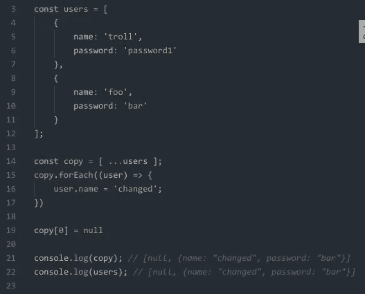
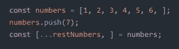
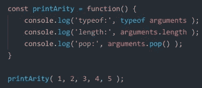
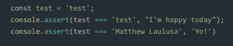

# JavaScript/React 琐事#2

> 原文：<https://betterprogramming.pub/javascript-react-trivia-2-b45406d08ff7>

## 你在这里独自玩的游戏的延续，在这一块


卡尔·劳在 [Unsplash](https://unsplash.com?utm_source=medium&utm_medium=referral) 上的照片

好吧，如果你正在读这篇文章，希望你已经看过了我关于 Javascript/React 的第一次测验。[如果你还没有，你可以点击这里查看更好地编程一个中型博客](https://medium.com/better-programming/javascript-react-trivia-4886795e8db7)。

第二次测验由 6 个问题组成。希望它们不会让你绞尽脑汁。

# 1.(对/错)函数参数(数字、布尔值、字符串、Null 和未定义的)通过引用传递

# 2.(对/错)考虑以下代码，注释是否代表正确的输出？



# 3.考虑下面的代码，会得到哪个答案？



a)警告:变异常量变量:数字。

b)错误:数组实例化不能以逗号结尾。

c)错误:使用值`…'的赋值无效。

d)错误:Rest 元素必须是最后一个元素。

# 4.考虑下面的代码，确定输出



答

```
typeof: Array
length: 5
pop: 1
```

b)

```
typeof: Array
length: 5
pop: 5
```

c)

```
typeof: Array
length: 5
TypeError: pop is not a function
```

d)

```
typeof: Array
length: null
TypeError: pop is not a function
```

# 5.考虑下面的代码，输出是什么？



答

```
Assertion failed: YO!
```

b)

```
Assertion failed: I’m happy today
```

c)

```
Assertion passed
Assertion failed: YO!
```

d)

```
Assertion failed: I’m happy today
Assertion passed
```

# 6.考虑下面的代码，断言会做什么？


答

```
6
Assertion failed: string!!!
```

b)

```
Assertion failed: string!!!
```

c)

```
6
Assertion failed: string!!!
'33'
7
```

d)

```
6
Assertion failed: string!!!
7
```

# 答案

## 问题 1

```
False. Numbers, booleans, strings, null, and undefined are all passed by value in JavaScript. Interestingly, objects and arrays are all passed by reference.
```

## 问题 2

```
False. Also false. This one can be a bit confusing. The spread operator is a shallow copy of the array. You can reassign the values at different indices. And it will only affect the copy array. The original array will stay the same. But if you mutate the values within the array, they are references so both the copy and the original will change.copy: [null, { name: "changed", password: "bar" }]
users: [{ name: "changed", password: "password1" }, { name: "changed", password: "bar" }]
```

## 问题 3

```
d) Interestingly, the only error here is that you cannot collect and then have a comma proceeding the collection. This will throw an error.
```

## 问题 4

```
c) The keyword arguments is in fact of type object but it is array-like so it has a length property but no .pop() function
```

## 问题 5

```
a) For this one, you just need to understand what console.assert does. If the test condition is falsy, then it will assert the message.
```

## 问题 6

```
c) It is also helpful to understand what console.assert does. It doesn't stop the rest of the code from running but also only asserts the message when the answer is falsy. Therefore when it's a string.
```

我希望你觉得这很愉快。有时候，测试一下你的知识，看看你知道多少是有好处的。

希望你玩得开心！

干杯！