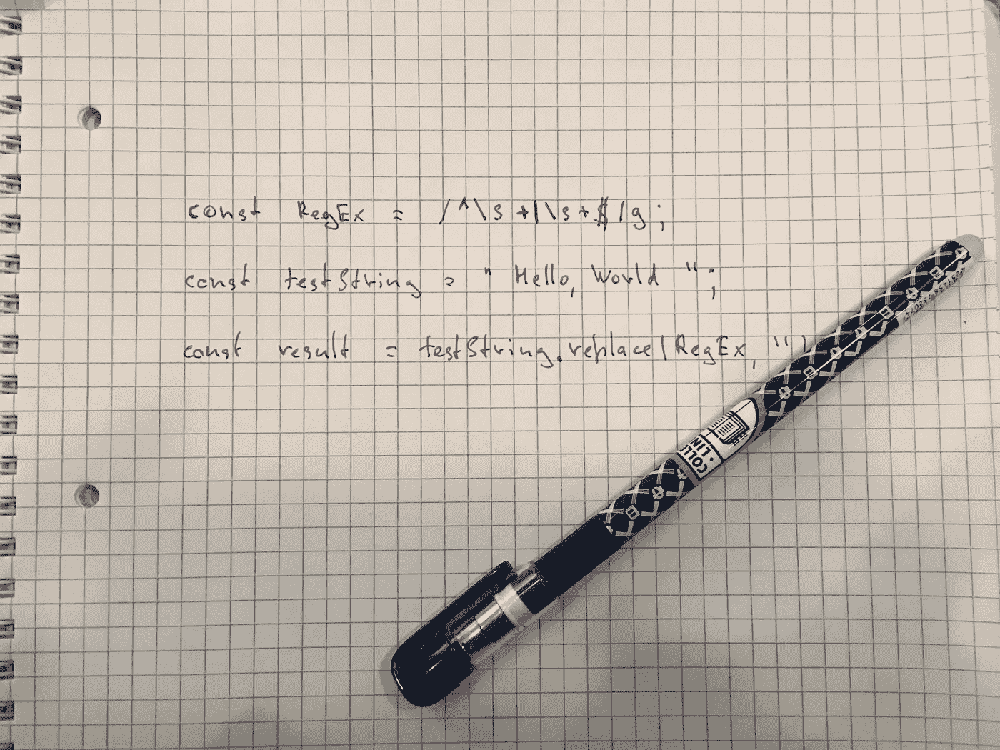

# JavaScript 正则表达式备忘单

> 原文：<https://betterprogramming.pub/javascript-regular-expressions-cheatsheet-b55b0d6886e3>

## 使用正则表达式在文本中找到你需要的内容



图片来源:作者

`.test()`获取正则表达式，将其应用于字符串，并返回一个布尔值。
`.replace()` 用另一个子串替换一个子串，返回修改后的字符串。`.match()` 提取您在返回数组中找到的实际匹配项。

# 小抄

## 匹配文字字符串

`/test/`搜索字符串的文字匹配。

```
const str = 'test';
const reg = /test/;
reg.test(str); // return true
```

## 或者(`|`)中的文字字符串

使用 or 运算符`|`搜索多个模式。

```
const str = 'second';
const reg = /first|second/;
reg.test(str); // return true
```

## 忽略大小写(`i`)

使用`i`搜索忽略案例。

```
const str = 'firstClass';
const reg = /firstclass/i;
reg.test(str); // return true
```

## 使用全局(`g`)

使用`g`多次搜索或提取图形。

```
const str = 'test test';
const reg = /test/g;
str.match(reg); // return ['test', 'test']
```

## 匹配任何带有通配符句点的内容(通配符、点号、句点)

通配符`.`将匹配任何一个字符。

```
const str = 'The string is strong';
const reg = /str./;
str.match(reg); // return ['stri']
```

## 用多种可能性匹配单个字符[ ]

使用`/[abei]/`使用字符类搜索具有一定灵活性的文字模式。

```
const str = 'The tree is strong';
const reg = /t[hr]e/gi;
str.match(reg); // ['The', 'tre']
```

## 匹配字母表中的字母

使用`[a-z]`搜索字母文字模式。

```
const str = 'The';
const reg = /[a-z]+/;
str.match(reg); // ['he']
```

## 未指定匹配单个字符

对于不想匹配的字符集，使用`[^ae]`。

```
const str = 'Test';
const reg = /[^ae]/;
reg.test(str); // true
```

## 匹配出现一次或多次的字符

使用`**+**` 匹配至少出现一次且可能重复出现的字符。

```
const str = 'the text, the apple';
const reg = /the+/g;
str.match(reg); // ['the', 'the']
```

## 匹配出现零次或多次的字符

星号`*` 匹配出现零次或多次的字符。

```
const str = 'greedy';
const reg = /e*/;
reg.test(str); // true
```

## 匹配开始字符串模式

脱字符号`**^**` 用于搜索字符串开头的模式。

```
const str = 'Test';
const reg = /^A/i;
reg.test(str); // false
```

## 匹配结束字符串模式(`$`)

使用`$`搜索字符串末尾的模式。

```
const str = 'test-id-sDb4r';
const reg = /-\w{5}$/;
const result = str.replace(reg, ''); // 'test-id'
```

## 匹配所有字母和数字

使用`\w`作为等于`/[A-Za-z0–9_]/`的字符类的简写。包括下划线(`_`)字符。

```
const str = 'sDb4r';
const reg = /\w/;
reg.test(str); // true
```

## 匹配除字母和数字以外的所有内容

`\W` 搜索是字母数字的反义词，等于`/[^A-Za-z0–9_]/`。

```
const str = 'sDb4r?';
const reg = /\W/;
str.match(reg); // ['?']
```

## 匹配所有号码/d

`/d` 用于查找数字字符，等于`/[0–9]/`。

```
const str = 'sDb4r?';
const reg = /\d/;
str.match(reg); // ['4']
```

## 匹配所有非数字

`/D`用于查找非数字字符，等于`/[^0-9]/`。

```
const str = 'sDb4r?';
const reg = /\D/g;
str.match(reg); //['s', 'D', 'b', 'r', '?']
```

## 匹配空格`\s`

使用`\s`搜索空白。该模式不仅匹配空白，还匹配回车、制表符、换页符和换行符。和`\r\t\f\n\v`差不多。

```
const str = 'test string';
const reg = /\s/;
str.replace(reg, ' new '); // 'test new string'
```

## 匹配非空白字符`\S`

使用`\S`搜索非空白。此模式不匹配空白、回车、制表符、换页符和换行符。和`^ \r\t\f\n\v`差不多。

```
const str = 'test string';
const reg = /test\S/;
reg.test(str); // false
```

## 用惰性匹配(`?`)查找字符

`?`查找字符串中满足正则表达式模式的最小可能部分。

```
const str = '<h1>Title</h1>';
const reg = /<.*?>/;
str.match(reg); // ['<h1>']
```

## 指定匹配的上限和下限

您可以使用数量说明符指定模式的上限和下限。数量说明符与花括号一起使用:({ })。你把两个数字放在花括号中，分别代表模式的上限和下限。

```
const str = 'google';
const str1 = 'gooogle';
const str2 = 'gogle';
const reg = /go{2,3}gle/;
reg.test(str); // true
reg.test(str2); // false 
reg.test(str1); // true
```

## 仅指定较低的匹配数

要指定较低的模式数，请在第一个数字后加一个逗号。

```
const str = 'google';
const str1 = 'gogle';
const str2 = 'goooogle';
const reg = /go{2,}gle/;
reg.test(str); // true 
reg.test(str1); // false
reg.test(str2); // false
```

## 指定准确的匹配数

要指定一定数量的模式，只需在花括号之间有一个数字。

```
const str = 'heel';
const str1 = 'heeeeel';
const reg = /he{2}l/
reg.test(str); // true
reg.test(str1); // false
```

## 选择全部或全部不选

有时，您想要搜索的模式可能包含可能存在或不存在的部分。

```
const str = 'favourite';
const str1 = 'favorite';
const str2 = 'faver';
const reg = /favou?/;
reg.test(str); // true
reg.test(str1); // true
reg.test(str2); // false
```

## 正向(`?=…`)和负向(`?!…`)前瞻

*Lookaheads* 是一些模式，告诉 JavaScript 在字符串中向前看，以进一步检查模式。

```
const str = 'abs123';Positive 
const reg = /(?=\w{2,6})/
reg.test(str); // trueNegative
const reg1 = /(?=[a-z]{3})(?!\d{3})/
reg1.test(str); // true
```

感谢阅读！我希望这些能帮到你。