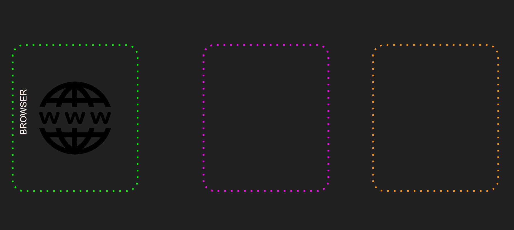
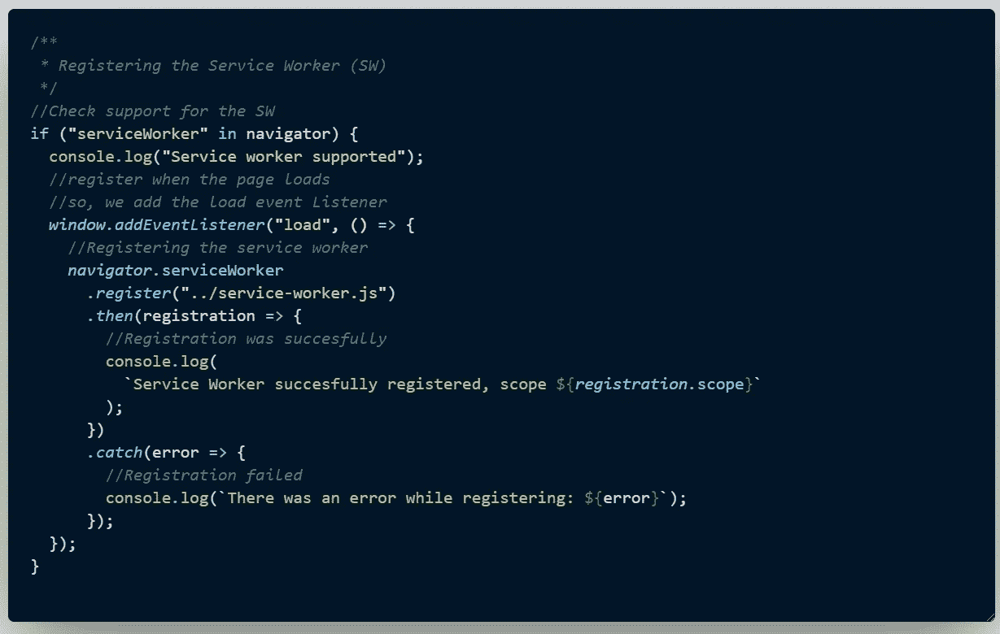
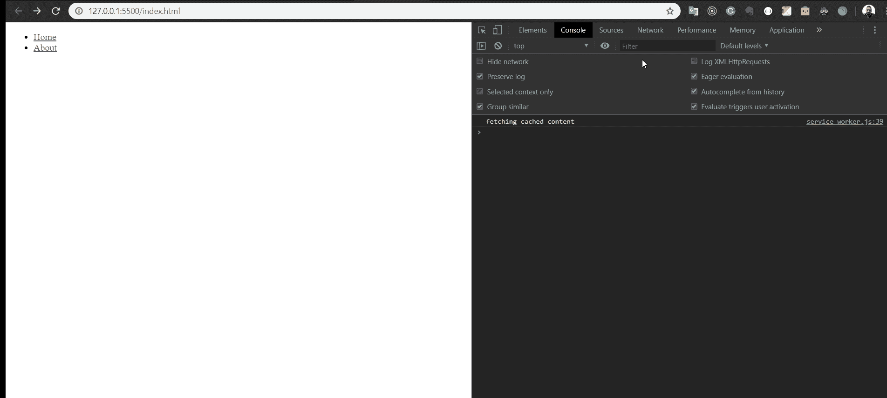
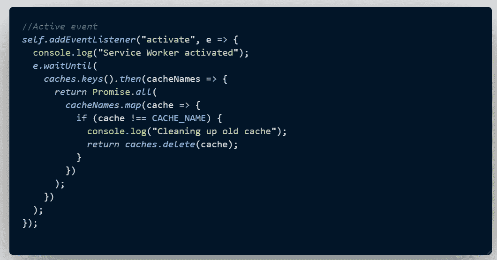
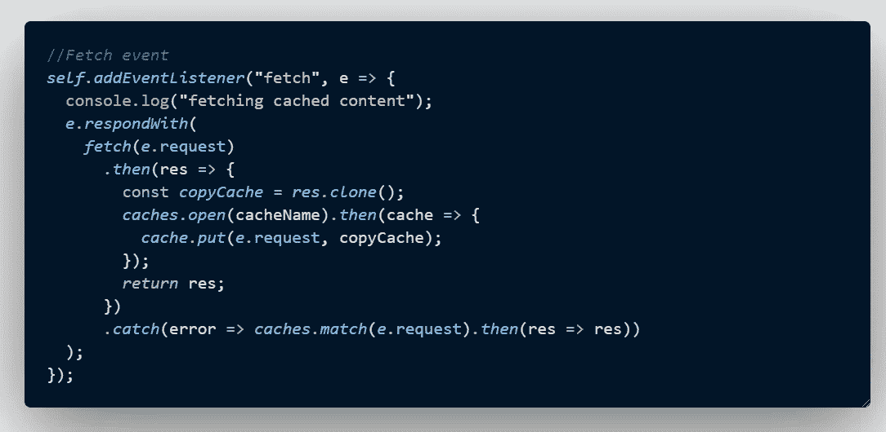

# JavaScript 服务人员，可视化

> 原文：<https://betterprogramming.pub/javascript-service-workers-visualized-308ca3292b6a>

## 服务人员是如何工作的，举几个例子

服务人员——作者

很可能，你们中的大多数人都以这样或那样的方式听说过 JavaScript 生态系统中的新成员。我说的是服务工作者，他们是现代网络开发的关键部分。它们在最近几年获得了牵引力，这都要归功于渐进式网络应用程序的流行，或称之为 *PWAs* 。

当我听到这个消息时，我的一个大问题是:“我们什么时候应该使用服务人员？我们可以在哪些场景或背景下应用它们？”

在这篇文章中，我们将会看到一些他们适合的实际案例，并且将会为我们的最终用户的利益做一件伟大的工作。最终的想法是让他们真正快乐，对吗？。

话虽如此，但在进入实际案例之前，我认为最好先了解一下服务人员的一些基本知识。对于新来的人来说，这将是一个很好的底线，为了向他们表示敬意，让我们放入一张表中。

# 什么是服务人员？

服务人员本质上是您的浏览器在后台运行的脚本。请记住，它完全独立于它正在处理或服务的网页。

实际上，它们充当代理服务器，位于 web 应用程序、浏览器和网络之间。目前有什么疑问吗？我希望不会。

服务人员赋予 web 应用程序像本地应用程序一样工作的能力。

# 关于服务人员需要考虑的事实

*   他们不能直接访问 DOM。它使用一种机制来响应通过 [postMessage](https://html.spec.whatwg.org/multipage/workers.html#dom-worker-postmessage) 接口发送的消息。
*   不使用时终止。这意味着它们是事件驱动的。
*   利用 ES6 承诺。
*   因为它们非常强大，所以只需要通过 HTTPS 使用它们，除非在本地主机上，没有 HTTPS 也可以使用它们。然而，如果你上传到远程服务器，他们需要安装 HTTPS。

# 服务人员如何工作？一目了然

基本上，它们让应用程序能够拦截网络请求，缓存这些请求以增强应用程序的性能。这种增强是因为您已经缓存了所有内容。

但是，“一张图胜过千言万语”，所以，为了更好的理解，我们来看下一张图。

服务人员如何工作——作者

# 服务工作者生命周期

正如我前面提到的，服务人员独立于它所控制的页面工作。如果你想在你的 web 应用中安装一个服务人员，首先要做的就是注册它。

完成后，启动服务人员安装的浏览器将进入后台。为了更好的理解，让我们看下一张图片。

服务工作者的生命周期——作者

# 最常见的使用案例

现在，我们对服务人员的工作方式有了更好的了解，是时候了解他们最常见的用法了。

## 缓存支持

服务工作者可以在一系列缓存策略下使用。关于这些缓存策略，有以下使用案例:

*   仅缓存—您拥有从不改变的静态内容。
*   网络或缓存—如果您想向用户显示最新的内容，唯一的条件/愿望是您想更快地加载它。
*   缓存和更新—您希望即时显示内容，并且不介意暂时与服务器不同步。
*   缓存、更新和刷新—您希望在后台检索新内容的同时即时显示内容。一旦新内容可用，您希望以某种方式显示它。

## 网页推送

Web push 允许应用程序发送推送通知，然后在收到通知后返回内容。

*   推送和检索有效负载—您希望在内容到达时交付并带回内容。
*   推送有效载荷——你不仅要发送文本，还要发送不同种类的有效载荷，使你的信息更加丰富。
*   丰富推送——你想展示一幅图像、一种振动，以及任何能丰富你想要传达的信息的东西。
*   推送客户端—您想要根据应用程序的状态显示不同的通知。

# 更复杂的用例

## API 分析

我有一个网络应用程序。因此，我想添加跟踪其使用情况的能力，并使用 sync API 不时上传收集的数据。

## 负载平衡器

您希望根据服务器可用性动态选择最佳内容提供商。在这种情况下，您需要一个服务工作者来拦截对资源的请求，并根据其可用性选择最合适的内容提供者。

我强烈推荐你查看关于如何在[services workers . RS](https://serviceworke.rs/)上使用 service worker 的全部集合、实际例子和更多内容。

# 通过弄脏你的手来掌握你的手艺

正如我常说的:“跳进水里，看看你会不会游泳。”读这篇文章很好也很有趣，但是真正的娱乐是从你弄脏手指开始的。

## 注册服务人员

如果我们快速回忆一下上面描述服务人员生命周期的图片，首先要做的是安装它。要做到这一点，它需要注册的步骤。

现在，你可以通过进入`Chrome://inspect/#service-workers`来检查所有的服务人员都在运行(Chrome inspect image)。

镀铬检查—维修工人

同样，如果你打开 Chrome 开发者工具，进入*应用* tab - > *服务工作者*，你会看到关于服务工作者状态的所有信息。

## 正在安装

我们需要做的最基本的例子是缓存所有文件。此外，您可以定义要缓存哪些文件。因此，我们可以在*安装*步骤中处理这个问题。

安装维修工人

在上面的代码中，我们所做的是:

1.  为我们的缓存定义一个名称(`mullinstack.com-v1`)。
2.  定义我们想要缓存的文件。我们定义了一个数组。
3.  在`install eventListener`中，我们对浏览器说等待，直到承诺被解决，并且在该函数中，我们打开了一个缓存，它将被存储在名称`mullinstack.com-v1`下。
4.  最后，我们将之前定义的所有文件添加到缓存中。

## 移除所有不需要的缓存

现在，我们需要删除所有不需要的旧版本缓存。

不需要的缓存

## 返回响应

如果我们不能返回缓存的内容，上面所说的都不重要。所以，你可能想返回一个缓存的响应，对吗？

这在我们现在将要创建的*获取事件*中是可能的。

从缓存内容返回响应

## 完全码

【https://codesandbox.io/s/service-workers-5twws 

感谢阅读！我希望这篇文章对你有所帮助。