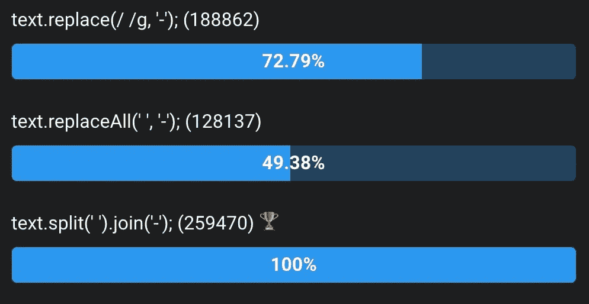
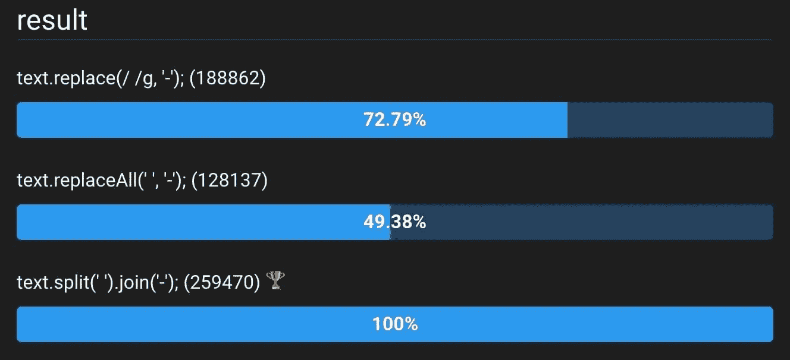
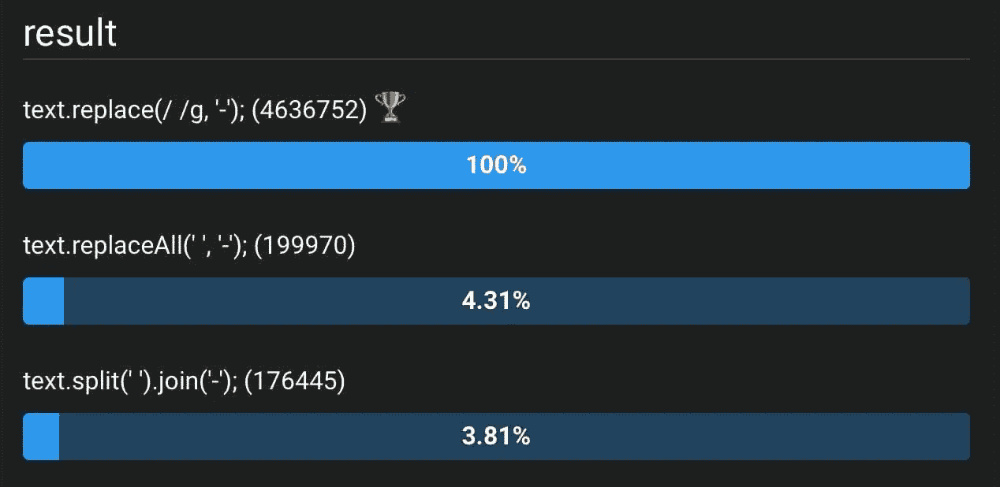
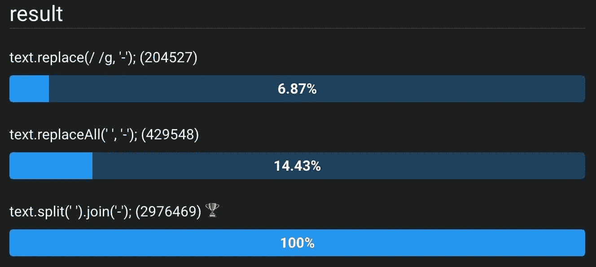

# JavaScript: String.replaceAll 已经登陆所有主流浏览器

> 原文：<https://betterprogramming.pub/javascript-string-replaceall-has-landed-in-all-major-browsers-9417e2f831d4>

## 我们应该重构吗？

作者照片。

有了最新版本的 v8，我们现在在所有主流浏览器中都有了几个新的 JavaScript 特性——其中之一是`String.prototype.replaceAll`。它用于用另一个字符串替换给定字符串或正则表达式的所有匹配项。看起来是这样的:

它是对`String.prototype.replace`的一个非常简单的补充。作为一个微优化极客，我决定看看这个新特性与它的替代品相比表现如何。因此，本文的目的是展示这一新特性，并鼓励读者从不同的角度来了解新特性。

# 到目前为止有什么选择？

追溯到 JavaScript 的早期，`String`的原型为我们提供了一个名为`replace`的函数，它本质上与`replaceAll`做同样的事情，但它只是取代了第一次出现的`searchValue`。示例:

这是有用的，但如果您想要替换文本的所有出现，这是不可取的。该问题的一个解决方案是使用 RegExp 来定义`searchValue`。上面的例子可以很容易地用 RegExp 重写，以实现与`replaceAll`相同的行为:

这对我们的情况很有用。对于任何对正则表达式有一些基本知识的人来说，这也是显而易见的。

让我们把事情变得复杂一点。假设我们有一个案例，我们需要我们的`searchValue`是动态的。例如，假设我们将`searchValue`作为一个参数，而不是硬编码它。在这种情况下，从这个变量创建一个正则表达式变得有点复杂。一个例子:

这个管用。代码做什么也很清楚。但是动态生成正则表达式并不总是简单明了的。给定字符串中的特殊字符很容易扰乱正则表达式:

它仍然有效，但是现在它的工作方式更加神秘了。该函数的用户必须知道，他们必须在将字符串传递给该函数之前对其进行净化。另一种方法是让`removeFromText()`净化接收到的输入。然而，在这种情况下，我们使`removeFromText()`的实现变得不必要的复杂。

解决上述问题的最后一个替代方案是将`.split()`和`.join()`链接起来，以实现与`replaceAll`相同的行为:

现在这一个涵盖了我们所有的用例。这种方法的缺点是代码做的事情不太明显。将一个字符串拆分成一个数组，然后再次合并，这看起来很浪费，并且没有告诉我们任何关于替换字符串的事情。与其说是直接做我们想做的事，不如说是黑。

出于所有这些原因，我们现在有了我们的语法糖`replaceAll()`。我认为它应该比它的替代品更有性能，考虑到它最接近的替代品是创建和销毁数组。所以我做了一些基准测试。

# 让我们比较一下性能

我首先使用 Lorem Ipsum 生成器生成一个 1300 个字符长的字符串。然后，我创建了几种替换字符串中所有文本的测试用例。然后我使用 [jsben.ch](https://jsben.ch/EWf2l) 对这些测试用例进行基准测试。我是在 Chrome、Safari 和 Firefox 上这样做的。结果如下:

Chrome 中的基准测试

Safari 中的基准测试

Firefox 中的基准测试

我预计`replaceAll()`会比其他选择稍微快一点。你可以想象，当我看到每个浏览器的结果都有显著变化时，我感到非常惊讶。然而，`replaceAll()`并不是所有浏览器中最快的。令人失望的是，一个被添加为辅助功能的特性实际上比它的替代品要慢。

[您可以运行](https://jsben.ch/EWf2l)我亲自运行的相同基准测试。

# 裁决

那么，我们应该重构我们所有的代码吗？

如果您的代码被认为是高性能的，以至于您正在对代码执行微优化，那么您可能应该使用替代方案。当用 JavaScript 编码时，通常不需要高性能的代码，但是如果你正在开发一个实用程序库或框架，它仍然可能发生。

但是，如果您正在开发面向用户的应用程序，如果您使用更明显的函数来实现您的目标，您的代码将更具可读性。因此，最好使用`replaceAll()`和类似的帮助器，让读者更清楚地了解您代码的目的。

— [奥赞通卡](https://medium.com/@ozantunca)

## 订阅更多

如果你喜欢这篇文章，并希望得到类似的其他文章的通知，[你可以在这里订阅我](https://ozantunca.org/subscribe)。我还会不时地给你发送免费的课程和电子书。我保证永远不会给你发垃圾邮件👍