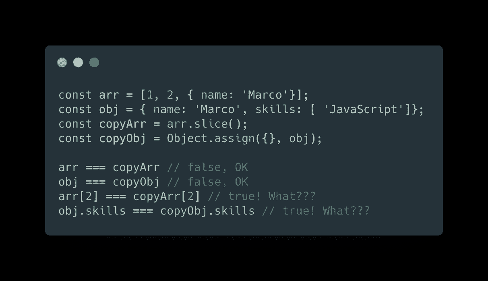
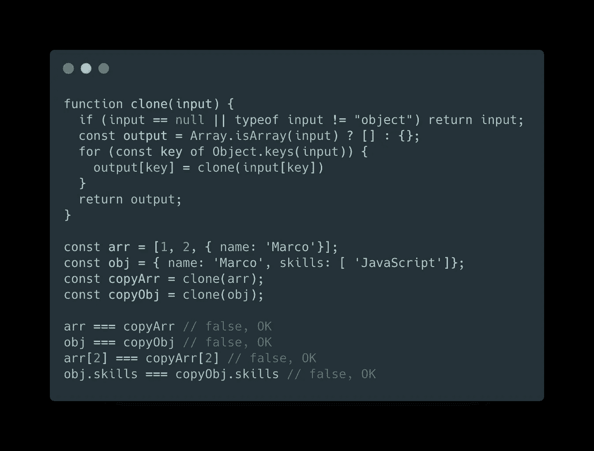

# JavaScript 技巧#2:对象/数组深度克隆实现

> 原文：<https://betterprogramming.pub/javascript-tips-2-object-array-deep-clone-implementation-2d6a43e43d2a>

## JavaScript 中深度克隆方法的简单实现

约翰·莫塞斯·鲍恩在 [Unsplash](https://unsplash.com/photos/2zUWGeg8DTw) 拍摄的照片

# 问题是

由于数组和对象的本地方法，例如`Array.prototype.slice` 和`Object.assign`，，我们能够为我们的数据创建新的引用，在新的实例中复制所有的属性/元素。但是当我们的列表包含嵌套的对象/数组时，问题就来了。由于它们以引用的形式存储在内存中，所以`.slice` 和`.assign`的实现将只是复制那个关联的地址:

嗯，嵌套元素不会作为新元素复制

那么，我们如何才能创建一个深层副本来创建嵌套属性的新实例呢？

# 解决方案

网上有大量的解决方案，许多像 [Lodash](https://lodash.com/) 这样的库已经提供了一个解决方案。但我希望你会喜欢我的解决方案。首先，理解幕后发生的事情可能是有用的:

如您所见，它非常简单，易于阅读，但它做得很好。

它接受任何类型的输入，并返回一个新的实例，复制所有属性，如果找到嵌套的对象/数组，则递归调用该函数。

请记住，有些类型不一定需要克隆，例如函数或符号，因此复制它们的引用是安全的。

希望你喜欢这篇文章。谢谢你阅读它。