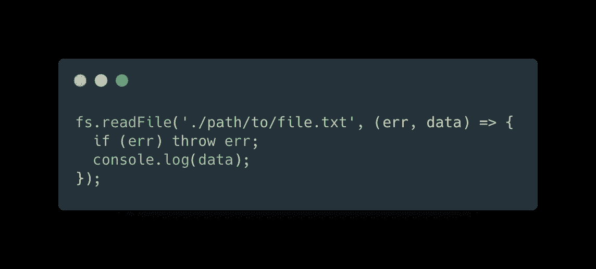
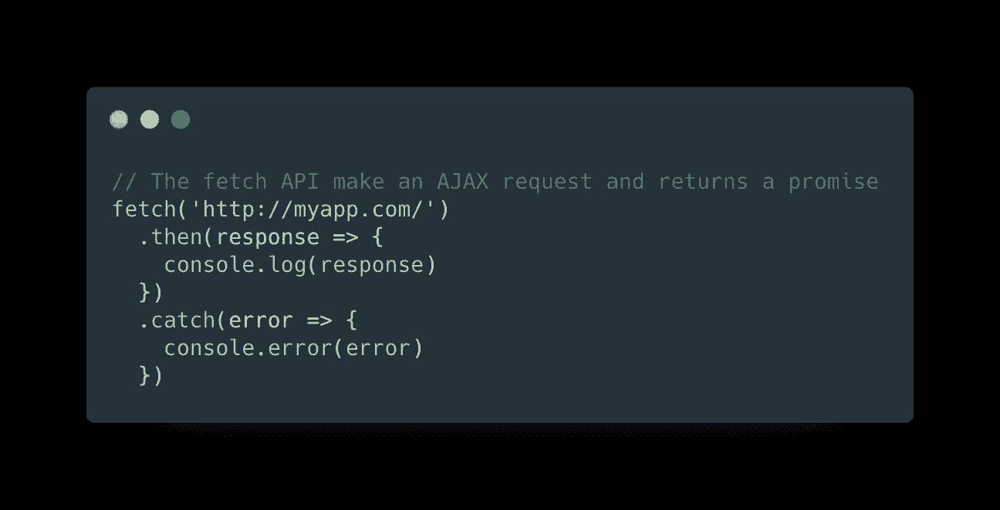
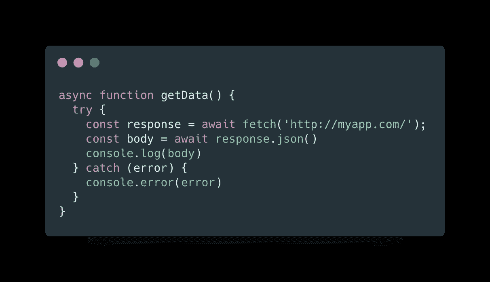
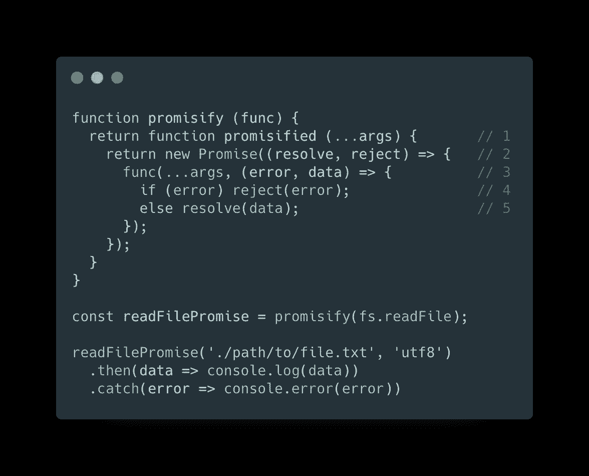

# JavaScript 技巧#3:将错误优先回调函数转换为承诺

> 原文：<https://betterprogramming.pub/javascript-tips-3-convert-error-first-callback-functions-to-promises-f2561d2aaefd>

## JavaScript 异步概述和保证错误优先回调的实用程序

[timJ](https://unsplash.com/@the_roaming_platypus?utm_source=medium&utm_medium=referral) 在 [Unsplash](https://unsplash.com?utm_source=medium&utm_medium=referral) 上的照片

# 问题是

异步是 JavaScript 中的一个核心概念。我们知道处理异步函数的不同技术，异步函数出现在我们程序的许多操作中，尤其是当我们需要处理 AJAX 请求时。

让我们回顾一下其中的一些。

## 错误-第一次回调

错误优先模式包括在异步操作结束时执行一个函数(比如传入的 AJAX 响应),该函数将错误(如果发生了错误)作为第一个参数，并将请求的结果作为额外的参数。

下面是一个使用 Node.js 的文件系统模块中的`.readFile` 的示例:

错误-第一次回调模式

主要问题？复试地狱！如果我们开始嵌套异步操作，我们的代码会变得非常混乱。

## **承诺**

在 ES6 中引入的这个 API 帮助开发人员更好地处理异步操作。

承诺的一个强大特性是我们可以将异步操作链接起来。这篇文章没有深入讨论承诺是如何起作用的，但是我们可以通过一个简单的例子来理解它:

用承诺处理异步请求

## **异步/等待**

在 ES7 中，这是一个关于承诺的包装器，使用异步函数，使我们的代码执行看起来像同步执行:

ES7 中引入了异步/等待模式

使用承诺使我们的代码更干净，可读性更好，但不幸的是，一些 API 仍然只能使用错误优先的回调模式。

我们如何让他们接受承诺去工作？

# 解决方案

网上有大量的实用程序和现成的库来保证一个功能。但是，对于学习来说，我更喜欢写一些代码，如果你面对一个没有集成承诺支持的 API，这些代码将来会有用。

让我们写一个可能的解决方案:

我们来评论一下是怎么回事:

1.  该实用程序创建了一个闭包，返回一个新函数，这将是我们承诺的版本。
2.  当被调用时，promisified 函数返回一个新的`promise`。
3.  在 promise 构造函数回调中，我们调用异步函数，我们转换该函数来处理 promises，我们用错误优先回调来处理异步操作。
4.  如果出现错误，它将被拒绝。
5.  否则，承诺会解决结果。

希望你喜欢这篇文章，感谢阅读！