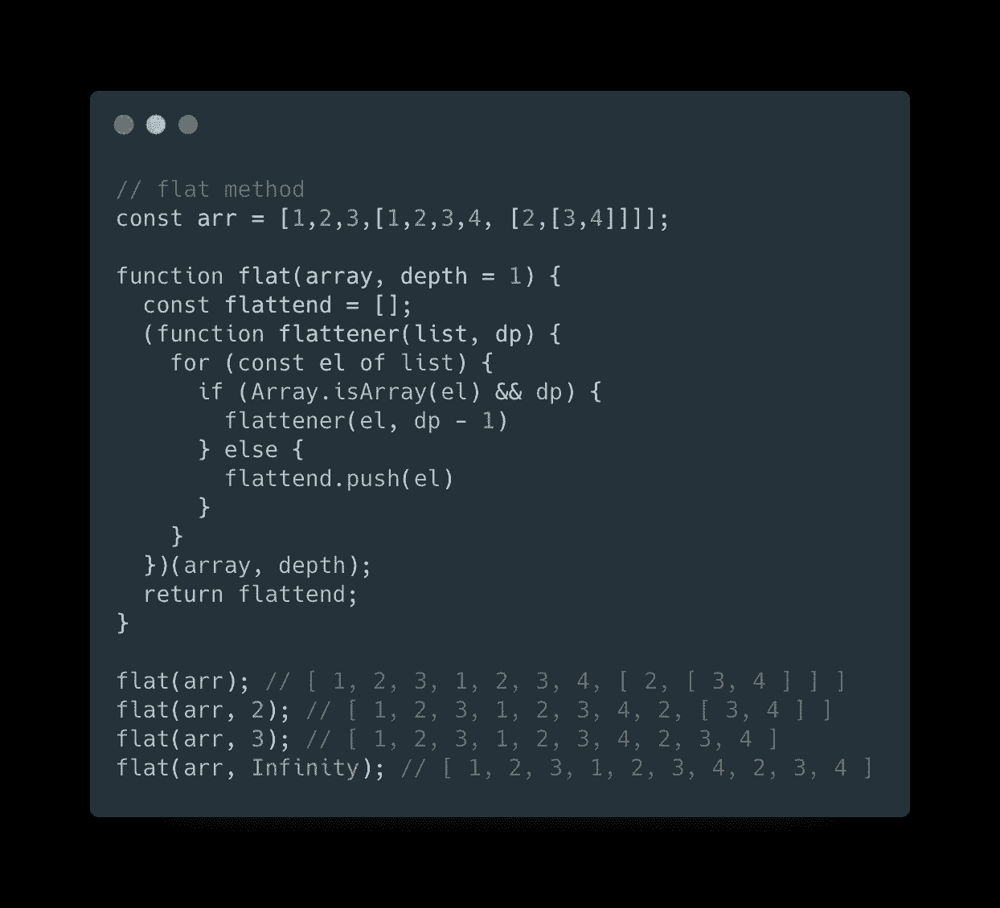
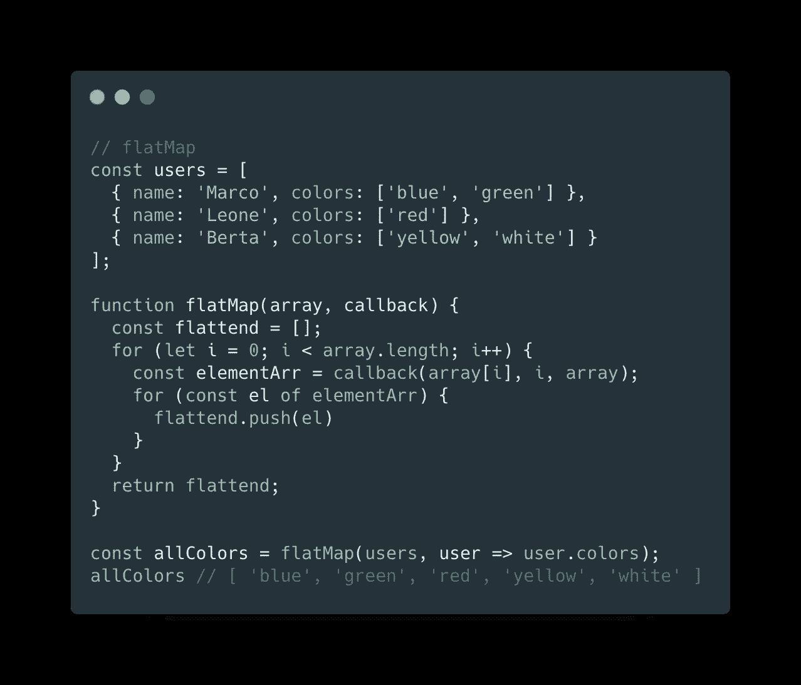

# JavaScript 技巧#4:数组平面和平面图实现

> 原文：<https://betterprogramming.pub/javascript-tips-4-array-flat-and-flatmap-implementation-2f81e618bde>

## 对新的 flat 和 flatMap 方法的潜力的有用介绍

[Tabea Damm](https://unsplash.com/@tabeadamm?utm_source=medium&utm_medium=referral) 在 [Unsplash](https://unsplash.com?utm_source=medium&utm_medium=referral) 上拍照

作为一种编程语言，JavaScript 不断发展，增加了新的语法、特性或抽象，帮助开发人员轻松解决复杂的问题。

在 ES10 中，我们收到了一些新的数组方法来处理一个你可能在代码中见过很多次的常见操作:将数组的元素扩展到一个新的元素中。

这两种方法分别是`flat`和`flatMap`。让我们来谈谈他们做什么，以及一个可能的 polyfill 来模拟他们在旧浏览器中的行为。

# 平的

作为数组原型的一部分，`flat`方法返回一个新数组，传播列表中嵌套数组的内容。它最终接受一个可选的`depth`参数，该参数表示在停止之前我们想要扩展多少嵌套层次的数组。

由于并非所有浏览器都完全支持该方法(查看此处支持的列表:[可以使用](https://caniuse.com/#search=flat))，我们来实现一个命令性的执行解决方案，以达到相同的结果:

# 平面地图

`flatMap`方法的工作方式与`flat`非常相似，但是它遍历每个元素并将传递的回调函数的结果放到一个新数组中。我们可以把它看作是通常的`map`**`flat`*方法的组合。***

***与`flat`不同的是这种方法只是将回调结果扁平化一级，并不像 flat 那样深入。***

****

**我希望你喜欢这篇文章，感谢阅读！**