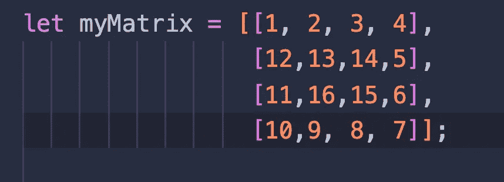
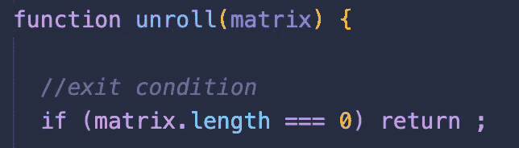
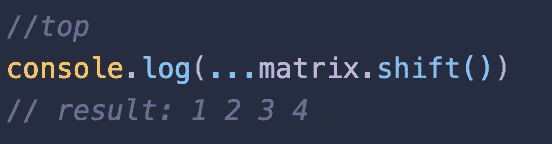
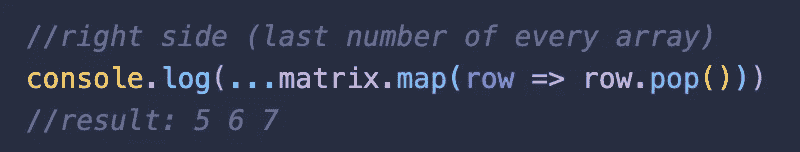
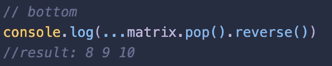
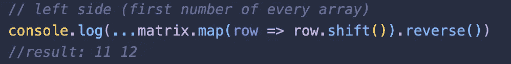
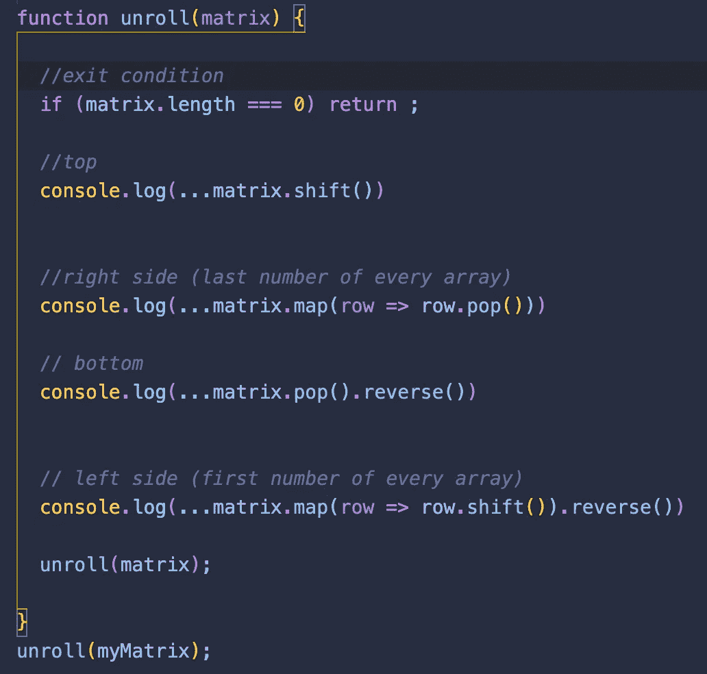

# JavaScript 访谈:解开矩阵

> 原文：<https://betterprogramming.pub/javascript-unraveling-the-matrix-7327257652a9>

## 确定下一个与矩阵相关的面试问题

美国国家海洋和大气管理局在 [Unsplash](/?utm_source=unsplash&utm_medium=referral&utm_content=creditCopyText) 拍摄的照片

最近，在我进入求职阶段时，我有机会进行了一次模拟技术面试。对于最后一个问题，我给出的是一个矩阵问题。矩阵问题是受欢迎的技术面试问题，有许多使用矩阵数据结构的问题。这个具体问题对练习数组方法有好处！

## 问题陈述

给定一个矩阵，创建一个以螺旋顺序输出矩阵的函数，即解开。一旦熄灭，就把每个数字去掉。

4x4 矩阵

不管矩阵中数字的连续顺序如何，该函数都应该工作。

## 分解它

为了解开每个数字，该函数将需要几个动作以螺旋方式工作:**一个条件语句**(知道何时停止)，输出顶部数组的**，每个数组右侧**(每个数组的最后一个数字)，底部**数组的**以*相反的顺序*，数组左侧**(每个数组的第一个数字)，然后是剩余的数字。******

一旦打印出矩阵中的所有数字，退出条件将停止该函数。

如果矩阵的长度为 0，则停止

打印顶部数组相当简单。随着函数的运行，已经打印的每个数字都将被删除。为此，我们使用 shift()方法删除数组中的第一个元素。

使用 spread 操作符，我们复制当前数组

接下来，我们需要输出每个数组的右边。矩阵映射将为每一行(数组)调用一个函数。在这种情况下，pop()方法用于删除每一行中的最后一个元素。

为了获得逆序的底部行，我们仍然使用 pop()方法，但是我们将 reverse()方法链接到*reverse*数组中数字的排列顺序。

倒数第二部分是获取矩阵左侧的数字，即从下到上每一行的第一个数字。

前面的步骤中使用了相同的方法，但以不同的方式排列以获得所需的结果。矩阵被映射，因此每一行都调用 shift()方法，然后以相反的行顺序获取上一行的元素。

最后，函数需要继续运行，直到达到退出条件。为此，我们称函数本身为递归。

现在你知道了！整体功能如下:

# 结论

这只是在技术面试中被问到的许多矩阵问题中的一个。你可以在这里找到更多的。

尽情享受吧！