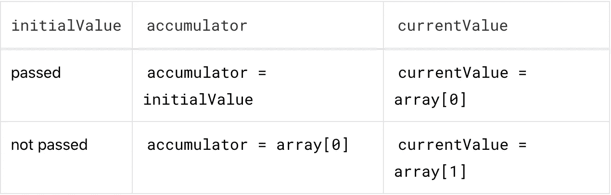
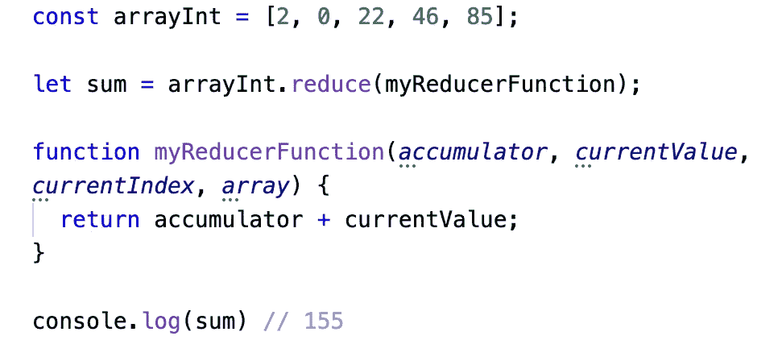

# JavaScript 的数组归约方法

> 原文：<https://betterprogramming.pub/javascripts-array-reduce-method-3bcea104a975>

## 如何适当地减少代码库中的数组


[拍照](https://unsplash.com/@photoholgic?utm_source=medium&utm_medium=referral)在 [Unsplash](https://unsplash.com?utm_source=medium&utm_medium=referral) 上拍照。

JavaScript 有几个不同的数组方法，每个方法都适用于不同的情况。`Array.reduce()`方法就是这样一种方法。虽然`reduce()`方法初看起来可能令人困惑，但它绝对是所有开发人员的工具箱中应该有的一个方法。`reduce()`方法获取一个数组，对数组的每个元素执行一组操作，并将其简化为一个值。

reduce 函数采用以下语法:

```
array.reduce(reducer, initialValue)// the initialValue argument is optional
```

如上所示，`reduce()`方法有两个参数:一个`reducer`函数和一个可选的`initial value`。现在让我们更深入地看看在这个`reduce()`方法下到底发生了什么。

# **减速器()功能**

`reducer()`函数是一个接受四个参数的回调函数，重要的是，在最后一次迭代后只返回一个值。它具有以下语法:

```
function reducer(accumulator, currentValue, currentIndex, array) { // some code here}
```

reducer 在每个数组元素上执行，并返回一个值。然后这个返回值被传递给累加器作为下一次迭代的参数。在`reduce()`函数的最后一次迭代中，累加器的值等于`reduce()`函数返回的单个值。

请记住，在`reduce()`方法中，初始值是一个可选参数。如果提供了,`initialValue`将成为 reducer 函数第一次迭代时累加器的值。来自 [JavaScript 教程](https://www.javascripttutorial.net/javascript-array-reduce/)网站的下表很好地说明了根据`initialValue`是否通过会发生什么:



来源: [JavaScript 教程](https://www.javascripttutorial.net/javascript-array-reduce/)

`reducer()`函数的其余三个参数是不言自明的。`currentValue`是 reducer 函数当前迭代中数组元素的值。类似地，`currentIndex`是 reducer 函数当前传递中数组元素的索引。最后，`array` 参数是调用`reduce()`方法的数组。

# **将所有这些放在一起**

综上所述，`reduce()`函数为给定数组中的每个元素调用`reducer()`函数。这个`reducer()`函数对每个数组元素执行，最终返回一个值。

为了将我们所学的全部带回家，让我们来看看`reduce()`函数的一个基本例子:



感谢阅读！