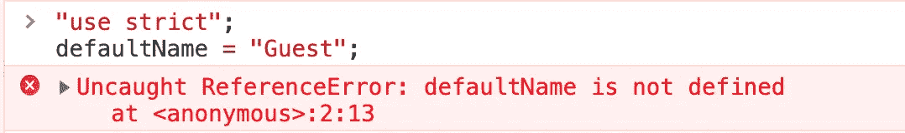
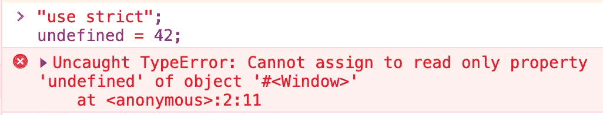
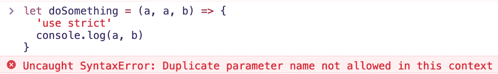
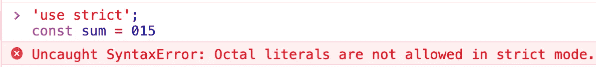
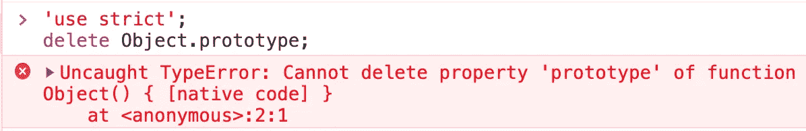

# JavaScript 的使用是严格的——用松散的代码换取严格的模式

> 原文：<https://betterprogramming.pub/javascripts-use-strict-trade-in-your-sloppy-code-for-strict-mode-260218113048>

## 在虫子存在之前就把它们压扁


照片由[爱丽丝·迪特里希](https://unsplash.com/@alicegrace?utm_source=unsplash&utm_medium=referral&utm_content=creditCopyText)在 [Unsplash](https://unsplash.com/s/photos/mess?utm_source=unsplash&utm_medium=referral&utm_content=creditCopyText) 拍摄

# 草率模式

与 Java 或 C#不同，JavaScript 是一种松散类型的语言，这使它成为一种非常宽容的语言。JavaScript 将尽最大努力弥补编写它的人所犯的大多数错误。

从表面上看，这似乎是一件好事，但它可以允许一些规则弯曲，往往会导致意想不到的后果。这为默认的 JavaScript 环境赢得了*草率模式*的称号。*

这不是一个官方名称，但 MDN 确实有一个专门介绍这个术语的页面。

# 为什么使用严格模式？

避免 slop 是使用严格模式的充分理由吗？只有你能决定，但是这就是为什么 ECMA 的医生认为开发者可能想要使用严格模式:

> 他们这样做可能是出于安全考虑，避免他们认为容易出错的功能，获得增强的错误检查，或者出于他们选择的其他原因…严格变体还指定了额外的错误条件，在语言的非严格形式未指定为错误的情况下，必须通过引发错误异常来报告这些错误条件

jQuery 的创始人 John Resig 写道，严格模式非常有用，因为:

> 它捕捉一些常见的编码错误，抛出异常。
> 
> 当采取相对“不安全”的操作时(比如访问全局对象)，它会阻止或抛出错误。
> 
> 它禁用令人困惑或考虑不周的功能。

# 严格模式——马虎的替代方案

向后兼容性是 JavaScript 的一大优势。有一些 20 年前写的 JS 网站仍然运行良好！另一方面，这意味着改变语言语义会破坏数百万个网站。

这导致了一些 JavaScript 错误和失误成为语言的一部分(比如在 JS 中`typeof null`是一个[对象](https://2ality.com/2013/10/typeof-null.html))。

为了保持兼容性，必须小心地进行更改。在严格模式下，该特性是可选的，您可以手动选择加入。根据 MDN，选择加入会改变 JavaScript 语义，如下所示:

> 1.通过将 JavaScript 静默错误改为抛出错误来消除这些错误。
> 
> 2.修复了使 JavaScript 引擎难以执行优化的错误:严格模式代码有时可以比非严格模式的相同代码运行得更快。
> 
> 3.禁止某些可能在 ECMAScript 未来版本中定义的语法。

我们来分解一下如何实现严格模式，以及它有什么改变。

# 如何启用严格模式

您可以将严格模式应用于整个文档或单个函数。要调用整个脚本的严格模式，在文档的第一行写字符串`use strict`。

```
// apply strict mode to entire script
'use strict';
let x= "So this is strict mode. Neat.";
```

`use strict`指令必须在文档的**顶部**声明。否则可能根本使不了，不管写到哪里。

```
function(str){
  return something
}; 
// strict mode will not apply to the above function"use strict";// though it has been invoked, strict mode is not enabled
```

唯一的例外是在单个函数中调用严格模式。

```
function amStrict(){
"use strict";
// your code
}
```

严格模式的最后一个应用涉及到模块。ECMAScript 2015 中引入了 JavaScript 模块，默认情况下，模块的内容应用了严格模式。

# 严格模式(具体)做什么？

有关严格模式应用的变更的详细列表，请参见 [ECMAScript 文档](https://www.ecma-international.org/ecma-262/5.1/#sec-13.1)。由于这篇文章的篇幅有限，我将概述一些您可能会经历的最常见的变化。

## 没有意外的全局变量

在普通的 JavaScript 中，如果你声明一个没有`let`、`const`或`var`的变量，它会被自动声明为一个全局变量。严格模式可以防止这种情况。



## 不可写的全局变量不能用作 var/func 名称

> “在普通代码中静默失败的赋值(对不可写的全局或属性的赋值…)将在严格模式下抛出。”——MDN



## 不允许重复的参数

普通 JS 允许函数重复参数名。非严格模式:



这同样适用于严格模式下对象的重复属性。

## 严格模式禁止八进制语法

开发人员有时假设前导零没有意义，并在代码中将其用作对齐装置。严格模式将引发语法错误:



## 尝试删除不可删除的属性将会引发错误

通常，JavaScript 在这些情况下什么也不做。



# 严格模式不是魔杖

使用严格模式时，需要考虑一些预防措施。所有主流的现代浏览器都支持严格模式，但仍有一些浏览器仅部分支持，甚至有少数完全不支持。

当编写你完全拥有的全新代码时，你可以假设从一开始就使用严格模式是安全的。这很聪明，强烈推荐。

相反，试图在遗留代码上调用严格模式是不明智的，可能会导致灾难。更有可能的是，将会有无数的错误，甚至是在工作代码中，因为普通的 JavaScript 是非常宽容的，不遵循严格的约定也可以编写大量的工作代码。

对您不拥有或维护的代码调用严格模式也是一个很大的问题

撇开预防措施不谈，严格模式是非常值得的！编写更多有意的代码总是有益的，并且将使您免于许多未来的麻烦。

一如既往，感谢阅读。