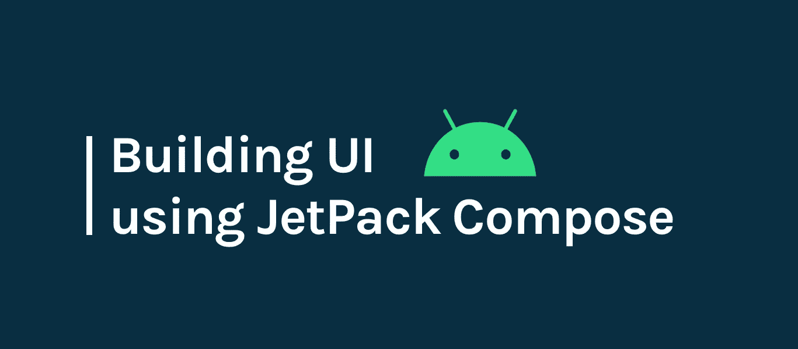
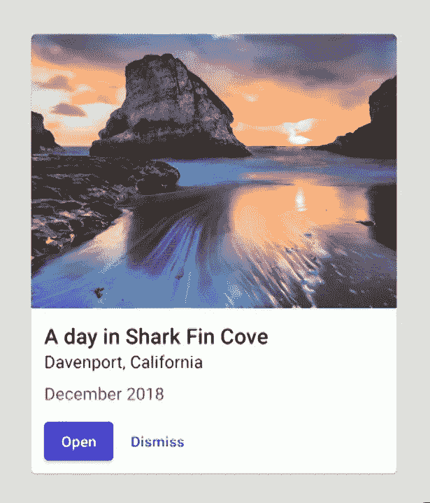

# jetpack Compose——一种在 Android 中创建材质界面的简单新方法

> 原文：<https://betterprogramming.pub/jetpack-compose-a-new-and-simple-way-to-create-material-ui-in-android-f49c6fcb448b>

## 了解如何创建没有任何 XML 文件的用户界面



1.  引言。
2.  为什么我们需要 [Jetpack Compose](https://developer.android.com/jetpack/compose) ？
3.  整合。
4.  开始新的撰写活动。
5.  可组合函数。
6.  使用 Jetpack Compose 创建容器。
7.  带有 Jetpack Compose 的材料组件。
8.  自定义视图。
9.  有用的链接。

# 介绍

在我们讨论 Jetpack compose 之前，你知道 Jetpack 是什么吗？

Android Jetpack 是一套 Android 软件组件，帮助我们构建完美和伟大的 Android 应用程序。

这些软件组件有助于:

1.  遵循最佳实践，编写更少的样板代码。
2.  让复杂的事情变得简单。

现在，Jetpack Compose 是谷歌最近试图让 Android 开发者在 UI 开发中变得简单的尝试之一。Jetpack Compose 还处于非常早期的阶段，但它像其他任何 Jetpack 库(WorkManager、Room 和 Pagination)一样受到了大肆宣传。

> Jetpack Compose 是一个用于构建原生 Android UI 的现代工具包。Jetpack Compose 通过更少的代码、强大的工具和直观的 Kotlin APIs 简化并加速了 Android 上的 UI 开发。— [安卓开发者](https://developer.android.com/jetpack/compose/tutorial)

注意:如果要将 Jetpack Compose 与 Android Studio 配合使用，必须使用 Android Studio Canary 4.1 或更高版本。

# 为什么我们需要 Jetpack Compose？

> JetPack 结合了反应式编程模型和 Kotlin 编程语言的简洁易用性。它是完全声明性的，意味着您通过调用一系列将数据转换成 UI 层次结构的函数来描述您的 UI。——[Codelab](https://codelabs.developers.google.com/codelabs/jetpack-compose-basics/)

通常，我们使用相对布局、线性布局或框架布局来构建布局文件，但超级约束布局出现了，吸引了我们所有人(Android 开发人员)。很好，但是它们只能用在我们传统的布局文件中。

*   如果没有更多的相对布局关系或约束布局约束需要写在你的布局文件？
*   我们可以更进一步说:“如果我们有一种新的方法来创建没有布局文件的 UI 会怎么样？”

可能吗？是的，这就是我们所说的 Jetpack Compose。

不管我们有多少像相对约束布局这样的高级布局，我们在 Android 中总是缺少一个声明性的 UI。

虽然我们有一些第三方库，但如果有一个原生库，并且现在有了，那就太好了。它的名字叫 Jetpack Compose。

在 Google IO '19 中，Google 推出了 Jetpack Compose，在 Android 中创建声明式 UI。因此，基本上，声明式 UI 意味着使用特定的语言以某种格式指定您想要的 UI 元素。

# 综合

这可以通过四个简单的步骤来完成

*   将`google()`添加到项目的`build.gradle`文件中。

```
allprojects {
    repositories {
        google()
        jcenter()
        maven { url 'https://dl.bintray.com/kotlin/kotlin-eap' }
    }
}
```

*   升级你的 [Gradle](https://gradle.org/) 工具和 [Kotlin](https://kotlinlang.org/) 插件。

```
dependencies {
        classpath 'com.android.tools.build:gradle:4.0.0-alpha01'
        classpath 'org.jetbrains.kotlin:kotlin-gradle-plugin:1.3.60-eap-25'
    }
```

*   启用 Compose 并将 Java 和 Kotlin 编译器目标设置为 Java 8，如下面的应用程序级`build.gradle`文件所示。

```
buildFeatures {
        // Enables Jetpack Compose for this module
        **compose true**
    }
    ... // Set both the Java and Kotlin compilers to target Java 8. compileOptions {
        sourceCompatibility JavaVersion.VERSION_1_8
        targetCompatibility JavaVersion.VERSION_1_8
    }
```

*   最后，添加 Jetpack 组合依赖项。

```
implementation "androidx.compose:compose-runtime:0.1.0-dev02" implementation "androidx.ui:ui-core:0.1.0-dev02" 
implementation "androidx.ui:ui-layout:0.1.0-dev02" 
implementation "androidx.ui:ui-framework:0.1.0-dev02" 
implementation "androidx.ui:ui-material:0.1.0-dev02" 
implementation "androidx.ui:ui-foundation:0.1.0-dev02" implementation "androidx.ui:ui-text:0.1.0-dev02" 
implementation "androidx.ui:ui-tooling:0.1.0-dev02"
```

就这样，我们完成了整合。

# 开始新的撰写活动

现在我们已经完成了设置，是时候用 Jetpack Compose 创建一个新的活动了。

在`onCreate`函数中，我们使用`setcontent`而不是`setcontentview`，因为在这里，我们不再使用 UI 的布局文件。正如我们在`build.gradle`中提到的`buildFeatures { compose true }`标志，这应该可以正常工作。

当我们作为开发人员学习 Jetpack Compose 的基础知识时，让我们从一个简单的带有“Hello world”文本的 textview 开始。看一看:

# 可组合函数

可组合函数是用`@Composable`注释的普通函数。

这使您的函数能够调用其中的其他`@Composable`函数。你可以看到`Greeting`函数是如何标记为`@Composable`的。这个函数将产生一个 UI 层次结构。

可组合函数只能从其他可组合函数中调用。

# 使用 Jetpack Compose 创建容器

在这里，我们要建立一个垂直模式的线性布局的行为。让我们用如下所示的可组合 UI 构建一个新故事。

但是，如果你只是这样做，输出可能不会像预期的那样，你对你的 UI 应该如何出现有点看法。

因此，这里我们有一个新的概念叫做*列，*，它类似于 XML 文件中的布局。让我们看看上面的列和间距的例子。

这就是你如何拥有一个具有垂直线性布局风格和标准间距的 UI。

像这个列一样，我们现在有了一个以水平模式显示视图的行，正如 Jetpack 团队所说，他们正在尝试包含约束布局功能，所以还会有更多的功能，请耐心等待。

# 具有喷气背包组件材料组件

Jetpack Compose 是在牢记材料组件的基础上构建的，换句话说，它在材料组件上投入很大。下面我们来看一个建立物料卡片的例子:



如果你仔细观察，它有一些材料指南，如圆角、间距、文本样式等等。让我们看看如何用`@Composable`方法实现它。

现在让我们一步一步地检查代码。

1.  首先，将整个代码包装在`card`中，这就像 XML 文件中的材料卡片视图。
2.  这张卡片有圆角。为了实现这个 UI，我们在以 4dp 为半径的卡片上使用了 shape 属性。
3.  为了垂直对齐视图，我们使用了一个列。
4.  为了在 Jetpack Compose 中加载图像，我们有一个名为`SimpleImage`的函数，通过它我们可以加载远程 URL、文件或 URIs。
5.  关于文本视图，我们已经讨论了如何创建和分配文本给它们。
6.  但是在这里，基本的文本视图有更多的内容。这里，文本视图有不同的颜色和文本大小。为此，我们使用了样式概念。
7.  在这里，样式是基于材质规则创建的。
8.  最后，为了完成设计，我们添加了两个按钮`row` (水平对齐视图)。
9.  同样，我们使用材料设计来塑造按钮的形状。

# 自定义视图

不管我们有多少默认视图，设计师总是想出新的设计和奇怪的视图。

以传统方式创建自定义视图需要做大量的工作，但是在 Jetpack Compose 中，您可以通过编写函数来构建自定义视图。

这里，在 Jetpack 中，我们只需要创建一个可组合的函数来创建一个自定义视图。我们有构建块来帮助创建定制视图，其中`draw`和`layout`是两个基本的视图。

## 画

Draw 会给你一个句柄来做任何你想做的自定义编码。

## 布局

Jetpack 从列和行开始提供基本布局。现在，它正在将约束布局引入 Jetpack Compose。

# 有用的链接

[](https://developer.android.com/jetpack/compose) [## Jetpack Compose | Android 开发者

### 注意:Jetpack Compose 目前处于开发者预览版。API surface 还没有最终确定，正在计划更改…

developer.android.com](https://developer.android.com/jetpack/compose) [](https://developer.android.com/jetpack/compose/setup) [## 使用 Android Studio 和 Jetpack Compose | Android 开发人员

### Jetpack Compose 是一个用于构建原生 Android UI 的现代工具包。它基于声明式编程模型，所以…

developer.android.com](https://developer.android.com/jetpack/compose/setup) [](https://codelabs.developers.google.com/codelabs/jetpack-compose-basics/index.html?index=..%2F..index#1) [## Jetpack 撰写基础知识—代码实验室

### Jetpack Compose 是一个旨在简化 UI 开发的现代工具包。它将反应式编程模型与…

codelabs.developers.google.com](https://codelabs.developers.google.com/codelabs/jetpack-compose-basics/index.html?index=..%2F..index#1) 

感谢您的阅读。